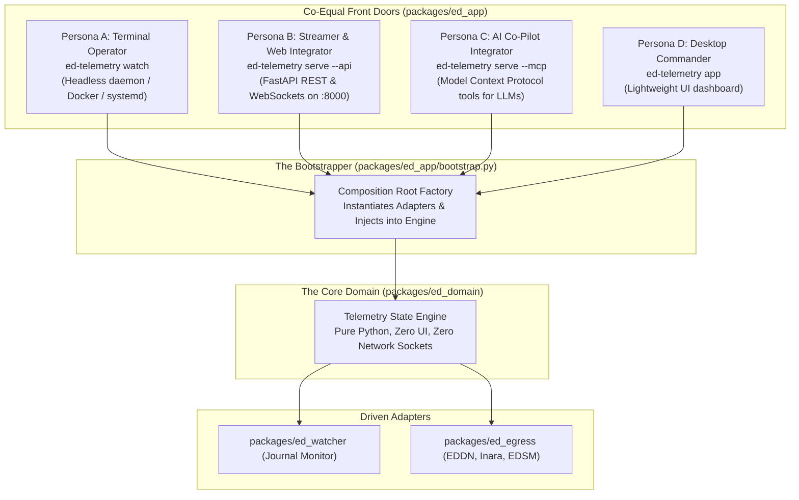

# ADR 0001: Architectural Vision, Operational Concept, and CI-Enforced Modular Boundaries

## 1. Context and Problem Statement

Legacy community tooling for Elite Dangerous (such as EDMarketConnector) evolved as a desktop-first monolithic application. In those codebases, user interfaces, operating system quirks, background file watchers, and network transmitters were tightly commingled in flat root scripts with circular import loops. 

This architectural entanglement caused three fatal defects:
1. **Inflexible Delivery:** The application could not be operated as a headless background daemon, local REST server, or AI agent tool without modifying GUI code.
2. **Coupling Traps:** Modules instantiated their own dependencies at import time, causing circular import loops and fragile testing setups.
3. **Developer Burnout:** Managing a monolithic graph without automated architectural boundaries created extreme cognitive friction.

We require an immutable architectural baseline that defines exactly what `ed-telemetry` is, how it behaves for the end user upon installation, and how automated CI pipelines will permanently enforce package boundaries.

---

## 2. Decision Drivers

* **Operational Versatility:** Provide four distinct, co-equal front doors (CLI, REST API, MCP Server, UI) into a single decoupled telemetry core.
* **Acyclic Dependencies Principle (ADP):** Eliminate circular loops mathematically by enforcing strict, one-way inward dependency flows.
* **Automated CI Architecture Gates:** Enforce package division of labor, import boundaries, and clean bootstrapping via automated CI linters and tests to prevent coupling regressions.
* **Cognitive Ergonomics:** Maintain an intuitive modular monorepo structure where each package has a single, unambiguous responsibility.

---

## 3. Decision Outcome

Chosen Option: **Hexagonal Architecture with Co-Equal Driving Surfaces, Composition Root Bootstrapping, and CI-Enforced Package Boundaries**.

---

## 4. Target Operational Concept (The Four Personas)

Upon installation via `pip install ed-telemetry`, the system provides four co-equal driving interfaces into the application core:

### 4.1 Persona Specifications
1. **Persona A: Terminal Operator (Headless Daemon):**
   * Command: `ed-telemetry watch`
   * Behavior: Runs silently in the background, monitoring Elite Dangerous journal logs and streaming telemetry to EDDN and Inara. Zero GUI requirements; zero `$DISPLAY` dependencies.
2. **Persona B: Streamer / Web Integrator (REST & WebSockets):**
   * Command: `ed-telemetry serve --api`
   * Behavior: Mounts a local FastAPI server providing OpenAPI interactive documentation (`/docs`) and real-time WebSocket state streams for browser overlays, OBS docks, or third-party web apps.
3. **Persona C: AI Co-Pilot Integrator (MCP Server):**
   * Command: `ed-telemetry serve --mcp`
   * Behavior: Exposes a standardized Model Context Protocol (MCP) server over stdio or SSE, allowing AI coding assistants and game co-pilots (e.g. Antigravity, Claude Desktop) to invoke live game telemetry tools.
4. **Persona D: Desktop Commander (Visual Dashboard):**
   * Command: `ed-telemetry app`
   * Behavior: Launches an optional graphical desktop view that visualizes commander status, cargo, and outfitting by observing the local core engine.

---

## 5. Modular Monorepo Package Topology & Division of Labor

The codebase is partitioned into five isolated packages under `packages/`:

| Package Path | Architectural Role | Responsibilities | Strict Import Boundary Rules |
| :--- | :--- | :--- | :--- |
| `packages/ed_domain/` | **The Core Domain & Ports** | Pure data models, journal event schemas, game enums, and abstract port interfaces (`abc.ABC`). | **Zero dependencies.** May NOT import `ed_watcher`, `ed_egress`, `ed_sdk`, or `ed_app`. Forbidden from importing network, filesystem monitor, or GUI libraries. |
| `packages/ed_watcher/` | **Inbound (Driven) Adapter** | Watches `%USERPROFILE%\Saved Games\Frontier Developments\Elite Dangerous\` for Journal updates. | May import `ed_domain`. May NOT import `ed_egress`, `ed_app`, or `ed_sdk`. |
| `packages/ed_egress/` | **Outbound (Driven) Adapter** | HTTP transmitters sending validated payloads to EDDN, Inara, and EDSM. | May import `ed_domain`. May NOT import `ed_watcher`, `ed_app`, or `ed_sdk`. |
| `packages/ed_sdk/` | **Testing Harness** | `MockJournalWriter`, deterministic event generators, and test fixtures. | May import `ed_domain`. Used strictly in test suites and third-party extension SDKs. Forbidden in production runtime packages. |
| `packages/ed_app/` | **Driving Adapters & Bootstrapper** | Hosts `bootstrap.py` (Composition Root), CLI (`cli/`), FastAPI REST (`api/`), MCP (`mcp/`), and UI (`ui/`). | **The only package authorized to import and wire all other packages together.** May NOT import `ed_sdk`. |

### 5.1 Machine-Enforceable Boundary Invariants
1. **Invariant A (Pure Domain I/O Isolation):** `ed_domain` must remain 100% pure computational logic. It is strictly forbidden from importing standard library or third-party network (`socket`, `http`, `urllib`, `requests`, `httpx`), filesystem monitors (`watchdog`), or graphical frameworks (`tkinter`).
2. **Invariant B (SDK Production Isolation):** Production runtime packages (`ed_watcher`, `ed_egress`, `ed_app`) are strictly forbidden from importing `ed_sdk`. The testing SDK exists solely for test execution (`tests/`) and downstream external plugin testing.

---

## 6. CI-Enforced Architecture & Bootstrapping Gates

To guarantee that circular dependency loops, import violations, and coupling traps never enter the repository, the Continuous Integration (CI) pipeline will enforce four automated architecture quality gates:

### 6.1 Gate 1: Automated Import Boundary & Invariant Enforcement (`import-linter`)
The CI workflow will execute `import-linter` on every commit and pull request against the contracts defined in Section 5 and Section 5.1:
* Fails if `ed_domain` imports any sibling package OR any I/O library (`httpx`, `watchdog`, `tkinter`).
* Fails if `ed_watcher` or `ed_egress` imports each other or `ed_app`.
* Fails if any production package imports `ed_sdk`.
* Fails if any package creates circular dependency loops.

### 6.2 Gate 2: Clean Bootstrapping Isolation Tests
The CI suite will include dedicated tests verifying the Composition Root in `packages/ed_app/bootstrap.py`:
* Verify that all concrete adapters can be instantiated with mock dependencies.
* Verify that module imports do not produce runtime side-effects (e.g., no background threads, no network connections, and no file locks are created purely by importing a module).
* Verify that `ed_domain` can be imported in a clean Python environment without any other package installed.

### 6.3 Gate 3: Headless Verification Guarantee
The CI suite will execute all tests across Linux and Windows without virtual display workarounds (`xvfb`):
* `ed_domain`, `ed_watcher`, `ed_egress`, `ed_sdk`, `ed_app/cli`, `ed_app/api`, and `ed_app/mcp` must pass 100% of their test suites headlessly in standard terminal environments.

---

## 7. Consequences

### Positive
* **Crystal-Clear Behavioral Contract:** What the software is and how it behaves across the 4 personas is permanently defined.
* **Immunity to Circular Loops:** Acyclic dependency rules and composition root bootstrapping prevent import cycles.
* **Machine-Enforced Architecture:** CI automatically catches and blocks accidental coupling before code can be merged.
* **ADHD Ergonomics:** Developers can work inside a single package (e.g., `packages/ed_domain/`) without worrying about breaking unrelated systems.

### Negative / Trade-Offs
* Requires configuring architectural linting rules in CI (`import-linter` or equivalent Ruff AST checks).
* Requires disciplined use of `bootstrap.py` rather than ad-hoc instantiation across modules.
