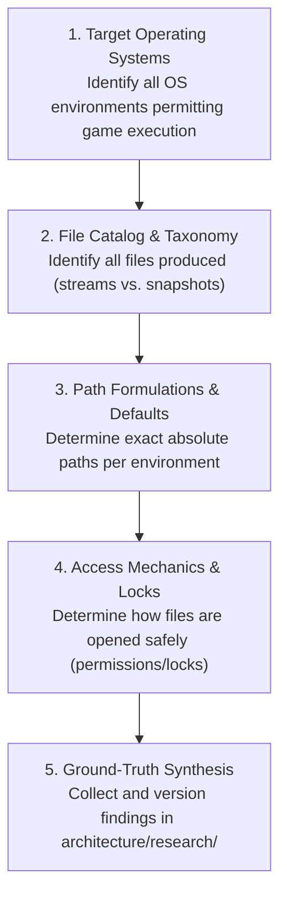

# ADR 0004: OS Path Discovery and Filesystem Ground-Truth Research Framework

## 1. Context and Problem Statement

Before designing journal tailing mechanics, event envelopes, or downstream data consumers in `ed-telemetry`, the system must authoritatively determine **where and how Elite Dangerous writes telemetry and game state files to the host filesystem**.

Because the game client is closed-source and distributed across different operating environments (native Windows and compatibility-layer Linux), guessing or hardcoding paths creates immediate brittleness. Furthermore, the downstream system requires an inbound discovery service that can locate these files to power two distinct eventual workflows:
1. **Workflow A (SDK Recon & Data Preservation):** Anonymizing and archiving empirical log samples for offline development and test harness simulation (`packages/ed_sdk`).
2. **Workflow B (Production Telemetry Daemon):** Live state accumulation, CLI/API streaming, and egress transmission to community APIs like EDDN and Inara (`packages/ed_app` and `packages/ed_egress`).

We require an architectural decision that:
* Mandates OS Path Discovery as a dedicated, reusable capability.
* Establishes a formal research methodology to verify filesystem facts without premature feature declarations.
* Designates an authoritative ground-truth location in the repository for collected research findings.

---

## 2. Scope Lock & Boundaries

In strict adherence to our anti-bloat and focused-elaboration policies:
* **In Scope:**
  - Defining the requirement for cross-platform OS Path Discovery.
  - Contextualizing path discovery as the single upstream provider for eventual Workflow A and Workflow B consumers.
  - Establishing the formal 5-question Research Verification Framework.
  - Designating the canonical location for research dossiers in `architecture/research/`.
* **Explicitly Out of Scope:**
  - Designing specific event data models or Pydantic schemas.
  - Designing file tailing, buffer retry, or event ingestion logic.
  - Defining internal features or implementation logic for the Recon Probe (Workflow A).
  - Defining business logic or API contracts for EDMC production daemon features (Workflow B).

---

## 3. Decision Drivers

* **Ground-Truth First:** Architectural policies and code must be informed by empirical facts, not assumptions or outdated forum posts.
* **Single Source of Discovery:** Inbound path resolution must be solved once in `packages/ed_watcher` so that both the SDK recon tooling and the production daemon use the identical discovery logic.
* **Multi-Platform Support:** Must accommodate all operating systems where Elite Dangerous can be executed.
* **Zero Repository Bloat:** Research findings must be synthesized into clean, versioned Markdown dossiers, avoiding committing raw log dumps to git.

---

## 4. Decision Outcome

Chosen Option: **Establish a Reusable OS Path Discovery Mandate, Define the Filesystem Research Verification Framework, and Designate `architecture/research/` as the Master Ground-Truth Repository.**

### 4.1 Reusable OS Path Discovery Mandate
* Path discovery logic shall be encapsulated as a dedicated service within `packages/ed_watcher` (e.g., `ed_watcher.discovery`).
* It must automatically detect standard installation and saved game paths on supported operating systems, while supporting an explicit operator path override (e.g., `--journal-dir <PATH>`).
* Its sole responsibility is resolving the directory containing live game files and validating read accessibility. It does not perform event parsing or business logic.

### 4.2 Upstream Provider Role (Workflow Context)
The resolved path serves as the single foundation for two eventual downstream sinks:
* **Workflow A (SDK Recon / Preservation):** Pointed at the discovered path to harvest, anonymize, and store sample datasets for offline testing.
* **Workflow B (Production Daemon):** Pointed at the discovered path to monitor live events for CLI dashboards, API serving, and egress transmission.

*(Note: Internal features and logic for Workflows A and B are deferred to dedicated future ADRs).*

---

## 5. The Filesystem Research Verification Framework

Before declaring file monitoring contracts or tailing implementations, the engineering team must systematically investigate, empirically verify, and document five core questions:

### 5.1 The 5 Investigation Pillars

1. **Operating System Identification:**
   - Determine which operating systems officially and unofficially permit Elite Dangerous to run (Windows native, Linux Proton via Steam/Wine, Steam Deck/SteamOS).
   - Document OS-specific environment variables and registry/configuration markers used to locate user profiles.

2. **File Catalog & Taxonomy:**
   - Enumerate all active files produced by the game client within the target directory.
   - Classify files into **Rolling Append Streams** (`Journal.<timestamp>.<part>.log`) versus **Atomic Point-in-Time Snapshots** (`Status.json`, `Market.json`, `Cargo.json`, `NavRoute.json`, `Backpack.json`, `ShipLocker.json`).
   - Identify which files are deprecated or version-specific (e.g., Horizons 3.8 vs. Odyssey 4.0).

3. **Filesystem Path Formulations:**
   - Identify default filesystem locations on native Windows (`%USERPROFILE%\Saved Games\Frontier Developments\Elite Dangerous\`).
   - Identify compatibility-layer paths under Steam Proton / Steam Deck (`~/.steam/steam/steamapps/compatdata/359320/pfx/...`).
   - Identify custom Wine prefix paths and flatpak installation structures.

4. **File Access & Locking Mechanics:**
   - Determine how the Frontier game client writes to disk: line buffering, flush frequency, and file sharing flags.
   - Establish safe file opening modes on Windows (`FILE_SHARE_READ | FILE_SHARE_WRITE`) to ensure the telemetry reader never locks out the game engine.
   - Verify character encoding standards (UTF-8, presence of Byte Order Marks / BOM).

5. **Designated Source-of-Truth Location:**
   - All empirical research, triangulation results, and path catalogs must be collected in:
     [`architecture/research/`](../research/)
   - Output artifacts must follow standard Markdown hygiene with YAML frontmatter.
   - Raw multi-megabyte log files must never be committed to git; only synthesized schemas, catalogs, and path matrices reside here.

---

## 6. Consequences

### Positive
* Eliminates guesswork by enforcing formal empirical research before writing I/O tailers.
* Establishes a permanent, versioned ground-truth reference for all future developers and contributors.
* Prevents duplication between recon/probe tools and production daemon code by centralizing path discovery.
* Keeps scope strictly contained without prematurely designing probe or business features.

### Negative / Trade-Offs
* Requires conducting research and documenting findings in `architecture/research/` prior to implementing Phase 2 ingestion code.
