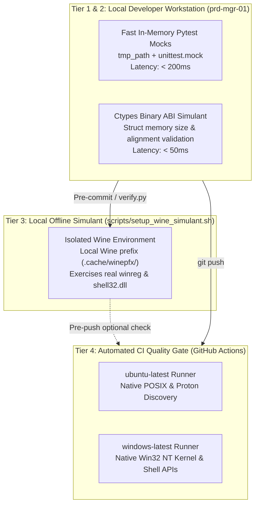
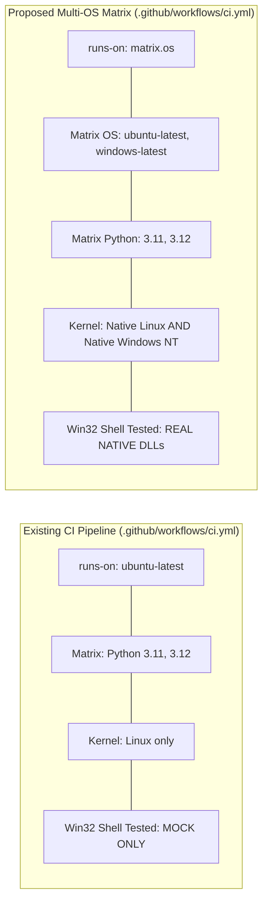

# ADR 0005: Cross-Platform Testing Strategy and Operating System Simulation Matrix

## 1. Context and Problem Statement

With the implementation of the OS Path Discovery subsystem ([ADR 0004](0004_os_path_discovery_and_filesystem_research_framework.md) and [SDD-002](../designs/0002_os_path_discovery_component_design.md)), `ed-telemetry` contains platform-specific code paths that execute conditionally based on the host operating system:
1. **Microsoft Windows:** Depends on the Win32 NT kernel, ctypes invoking `shell32.dll` (`SHGetKnownFolderPath`), `ole32.dll` (`CoTaskMemFree`), and the native `winreg` module.
2. **Linux / SteamOS:** Depends on POSIX filesystems, Steam `libraryfolders.vdf` parsing, Proton compatibility prefixes (`compatdata/359320`), and Flatpak sandbox paths.

Our primary local development workstation (`prd-mgr-01`) is a Linux host (`Ubuntu / Debian`). While our unit test suite mocks `sys.platform` and filesystem trees via Pytest (`tmp_path`), **mocking alone does not test real binary C ABI packing or true platform API contracts**.

We require an architectural decision that defines:
* How Windows and Linux platform logic can be simulated and tested locally on a Linux workstation (`prd-mgr-01`).
* What packages and runtime environments are required on the host system.
* What test tooling (inside and outside Pytest) shall be employed.
* The formal distinction between our existing GitHub Actions workflow and a native multi-OS CI matrix.

---

## 2. Decision Drivers

* **Ground-Truth Fidelity:** We must prevent bugs where mock tests pass on Linux, but real ctypes memory structures crash on Windows NT.
* **Developer Velocity:** Running tests locally on `prd-mgr-01` must not require a dedicated Windows secondary computer or complex manual setup for everyday tasks.
* **Zero Host Bloat:** Avoid polluting the developer's workstation with gigabytes of unneeded runtime virtual machines unless strictly containerized.
* **CI-Enforced Parity:** Pull requests must be verified against authentic, physical operating systems before merging to `main`.

---

## 3. Considered Options

* **Option 1: In-Memory Pytest Mocking Only (Status Quo)**
  - Fast, zero host dependencies, but cannot detect Windows ctypes ABI mismatches or `winreg` syntax errors.
* **Option 2: Scripted Local Wine & Windows Python Simulant (`scripts/setup_wine_simulant.sh`)**
  - Provide a deterministic maintainer script to initialize an isolated Wine prefix (`.cache/winepfx/`) and run Windows tests locally on `prd-mgr-01`.
* **Option 3: Containerized Multi-Environment Matrix (Docker / OCI) [REJECTED]**
  - Building and maintaining custom 2 GB Docker containers with Wine + X11 was considered but rejected as redundant overhead given that Option 2 solves local execution cleanly and Option 4 provides authentic hardware.
* **Option 4: Native GitHub Actions Multi-OS Matrix (`windows-latest` + `ubuntu-latest`)**
  - Add native Windows runners to GitHub Actions CI to execute Tier 2 quality gates on authentic Microsoft Windows VMs on every push and PR.

---

## 4. Decision Outcome

Chosen Option: **Adopt a Streamlined 3-Tier Testing Pyramid (Tier 1/2 Local Pytest & ABI Checks $\rightarrow$ Optional Scripted Local Wine $\rightarrow$ Native GitHub Actions Multi-OS Runner Matrix).** Option 3 (Docker) is explicitly discarded as unnecessary bloat.



---

## 5. Architectural Specifications

### 5.1 System-Side Packages & Setup Script for `prd-mgr-01`

To ensure uniform setup across different developer workstations without manual configuration drift:

1. **Baseline Workstation Requirements (Mandatory for everyday work):**
   - Standard Linux Python 3.11+ virtual environment (`.venv`).
   - No external non-apt packages required for everyday Tier 1 and Tier 2 testing.

2. **Automated Wine Setup Script (`scripts/setup_wine_simulant.sh`):**
   - To make Option 2 turnkey and reproducible across team members, the repository will provide a dedicated script in `scripts/`:
     - Checks for system package `wine64` (`sudo apt install wine64`).
     - Initializes an isolated, project-local Wine prefix at `.cache/winepfx/` (ignoring system desktop associations).
     - Downloads and installs the standalone official Windows Python 3.11 embeddable runtime.
     - Provides a companion test launcher: `scripts/run_wine_tests.sh` allowing any Linux developer to execute `pytest` under real Wine with a single command.

### 5.2 Tooling Landscape: Inside and Outside Pytest

| Tool | Category | Status in Repo | Execution Layer | Purpose |
| :--- | :--- | :---: | :--- | :--- |
| `pytest` + `tmp_path` | In Pytest | **Existing** | Tier 1/2 Local | Fast directory tree mocking and parameter precedence validation. |
| `pytest-mock` | In Pytest | **New Proposed** | Tier 1/2 Local | Clean fixture-based mocking of `sys.platform` and environment variables. |
| `ctypes` Memory Profiling | In Pytest | **New Proposed** | Tier 2 Local | Asserts that `ctypes.sizeof(GUID) == 16` bytes and struct member byte offsets match the Microsoft C header specification. |
| `import-linter` | Separate Tool | **Existing** | Tier 2 Verification | Enforces that platform strategies in `ed_watcher` never cross architectural package boundaries. |
| `mypy` (Cross-Platform) | Separate Tool | **Existing** | Tier 2 Verification | Type checks platform branches using `mypy --platform win32` and `mypy --platform linux`. |
| `scripts/setup_wine_simulant.sh` | Shell Script | **New Proposed** | Tier 3 Local | Automates local Wine environment provisioning for Linux developers. |
| `act` (Local GitHub Actions) | Separate Tool | **Optional** | Local Offline CI | Optional local CLI tool allowing developers to run GitHub Actions workflows locally inside Docker. |

### 5.3 Distinction: Existing CI Workflow vs. Native GitHub Actions Matrix

Our repository currently maintains `.github/workflows/ci.yml`. It is essential to distinguish how our existing setup differs from the proposed native cross-platform matrix:



1. **Existing Workflow (`.github/workflows/ci.yml`):**
   - **Single OS Host:** Runs exclusively on `runs-on: ubuntu-latest`.
   - **The Blindspot:** On `ubuntu-latest`, `WindowsPathStrategy` is only exercised via mocked unit tests. Real Windows DLLs (`shell32.dll`), NTFS file systems, and the native C-extension `winreg` are completely skipped.

2. **Proposed Native Multi-OS Matrix:**
   - **Multi-OS Host:** Expands the runner matrix in `.github/workflows/ci.yml`:
     ```yaml
     strategy:
       matrix:
         os: [ubuntu-latest, windows-latest]
         python-version: ["3.11", "3.12"]
     runs-on: ${{ matrix.os }}
     ```
   - **True NT Kernel:** On the `windows-latest` runner, GitHub Actions boots an authentic Microsoft Windows Server 2022 / Windows 11 virtual machine.
   - **Execution Overhead & Intensity:**
     - While it boots a full Windows VM in GitHub's cloud, for a Python library this is **neither complex nor resource-intensive**.
     - `actions/setup-python` caches and installs Python in ~5 seconds.
     - Running our complete Tier 2 quality gates (`scripts/verify.py`) on Windows takes **under 45–60 seconds total**.
     - It runs automatically on every pull request and push to `main` as an automated gate, guaranteeing zero platform regressions without burdening developer machines.

---

## 6. Consequences

### Positive
* **Guaranteed Windows Compatibility:** Every PR is automatically verified on real Windows 11 hardware/VMs before merging, eliminating platform regression bugs.
* **Deterministic Local Setup:** The `scripts/setup_wine_simulant.sh` script guarantees reproducible local Wine testing across all team members on Linux.
* **Clean Workstation:** The developer's primary machine (`prd-mgr-01`) remains clean, fast, and uncluttered by heavy virtual machines.
* **Discarded Container Bloat:** Formally rejecting Option 3 prevents accumulating 2 GB custom Docker images in the repository lifecycle.
* **Multi-Layered Confidence:** Cheap tests run locally in < 1 second; expensive platform tests run asynchronously in GitHub cloud infrastructure.


### Negative / Trade-Offs
* **CI Execution Time:** Adding `windows-latest` runners to GitHub Actions increases CI workflow duration (Windows runners typically take ~30–45 seconds longer to provision than Ubuntu containers).
* **Cross-Platform Mypy Invocations:** Maintainers must ensure code passes static typing under both Windows and POSIX stub definitions.
