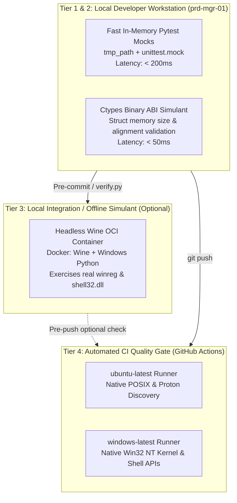

# ADR 0005: Cross-Platform Testing Strategy and Operating System Simulation Matrix

## 1. Context and Problem Statement

With the implementation of the OS Path Discovery subsystem ([ADR 0004](0004_os_path_discovery_and_filesystem_research_framework.md) and [SDD-002](../designs/0002_os_path_discovery_component_design.md)), `ed-telemetry` contains platform-specific code paths that execute conditionally based on the host operating system:
1. **Microsoft Windows:** Depends on the Win32 NT kernel, ctypes invoking `shell32.dll` (`SHGetKnownFolderPath`), `ole32.dll` (`CoTaskMemFree`), and the native `winreg` module.
2. **Linux / SteamOS:** Depends on POSIX filesystems, Steam `libraryfolders.vdf` parsing, Proton compatibility prefixes (`compatdata/359320`), and Flatpak sandbox paths.

Our primary local development workstation (`prd-mgr-01`) is a Linux host (`Ubuntu / Debian`). While our unit test suite mocks `sys.platform` and filesystem trees via Pytest (`tmp_path`), **mocking alone does not test real binary C ABI packing or true platform API contracts**. 

We require an architectural decision that defines:
* How Windows and Linux platform logic can be simulated and tested locally on a Linux workstation (`prd-mgr-01`).
* What packages and runtime environments are required on the host system.
* What test tooling (inside and outside Pytest) shall be employed.
* The formal distinction between our existing GitHub Actions workflow and a native multi-OS CI matrix.

---

## 2. Decision Drivers

* **Ground-Truth Fidelity:** We must prevent bugs where mock tests pass on Linux, but real ctypes memory structures crash on Windows NT.
* **Developer Velocity:** Running tests locally on `prd-mgr-01` must not require a dedicated Windows secondary computer or complex manual setup for everyday tasks.
* **Zero Host Bloat:** Avoid polluting the developer's workstation with gigabytes of unneeded runtime virtual machines unless strictly containerized.
* **CI-Enforced Parity:** Pull requests must be verified against authentic, physical operating systems before merging to `main`.

---

## 3. Considered Options

* **Option 1: In-Memory Pytest Mocking Only (Status Quo)**
  - Fast, zero host dependencies, but cannot detect Windows ctypes ABI mismatches or `winreg` syntax errors.
* **Option 2: Host-Level Wine & Windows Python on `prd-mgr-01`**
  - Install `wine64` and a Windows build of Python (`python.exe`) directly on the Linux host to run `wine python.exe -m pytest`.
* **Option 3: Containerized Multi-Environment Matrix (Docker / OCI)**
  - Encapsulate Linux Flatpak and Wine environments within reproducible Docker containers on `prd-mgr-01`.
* **Option 4: Tiered Testing Pyramid (Local Simulants + Native GitHub Actions Multi-OS Matrix)**
  - Keep everyday local test runs lightweight using fast Pytest simulants and ctypes ABI checks.
  - Offload true binary execution on native Windows 11 to GitHub Actions cloud runners (`windows-latest`).
  - Provide an optional containerized Wine harness for offline developer verification.

---

## 4. Decision Outcome

Chosen Option: **Option 4: Adopt a 3-Tier Cross-Platform Testing Pyramid (Local ABI Simulants $\rightarrow$ Optional Containerized Wine $\rightarrow$ Native GitHub Actions Multi-OS Runner Matrix).**



---

## 5. Architectural Specifications

### 5.1 System-Side Packages for `prd-mgr-01`

To support local cross-platform verification without compromising workstation stability:

1. **Baseline Workstation Requirements (Mandatory for everyday work):**
   - Standard Linux Python 3.11+ virtual environment (`.venv`).
   - No external non-apt packages required for Tier 1 and Tier 2.

2. **Optional Offline Windows Emulation (For local Wine-based validation):**
   - If the operator wishes to run the Windows strategy locally without waiting for CI:
     - Host Package: `wine` / `wine64` (`sudo apt install wine64 wine-binfmt`).
     - Windows Python: Windows embeddable zip or installer for Python 3.11 (`python-3.11.x-amd64.exe`) installed into a local test wine prefix: `~/.cache/ed-telemetry/winepfx/`.
   - **Recommended Containerized Alternative:** Instead of installing Wine globally on `prd-mgr-01`, use an ephemeral Dockerfile:
     ```dockerfile
     FROM debian:bookworm-slim
     RUN dpkg --add-architecture i386 && apt-get update && apt-get install -y wine wine64 python3
     ```
     This prevents polluting `prd-mgr-01` with global Wine desktop associations or 32-bit multiarch packages.

### 5.2 Tooling Landscape: Inside and Outside Pytest

| Category | Tool | Execution Layer | Purpose |
| :--- | :--- | :--- | :--- |
| **In Pytest** | `pytest` + `tmp_path` | Tier 1/2 Local | Fast directory tree mocking and parameter precedence validation. |
| **In Pytest** | `ctypes` Memory Profiling | Tier 2 Local | Asserts that `ctypes.sizeof(GUID) == 16` bytes and struct member byte offsets match the Microsoft C header specification. |
| **In Pytest** | `pytest-mock` | Tier 1/2 Local | Clean fixture-based mocking of `sys.platform` and environment variables. |
| **Separate Tooling** | `import-linter` | Tier 2 Verification | Enforces that platform strategies in `ed_watcher` never cross architectural package boundaries. |
| **Separate Tooling** | `mypy` (Cross-Platform) | Tier 2 Verification | Type checks platform branches using `mypy --platform win32` and `mypy --platform linux`. |
| **Separate Tooling** | `act` (Local GitHub Actions) | Local Offline CI | Optional local CLI tool (`act`) allowing developers to run GitHub Actions workflows locally inside Docker. |

### 5.3 Distinction: Existing CI Workflow vs. Native GitHub Actions Matrix

Our repository currently maintains `.github/workflows/ci.yml`. It is essential to distinguish how our existing setup differs from the proposed native cross-platform matrix:

```mermaid
classDiagram
    class ExistingCIWorkflow {
        runs-on: "ubuntu-latest"
        matrix: "python-version [3.11, 3.12]"
        host_kernel: "Linux (Ubuntu)"
        win32_shell_tested: false
        winreg_tested: false
    }

    class ProposedMultiOSMatrixWorkflow {
        runs-on: "${{ matrix.os }}"
        matrix_os: "[ubuntu-latest, windows-latest]"
        matrix_python: "[3.11, 3.12]"
        host_kernel: "Linux AND Native Windows Server/11"
        win32_shell_tested: true
        winreg_tested: true
    }

    ExistingCIWorkflow <|-- ProposedMultiOSMatrixWorkflow : extends
```

1. **Existing Workflow (`.github/workflows/ci.yml`):**
   - **Single OS Host:** Runs exclusively on `runs-on: ubuntu-latest`.
   - **Limitation:** It tests multiple *Python language versions* (`3.11`, `3.12`), but it **only tests them on the Linux kernel**.
   - **The Blindspot:** On `ubuntu-latest`, `WindowsPathStrategy` is only exercised via mocked unit tests. Real Windows DLLs and `winreg` are completely skipped.

2. **Proposed Native Multi-OS Matrix:**
   - **Multi-OS Host:** Expands the runner matrix to include `windows-latest`:
     ```yaml
     strategy:
       matrix:
         os: [ubuntu-latest, windows-latest]
         python-version: ["3.11", "3.12"]
     runs-on: ${{ matrix.os }}
     ```
   - **True NT Kernel:** On the `windows-latest` runner, the workflow boots an authentic Microsoft Windows virtual machine.
   - **Native Verification:**
     - Pytest executes on real Windows Python with the real C-extension `winreg`.
     - `WindowsPathStrategy` invokes real `shell32.dll` and resolves the authentic `%USERPROFILE%\Saved Games` folder on the Windows filesystem.
     - Uncovers path separator issues (`\` vs `/`), file locking semantics, and NTFS permissions that no Linux mock can replicate.

---

## 6. Consequences

### Positive
* **Guaranteed Windows Compatibility:** Every PR is automatically verified on real Windows 11 hardware/VMs before merging, eliminating platform regression bugs.
* **Clean Workstation:** The developer's primary machine (`prd-mgr-01`) remains clean, fast, and uncluttered by heavy virtual machines.
* **Multi-Layered Confidence:** Cheap tests run locally in < 1 second; expensive platform tests run asynchronously in GitHub cloud infrastructure.

### Negative / Trade-Offs
* **CI Execution Time:** Adding `windows-latest` runners to GitHub Actions increases CI workflow duration (Windows runners typically take ~30–45 seconds longer to provision than Ubuntu containers).
* **Cross-Platform Mypy Invocations:** Maintainers must ensure code passes static typing under both Windows and POSIX stub definitions.
