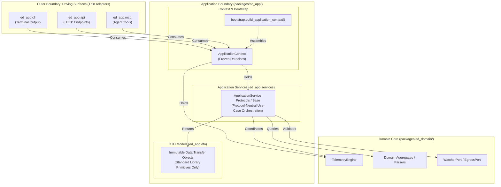

# ADR 0010: Application Service Layer Architecture, Boundary Contracts, and Multi-Modal Orchestration

## 1. Context and Problem Statement

`ed-telemetry` is designed as a multi-modal telemetry core supporting four co-equal front doors ([ADR 0001](0001_architectural_vision_and_operational_concept.md)):
1. **Interactive CLI**: Operational inspection, real-time event tailing, and daemon execution.
2. **Local REST API**: HTTP endpoints and server-sent telemetry streams.
3. **Model Context Protocol (MCP) Server**: Telemetry query and streaming tools exposed directly to AI coding agents.
4. **Desktop UI / TUI**: Cockpits and live event dashboards.

With the completion and sealing of the inbound driving adapter subsystem `ed_watcher` ([ADR 0008](0008_file_ingestion_io_freshness_and_concurrency.md), [ADR 0009](0009_watcher_port_adapter_and_threaded_lifecycle.md)), we face a critical structural decision before introducing domain parsers and concrete use-cases:

If driving surfaces (CLI, REST, MCP) implement their own coordination logic ad-hoc:
- **Logic Duplication (DRY Violation):** CLI commands, REST endpoints, and MCP tools would write redundant, diverging logic to query or control the system.
- **Protocol Coupling:** Infrastructure frameworks (FastAPI request contexts, Click/Argparse flags, MCP JSON-RPC schemas) risk leaking into domain workflows.
- **Architectural Erosion:** Driving surfaces might bypass domain boundaries and call low-level adapters (`PathDiscoverer`, `JournalSelector`) directly, corrupting the Hexagonal model.

We require an architectural decision establishing the formal **structural scaffolding of the Application Service Layer** in `packages/ed_app/`: defining its semantic responsibilities, structural taxonomy, boundary scope, governing invariants, and mechanical CI enforcement policies.

---

## 2. Decision Drivers

* **Strict Hexagonal Integrity:** Preserve the clean boundary where `ed_domain` remains 100% pure, infrastructure adapters remain decoupled behind ports, and driving surfaces remain ultra-thin protocol translators.
* **Co-Equal Multi-Modal Parity:** Ensure any capability implemented in the future is identically available via CLI, REST API, and MCP with zero divergent business logic.
* **Protocol Neutrality:** Application services and DTOs must have zero knowledge of HTTP headers, CLI terminal codes, or JSON-RPC transport layers.
* **Deterministic Machine Enforcement:** Architectural policies governing the Application Service Layer must be mechanically enforced by CI linters and test suites rather than relying on developer discipline.

---

## 3. Decision Outcome

Chosen Option: **Mediated Application Service Layer with Pure Data Transfer Objects (DTOs), Typed `ApplicationContext`, and CI-Enforced Submodule Boundaries**.

We will formally structure `packages/ed_app/` into dedicated architectural submodules:
1. `packages/ed_app/services/`: Protocol-agnostic application workflows and use-case orchestrators inheriting from a common base contract.
2. `packages/ed_app/dto/`: Strongly-typed, serializable Data Transfer Objects decoupling internal domain models from external presentation.
3. `packages/ed_app/context.py`: Strongly-typed, immutable `ApplicationContext` container bundling pre-wired services.
4. `packages/ed_app/bootstrap.py`: Side-effect-free Composition Root factory (`build_application_context()`).
5. `packages/ed_app/exceptions.py`: Pure application-level exception hierarchy (`ApplicationServiceError`).
6. `packages/ed_app/cli/`: Ultra-thin CLI driving adapter (translates CLI flags $\to$ Service calls $\to$ stdout).
7. `packages/ed_app/api/`: Ultra-thin REST/HTTP driving adapter (future; translates HTTP requests $\to$ Service calls $\to$ JSON responses).
8. `packages/ed_app/mcp/`: Ultra-thin MCP server driving adapter (future; translates JSON-RPC tool calls $\to$ Service calls $\to$ tool results).

---

### 3.1 Architectural Component Hierarchy



---

### 3.2 Boundary Scope and Taxonomy

| Component | Allowed Inbound Callers | Allowed Outbound Imports | Strict Prohibitions |
| :--- | :--- | :--- | :--- |
| **`ed_app.dto`** | `ed_app.services`, `ed_app.cli`, `ed_app.api`, `ed_app.mcp`, external SDK | Standard library only (`dataclasses`, `datetime`, `typing`, `pydantic`) | Must NEVER import `ed_domain`, `ed_watcher`, `ed_egress`, or web/CLI frameworks. |
| **`ed_app.services`** | `ed_app.cli`, `ed_app.api`, `ed_app.mcp`, `bootstrap.py` | `ed_domain` (all modules), `ed_app.dto`, `ed_app.exceptions` | Must NEVER import driving surface frameworks (`fastapi`, `click`, `sys.exit`) or concrete infrastructure adapters. |
| **`ed_app.cli`** | CLI executable entrypoints | `ed_app.services`, `ed_app.dto`, `ed_app.context`, `bootstrap.py` | Must NEVER import `ed_domain` directly or make raw calls to infrastructure adapters. |
| **`ed_app.api`** | HTTP ASGI server | `ed_app.services`, `ed_app.dto`, `ed_app.context`, `bootstrap.py` | Must NEVER import `ed_domain` directly or make raw calls to infrastructure adapters. |
| **`ed_app.mcp`** | MCP daemon runner | `ed_app.services`, `ed_app.dto`, `ed_app.context`, `bootstrap.py` | Must NEVER import `ed_domain` directly or make raw calls to infrastructure adapters. |

---

### 3.3 The DTO Architectural Standard (`packages/ed_app/dto/`)

To guarantee strict boundary isolation between domain aggregates and presentation protocols:
1. **Pure Data Containers:** All DTOs are declared as immutable dataclasses (`@dataclass(frozen=True)`).
2. **Primitive Typing:** DTO fields must strictly use standard library primitive types (`str`, `int`, `float`, `bool`, `datetime`, `UUID`, `tuple`). Internal domain entities or aggregate pointers must never escape through DTO boundaries.
3. **Framework Agnostic:** DTOs are completely independent of web serialization libraries (Pydantic models, JSON-RPC schemas) or terminal styling codes.
4. **Serialization Readiness:** DTOs must provide standard conversion methods (`as_dict()`, `as_json()`) without requiring external dependencies.

---

### 3.4 The `ApplicationContext` Contract (`packages/ed_app/context.py`)

To eliminate global state and prevent driving surfaces from having to manually assemble individual service dependencies, `ed_app` defines an immutable, strongly-typed `ApplicationContext`:

```python
"""Application Context: Bundles assembled services and engine handles."""

from dataclasses import dataclass
from typing import Any
from ed_domain.engine import TelemetryEngine


@dataclass(frozen=True)
class ApplicationContext:
    """Immutable bundle of initialized application services and engine handles.

    Provides driving surfaces (CLI, REST, MCP) with a single, strongly-typed
    entry point to all application-layer capabilities without global state.
    """

    engine: TelemetryEngine
    services: tuple[Any, ...]  # Typed tuple of initialized BaseApplicationService instances
```

#### Composition Root Signature (`packages/ed_app/bootstrap.py`)
The composition root exports a side-effect-free factory function:

```python
def build_application_context(
    journal_dir_override: Path | None = None,
) -> ApplicationContext:
    """Instantiate ports, domain core, and application services into a frozen context.

    Guaranteed side-effect-free: does not bind network sockets, create files,
    or launch background threads during construction.
    """
    ...
```

---

### 3.5 Governing Invariants & Policies

* **Invariant C (Protocol Neutrality):**
  - Application Services and DTOs must be 100% protocol-agnostic.
  - Services must never raise HTTP exceptions (`fastapi.HTTPException`), execute CLI exits (`sys.exit()`), or serialize MCP JSON-RPC schemas.
  - Failures inside services must raise strongly-typed application exceptions inheriting from `ApplicationServiceError` (`packages/ed_app/exceptions.py`).
* **Invariant D (Downward Dependency Rule):**
  - High-level orchestration services and DTOs must never depend on the driving surfaces that call them.
  - `ed_app.services` and `ed_app.dto` $\to$ `ed_app.cli` / `ed_app.api` / `ed_app.mcp` imports are strictly forbidden.
* **Invariant E (DTO Boundary Isolation):**
  - Application services must return pure, serializable DTOs to driving surfaces, never mutable internal domain aggregates or raw telemetry entity pointers.
* **Invariant F (Side-Effect-Free Service Instantiation):**
  - Service constructors (`__init__`) must strictly perform dependency assignment. No background threads, network sockets, or file I/O may be initiated during object construction.
* **Invariant G (Driving Surface and Service Infrastructure Isolation):**
  - Concrete infrastructure adapter packages (`ed_watcher`, `ed_egress`) are strictly forbidden from being imported by driving surfaces (`ed_app.cli`, `ed_app.api`, `ed_app.mcp`), application services (`ed_app.services`), and DTO models (`ed_app.dto`).
  - The **only** module within `ed_app` authorized to import from `ed_watcher` or `ed_egress` is the Composition Root (`ed_app.bootstrap`).
  - Driving surfaces and services must interact with watchers and transmitters strictly through domain ports (`ed_domain.ports.WatcherPort`, `ed_domain.ports.EgressPort`) or application services.

---

### 3.6 Mechanical Enforcement Matrix

To ensure architectural integrity is never compromised over time, policies are enforced across automated CI quality gates:

```toml
# Machine-enforced import-linter boundary contract (pyproject.toml)
[[tool.importlinter.contracts]]
name = "Invariant G: Driving surfaces and services forbidden from concrete adapters"
type = "forbidden"
source_modules = [
    "ed_app.cli",
    "ed_app.api",
    "ed_app.mcp",
    "ed_app.services",
    "ed_app.dto",
]
forbidden_modules = [
    "ed_watcher",
    "ed_egress",
]

[[tool.importlinter.contracts]]
name = "Invariant D: Application services forbidden from driving surfaces"
type = "forbidden"
source_modules = [
    "ed_app.services",
    "ed_app.dto",
]
forbidden_modules = [
    "ed_app.cli",
    "ed_app.api",
    "ed_app.mcp",
]

[[tool.importlinter.contracts]]
name = "Invariant C: Services and DTOs forbidden from protocol frameworks"
type = "forbidden"
source_modules = [
    "ed_app.services",
    "ed_app.dto",
]
forbidden_modules = [
    "argparse",
    "click",
    "fastapi",
    "starlette",
    "mcp",
]
```

| Policy | Mechanical Enforcement Mechanism | Failure Surface |
| :--- | :--- | :--- |
| **Infrastructure Isolation (Invariant G)** | `import-linter` contract forbidding `ed_app.cli`, `ed_app.api`, `ed_app.mcp`, `ed_app.services`, `ed_app.dto` from importing `ed_watcher` and `ed_egress`. | Tier 2 `scripts/verify.py` (`Import Linter Boundaries`) |
| **Downward Dependency (Invariant D)** | `import-linter` contract forbidding `ed_app.services` and `ed_app.dto` from importing `ed_app.cli`, `ed_app.api`, `ed_app.mcp`. | Tier 2 `scripts/verify.py` (`Import Linter Boundaries`) |
| **Protocol Neutrality (Invariant C)** | `import-linter` forbidden modules contract restricting `fastapi`, `starlette`, `click`, `argparse`, `mcp` from `ed_app.services` and `ed_app.dto`. | Tier 2 `scripts/verify.py` (`Import Linter Boundaries`) |
| **Domain Direct Access Prohibition** | `import-linter` contract ensuring `ed_app.cli`, `ed_app.api`, `ed_app.mcp` only access domain via `ed_app.services` and `ed_domain.ports`. | Tier 2 `scripts/verify.py` (`Import Linter Boundaries`) |
| **DTO Typing Purity** | Static type checking via `mypy --strict packages/ed_app`. | Tier 2 `scripts/verify.py` (`Mypy Static Typing`) |
| **Side-Effect-Free Construction (Invariant F)** | Unit test `test_services_side_effect_freedom` asserting `threading.active_count()` unchanged upon assembly. | Tier 2 Pytest test suite |

---

## 4. Architectural Consequences

### Positive
* **Pure Architectural Scaffolding:** Establishes the formal boundary interfaces, typing rules, and mechanical enforcement before implementing specific domain use cases.
* **Complete Interface Parity:** When use-case services are introduced, they automatically become accessible across CLI, REST API, and MCP with zero duplicate logic.
* **Machine-Guarded Integrity:** Developers cannot accidentally cross layer boundaries or leak concrete adapters into driving surfaces because CI actively breaks on unauthorized imports.

### Negative / Trade-Offs
* **Additional Indirection:** Operations flow through DTO boundaries rather than directly manipulating domain objects. This structure is accepted to guarantee decoupling.

---

## 5. References
* [ADR 0001: Architectural Vision, Operational Concept, and CI-Enforced Modular Boundaries](0001_architectural_vision_and_operational_concept.md)
* [ADR 0003: Minimal Walking Skeleton and Bootstrap Verification Contract](0003_minimal_walking_skeleton_and_bootstrap_contract.md)
* [ADR 0009: Watcher Port Adapter and Threaded Lifecycle Management](0009_watcher_port_adapter_and_threaded_lifecycle.md)
