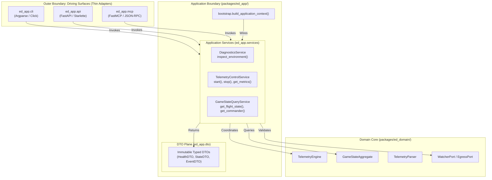

# ADR 0010: Application Service Layer Architecture, Boundary Contracts, and Multi-Modal Orchestration

## 1. Context and Problem Statement

`ed-telemetry` is designed as a multi-modal telemetry core supporting four co-equal front doors ([ADR 0001](0001_architectural_vision_and_operational_concept.md)):
1. **Interactive CLI**: Operational inspection, real-time event tailing, and daemon execution.
2. **Local REST API**: HTTP endpoints (`/health`, `/status`) and server-sent telemetry streams (`/events`).
3. **Model Context Protocol (MCP) Server**: Exposing telemetry tools (`get_flight_state`, `list_events`, `check_game_status`) directly to AI coding agents.
4. **Desktop UI / TUI**: High-density cockpits and event burst dashboards.

With the completion and sealing of the inbound driving adapter subsystem `ed_watcher` ([ADR 0008](0008_file_ingestion_io_freshness_and_concurrency.md), [ADR 0009](0009_watcher_port_adapter_and_threaded_lifecycle.md)), we face a critical structural decision before introducing the domain telemetry parser and operational use-cases:

If driving surfaces (CLI, REST, MCP) implement their own coordination logic ad-hoc:
- **Logic Duplication (DRY Violation):** `ed-telemetry doctor`, HTTP `GET /health`, and MCP tool `check_game_status` would write redundant, diverging logic to inspect path discovery and telemetry health.
- **Protocol Coupling:** Infrastructure frameworks (FastAPI request contexts, Click/Argparse flags, MCP JSON-RPC schemas) risk leaking into domain workflows.
- **Architectural Erosion:** Driving surfaces might bypass domain boundaries and call low-level adapters (`PathDiscoverer`, `JournalSelector`) directly, corrupting the Hexagonal model.

We require an architectural decision establishing the formal **Application Service Layer** in `packages/ed_app/`: defining its semantic responsibilities, structural taxonomy, boundary scope, governing invariants, and mechanical CI enforcement policies.

---

## 2. Decision Drivers

* **Strict Hexagonal Integrity:** Preserve the clean boundary where `ed_domain` remains 100% pure, infrastructure adapters remain decoupled behind ports, and driving surfaces remain ultra-thin protocol translators.
* **Co-Equal Multi-Modal Parity:** Ensure every capability available in the CLI is identically available via REST API and MCP tools with zero divergent business logic.
* **Protocol Neutrality:** Application services must have zero knowledge of HTTP headers, CLI terminal codes, or JSON-RPC transport layers.
* **Deterministic Machine Enforcement:** Architectural policies governing the Application Service Layer must be mechanically enforced by CI linters and test suites rather than relying on developer discipline.

---

## 3. Decision Outcome

Chosen Option: **Mediated Application Service Layer with Pure Data Transfer Objects (DTOs) and CI-Enforced Submodule Boundaries**.

We will formally structure `packages/ed_app/` into dedicated submodules:
1. `packages/ed_app/services/`: Protocol-agnostic application workflows and use-case orchestrators.
2. `packages/ed_app/dto/`: Strongly-typed, serializable Data Transfer Objects decoupling internal domain models from external presentation.
3. `packages/ed_app/bootstrap.py`: Side-effect-free Composition Root assembling ports, domain engines, and services.
4. `packages/ed_app/cli/`: Ultra-thin CLI driving adapter (translates CLI flags $\to$ Service calls $\to$ stdout).
5. `packages/ed_app/api/`: Ultra-thin REST/HTTP driving adapter (translates HTTP requests $\to$ Service calls $\to$ JSON responses).
6. `packages/ed_app/mcp/`: Ultra-thin MCP server driving adapter (translates JSON-RPC tool calls $\to$ Service calls $\to$ tool results).

---

### 3.1 Architectural Component Hierarchy

---

### 3.2 Boundary Scope and Taxonomy

| Component | Allowed Inbound Callers | Allowed Outbound Imports | Strict Prohibitions |
| :--- | :--- | :--- | :--- |
| **`ed_app.dto`** | `ed_app.services`, `ed_app.cli`, `ed_app.api`, `ed_app.mcp`, external SDK | Standard library (`dataclasses`, `datetime`, `typing`, `pydantic`) | Must NEVER import `ed_domain`, `ed_watcher`, `ed_egress`, or web/CLI frameworks. |
| **`ed_app.services`** | `ed_app.cli`, `ed_app.api`, `ed_app.mcp`, `bootstrap.py` | `ed_domain` (all modules), `ed_app.dto` | Must NEVER import driving surface frameworks (`fastapi`, `click`, `sys.exit`) or concrete infrastructure adapters. |
| **`ed_app.cli`** | CLI executable entrypoints | `ed_app.services`, `ed_app.dto`, `bootstrap.py` | Must NEVER import `ed_domain` directly or make raw calls to infrastructure adapters. |
| **`ed_app.api`** | HTTP ASGI server | `ed_app.services`, `ed_app.dto`, `bootstrap.py` | Must NEVER import `ed_domain` directly or make raw calls to infrastructure adapters. |
| **`ed_app.mcp`** | MCP daemon runner | `ed_app.services`, `ed_app.dto`, `bootstrap.py` | Must NEVER import `ed_domain` directly or make raw calls to infrastructure adapters. |

---

### 3.3 Governing Invariants & Policies

* **Invariant C (Protocol Neutrality):**
  - Application Services must be 100% protocol-agnostic.
  - Services must never raise HTTP exceptions (`fastapi.HTTPException`), execute CLI exits (`sys.exit()`), or serialize MCP JSON-RPC schemas.
  - Failures inside services must raise strongly-typed application exceptions inheriting from `ApplicationServiceError` (`packages/ed_app/exceptions.py`).
* **Invariant D (Downward Dependency Rule):**
  - High-level orchestration services must never depend on the driving surfaces that call them.
  - `ed_app.services` $\to$ `ed_app.cli` / `ed_app.api` / `ed_app.mcp` imports are strictly forbidden.
* **Invariant E (DTO Boundary Isolation):**
  - Application services must return pure, serializable DTOs to driving surfaces, never mutable internal domain aggregates or raw telemetry entity pointers.
* **Invariant F (Side-Effect-Free Service Instantiation):**
  - Service constructors (`__init__`) must strictly perform dependency assignment. No background threads, network sockets, or file I/O may be initiated during object construction.

---

### 3.4 Mechanical Enforcement Matrix

To ensure architectural integrity is never compromised over time, policies will be enforced across four automated tiers:

| Policy | Mechanical Enforcement Mechanism | Failure Surface |
| :--- | :--- | :--- |
| **Downward Dependency (Invariant D)** | `import-linter` contract in `pyproject.toml` forbidding `ed_app.services` from importing `ed_app.cli`, `ed_app.api`, `ed_app.mcp`. | Tier 2 `scripts/verify.py` (`Import Linter Boundaries`) |
| **Protocol Neutrality (Invariant C)** | `import-linter` forbidden modules contract restricting `fastapi`, `starlette`, `click`, `argparse`, `mcp` from `ed_app.services` and `ed_app.dto`. | Tier 2 `scripts/verify.py` (`Import Linter Boundaries`) |
| **Domain Direct Access Prohibition** | `import-linter` contract ensuring `ed_app.cli`, `ed_app.api`, `ed_app.mcp` only access domain via `ed_app.services` and `ed_domain.ports`. | Tier 2 `scripts/verify.py` (`Import Linter Boundaries`) |
| **DTO Typing Purity** | Static type checking via `mypy --strict packages/ed_app`. | Tier 2 `scripts/verify.py` (`Mypy Static Typing`) |
| **Side-Effect-Free Construction (Invariant F)** | Unit test `test_services_side_effect_freedom` asserting `threading.active_count()` unchanged upon assembly. | Tier 2 Pytest test suite |

---

## 4. Architectural Consequences

### Positive
* **Complete Interface Parity:** New capabilities (e.g. state querying, historical replay, live event filtering) implemented in an Application Service immediately become available across CLI, REST API, and MCP with zero duplicate logic.
* **Pluggable Driving Surfaces:** CLI, REST, and MCP implementations can be added, updated, or refactored independently without touching domain logic.
* **Machine-Guarded Integrity:** Developers cannot accidentally cross layer boundaries because CI actively breaks on unauthorized imports.

### Negative / Trade-Offs
* **Additional Indirection:** Adding a new query or command requires defining a DTO, a service method, and the surface mapping rather than directly accessing domain classes. This overhead is accepted to guarantee long-term stability and protocol decoupling.

---

## 5. References
* [ADR 0001: Architectural Vision, Operational Concept, and CI-Enforced Modular Boundaries](0001_architectural_vision_and_operational_concept.md)
* [ADR 0003: Minimal Walking Skeleton and Bootstrap Verification Contract](0003_minimal_walking_skeleton_and_bootstrap_contract.md)
* [ADR 0009: Watcher Port Adapter and Threaded Lifecycle Management](0009_watcher_port_adapter_and_threaded_lifecycle.md)
