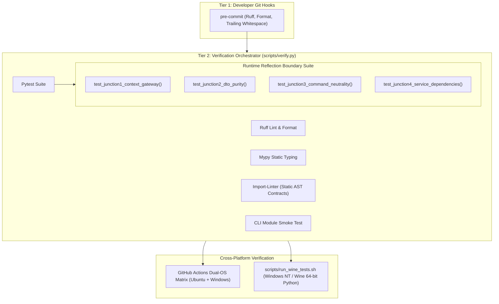

# ADR 0013: Runtime Reflection Verification for Object-Tunneling Boundary Invariants

## 1. Context and Problem Statement

`ed-telemetry` enforces architectural separation via static AST analysis (`import-linter`) across the Pure Hexagonal topology ([ADR 0012](0012_segregation_of_root_monorepo_topology_into_apps_and_libs.md)). While `import-linter` strictly verifies file-level `import` statements, it possesses a critical architectural blind spot: **Transitive Runtime Object Tunneling**.

Object tunneling occurs when an authorized import path returns an aggregated data container or composite object whose fields leak instances of unauthorized layers across boundary walls:
```python
# interfaces/cli/main.py
from services.bootstrap import build_application_context  # Statically allowed!

app_ctx = build_application_context()
app_ctx.engine.start()  # RUNTIME VIOLATION: CLI directly invokes domain.engine without importing domain!
```

Because `main.py` only imports `services.bootstrap`, static AST linters report 100% compliance. However, at runtime, the driving surface gains direct access to manipulate the domain core or driven infrastructure adapters through attribute traversal.

We require an automated, deterministic verification mechanism to audit the live Python object graph across architectural boundary junctions, provide standardized human-readable diagnostics, and integrate seamlessly into our existing multi-tier quality gates.

---

## 2. Decision Drivers

* **Zero-Blind-Spot Boundary Enforcement:** Mathematically eliminate runtime object tunneling across Hexagonal boundaries.
* **Standardized Diagnostic Feedback:** Provide human-readable, actionable assertion failure diagnostics following a predictable formatting protocol.
* **Zero New Heavy Dependencies:** Leverage native standard library reflection (`dataclasses`, `inspect`, `typing`) rather than runtime profilers, tracers, or bytecode injectors.
* **Seamless Quality Gate Integration:** Operate natively within `pytest`, `scripts/verify.py`, dual-OS GitHub Actions CI, and the Windows NT / Wine simulant runner (`scripts/run_wine_tests.sh`).
* **Preservation of Test Subject for Inception:** Retain `app_ctx.engine` during this inception phase as a concrete, detectable test subject to validate the verification mechanism before refactoring `TelemetryEngine`.

---

## 3. Decision Outcome

Chosen Option: **Standardized Runtime Reflection Validator Harness (`tests/helpers/boundary_reflection.py`) executed natively within Pytest and cross-platform verification gates**.

---

## 4. Architectural Boundary Junctions & Verification Matrix

Four canonical boundary junctions are established where objects cross architectural planes. Each junction is inspected using Python standard library reflection:

| Junction | Boundary Crossing | Tunneling Risk | Reflection Inspection Mechanism | Target Invariant & Assertion Rule |
| :--- | :--- | :--- | :--- | :--- |
| **Junction 1: Context Gateway** | `ApplicationContext`<br/>(Services ➔ Interfaces) | Leaking `domain.*` entities or `infrastructure.*` adapters onto the context. | Iterates `dataclasses.fields(app_ctx)`. Asserts `type(val).__module__` and typed annotations resolve strictly to `services.*` (implementing `BaseApplicationService`). | **Invariant D & G:**<br/>`app_ctx` attributes must **never** belong to `domain.*` or `infrastructure.*`. (Exposes current `app_ctx.engine` violation). |
| **Junction 2: Query DTO Purity** | Outbound DTOs<br/>(Services ➔ Interfaces) | Slipping domain entities, database records, or stream contexts into DTO payloads. | Recursive traversal of `dataclasses.fields(dto_instance)`. Verifies value types are strictly primitives (`str`, `int`, `float`, `bool`, `None`, `dict`, `list`, `tuple`) or nested frozen DTOs. | **Invariant E (DTO Purity):**<br/>DTO fields must **never** contain classes defined in `domain.*` or `infrastructure.*`. |
| **Junction 3: Inbound Command Neutrality** | Inbound Commands<br/>(Interfaces ➔ Services) | Passing framework presentation objects (`click.Context`, `fastapi.Request`, `mcp.Context`) into service use cases. | Evaluates `dataclasses.fields(command_instance)`. Asserts field values and annotations are primitive values, enums, or domain value objects. | **Invariant C (Protocol Neutrality):**<br/>Command fields must **never** originate from UI/CLI/Web frameworks. |
| **Junction 4: Service Constructor Dependency Shielding** | Composition Root ➔ Service Constructor | Injecting concrete infrastructure adapters directly into services instead of abstract domain ports. | Inspects `inspect.signature(ServiceClass.__init__)`. Audits parameter type annotations to ensure dependencies resolve to `domain.ports.*` and **never** `infrastructure.*`. | **Invariant G (Adapter Shielding):**<br/>Service constructors must **never** type-hint or bind concrete `infrastructure.*` adapters. |

---

## 5. Human-Readable Diagnostic Presentation Standard

When an architectural invariant violation is caught by runtime reflection, the test assertion must fail with a standardized, predictable diagnostic block.

### 5.1 Diagnostic Template Specification

```text
================================================================================
ARCHITECTURAL RUNTIME BOUNDARY VIOLATION: {INVARIANT_NAME}
================================================================================
Junction:     {JUNCTION_NAME} ({SOURCE_LAYER} -> {TARGET_LAYER})
Location:     {ENCLOSING_CLASS_OR_CONTAINER}.{FIELD_OR_PARAMETER_NAME}
Leaked Type:  {OBJECT_CLASS_NAME}
Module Path:  {OBJECT_MODULE_PATH}
Severity:     CRITICAL (Object Tunneling Detected)

Policy Violation:
  {EXPLICIT_RULE_EXPLANATION}

Remediation:
  {CONCRETE_REMEDIATION_ACTION}
================================================================================
```

### 5.2 Concrete Diagnostic Example (Junction 1: `app_ctx.engine`)

```text
================================================================================
ARCHITECTURAL RUNTIME BOUNDARY VIOLATION: Invariant D (Downward Layering)
================================================================================
Junction:     Junction 1: Context Gateway (src/services/ -> src/interfaces/)
Location:     ApplicationContext.engine
Leaked Type:  TelemetryEngine
Module Path:  domain.engine
Severity:     CRITICAL (Object Tunneling Detected)

Policy Violation:
  ApplicationContext is strictly an application service container.
  Exposing raw domain entities ('domain.*') directly to driving surfaces
  allows interfaces to bypass the Application Service Layer.

Remediation:
  Extract lifecycle coordination from TelemetryEngine into a dedicated
  DaemonService in 'src/services/', register DaemonService on ApplicationContext,
  and remove 'engine' from ApplicationContext.
================================================================================
```

---

## 6. Integration into Verification Gates & Quality Pipeline

The Runtime Reflection Validator operates without external dependencies and integrates across all existing quality gates:



1. **Native Pytest Execution (`tests/unit/test_boundary_reflection.py`):**
   - Directly executed by `pytest -v`.
   - Runs in `< 10ms` in-process.
2. **Orchestrated Quality Gate (`scripts/verify.py`):**
   - Step 4 (`Import Linter Boundaries`) validates the static AST graph.
   - Step 5 (`Pytest Suite`) executes the runtime reflection tests, ensuring both static files and live memory graphs pass before deployment.
3. **Cross-Platform Parity (`scripts/run_wine_tests.sh` & GitHub Actions):**
   - Windows Python running under Wine verifies that dataclass layouts, ABI structures, and object graphs remain invariant across Linux and Windows operating systems.

---

## 7. Consequences

### Positive
* **Complete Boundary Coverage:** Closes the static AST blind spot by mathematically auditing runtime object graphs.
* **Standardized Triage:** Uniform, high-visibility error blocks eliminate ambiguity during test failures.
* **Zero Overhead:** Requires no external packages; executes with zero latency impact.
* **Testability of Current Gap:** `TelemetryEngine` on `ApplicationContext` serves as an active, verified test case confirming the validator functions before we refactor the engine into a `DaemonService`.

### Negative
* Requires authors of new DTOs, Commands, and Services to adhere strictly to type annotations so reflection can inspect them.
