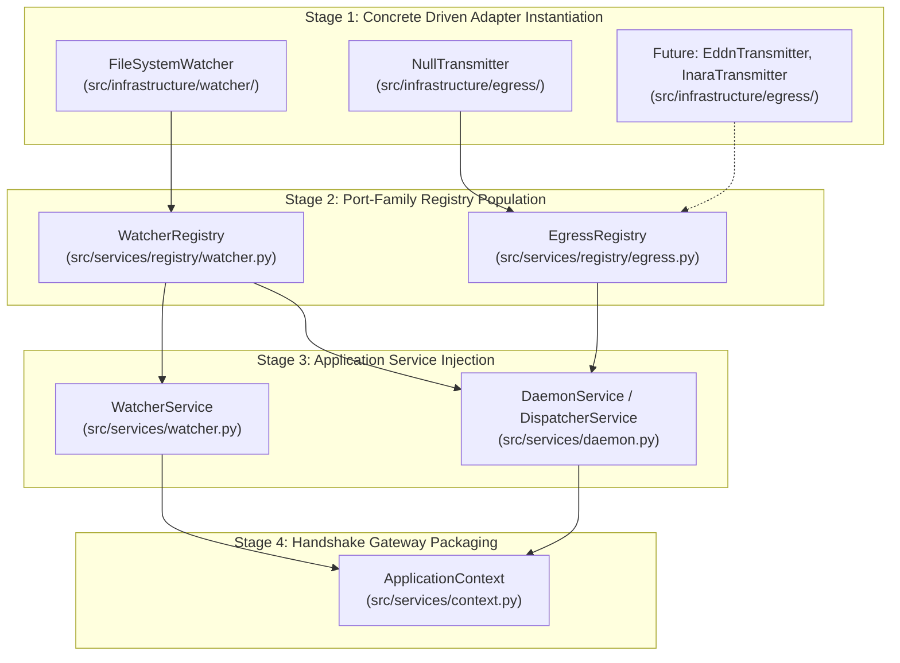

# ADR 0014: Driven Adapter Registry Architecture and Composition Root Integration

## 1. Context and Problem Statement

In Pure Hexagonal Architecture ([ADR 0012](0012_segregation_of_root_monorepo_topology_into_apps_and_libs.md)), all code outside the Domain Core and Application Service Layer is an Adapter. These adapters are categorized into two mutually exclusive directional groups:
1. **Driving Adapters (Primary / Inward):** Live strictly in `src/interfaces/` (CLI, future REST API, MCP). They drive the application core via the `ApplicationContext`.
2. **Driven Adapters (Secondary / Outward):** Live strictly in `src/infrastructure/` (`watcher`, `egress`). They are driven by the application core to perform real-world I/O.

Currently, driven adapter instances are instantiated ad-hoc in `src/services/bootstrap.py` and passed into `TelemetryEngine` as loose constructor arguments (`watcher=...`, `egress_ports=[...]`).

As the system scales to support multiple concurrent outbound transmitters (EDDN, Inara, EDSM, Discord Webhooks, SQLite loggers) and configurable inbound file watchers, the codebase requires an authoritative pattern for:
1. Registering, discovering, and holding collections of driven adapters.
2. Restricting the Adapter Registry exclusively to **Driven Adapters** residing in `src/infrastructure/`.
3. Integrating the registry into the Composition Root (`bootstrap.py`) and Application Service Layer (`services/`) without leaking adapters to driving surfaces or polluting the pure domain core.

---

## 2. Decision Drivers

* **Driven Adapter Exclusivity:** The Adapter Registry must manage **Driven Adapters only** (`src/infrastructure/`). Driving adapters (`src/interfaces/`) are entry-point consumers and must never be registered in an adapter registry.
* **Port Family Isolation (Interface Segregation):** Registries must be strictly segregated by Port Family (`BaseAdapterRegistry[T]`) rather than a unitary global bag. Services must only depend on the port types they consume (e.g. `DispatcherService` consumes `EgressRegistry`, never `WatcherRegistry`).
* **Predictable Common Protocol:** All port-family registries must derive from a common generic protocol/class (`BaseAdapterRegistry[T]`) to guarantee uniform lifecycle, discovery, inspection, and runtime boundary validation.
* **Physical Locality Invariance:** All Driven Adapters accepted by any registry must reside strictly in `src/infrastructure/` and implement abstract domain ports (`src/domain/ports/`).
* **Composition Root Cleanliness:** The Composition Root (`src/services/bootstrap.py`) must cleanly wire registered adapters into services without manual, tangled dependency injection.
* **Shielded Exposure (No Leakage):** The Adapter Registry and its concrete adapters must never be exposed directly to Driving Surfaces on `ApplicationContext` (preventing the object-tunneling violations governed by ADR 0013).
* **Operator Transparency:** Provide living Diátaxis runbooks (`docs/how-to/register_driven_adapter.md` and `docs/how-to/create_driven_adapter_registry.md`) for engineers to author, register, and create new registries with zero architectural friction.

---

## 3. Decision Outcome

Chosen Option: **Generic Base Protocol (`BaseAdapterRegistry[T]`) with Bespoke Port-Family Registries (`src/services/registry/`) and Automated Runtime Boundary Enforcement**.

---

## 4. Policy Specifications & Architecture

### 4.1 Driven Adapter Exclusivity Policy & Machine Enforcement

1. **Policy Statement:**
   > An Adapter Registry manages **Driven (Secondary) Adapters only**. Every registered adapter instance MUST reside strictly within `src/infrastructure/` and MUST implement an abstract domain port defined in `src/domain/ports/`. Driving Adapters (`src/interfaces/`) are strictly prohibited from registration.

2. **Automated Enforcement Mechanisms:**
   * **Static Type Invariants (`mypy`):** Registry registration methods strictly type-hint generic domain ports (e.g. `register(key: str, adapter: T)` where `T = TypeVar("T", bound=Port)`), refusing non-conforming objects at compile time.
   * **Runtime Boundary Reflection (`tests/helpers/boundary_reflection.py`):**
     At runtime, when an adapter is registered in `BaseAdapterRegistry[T]`, the base class asserts that the adapter class's module path starts with `infrastructure.`:
     ```python
     def _assert_driven_adapter(self, adapter: T) -> None:
         module_path = type(adapter).__module__
         if not module_path.startswith("infrastructure."):
             raise TypeError(
                 f"Adapter Registry only accepts Driven Adapters from 'src/infrastructure/', "
                 f"got: {type(adapter).__qualname__} from '{module_path}'"
             )
     ```
   * **Import-Linter Static Contract:** Ensures the registry modules in `src/services/registry/` do not statically depend on concrete adapters (adapters are injected into registries at bootstrap time).

---

### 4.2 Generic Base Protocol & Bespoke Port-Family Registries

Rather than a unitary registry that turns into an untyped dictionary or violates the Interface Segregation Principle (ISP), registries are partitioned by **Port Family** and descended from a reusable generic base class:

```text
src/services/
├── registry/                      # Driven Adapter Registry Subsystem
│   ├── __init__.py                # Public exports: BaseAdapterRegistry, EgressRegistry, WatcherRegistry
│   ├── base.py                    # Generic BaseAdapterRegistry[T] protocol & validation
│   ├── egress.py                  # EgressRegistry(BaseAdapterRegistry[EgressPort])
│   └── watcher.py                 # WatcherRegistry(BaseAdapterRegistry[WatcherPort])
```

#### 4.2.1 Common Generic Protocol (`BaseAdapterRegistry[T]`)
Located in `src/services/registry/base.py`:
* **Generic Type Parameter:** Parameterized over `T = TypeVar("T")` (typically bounded by domain port protocols).
* **Core Interface:**
  * `register(key: str, adapter: T) -> None`: Validates driven boundary and stores the adapter under `key`.
  * `get(key: str) -> T`: Retrieves adapter by key or raises `KeyError`.
  * `get_all() -> Sequence[T]`: Returns all registered adapters in registration order.
  * `list_keys() -> Sequence[str]`: Returns registered identifiers for diagnostic reporting.
  * `__len__() -> int`: Returns the count of registered adapters.
  * `__contains__(key: str) -> bool`: Checks existence of key.
* **Shared Invariant:** Automatically executes `_assert_driven_adapter(adapter)` on registration across all derived registries.

#### 4.2.2 Bespoke Port-Family Registries & Cardinality Invariants
Bespoke registries inherit from `BaseAdapterRegistry[T]` and enforce the specific cardinality and routing semantics of their port family:

1. **`EgressRegistry(BaseAdapterRegistry[EgressPort])`:**
   - **Cardinality:** $1 \rightarrow N$ (one event broadcasts across multiple sinks).
   - **Domain Port:** `src/domain/ports/egress.py:EgressPort`.
   - **Family Behavior:** Provides `broadcast(event: JournalEvent)` or returns immutable sequences of active transmitters for the `DispatcherService`.
2. **`WatcherRegistry(BaseAdapterRegistry[WatcherPort])`:**
   - **Cardinality:** $1 \rightarrow 1$ (primary active stream source per runtime engine).
   - **Domain Port:** `src/domain/ports/watcher.py:WatcherPort`.
   - **Family Behavior:** Provides `get_active() -> WatcherPort` and enforces single active source semantics for `WatcherService`.

* **Architectural Rationale for Port-Family Separation:**
  * **Interface Segregation Principle (ISP):** A consumer service like `DispatcherService` only requires egress sinks and must not receive or know about file watcher sources.
  * **Type-Safe Dispatch:** Static analysis (`mypy`) guarantees that methods invoked on registry items match the expected port contract without dynamic `isinstance` casting.
  * **Domain Cardinality Alignment:** Cardinality differences ($1 \rightarrow N$ broadcast vs. $1 \rightarrow 1$ active input) are modeled naturally in dedicated family classes rather than leaky branching logic.

---

### 4.3 Composition Root Integration (`src/services/bootstrap.py`)

The addition of port-family Adapter Registries transforms `bootstrap.py` into a clean, staged assembly pipeline:



1. **Bootstrap Pipeline:**
   ```python
   # src/services/bootstrap.py
   def build_application_context(journal_dir: Path | None = None) -> ApplicationContext:
       # 1. Instantiate Driven Adapters (src/infrastructure/)
       watcher_adapter = FileSystemWatcher(journal_dir=journal_dir)
       null_transmitter = NullTransmitter()

       # 2. Populate Port-Family Registries
       watcher_registry = WatcherRegistry()
       watcher_registry.register("primary_watcher", watcher_adapter)

       egress_registry = EgressRegistry()
       egress_registry.register("null_transmitter", null_transmitter)

       # 3. Instantiate Application Services (src/services/)
       watcher_service = WatcherService(watcher_registry=watcher_registry)
       daemon_service = DaemonService(
           watcher_registry=watcher_registry,
           egress_registry=egress_registry,
       )

       # 4. Package into immutable ApplicationContext
       return ApplicationContext(
           daemon_service=daemon_service,
           watcher_service=watcher_service,
           services=(daemon_service, watcher_service),
       )
   ```
2. **Key Guarantee:** Neither `BaseAdapterRegistry` instances nor concrete infrastructure adapters are placed on `ApplicationContext`. Driving interfaces access capabilities strictly through sanitized Application Service methods and immutable DTOs (e.g. `app_ctx.daemon_service.get_active_transmitters()`).

---

### 4.4 Inventory of Existing Driven Adapters

The current repository contains the following driven adapters to be registered:

| Driven Adapter | Physical Location | Port Family / Target Registry | Satisfied Domain Port | Registration Key | Operational Role |
| :--- | :--- | :--- | :--- | :--- | :--- |
| **`FileSystemWatcher`** | `src/infrastructure/watcher/watcher.py` | `WatcherRegistry` | `domain.ports.watcher.WatcherPort` | `primary_watcher` | Headless daemon OS journal directory watcher, tailer, and reactor. |
| **`NullTransmitter`** | `src/infrastructure/egress/transmitter.py` | `EgressRegistry` | `domain.ports.egress.EgressPort` | `null_transmitter` | No-op egress sink used for offline simulation and walking skeleton baseline. |

*Future Driven Adapters planned for registration:*
* `EddnTransmitter` (`src/infrastructure/egress/eddn.py`) ➔ `EgressRegistry` (`EgressPort`)
* `InaraTransmitter` (`src/infrastructure/egress/inara.py`) ➔ `EgressRegistry` (`EgressPort`)
* `EdsmTransmitter` (`src/infrastructure/egress/edsm.py`) ➔ `EgressRegistry` (`EgressPort`)

---

### 4.5 Operator Documentation & Runbook Plan

To ensure developers can add driven adapters and create new port-family registries without violating architectural boundaries, the following user-facing documentation in `docs/` must be authored:

1. **`docs/how-to/register_driven_adapter.md` (Diátaxis How-To Runbook):**
   - Step-by-step procedure:
     1. Implement the abstract domain port in `src/infrastructure/<subsystem>/`.
     2. Verify adapter isolation (Invariant G & ADR 0013 reflection).
     3. Register the adapter in `src/services/bootstrap.py` via the corresponding port-family registry (`EgressRegistry`, `WatcherRegistry`).
     4. Expose query status through an Application Service and DTO.
     5. Add cross-platform tests in `tests/unit/` and `scripts/run_wine_tests.sh`.
2. **`docs/how-to/create_driven_adapter_registry.md` (Diátaxis How-To Runbook):**
   - Step-by-step procedure:
     1. Define the abstract domain port protocol in `src/domain/ports/<port_name>.py`.
     2. Subclass `BaseAdapterRegistry[<PortType>]` in `src/services/registry/<port_name>.py`.
     3. Implement family-specific cardinality methods (e.g. broadcast, select active, fallback).
     4. Export the new registry in `src/services/registry/__init__.py`.
     5. Wire the registry into `src/services/bootstrap.py` and inject into consumer services.
     6. Verify automated boundary reflection enforcement (`_assert_driven_adapter`).
3. **`docs/reference/driven_adapters.md` (Diátaxis Reference Manual):**
   - Complete inventory and capability matrix of all registered driven adapters, supported platforms, and configuration flags.

---

## 5. Consequences

### Positive
* **Interface Segregation:** Services only declare dependencies on the exact port-family registry they need, preventing monolithic coupling.
* **Uniform & Predictable Protocol:** All registries inherit standard registration, querying, and error handling from `BaseAdapterRegistry[T]`.
* **Automated Boundary Invariance:** The base class mathematically rejects driving adapters or rogue non-infrastructure instances before they can be utilized.
* **Decoupled Expansion:** New outbound transmission sinks or input sources can be authored in `src/infrastructure/` and registered with zero modifications to the domain core or driving interfaces.
* **Elimination of TelemetryEngine Conflation:** Provides the proper home for multi-adapter aggregation, paving the way for clean `DaemonService` extraction.

### Negative
* Requires maintaining family-specific registry classes in `src/services/registry/` alongside `BaseAdapterRegistry[T]` rather than passing ad-hoc adapter lists.
