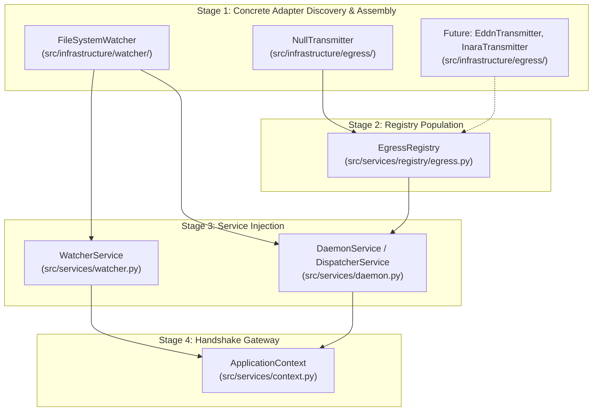

# ADR 0014: Driven Adapter Registry Architecture and Composition Root Integration

## 1. Context and Problem Statement

In Pure Hexagonal Architecture ([ADR 0012](0012_segregation_of_root_monorepo_topology_into_apps_and_libs.md)), all code outside the Domain Core and Application Service Layer is an Adapter. These adapters are categorized into two mutually exclusive directional groups:
1. **Driving Adapters (Primary / Inward):** Live strictly in `src/interfaces/` (CLI, future REST API, MCP). They drive the application core via the `ApplicationContext`.
2. **Driven Adapters (Secondary / Outward):** Live strictly in `src/infrastructure/` (`watcher`, `egress`). They are driven by the application core to perform real-world I/O.

Currently, driven adapter instances are instantiated ad-hoc in `src/services/bootstrap.py` and passed into `TelemetryEngine` as loose constructor arguments (`watcher=...`, `egress_ports=[...]`).

As the system scales to support multiple concurrent outbound transmitters (EDDN, Inara, EDSM, Discord Webhooks, SQLite loggers) and configurable inbound file watchers, the codebase requires an authoritative pattern for:
1. Registering, discovering, and holding collections of driven adapters.
2. Restricting the Adapter Registry exclusively to **Driven Adapters** residing in `src/infrastructure/`.
3. Integrating the registry into the Composition Root (`bootstrap.py`) and Application Service Layer (`services/`) without leaking adapters to driving surfaces or polluting the pure domain core.

---

## 2. Decision Drivers

* **Driven Adapter Exclusivity:** The Adapter Registry must manage **Driven Adapters only** (`src/infrastructure/`). Driving adapters (`src/interfaces/`) are entry-point consumers and must never be registered in an adapter registry.
* **Physical Locality Invariance:** All Driven Adapters accepted by the registry must reside strictly in `src/infrastructure/` and implement abstract domain ports (`src/domain/ports/`).
* **Composition Root Cleanliness:** The Composition Root (`src/services/bootstrap.py`) must cleanly wire registered adapters into services without manual, tangled dependency injection.
* **Shielded Exposure (No Leakage):** The Adapter Registry and its concrete adapters must never be exposed directly to Driving Surfaces on `ApplicationContext` (preventing the object-tunneling violations governed by ADR 0013).
* **Operator Transparency:** Provide living Diátaxis runbooks (`docs/how-to/register_driven_adapter.md`) for engineers to author and register new adapters with zero architectural friction.

---

## 3. Decision Outcome

Chosen Option: **Application Service Layer Driven Adapter Registries (`src/services/registry/`) with Automated Runtime Boundary Enforcement**.

---

## 4. Policy Specifications & Architecture

### 4.1 Driven Adapter Exclusivity Policy & Machine Enforcement

1. **Policy Statement:**
   > An Adapter Registry manages **Driven (Secondary) Adapters only**. Every registered adapter instance MUST reside strictly within `src/infrastructure/` and MUST implement an abstract domain port defined in `src/domain/ports/`. Driving Adapters (`src/interfaces/`) are strictly prohibited from registration.

2. **Automated Enforcement Mechanisms:**
   * **Static Type Invariants (`mypy`):** Registry registration methods strictly type-hint domain ports (e.g. `register_egress(port: EgressPort)`), refusing non-conforming objects at compile time.
   * **Runtime Boundary Reflection (`tests/helpers/boundary_reflection.py`):**
     At runtime, when an adapter is registered, the registry asserts that the adapter class's module path starts with `infrastructure.`:
     ```python
     if not type(adapter).__module__.startswith("infrastructure."):
         raise TypeError(
             f"Adapter Registry only accepts Driven Adapters from 'src/infrastructure/', got: {type(adapter).__module__}"
         )
     ```
   * **Import-Linter Static Contract:** Ensures the registry module in `src/services/` does not statically depend on concrete adapters (adapters are injected into the registry at bootstrap time).

---

### 4.2 Locality & Code Organization

The Adapter Registry components reside strictly within the **Application Service Layer**:

```text
src/services/
├── registry/                      # Driven Adapter Registry Subsystem
│   ├── __init__.py                # Public exports: EgressRegistry, WatcherRegistry
│   ├── egress.py                  # EgressRegistry (manages collection of EgressPort sinks)
│   └── watcher.py                 # WatcherRegistry (manages inbound WatcherPort sources)
```

* **Rationale for `src/services/registry/`:**
  The registry is an operational coordinator and collection manager. It does not belong in `src/domain/` (the domain core does not hold runtime inventories of network sinks), nor does it belong in `src/infrastructure/` (it manages multiple adapters across different infrastructure subpackages). It naturally belongs in `src/services/`.

---

### 4.3 Composition Root Integration (`src/services/bootstrap.py`)

The addition of the Adapter Registry transforms `bootstrap.py` into a clean, two-stage assembly pipeline:



1. **Bootstrap Pipeline:**
   ```python
   # src/services/bootstrap.py
   def build_application_context(journal_dir: Path | None = None) -> ApplicationContext:
       # 1. Instantiate Driven Adapters (src/infrastructure/)
       watcher_adapter = FileSystemWatcher(journal_dir=journal_dir)
       null_transmitter = NullTransmitter()

       # 2. Populate Egress Registry
       egress_registry = EgressRegistry()
       egress_registry.register("null_transmitter", null_transmitter)

       # 3. Instantiate Application Services (src/services/)
       watcher_service = WatcherService(watcher=watcher_adapter)
       daemon_service = DaemonService(
           watcher=watcher_adapter,
           egress_registry=egress_registry,
       )

       # 4. Package into immutable ApplicationContext
       return ApplicationContext(
           daemon_service=daemon_service,
           watcher_service=watcher_service,
           services=(daemon_service, watcher_service),
       )
   ```
2. **Key Guarantee:** Neither `EgressRegistry` nor any concrete adapter is placed on `ApplicationContext`. Driving interfaces access adapter capabilities exclusively through sanitized service methods (e.g. `app_ctx.daemon_service.get_active_transmitters()`).

---

### 4.4 Inventory of Existing Driven Adapters

The current repository contains the following driven adapters to be registered:

| Driven Adapter | Physical Location | Satisfied Domain Port | Registration Key | Operational Role |
| :--- | :--- | :--- | :--- | :--- |
| **`FileSystemWatcher`** | `src/infrastructure/watcher/watcher.py` | `domain.ports.watcher.WatcherPort` | Primary Watcher | Headless daemon OS journal directory watcher, tailer, and reactor. |
| **`NullTransmitter`** | `src/infrastructure/egress/transmitter.py` | `domain.ports.egress.EgressPort` | `null_transmitter` | No-op egress sink used for offline simulation and walking skeleton baseline. |

*Future Driven Adapters planned for registration:*
* `EddnTransmitter` (`src/infrastructure/egress/eddn.py`) ➔ `EgressPort`
* `InaraTransmitter` (`src/infrastructure/egress/inara.py`) ➔ `EgressPort`
* `EdsmTransmitter` (`src/infrastructure/egress/edsm.py`) ➔ `EgressPort`

---

### 4.5 Operator Documentation & Runbook Plan

To ensure developers can add, configure, and inspect driven adapters without violating architectural boundaries, the following user-facing documentation in `docs/` must be authored:

1. **`docs/how-to/register_driven_adapter.md` (Diátaxis How-To Runbook):**
   - Step-by-step procedure:
     1. Implement the abstract domain port in `src/infrastructure/<subsystem>/`.
     2. Verify adapter isolation (Invariant G & ADR 0013 reflection).
     3. Register the adapter in `src/services/bootstrap.py` via the appropriate `Registry`.
     4. Expose query status through an Application Service and DTO.
     5. Add cross-platform tests in `tests/unit/` and `scripts/run_wine_tests.sh`.
2. **`docs/reference/driven_adapters.md` (Diátaxis Reference Manual):**
   - Complete inventory and capability matrix of all registered driven adapters, supported platforms, and configuration flags.

---

## 5. Consequences

### Positive
* **Decoupled Egress Expansion:** New outbound transmission sinks can be authored in `src/infrastructure/egress/` and registered with zero modifications to domain core or driving interfaces.
* **Enforced Boundary Invariance:** The registry mathematically rejects driving adapters or rogue non-infrastructure instances.
* **Elimination of TelemetryEngine Conflation:** Provides the proper home for multi-adapter aggregation, paving the way for clean `DaemonService` extraction.

### Negative
* Requires managing a registry collection in `src/services/registry/` instead of passing a simple raw list of egress ports.
