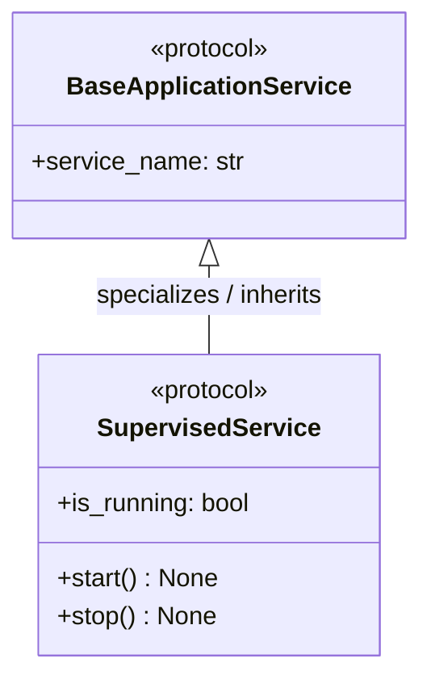
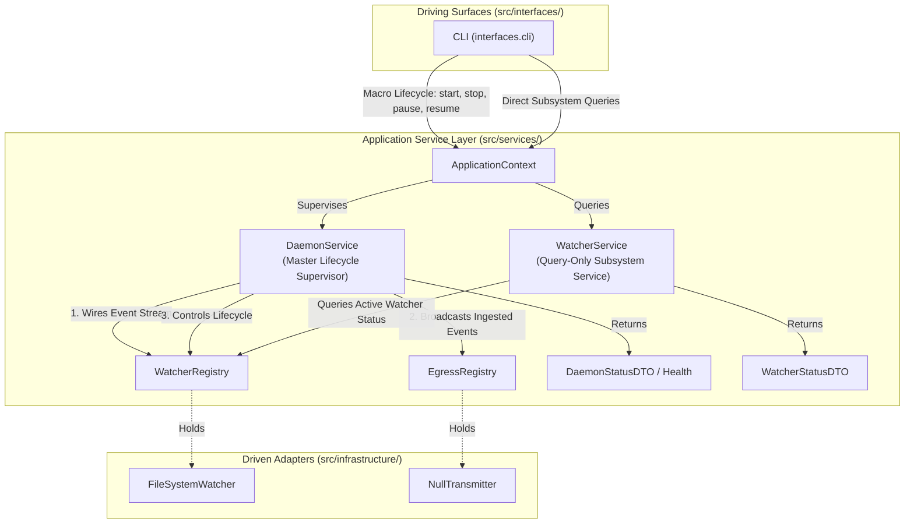
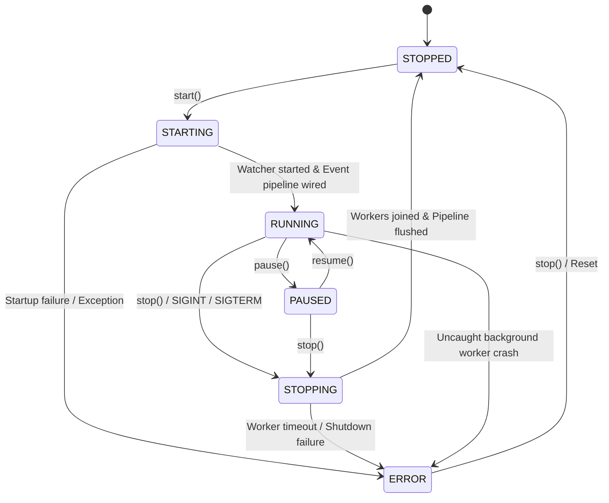

# ADR 0015: Daemon Application Service Orchestration and Lifecycle Supervision

## 1. Context and Problem Statement

In Pure Hexagonal Architecture ([ADR 0012](0012_segregation_of_root_monorepo_topology_into_apps_and_libs.md)), external driving entrypoints (`src/interfaces/`) must interact exclusively with the Application Service Layer (`src/services/`).

Currently, `ed-telemetry` retains an architectural defect and boundary violation:
1. **Transitive Runtime Object Tunneling (Junction 1):** `ApplicationContext` exposes `engine: TelemetryEngine`. Because `TelemetryEngine` is located in `src/domain/engine.py`, external driving surfaces (e.g. `src/interfaces/cli/main.py`) directly invoke domain entity methods (`app_ctx.engine.start()`, `app_ctx.engine.stop()`) without importing domain modules. This active leak was identified and benchmarked in [ADR 0013](0013_runtime_reflection_verification_for_object_tunneling_boundaries.md) and [SDD-011](../designs/0011_runtime_reflection_verification_for_object_tunneling_boundaries.md).
2. **Conflated Responsibilities in `TelemetryEngine`:** `TelemetryEngine` (originally stubbed in ADR 0001, ADR 0003, and ADR 0008) serves multiple mismatched roles—it manages OS process/thread lifecycles, retains background thread state, directly binds to inbound and outbound driven ports, and attempts to coordinate event routing. In pure domain architecture, domain entities must remain pure business logic and must never supervise long-running OS processes or thread lifecycles.
3. **Competing Lifecycle Ownership Defect in `WatcherService` (ADR 0011):** [ADR 0011](0011_watcher_telemetry_application_service.md) introduced `WatcherService` with its own `start()` and `stop()` methods delegating directly to `WatcherPort`. Exposing `start()` and `stop()` on both `ApplicationContext.engine` and `ApplicationContext.watcher_service` creates an architectural conflict: two competing services claiming authority over background threads without coordinated pipeline wiring or centralized state management. Calling `watcher_service.stop()` stops the background thread while leaving `engine.is_running` reporting `True`.
4. **Missing Master Orchestrator:** Now that driven adapters are organized into specialized port-family registries ([ADR 0014](0014_driven_adapter_registry_architecture_and_composition_root.md), [SDD-012](../designs/0012_driven_adapter_registry_and_composition_root.md)), the system requires a designated **Master Lifecycle Supervisor** to coordinate operational state, supervise background workers, wire the active event pipeline from `WatcherRegistry` to `EgressRegistry`, scaffold health reporting, and provide an immutable query/command boundary.

We must decide the formal architectural boundaries, invariants, lifecycle state machine, and enforcement mechanisms for `DaemonService`, while formally superseding the conflicting lifecycle methods of ADR 0011 and decommissioning `TelemetryEngine`.

---

## 2. Superseded Architectural Decisions

This ADR formally records the following supersedence:
* **ADR 0011 (Section 3.2.2 - `WatcherService` Lifecycle Methods):** **SUPERSEDED.** `WatcherService` is stripped of `start()` and `stop()`. It is refactored into a dedicated read-only Subsystem Query Service exposing `get_status() -> WatcherStatusDTO`.
* **ADR 0001, ADR 0003, ADR 0008 (`TelemetryEngine` Lifecycle and Wiring):** **SUPERSEDED & RETIRED.** `TelemetryEngine` is decommissioned. Process lifecycle, thread supervision, and event pipeline orchestration move entirely to `DaemonService`.

---

## 3. Decision Drivers

* **Master Lifecycle Supervision:** A single, authoritative service (`DaemonService`) must hold exclusive ownership of process-level `start()` and `stop()`, eliminating competing out-of-band lifecycle controls.
* **Eradication of Junction 1 Tunneling:** Completely remove `engine: TelemetryEngine` from `ApplicationContext` and decommission `TelemetryEngine`, restoring strict zero-tolerance boundary validation (`assert len(engine_violations) == 0`).
* **Active Event Pipeline Orchestration:** `DaemonService` must wire event emissions from `WatcherRegistry.get_active()` directly into `EgressRegistry.broadcast()`.
* **Clean Separation of Concerns:** Sub-services (e.g. `WatcherService`) act strictly as query and diagnostic providers, not independent thread spawners.
* **Operational Controls & Scaffolding for Health Reporting:** Expose operational controls (`start`, `stop`, `pause`, `resume`) and scaffold basic health reporting (`DaemonHealthDTO` / operational status flags) for future elaboration.
* **Cooperative Thread Supervision:** Deterministic join on shutdown (`SIGINT`/`SIGTERM`) preventing thread or descriptor leaks.
* **Machine-Enforced Invariants:** Every architectural rule governing the orchestrator must be backed by an automated enforcement mechanism.

---

## 4. Decision Outcome

Chosen Option: **Implement `DaemonService` in `src/services/daemon.py` as the Master Lifecycle Supervisor and Event Pipeline Orchestrator, Refactor `WatcherService` into a Query-Only Service, and Decommission `TelemetryEngine`**.

---

## 5. Architectural Rules, Boundaries, and Automated Enforcement Mechanisms

The following 12 rules govern `DaemonService` across five boundary categories, each paired with an explicit machine enforcement mechanism:

### Category 1: Dependency & Directionality Invariants

1. **Rule 1.1: Downward Layering Only (Invariant D):**
   * *Rule:* `DaemonService` resides in `src/services/daemon.py`. It may depend strictly downward on `src/domain/` entities and ports. It must never depend on or import from Driving Interfaces (`src/interfaces/`).
   * *Enforcement:* Verified statically on every commit by `import-linter` via contract `Contracts.downward_layering`.
2. **Rule 1.2: Adapter Shielding (Invariant G):**
   * *Rule:* `DaemonService` must never import or directly instantiate concrete driven adapters (`src/infrastructure/`). It receives adapters strictly via abstract domain ports or port-family registries (`src/services/registry/`) injected at construction.
   * *Enforcement:* Verified statically by `import-linter` contract `Contracts.services_depend_only_on_domain_and_infrastructure`, and verified at runtime by constructor reflection audits.
3. **Rule 1.3: Gateway Placement (Junction 1):**
   * *Rule:* `DaemonService` is instantiated solely by the Composition Root (`src/services/bootstrap.py`) and exposed to driving surfaces exclusively as an attribute on `ApplicationContext`.
   * *Enforcement:* Verified at runtime by `tests/helpers/boundary_reflection.py:audit_context_gateway`, asserting all context attributes inherit from `BaseApplicationService`.

### Category 2: Domain Purity & Business Logic Prohibition

4. **Rule 2.1: Zero Domain Business Logic:**
   * *Rule:* `DaemonService` contains no domain parsing algorithms, header validation, or game state computations. It delegates all telemetry validation to domain entities or domain services.
   * *Enforcement:* Code review quality gate and unit test verification in `tests/unit/test_daemon_service.py` asserting that telemetry mutation/parsing errors originate from `domain.*`.
5. **Rule 2.2: Pure Coordination / Orchestration:**
   * *Rule:* Operational flow is restricted strictly to: receive command $\rightarrow$ command registries $\rightarrow$ wire events $\rightarrow$ update operational state $\rightarrow$ return immutable DTO.
   * *Enforcement:* Verified by isolated unit tests with mock registries and ports, confirming zero internal state manipulation beyond lifecycle state and counters.

### Category 3: Interface & Boundary Neutrality (Invariant C)

6. **Rule 3.1: Protocol Neutrality:**
   * *Rule:* `DaemonService` has zero dependencies on presentation frameworks (`click`, `rich`, `fastapi`, `mcp`). It is completely headless and agnostic to whether the caller is a CLI, a REST daemon, or a test harness.
   * *Enforcement:* Verified statically by `import-linter` contract `Contracts.protocol_neutrality`.
7. **Rule 3.2: Primitive & DTO Boundary Input (Junction 3):**
   * *Rule:* Methods on `DaemonService` accept only primitive Python types (`str`, `int`, `bool`, `Path`) or immutable Inbound Command DTOs (`src/services/dto/`).
   * *Enforcement:* Enforced at compile time by `mypy --strict` and verified at runtime by `tests/helpers/boundary_reflection.py:audit_command_neutrality`.
8. **Rule 3.3: Primitive & DTO Boundary Output (Junction 2):**
   * *Rule:* Query methods return only primitive Python types or immutable Outbound Query DTOs (`DaemonStatusDTO`, `DaemonHealthDTO`). They never leak domain entities, active ports, or registry instances.
   * *Enforcement:* Enforced at compile time by `mypy --strict` and verified at runtime by `tests/helpers/boundary_reflection.py:audit_dto_purity`.

### Category 4: Lifecycle & State Supervision

9. **Rule 4.1: Operational State & Pure Lifecycle Supervision:**
   * *Rule:* `DaemonService` tracks operational daemon metrics only (`state`, `uptime_seconds`, `events_processed`). It strictly avoids leaky fields tied to specific subsystems (e.g. `transmitter_count` or `active_watcher_key`). Driving interfaces query subsystem details exclusively via dedicated peer application services on `ApplicationContext` (e.g. `WatcherService.get_status()`). Basic health status (`HEALTHY`, `DEGRADED`, `UNHEALTHY`) is scaffolded via `DaemonHealthDTO`.
   * *Enforcement:* Verified via `DaemonStatusDTO` inspection tests asserting that all exposed fields represent pure daemon lifecycle state and contain zero subsystem-specific attributes.
10. **Rule 4.2: Deterministic Master State Machine:**
    * *Rule:* Global state transitions adhere strictly to: `STOPPED` $\rightleftharpoons$ `STARTING` $\rightarrow$ `RUNNING` $\rightarrow$ `STOPPING` $\rightarrow$ `STOPPED` (or `ERROR`), with operational `PAUSED` state support. `start()` and `stop()` calls are idempotent.
    * *Enforcement:* Exhaustive lifecycle transition test suite in `tests/unit/test_daemon_service.py`.

### Category 5: Concurrency & Fault Isolation

11. **Rule 5.1: Master Thread Supervision:**
    * *Rule:* Exclusively coordinates startup and shutdown of background adapter threads. Shutdown must guarantee deterministic worker join with a configurable timeout, preventing lingering daemon threads or file descriptor leaks.
    * *Enforcement:* Thread leak assertion tests in `tests/unit/test_daemon_service.py` comparing `threading.active_count()` before `start()` and after `stop()`.
12. **Rule 5.2: Service Exception Hierarchy:**
    * *Rule:* Uncaught exceptions during startup or background coordination are mapped to `ApplicationServiceError` subclasses (`DaemonLifecycleError`, `DaemonStartupError`), preventing raw OS or socket exceptions from bubbling untransformed to driving surfaces.
    * *Enforcement:* Unit tests asserting that failed dependencies or crashed watchers raise `DaemonLifecycleError`.

---

## 6. Architectural Design & Specifications

### 6.1 Structural Placement & Component Model

```text
src/services/
├── base.py                   # BaseApplicationService and SupervisedService protocols
├── context.py                # ApplicationContext (exposes daemon_service, watcher_service)
├── daemon.py                 # DaemonService (Master Lifecycle Supervisor & Orchestrator)
├── watcher.py                # WatcherService (Refactored: Query-Only Subsystem Service)
├── dto/
│   ├── daemon.py             # DaemonStatusDTO, DaemonHealthDTO, DaemonState enum
│   └── watcher.py            # WatcherStatusDTO
└── registry/
    ├── egress.py             # EgressRegistry (EgressPort sinks)
    └── watcher.py            # WatcherRegistry (WatcherPort sources)
```

### 6.2 Common Protocol Pedigree & `SupervisedService` Specification

To guarantee that supervised sub-services expose predictable, uniform lifecycle hooks without violating the Interface Segregation Principle (ISP) for stateless or query-only services, `src/services/base.py` establishes a specialized protocol hierarchy:



1. **`BaseApplicationService(Protocol)` (Universal Base):**
   - Applies universally to all application services placed on `ApplicationContext`.
   - Requires solely `service_name: str` for identification, logging, and metrics.
   - Stateless or query-only services (e.g. `WatcherService`) implement `BaseApplicationService` directly, free of artificial `start()` / `stop()` stubs.

2. **`SupervisedService(BaseApplicationService, Protocol)` (Specialized Worker Contract):**
   - Inherits directly from `BaseApplicationService`, maintaining pedigree alignment across the type system.
   - Requires concrete lifecycle and supervision capabilities:
     - `start() -> None`: Starts background threads or streaming workers.
     - `stop() -> None`: Gracefully stops and joins background workers.
     - `is_running: bool`: Property reporting active execution state.
   - Services managing long-running background workers or network connections conform to `SupervisedService`, enabling `DaemonService` to supervise arbitrary collections of worker services in a predictable, uniform loop.

```python
# src/services/base.py
from typing import Protocol, runtime_checkable


@runtime_checkable
class BaseApplicationService(Protocol):
    """Universal contract satisfied by all application services."""

    @property
    def service_name(self) -> str:
        """Unique alphanumeric identifier for the service."""
        ...


@runtime_checkable
class SupervisedService(BaseApplicationService, Protocol):
    """Specialized contract for services managed by DaemonService."""

    def start(self) -> None:
        """Start background workers or streaming channels."""
        ...

    def stop(self) -> None:
        """Gracefully stop and join background workers."""
        ...

    @property
    def is_running(self) -> bool:
        """Return True if background workers are active."""
        ...
```



### 6.3 Master Lifecycle State Machine



### 6.4 WatcherService Refactoring Contract

`WatcherService` is refactored to remove lifecycle execution:
```python
# src/services/watcher.py (Refactored)
class WatcherService(BaseApplicationService):
    """Application service for querying inbound watcher status and telemetry."""

    def __init__(self, watcher_registry: WatcherRegistry) -> None:
        self._watcher_registry = watcher_registry

    @property
    def service_name(self) -> str:
        return "watcher_service"

    def get_status(self) -> WatcherStatusDTO:
        """Query current operational state of the active watcher adapter."""
        watcher = self._watcher_registry.get_active()
        journal_dir_path = getattr(watcher, "journal_dir", None)
        journal_str = str(journal_dir_path) if journal_dir_path is not None else None
        return WatcherStatusDTO(
            is_active=watcher.is_active,
            journal_dir=journal_str,
        )

    # NOTE: start() and stop() are permanently removed.
```

### 6.5 Event Pipeline Wiring & Health Scaffolding in `DaemonService`

```python
# src/services/daemon.py (Architectural Blueprint)
class DaemonService(BaseApplicationService):
    """Master Lifecycle Supervisor and Event Pipeline Orchestrator."""

    def __init__(
        self,
        watcher_registry: WatcherRegistry,
        egress_registry: EgressRegistry,
    ) -> None:
        self._watcher_registry = watcher_registry
        self._egress_registry = egress_registry
        self._state = DaemonState.STOPPED
        self._events_processed = 0

    def start(self) -> None:
        """Start daemon workers and attach the event pipeline."""
        if self._state == DaemonState.RUNNING:
            return
        self._state = DaemonState.STARTING
        try:
            active_watcher = self._watcher_registry.get_active()
            # Wire reactive pipeline: watcher event -> egress broadcast
            active_watcher.register_event_handler(self._handle_inbound_event)
            active_watcher.start()
            self._state = DaemonState.RUNNING
        except Exception as exc:
            self._state = DaemonState.ERROR
            raise DaemonStartupError(f"Failed to start daemon: {exc}") from exc

    def stop(self) -> None:
        """Stop all background workers deterministically."""
        if self._state in (DaemonState.STOPPED, DaemonState.ERROR):
            return
        self._state = DaemonState.STOPPING
        active_watcher = self._watcher_registry.get_active()
        active_watcher.stop()
        self._state = DaemonState.STOPPED

    def pause(self) -> None:
        """Pause event ingestion pipeline without terminating the process."""
        if self._state == DaemonState.RUNNING:
            self._state = DaemonState.PAUSED

    def resume(self) -> None:
        """Resume event ingestion pipeline."""
        if self._state == DaemonState.PAUSED:
            self._state = DaemonState.RUNNING

    def get_status(self) -> DaemonStatusDTO:
        """Return operational state metrics."""
        return DaemonStatusDTO(
            state=self._state.value,
            uptime_seconds=self._calculate_uptime(),
            events_processed=self._events_processed,
        )

    def get_health(self) -> DaemonHealthDTO:
        """Return scaffolded operational health status."""
        is_healthy = self._state in (DaemonState.RUNNING, DaemonState.PAUSED, DaemonState.STOPPED)
        return DaemonHealthDTO(
            status="HEALTHY" if is_healthy else "UNHEALTHY",
            daemon_state=self._state.value,
        )

    def _handle_inbound_event(self, event: Any) -> None:
        """Internal callback dispatching watcher events to all egress sinks."""
        if self._state != DaemonState.RUNNING:
            return
        self._events_processed += 1
        # Convert or forward to egress sinks
        payload = event if isinstance(event, dict) else {"event": str(event)}
        self._egress_registry.broadcast(payload)
```

---

## 7. Operator Documentation Plan

To ensure operators and developers can manage the daemon lifecycle cleanly, the following Diátaxis documentation will be authored:
* **`docs/how-to/manage_daemon_lifecycle.md` (Diátaxis How-To):**
  - How to start and stop the daemon programmatically via `ApplicationContext.daemon_service`.
  - How to configure graceful termination signal handlers (`SIGINT`, `SIGTERM`).
  - How to inspect `DaemonStatusDTO` metrics and scaffolded `DaemonHealthDTO`.
  - How `WatcherService.get_status()` operates as a dedicated subsystem query alongside `DaemonService`.

---

## 8. Consequences

### Positive
* **Master Lifecycle Authority:** A single service supervises background workers and pipeline state, resolving the competing lifecycle defect from ADR 0011.
* **Complete Elimination of Object Tunneling:** Junction 1 violation is fully eliminated. `ApplicationContext` exposes only pure application services.
* **Decommissioning of `TelemetryEngine`:** Domain core is purged of thread supervision and process lifecycle concerns.
* **Cohesive Pipeline Coordination:** Event forwarding from `WatcherRegistry` to `EgressRegistry` is cleanly orchestrated in the Application Service Layer.
* **Health Reporting Foundation:** Scaffolds health reporting for future diagnostic monitoring.

### Negative
* Requires refactoring `WatcherService`, updating `interfaces/cli/main.py`, and updating unit tests that asserted `WatcherService.start()` / `stop()` or `app_ctx.engine`.
