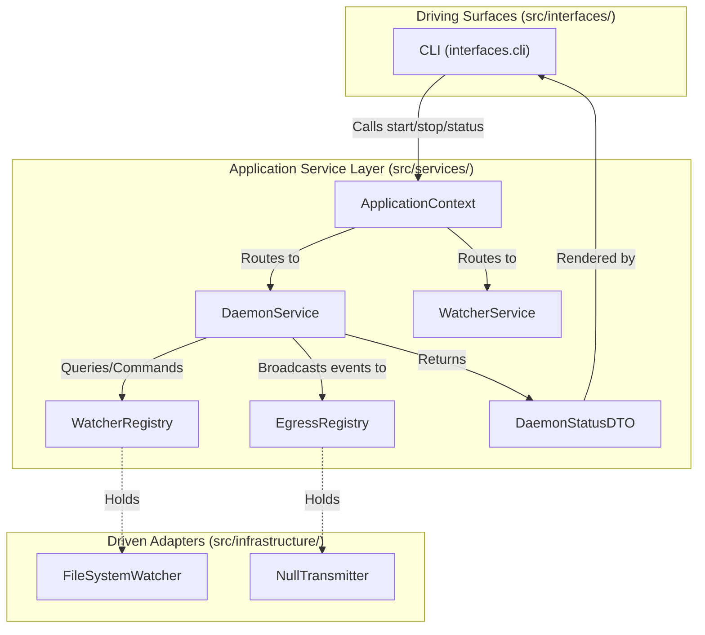
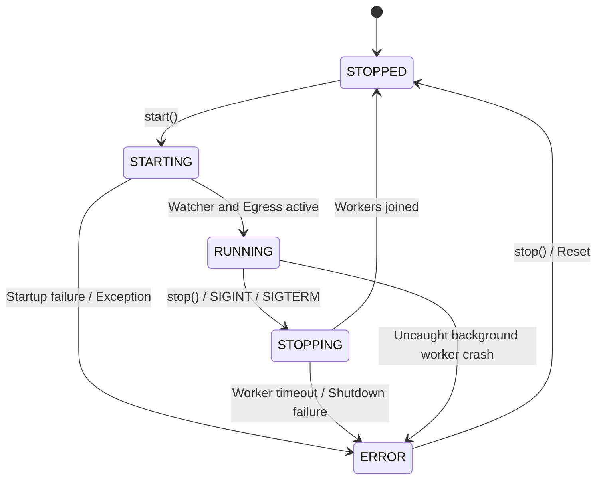

# ADR 0015: Daemon Application Service Orchestration and Lifecycle Supervision

## 1. Context and Problem Statement

In Pure Hexagonal Architecture ([ADR 0012](0012_segregation_of_root_monorepo_topology_into_apps_and_libs.md)), external driving entrypoints (`src/interfaces/`) must interact exclusively with the Application Service Layer (`src/services/`).

Currently, `ed-telemetry` retains an architectural defect and boundary violation:
1. **Transitive Runtime Object Tunneling (Junction 1):** `ApplicationContext` exposes `engine: TelemetryEngine`. Because `TelemetryEngine` is located in `src/domain/engine.py`, external driving surfaces (e.g. `src/interfaces/cli/main.py`) directly invoke domain entity methods (`app_ctx.engine.start()`, `app_ctx.engine.stop()`) without importing domain modules. This active leak was identified and benchmarked in [ADR 0013](0013_runtime_reflection_verification_for_object_tunneling_boundaries.md) and [SDD-011](../designs/0011_runtime_reflection_verification_for_object_tunneling_boundaries.md).
2. **Conflated Responsibilities in `TelemetryEngine`:** `TelemetryEngine` serves multiple mismatched roles—it manages OS process/thread lifecycles, retains background thread state, directly binds to inbound and outbound driven ports, and attempts to coordinate event routing. In pure domain architecture, domain entities must remain pure business logic and must never supervise long-running OS processes or thread lifecycles.
3. **Missing Orchestrator:** Now that driven adapters are organized into specialized port-family registries ([ADR 0014](0014_driven_adapter_registry_architecture_and_composition_root.md), [SDD-012](../designs/0012_driven_adapter_registry_and_composition_root.md)), the system requires a designated Application Service Orchestrator to coordinate the operational lifecycle, supervise background workers, bridge watcher events to egress sinks, and expose a clean, immutable query/command contract.

We must decide the formal architectural boundaries, invariants, lifecycle state machine, and enforcement mechanisms for `DaemonService`.

---

## 2. Decision Drivers

* **Eradication of Junction 1 Tunneling:** Completely remove `engine: TelemetryEngine` from `ApplicationContext` and decommission `TelemetryEngine`, restoring strict zero-tolerance boundary validation (`assert len(engine_violations) == 0`).
* **Strict Application Service Boundaries:** `DaemonService` must act strictly as an Application Service Orchestrator, fulfilling all 12 architectural rules across Directionality, Domain Purity, Interface Neutrality, Lifecycle State, and Fault Isolation.
* **Cooperative Thread Supervision:** The service must coordinate background workers (e.g. `FileSystemWatcher`) and dispatch queues without blocking driving callers indefinitely and guarantee deterministic termination on shutdown (`SIGINT`/`SIGTERM`).
* **Machine-Enforced Invariants:** Every architectural rule governing the orchestrator must be backed by an automated enforcement mechanism (static linters, runtime reflection, type hints, or unit tests).
* **Operator Documentation:** Provide clear Diátaxis how-to documentation (`docs/how-to/manage_daemon_lifecycle.md`) for driving interfaces to interact with the daemon lifecycle.

---

## 3. Decision Outcome

Chosen Option: **Implement `DaemonService` as a Pure Application Service Orchestrator in `src/services/daemon.py` with an Explicit Lifecycle State Machine, Decommissioning `TelemetryEngine`**.

---

## 4. Architectural Rules, Boundaries, and Automated Enforcement Mechanisms

The following 12 rules govern `DaemonService` across five boundary categories, each paired with an explicit machine enforcement mechanism:

### Category 1: Dependency & Directionality Invariants

1. **Rule 1.1: Downward Layering Only (Invariant D):**
   * *Rule:* `DaemonService` resides in `src/services/daemon.py`. It may depend strictly downward on `src/domain/` entities and ports. It must never depend on or import from Driving Interfaces (`src/interfaces/`).
   * *Enforcement:* Verified statically on every commit by `import-linter` via contract `Contracts.downward_layering`.
2. **Rule 1.2: Adapter Shielding (Invariant G):**
   * *Rule:* `DaemonService` must never import or directly instantiate concrete driven adapters (`src/infrastructure/`). It receives adapters strictly via abstract domain ports or port-family registries (`src/services/registry/`) injected at construction.
   * *Enforcement:* Verified statically by `import-linter` contract `Contracts.services_depend_only_on_domain_and_infrastructure` (forbidding service imports of infrastructure modules), and verified at runtime by constructor reflection audits.
3. **Rule 1.3: Gateway Placement (Junction 1):**
   * *Rule:* `DaemonService` is instantiated solely by the Composition Root (`src/services/bootstrap.py`) and exposed to driving surfaces exclusively as an attribute on `ApplicationContext`.
   * *Enforcement:* Verified at runtime by `tests/helpers/boundary_reflection.py:audit_context_gateway`, asserting all context attributes inherit from `BaseApplicationService`.

### Category 2: Domain Purity & Business Logic Prohibition

4. **Rule 2.1: Zero Domain Business Logic:**
   * *Rule:* `DaemonService` contains no domain parsing algorithms, header validation, or game state computations. It delegates all telemetry validation to domain entities or domain services.
   * *Enforcement:* Code review quality gate and unit test verification in `tests/unit/test_daemon_service.py` asserting that telemetry mutation/parsing errors originate from `domain.*`.
5. **Rule 2.2: Pure Coordination / Orchestration:**
   * *Rule:* Operational flow is restricted strictly to: receive command $\rightarrow$ command domain / registry $\rightarrow$ route events $\rightarrow$ update operational state $\rightarrow$ return immutable DTO.
   * *Enforcement:* Verified by isolated unit tests with mock registries and ports, confirming zero internal state manipulation beyond lifecycle state and counters.

### Category 3: Interface & Boundary Neutrality (Invariant C)

6. **Rule 3.1: Protocol Neutrality:**
   * *Rule:* `DaemonService` has zero dependencies on presentation frameworks (`click`, `rich`, `fastapi`, `mcp`). It is completely headless and agnostic to whether the caller is a CLI, a REST daemon, or a test harness.
   * *Enforcement:* Verified statically by `import-linter` contract `Contracts.protocol_neutrality`.
7. **Rule 3.2: Primitive & DTO Boundary Input (Junction 3):**
   * *Rule:* Methods on `DaemonService` accept only primitive Python types (`str`, `int`, `bool`, `Path`) or immutable Inbound Command DTOs (`src/services/dto/`).
   * *Enforcement:* Enforced at compile time by `mypy --strict` and verified at runtime by `tests/helpers/boundary_reflection.py:audit_command_neutrality`.
8. **Rule 3.3: Primitive & DTO Boundary Output (Junction 2):**
   * *Rule:* Query methods return only primitive Python types or immutable Outbound Query DTOs (`DaemonStatusDTO`). They never leak domain entities, active ports, or registry instances.
   * *Enforcement:* Enforced at compile time by `mypy --strict` and verified at runtime by `tests/helpers/boundary_reflection.py:audit_dto_purity`.

### Category 4: Lifecycle & State Supervision

9. **Rule 4.1: Operational State Only:**
   * *Rule:* `DaemonService` tracks operational metrics only (lifecycle status, uptime, worker thread status, processed event count, last error timestamp). It holds no domain game state.
   * *Enforcement:* Verified via `DaemonStatusDTO` inspection tests asserting all exposed fields represent runtime infrastructure telemetry.
10. **Rule 4.2: Deterministic Lifecycle Transitions:**
    * *Rule:* State transitions adhere to a strict state machine: `STOPPED` $\rightarrow$ `STARTING` $\rightarrow$ `RUNNING` $\rightarrow$ `STOPPING` $\rightarrow$ `STOPPED` (or `ERROR`). `start()` and `stop()` calls are idempotent; calling `start()` when already running or `stop()` when stopped is a safe no-op.
    * *Enforcement:* Exhaustive lifecycle transition test suite in `tests/unit/test_daemon_service.py`.

### Category 5: Concurrency & Fault Isolation

11. **Rule 5.1: Thread & Task Supervision:**
    * *Rule:* Coordinates startup and shutdown of background adapter threads (e.g. `FileSystemWatcher.start()`, `FileSystemWatcher.stop()`). Shutdown must guarantee deterministic join with a configurable timeout, preventing lingering daemon threads or file descriptor leaks.
    * *Enforcement:* Thread leak assertion tests in `tests/unit/test_daemon_service.py` comparing `threading.active_count()` before `start()` and after `stop()`.
12. **Rule 5.2: Service Exception Hierarchy:**
    * *Rule:* Uncaught exceptions during startup or background coordination are mapped to `ApplicationServiceError` subclasses (`DaemonLifecycleError`, `DaemonStartupError`), preventing raw OS or socket exceptions from bubbling untransformed to driving surfaces.
    * *Enforcement:* Unit tests asserting that failed dependencies or crashed watchers raise `DaemonLifecycleError`.

---

## 5. Architectural Design & Specifications

### 5.1 Structural Placement & Component Model

```text
src/services/
├── base.py                   # BaseApplicationService protocol
├── context.py                # ApplicationContext (stores daemon_service, watcher_service)
├── daemon.py                 # DaemonService orchestrator
├── dto/
│   ├── daemon.py             # DaemonStatusDTO, DaemonState enum
│   └── watcher.py            # WatcherStatusDTO
└── registry/
    ├── egress.py             # EgressRegistry (EgressPort sinks)
    └── watcher.py            # WatcherRegistry (WatcherPort sources)
```



### 5.2 Lifecycle State Machine



### 5.3 Composition Root Assembly (`src/services/bootstrap.py`)

`TelemetryEngine` is decommissioned and eliminated. The Composition Root instantiates `DaemonService`:

```python
# src/services/bootstrap.py
def build_application_context(journal_dir: Path | None = None) -> ApplicationContext:
    # 1. Instantiate Driven Adapters
    watcher_adapter = FileSystemWatcher(journal_dir=journal_dir)
    null_transmitter = NullTransmitter()

    # 2. Populate Port-Family Registries
    watcher_registry = WatcherRegistry()
    watcher_registry.register("primary_watcher", watcher_adapter)

    egress_registry = EgressRegistry()
    egress_registry.register("null_transmitter", null_transmitter)

    # 3. Instantiate Application Services
    watcher_service = WatcherService(watcher=watcher_adapter)
    daemon_service = DaemonService(
        watcher_registry=watcher_registry,
        egress_registry=egress_registry,
    )

    # 4. Return Pure ApplicationContext
    return ApplicationContext(
        daemon_service=daemon_service,
        watcher_service=watcher_service,
        services=(daemon_service, watcher_service),
    )
```

---

## 6. Operator Documentation Plan

To ensure operators and developers can manage the daemon lifecycle cleanly, the following Diátaxis documentation will be authored:
* **`docs/how-to/manage_daemon_lifecycle.md` (Diátaxis How-To):**
  - How to start and stop the daemon programmatically via `ApplicationContext`.
  - How to configure graceful termination signal handlers (`SIGINT`, `SIGTERM`).
  - How to inspect `DaemonStatusDTO` metrics (uptime, active watcher, registered transmitters, event counts).
  - How to handle `DaemonLifecycleError` operational failures.

---

## 7. Consequences

### Positive
* **Complete Elimination of Object Tunneling:** Junction 1 violation is fully eliminated. `ApplicationContext` exposes only pure application services.
* **Decommissioning of `TelemetryEngine`:** Domain core is purged of thread supervision and process lifecycle concerns.
* **Cohesive Orchestration:** Event forwarding from `WatcherRegistry` to `EgressRegistry` is managed in a single, well-defined service.
* **Deterministic Concurrency:** Guarantees clean worker startup and shutdown across Linux and Windows platforms.

### Negative
* Requires refactoring `interfaces/cli/main.py` and existing test cases that referenced `app_ctx.engine`.
