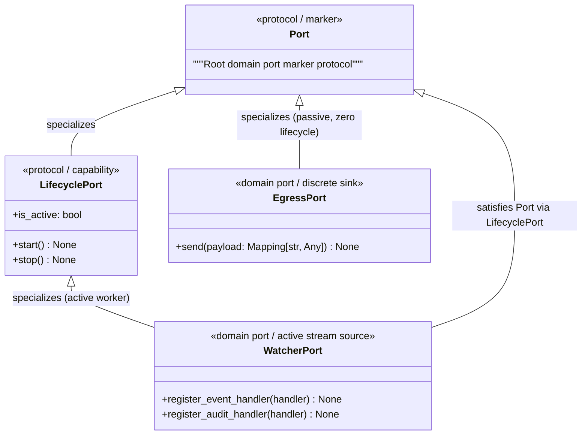

# ADR 0015: Domain Port Protocol Genealogy, Capability Taxonomy, and Lifecycle Governance

## 1. Context and Problem Statement

In Pure Hexagonal Architecture ([ADR 0012](0012_segregation_of_root_monorepo_topology_into_apps_and_libs.md)), all technological interactions with external systems (filesystems, network sockets, OS processes) are mediated through abstract **Ports** defined exclusively in the Domain Core (`src/domain/ports/`). Driven adapters in `src/infrastructure/` implement these ports.

Currently in `ed-telemetry`, domain ports lack an explicit structural genealogy and standardized capability taxonomy:
1. **Ad-Hoc Port Definitions:** `WatcherPort` (`src/domain/ports/watcher.py`) and `EgressPort` (`src/domain/ports/egress.py`) are disjoint, standalone `@runtime_checkable` protocols without a common ancestor or polymorphic marker.
2. **Unregulated Lifecycle Hooks:** `WatcherPort` declares `start()` and `stop()` methods, whereas `EgressPort` declares only `send()`. There is no formal architectural rule defining *when* a port must declare lifecycle hooks, *what* those hooks must be named, or *how* they must behave regarding idempotency and thread termination.
3. **Impediment to Orchestration:** Without a formal `LifecyclePort` capability protocol, future Application Services (such as `DaemonService`) cannot polymorphically supervise active adapters without hard-coding bespoke method calls per port type.

To ensure architectural integrity, predictable orchestration, and strict adherence to the Interface Segregation Principle (ISP), we must establish the formal genealogy, capability archetypes, naming conventions, and governing policies for all domain ports.

---

## 2. Decision Drivers

* **Protocol Genealogy & Common Ancestor:** Establish a root `Port` marker protocol in `src/domain/ports/base.py` that unifies all domain port contracts under a single structural type.
* **Granular Capability Composition (ISP):** Port capabilities (such as lifecycle management) must be factored into discrete, reusable protocols rather than monolithic interfaces. Passive ports must never be forced to declare empty lifecycle hooks.
* **Strict Bounded Lifecycle Vocabulary:** Standardize the vocabulary of active lifecycle hooks (`start()`, `stop()`, `is_active`) to eliminate arbitrary naming variations across future adapters.
* **Deterministic Concurrency & Resource Guarantees:** Machine-enforce behavioral policies regarding thread join timeouts, idempotency, and exception containment on stopping.
* **Adapter Registry Alignment:** Provide the type-safe foundation required for `BaseAdapterRegistry[T]` and future `DaemonService` supervisors.

---

## 3. Decision Outcome

Chosen Option: **Establish a Root `Port` Marker Protocol and Composable Capability Taxonomy (`LifecyclePort`) in `src/domain/ports/`, Governed by Strict Lifecycle Behavioral Invariants**.

---

## 4. Port Protocol Genealogy & Component Model

The domain port subsystem is organized into composable structural protocols:

```text
src/domain/ports/
├── __init__.py           # Exports: Port, LifecyclePort, WatcherPort, EgressPort
├── base.py               # Root Port marker and LifecyclePort capability protocols
├── egress.py             # EgressPort (Discrete Sink Archetype)
└── watcher.py            # WatcherPort (Active Worker & Stream Source Archetypes)
```



### 4.1 Root Marker Protocol (`Port`)
Located in `src/domain/ports/base.py`:
* Ultra-minimal runtime-checkable marker protocol.
* Serves as the polymorphic bound for generic containers (`BaseAdapterRegistry[T]` where `T = TypeVar("T", bound=Port)`).
* Enforces structural typing across reflection audits and architectural linters without imposing artificial methods.

```python
# src/domain/ports/base.py
from typing import Protocol, runtime_checkable


@runtime_checkable
class Port(Protocol):
    """Root marker protocol for all domain boundary port contracts."""
```

### 4.2 Standardized Lifecycle Capability Protocol (`LifecyclePort`)
Located in `src/domain/ports/base.py`:
* Specializes `Port` with the canonical **Worker Archetype** hooks:
  * `start() -> None`: Initializes background worker threads or streaming channels.
  * `stop() -> None`: Signals worker termination and blocks until background execution joins deterministically.
  * `is_active: bool`: Property returning `True` if background execution is active.

```python
# src/domain/ports/base.py
@runtime_checkable
class LifecyclePort(Port, Protocol):
    """Capability protocol for domain ports requiring background execution management."""

    def start(self) -> None:
        """Start background workers or streaming loops."""
        ...

    def stop(self) -> None:
        """Gracefully stop and join background workers."""
        ...

    @property
    def is_active(self) -> bool:
        """Return True if background workers are active."""
        ...
```

---

## 5. Domain Port Capability Archetypes & Governance Matrix

Ports in `ed-telemetry` are classified into five canonical capability archetypes:

| Port Archetype | Protocol Composition | Canonical Methods & Properties | Governing Policies & Invariants | Exemplar Implementations |
| :--- | :--- | :--- | :--- | :--- |
| **`BasePort`** | `Port` | *Marker Protocol* | **Invariant A (Domain Purity):** Zero imports of `infrastructure.*` or presentation frameworks.<br>**Invariant B (Runtime Checkable):** Decorated with `@runtime_checkable`. | Universal base marker for all domain ports. |
| **`ActiveWorkerPort`** | `Port` + `LifecyclePort` | `start() -> None`<br>`stop() -> None`<br>`is_active: bool` | **Policy L1 (Idempotency):** `start()` and `stop()` must be safe no-ops if already in target state.<br>**Policy L2 (Deterministic Join):** `stop()` must block until OS threads terminate cleanly without leaks.<br>**Policy L3 (No Throw on Stop):** `stop()` must suppress internal cleanup errors to prevent crashed shutdowns. | `WatcherPort` (`FileSystemWatcher`), background audit tick engines. |
| **`DiscreteSinkPort`** | `Port` | `send(payload: Mapping[str, Any]) -> None` | **Policy S1 (Bounded Execution):** Outbound I/O must enforce network/socket timeouts.<br>**Policy S2 (Payload Purity):** Accepts only primitive mappings or domain DTOs. | `EgressPort` (`NullTransmitter`, future `EddnTransmitter`, `InaraTransmitter`). |
| **`StreamSourcePort`** | `Port` (+ `LifecyclePort`) | `register_event_handler(cb)`<br>`register_audit_handler(cb)` | **Policy C1 (Callback Isolation):** Exceptions raised inside consumer callbacks must not crash the stream loop.<br>**Policy C2 (Chronological Ordering):** Events must be delivered to registered handlers in chronological occurrence order. | `WatcherPort` (journal streaming), future message bus consumers. |
| **`ConnectionPort`** | `Port` | `connect() -> None`<br>`disconnect() -> None`<br>`is_connected: bool` | **Policy N1 (Link Transparency):** Must expose connection readiness property.<br>**Policy N2 (Descriptor Hygiene):** `disconnect()` must release socket file descriptors without leaks. | Future Frontier CAPI OAuth client, WebSocket feed. |

---

## 6. Port Lifecycle Policies & Machine Enforcement

Every driven adapter implementing `LifecyclePort` must comply with three mandatory behavioral policies:

1. **Policy L1: Strict Idempotency Invariant:**
   * *Rule:* Invoking `start()` when already started, or `stop()` when already stopped, must be a safe, silent no-op. It must never raise `RuntimeError`, restart existing threads, or leak file handles.
   * *Enforcement:* Verified by automated unit tests in `tests/unit/test_watcher_adapter.py:test_start_and_stop_lifecycle_idempotence`.
2. **Policy L2: Deterministic Worker Join Guarantee:**
   * *Rule:* Invoking `stop()` must guarantee that all background OS threads spawned by the adapter terminate and join before `stop()` returns. Thread joins must observe a bounded timeout (default: 5.0s) and log a critical warning if a worker fails to exit.
   * *Enforcement:* Thread leak assertion tests verifying `threading.active_count()` before `start()` and after `stop()`.
3. **Policy L3: Exception Shielding on Shutdown:**
   * *Rule:* The `stop()` method must never raise unhandled exceptions resulting from underlying thread crashes or closed OS handles during teardown. Teardown errors must be captured and forwarded to audit handlers or suppressed.
   * *Enforcement:* Automated unit tests verifying `stop()` executes cleanly even when simulated adapter errors occur.

## 7. Refactoring Specifications for Existing Ports & Registries

To align existing domain ports with the new genealogy and machine-enforced policies, the following concrete refactorings must be executed:

### 7.1 `WatcherPort` Refactoring (`src/domain/ports/watcher.py`)
* **Current State:** Standalone `@runtime_checkable class WatcherPort(Protocol)` that redundantly declares `start()`, `stop()`, and `is_active` alongside its event subscription handlers.
* **Target Refactored Pedigree:**
  ```python
  from domain.ports.base import LifecyclePort


  @runtime_checkable
  class WatcherPort(LifecyclePort, Protocol):
      """Contract for inbound file and telemetry watchers."""

      def register_event_handler(self, handler: IngestionEventHandler) -> None:
          """Register a callback for raw file ingestion events."""
          ...

      def register_audit_handler(self, handler: AuditEventHandler) -> None:
          """Register a callback for watcher operational audit events."""
          ...

      # NOTE: start(), stop(), and is_active are inherited directly from LifecyclePort.
  ```
* **Enforcement Mechanism:**
  - `assert issubclass(WatcherPort, LifecyclePort)` and `issubclass(WatcherPort, Port)`.
  - Driven adapter `FileSystemWatcher` is verified with `isinstance(adapter, LifecyclePort)`.
  - Conformance to Policies L1, L2, L3 verified in `tests/unit/test_watcher_adapter.py`.

### 7.2 `EgressPort` Refactoring (`src/domain/ports/egress.py`)
* **Current State:** Standalone `@runtime_checkable class EgressPort(Protocol)` with no root marker link.
* **Target Refactored Pedigree:**
  ```python
  from domain.ports.base import Port


  @runtime_checkable
  class EgressPort(Port, Protocol):
      """Contract for transmitting telemetry payloads to external endpoints."""

      def send(self, payload: Mapping[str, Any]) -> None:
          """Transmit a payload to downstream consumers."""
          ...

      # Zero lifecycle hooks declared. Pure Discrete Sink Archetype.
  ```
* **Enforcement Mechanism:**
  - `assert issubclass(EgressPort, Port)`.
  - `assert not issubclass(EgressPort, LifecyclePort)` (proving zero lifecycle pollution).
  - Driven adapters (`NullTransmitter`) satisfy `isinstance(adapter, Port)` and `isinstance(adapter, EgressPort)`, but strictly evaluate `False` for `isinstance(adapter, LifecyclePort)`.

### 7.3 `BaseAdapterRegistry[T]` Refactoring (`src/services/registry/base.py`)
* **Current State:** Parameterized over an unbounded `T = TypeVar("T")`.
* **Target Refactored Bound:**
  ```python
  from domain.ports.base import Port

  T = TypeVar("T", bound=Port)


  class BaseAdapterRegistry(Generic[T]): ...
  ```
* **Enforcement Mechanism:**
  - Statically enforced by `mypy --strict`: attempting to instantiate `BaseAdapterRegistry[SomeNonPortClass]` triggers a type-check compiler error.
  - Runtime validation in `register()` asserts both `_assert_driven_adapter(adapter)` (module starts with `infrastructure.`) and `isinstance(adapter, Port)`.

### 7.4 Dedicated Verification Suite (`tests/unit/test_domain_ports.py`)
Introduce a new test suite verifying the port genealogy:
1. `test_port_marker_pedigree`: Verifies `LifecyclePort`, `WatcherPort`, and `EgressPort` are subclasses of `Port`.
2. `test_active_vs_passive_discrimination`: Proves that `WatcherPort` is a `LifecyclePort` while `EgressPort` is not.
3. `test_driven_adapters_satisfy_genealogy`: Asserts `FileSystemWatcher` satisfies `(Port, LifecyclePort, WatcherPort)` and `NullTransmitter` satisfies `(Port, EgressPort)`.

---

## 8. Migration and Implementation Plan

1. **Phase 1: Base Port & Capability Protocols:**
   - Author `src/domain/ports/base.py` containing `Port` and `LifecyclePort`.
   - Update `src/domain/ports/__init__.py` to export `Port`, `LifecyclePort`, `WatcherPort`, `EgressPort`.
2. **Phase 2: Port Refactoring:**
   - Refactor `src/domain/ports/egress.py` to inherit from `Port`.
   - Refactor `src/domain/ports/watcher.py` to inherit from `LifecyclePort`.
3. **Phase 3: Registry Bound & Verification Suite:**
   - Bind `BaseAdapterRegistry[T]` type variable to `T = TypeVar("T", bound=Port)`.
   - Implement `tests/unit/test_domain_ports.py`.
   - Verify all existing unit tests and quality gates pass via `scripts/verify.py`.

---

## 9. Consequences

### Positive
* **Unified Genealogy:** Every domain port descends structurally from `Port`, providing clean polymorphic bounds for registries and services.
* **Strict ISP Adherence:** Passive ports remain completely decoupled from lifecycle methods; only active worker ports compose `LifecyclePort`.
* **Predictable Orchestration:** Future Application Services (`DaemonService`) can inspect `isinstance(adapter, LifecyclePort)` to manage lifecycle hooks generically.
* **Machine-Enforced Policies:** Establishes unambiguous idempotency and thread termination guarantees across all adapters.

### Negative
* Requires updating existing port definitions (`EgressPort`, `WatcherPort`) and verifying downstream type checks.
