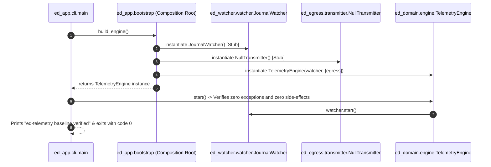
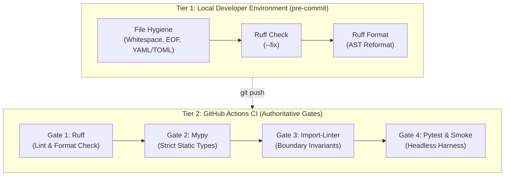

# SDD-001: Modular Monorepo Baseline, Composition Root, and Automated Verification Pipeline

## 1. Introduction and Architectural Motivation

### 1.1 Scope Lock & Anti-Bloat Principle
This Software Design Document (SDD) governs strictly the **foundational architectural baseline, package boundary enforcement, minimal walking skeleton, and CI verification pipeline** of the `ed-telemetry` project.

In strict adherence to our anti-bloat policy:
* This design deliberately contains **zero domain feature specifications, zero external API endpoints, and zero live game data models**.
* All functional telemetry models (Pydantic schemas, event parsing, EDDN payloads, and CAPI adapters) are deferred to dedicated SDDs during the Construction phase.

### 1.2 The Skeptic Test (Why This Architecture?)
Establishing this architectural baseline before writing feature code is required because:
1. It eliminates the circular import traps and accidental coupling that plagued legacy EDMC by verifying dependency directions mathematically in CI.
2. The Composition Root (`packages/ed_app/bootstrap.py`) guarantees that concrete adapters are decoupled from the core engine, allowing side-effect-free testing and headless execution.
3. It validates that all package entrypoints can be imported without display shims (`xvfb`) or external network dependencies.

### 1.3 The Vacation Test
This specification details the package directory layout, boundary contracts, stub ports, composition root bootstrapper, and CI pipeline gates such that any independent engineer can implement, execute, and verify the baseline test suite without ambiguity.

---

## 2. Structural Component Model (Mermaid)

The model below reflects the reduced architectural baseline and walking skeleton contracts:


---

## 3. Dynamic Sequence Flow: Bootstrapping Smoke Test (Mermaid)

The sequence below illustrates the Composition Root verification flow:



---

## 4. Package Taxonomy & Boundary Invariants

```text
packages/
|-- ed_domain/                 # The Core Domain & Port Contracts (Zero Dependencies)
|   |-- __init__.py
|   |-- engine.py              # TelemetryEngine class
|   \-- ports/                 # Abstract interfaces (WatcherPort, EgressPort)
|       |-- __init__.py
|       |-- watcher.py
|       \-- egress.py
|-- ed_watcher/                # Inbound Adapter (Stub Implementation)
|   |-- __init__.py
|   \-- watcher.py             # JournalWatcher implementing WatcherPort
|-- ed_egress/                 # Outbound Adapter (Stub Implementation)
|   |-- __init__.py
|   \-- transmitter.py         # NullTransmitter implementing EgressPort
|-- ed_sdk/                    # Testing Harness (Mock Stubs)
|   |-- __init__.py
|   \-- mock_writer.py         # MockJournalWriter stub
\-- ed_app/                    # Driving Adapters & Composition Root
    |-- __init__.py
    |-- __main__.py            # Module entrypoint (python -m ed_app)
    |-- bootstrap.py           # build_engine() Composition Root factory
    \-- cli/
        |-- __init__.py
        \-- main.py            # Minimal smoke-test entrypoint

scripts/
|-- verify.py                  # Portable cross-platform quality gate orchestrator
\-- print_dependency_graph.py  # Real-time AST dependency graph inspector (grimp)
```

### 4.1 Strict Machine-Enforceable Invariants
* **Invariant A (Pure Domain I/O Isolation):** `ed_domain` contains only pure algorithms, models, and type definitions. It is strictly forbidden from importing `httpx`, `requests`, `urllib`, `socket`, `watchdog`, `tkinter`, or any sibling package under `packages/`.
* **Invariant B (SDK Production Isolation):** Production runtime packages (`ed_watcher`, `ed_egress`, `ed_app`) are strictly forbidden from importing `ed_sdk`.
* **Invariant C (Composition Root Monopoly):** `ed_app/bootstrap.py` is the only authorized location where concrete adapters are instantiated and wired together. Adapters must never instantiate sibling adapters at module level.

---

## 5. Verification Architecture & Automated Pipeline Specification

Verification is architected as a two-tier quality control system: **Tier 1 (Shift-Left Pre-Commit Git Hooks)** for instant feedback during local development, and **Tier 2 (Continuous Integration Quality Gates)** for authoritative multi-platform verification in GitHub Actions.



### 5.1 Tier 1: Local `pre-commit` Hooks Specification

`pre-commit` executes sub-second validation prior to git commit creation, ensuring that no unformatted code or syntax errors enter the git tree:

* **Configuration Target:** `.pre-commit-config.yaml` at repository root.
* **Included Hooks:**
  1. `pre-commit-hooks`: `trailing-whitespace`, `end-of-file-fixer`, `check-yaml`, `check-toml`, `check-added-large-files`.
  2. `ruff-pre-commit`:
     - `ruff` (with `--fix` to automatically correct fixable lint violations).
     - `ruff-format` (to reformat Python source files).
* **Installation & Invocation:**
  - Setup: `pip install -e .[dev] && pre-commit install`
  - Manual execution across all files: `pre-commit run --all-files`
* **Exclusions from Pre-Commit:** `mypy`, `import-linter`, and `pytest` are intentionally excluded from `pre-commit` to prevent local commit latency. For instructions on executing these slower checks locally prior to push, consult the Diátaxis guide: [`docs/how-to/verify_architecture_and_test_locally.md`](../../docs/how-to/verify_architecture_and_test_locally.md).

### 5.2 Tier 2: Continuous Integration Gates & Verification Orchestrator (`scripts/verify.py`)

To eliminate discrepancies between developer environments and automated CI, quality gates are orchestrated by a portable, zero-dependency Python script: [`scripts/verify.py`](../../scripts/verify.py).

#### 5.2.1 Orchestrator Execution Model
* **Command:** `python scripts/verify.py`
* **Implementation Standard:** Pure Python standard library (`subprocess`, `sys`). Operates identically across Linux, macOS, and Windows.
* **Failure Policy:** Executes gates sequentially and halts immediately upon non-zero exit code of any step, echoing failing command output and bubbling up the failure code.

#### 5.2.2 Quality Gates Executed

1. **Gate 1: Ruff Lint & Format Verification**
   * Commands: `ruff check packages tests` and `ruff format --check packages tests`
   * Rules: Enforces PEP 8, import sorting (`I001`), bug detection (`B`), and Python 3.11+ syntax idioms.

2. **Gate 2: Mypy Static Type Analysis**
   * Command: `mypy`
   * Rules: Strict static typing across all 5 packages using `pyproject.toml` configurations.

3. **Gate 3: Architectural Boundary Verification (`import-linter`)**
   * Command: `lint-imports`
   * Contracts:
     - Invariant A (Domain purity: no I/O or sibling package imports in `ed_domain`).
     - Invariant B (SDK runtime isolation: no `ed_sdk` imports in production packages).
     - Layered boundaries (`ed_app` $\to$ `ed_watcher | ed_egress` $\to$ `ed_domain`).

4. **Gate 4: Headless Pytest Suite & CLI Smoke Test**
   * Commands: `pytest -v` and `python -m ed_app`
   * Verification: Headless verification of composition root instantiation and zero runtime side effects.

### 5.3 On-Demand AST Dependency Graph Inspector (`scripts/print_dependency_graph.py`)

To inspect live architectural relationships without checking static graph artifacts into documentation:
* **Engine:** Built with `grimp` (already bundled with `import-linter`).
* **Execution:** `python scripts/print_dependency_graph.py`
* **Output:** Traverses the Abstract Syntax Tree across `ed_domain`, `ed_watcher`, `ed_egress`, `ed_sdk`, and `ed_app`, printing:
  - Directed import edges per package.
  - Upstream dependencies and downstream dependents.
  - Visual confirmation that `ed_domain` has zero outgoing dependencies.

---

## 6. Release & Semantic Versioning Lifecycle

* **Tooling:** `bump-my-version` configured under `[tool.bumpversion]` in `pyproject.toml`.
* **Baseline:** Commences at `0.1.0`.
* **Branch Policy:** Release tags are strictly restricted to the `main` branch.
* **Synchronized Target Files:**
  1. `pyproject.toml` (`version = "0.1.0"`)
  2. `packages/ed_domain/__init__.py` (`__version__ = "0.1.0"`)
  3. `README.md` (Release badge / header)
  4. `CHANGELOG.md` (Keep a Changelog release section)

---

## 7. Concrete Verification Milestone
The Elaboration phase for this baseline is complete once:
1. The walking skeleton stub files in Section 4 are created.
2. `pyproject.toml` and `.github/workflows/ci.yml` are configured.
3. All four CI gates pass with zero warnings across Ubuntu and Windows.
