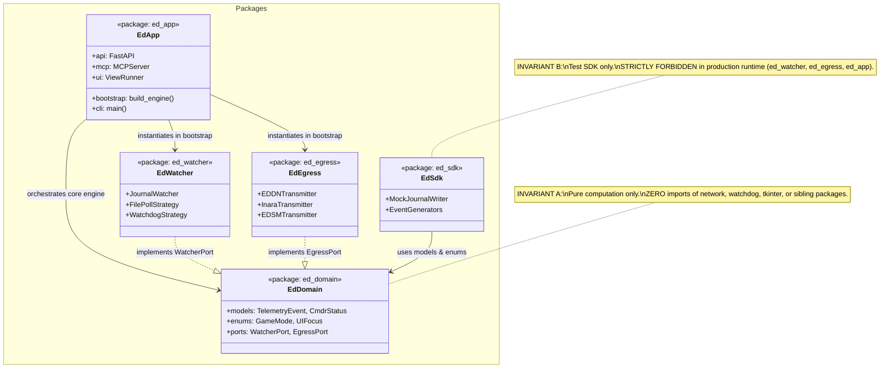
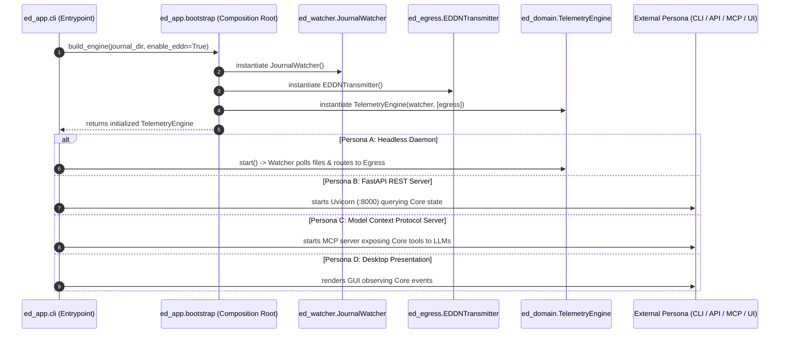
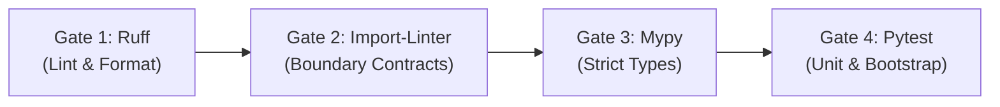

# SDD-001: Modular Monorepo Baseline, Composition Root, and Automated Verification Pipeline

## 1. Introduction and Architectural Motivation

### 1.1 Context and Problem Statement
Legacy community tooling for Elite Dangerous evolved as desktop-first monolithic applications where user interfaces, operating system hooks, background file monitors, and network transmitters were tightly commingled. This architecture prohibited headless execution, prevented automated CI verification without display shims (`xvfb`), caused circular import loops, and created extreme cognitive friction.

### 1.2 The Skeptic Test (Why This Architecture?)
A modular monorepo governed by Ports & Adapters (Hexagonal Architecture) is chosen over multi-repo micro-packages and monolithic flat scripts because:
1. **Multi-Repo Administrative Overhead:** Polyrepos introduce versioning choreography (tagging and releasing 5 separate PyPI packages for every game update), creating high cognitive friction and dependency desynchronization.
2. **Monolithic Entanglement:** Flat root scripts cause import loops and prevent headless deployments.
3. **The Hexagonal Advantage:** Partitioning packages into pure domain, isolated driven adapters, and a unified application driving package allows all 4 personas (CLI, REST API, MCP Server, UI) to drive the identical core engine without duplicate logic.

### 1.3 The Vacation Test
This specification details the package directory structure, import dependency matrix, composition root bootstrapping factory, automated CI architecture gates, and release lifecycle such that any independent engineer can implement and verify the foundational baseline without ambiguity.

---

## 2. Structural Component Model (Mermaid)



---

## 3. Dynamic Sequence Flow (Mermaid)

The sequence below illustrates the Composition Root bootstrapping flow and event routing across the co-equal driving interfaces:



---

## 4. Package Taxonomy & Boundary Invariants

```text
packages/
|-- ed_domain/                 # The Core Domain & Port Contracts (Zero Dependencies)
|   |-- __init__.py
|   |-- enums/                 # Game status flags, ship types, ranks
|   |-- models/                # Typed telemetry events, commander state
|   \-- ports/                 # Abstract interfaces (WatcherPort, EgressPort, ConfigPort)
|-- ed_watcher/                # Inbound Adapter (Journal File Monitoring)
|   |-- __init__.py
|   |-- watcher.py             # Watchdog & polling file listener
|   \-- parser.py              # Raw line JSON extractor
|-- ed_egress/                 # Outbound Adapter (Network Transmitters)
|   |-- __init__.py
|   |-- eddn.py                # EDDN gateway HTTP client
|   |-- inara.py               # Inara API client
|   \-- edsm.py                # EDSM API client
|-- ed_sdk/                    # Testing Harness (Mock Generator SDK)
|   |-- __init__.py
|   |-- mock_writer.py         # MockJournalWriter simulator
|   \-- fixtures.py            # Sample payloads and event factories
\-- ed_app/                    # Driving Adapters & Composition Root
    |-- __init__.py
    |-- __main__.py            # Module entrypoint (python -m ed_app)
    |-- bootstrap.py           # Single Composition Root factory
    |-- cli/                   # Front Door 1: Terminal commands
    |-- api/                   # Front Door 2: FastAPI REST & WebSockets
    |-- mcp/                   # Front Door 3: Model Context Protocol server
    \-- ui/                    # Front Door 4: Desktop presentation shell
```

### 4.1 Strict Machine-Enforceable Invariants
* **Invariant A (Pure Domain I/O Isolation):** `ed_domain` contains only pure algorithms, models, and type definitions. It is strictly forbidden from importing `httpx`, `requests`, `urllib`, `socket`, `watchdog`, `tkinter`, or any sibling package under `packages/`.
* **Invariant B (SDK Production Isolation):** Production runtime packages (`ed_watcher`, `ed_egress`, `ed_app`) are strictly forbidden from importing `ed_sdk`. The SDK is reserved solely for `tests/` and third-party plugin authors.
* **Invariant C (Composition Root Monopoly):** `ed_app/bootstrap.py` is the only authorized location where concrete adapters are instantiated and wired together. Adapters must never instantiate sibling adapters at module level.

---

## 5. Automated CI Verification Pipeline Specification

Continuous Integration (.github/workflows/ci.yml) executes four discrete quality gates across Ubuntu and Windows:



### 5.1 Gate 1: Ruff Lint & Format
* Command: `ruff check . && ruff format --check .`
* Rules: Enforces PEP 8, import sorting (`I001`), bug detection (`B`), and modern Python 3.11+ idioms across the entire repository.

### 5.2 Gate 2: Architectural Boundary Verification (`import-linter`)
* Command: `lint-imports`
* Contracts:
  - **Contract 1 (Layers):** `ed_app` $\to$ `ed_watcher`, `ed_egress` $\to$ `ed_domain`. (Forbids reverse imports).
  - **Contract 2 (Independence):** `ed_watcher` and `ed_egress` are independent (may not import each other).
  - **Contract 3 (Domain Purity):** `ed_domain` is forbidden from importing external I/O libraries (`httpx`, `watchdog`, `tkinter`).
  - **Contract 4 (SDK Isolation):** `ed_domain`, `ed_watcher`, `ed_egress`, and `ed_app` are forbidden from importing `ed_sdk`.

### 5.3 Gate 3: Mypy Static Type Analysis
* Command: `mypy packages/ tests/`
* Configuration: Enforces strict type annotations, verifying that concrete adapters satisfy abstract Port protocols.

### 5.4 Gate 4: Headless Pytest Suite
* Command: `pytest tests/`
* Scope:
  - `tests/unit/`: Isolated tests verifying models and parsers with mock I/O in < 1 second.
  - `tests/integration/`: Verification of `bootstrap.py` wiring and side-effect-free imports.
  - **Zero Display Shims:** Tests must execute in standard headless terminals without `xvfb`.

---

## 6. Release & Semantic Versioning Lifecycle

* **Tooling:** `bump-my-version` configured under `[tool.bumpversion]` in `pyproject.toml`.
* **Baseline:** Commences at `0.1.0`.
* **Synchronized Target Files:**
  1. `pyproject.toml` (`version = "0.1.0"`)
  2. `packages/ed_domain/__init__.py` (`__version__ = "0.1.0"`)
  3. `README.md` (Release badge / header)
  4. `CHANGELOG.md` (Keep a Changelog release section)

---

## 7. Phased Implementation Roadmap

### Phase 1: Foundational Walking Skeleton & Verification Pipeline (Current)
* Author port contracts in `packages/ed_domain/ports/`.
* Implement minimal `TelemetryEngine` in `packages/ed_domain/engine.py`.
* Implement Composition Root factory in `packages/ed_app/bootstrap.py`.
* Implement minimal CLI smoke test in `packages/ed_app/cli/main.py`.
* Configure `pyproject.toml` dependencies, `ruff`, `mypy`, `import-linter`, and `bump-my-version`.
* Author `.github/workflows/ci.yml` matrix workflow.
* Verify all 4 CI gates pass cleanly.

### Phase 2: Domain Telemetry Models & Parsing Engine
* Define typed Pydantic models for Elite Dangerous journal events (FSDJump, Docked, Market, etc.).
* Extract constants and ship/module data tables into typed enums under `packages/ed_domain/enums/`.
* Implement resilient JSON line parser with `extra="allow"` fallback.

### Phase 3: Headless Watcher & Testing SDK
* Implement `JournalWatcher` in `packages/ed_watcher/` supporting directory polling and file tailing.
* Implement `MockJournalWriter` in `packages/ed_sdk/` to simulate live game logs for CI testing.

### Phase 4: Outbound Egress Transmitters
* Implement `EDDNTransmitter` in `packages/ed_egress/` validating against EDDN schemas.
* Implement `InaraTransmitter` for commander profile synchronization.

### Phase 5: Multi-Adapter Driving Surfaces
* Implement full CLI subcommands (`watch`, `serve`, `status`).
* Implement FastAPI REST and WebSocket endpoints in `packages/ed_app/api/`.
* Implement Model Context Protocol (MCP) server in `packages/ed_app/mcp/`.
