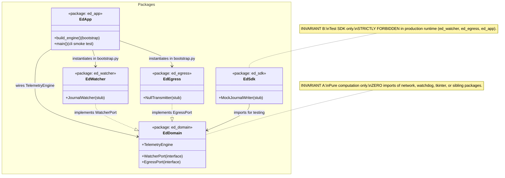
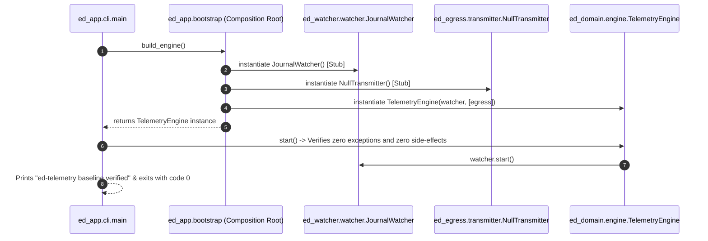
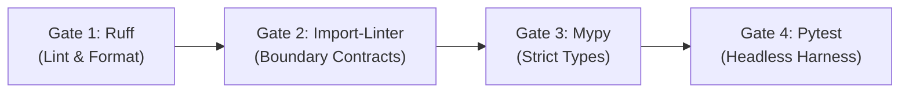

# SDD-001: Modular Monorepo Baseline, Composition Root, and Automated Verification Pipeline

## 1. Introduction and Architectural Motivation

### 1.1 Scope Lock & Anti-Bloat Principle
This Software Design Document (SDD) governs strictly the **foundational architectural baseline, package boundary enforcement, minimal walking skeleton, and CI verification pipeline** of the `ed-telemetry` project. 

In strict adherence to our anti-bloat policy:
* This design deliberately contains **zero domain feature specifications, zero external API endpoints, and zero live game data models**.
* All functional telemetry models (Pydantic schemas, event parsing, EDDN payloads, and CAPI adapters) are deferred to dedicated SDDs during the Construction phase.

### 1.2 The Skeptic Test (Why This Architecture?)
Establishing this architectural baseline before writing feature code is required because:
1. It eliminates the circular import traps and accidental coupling that plagued legacy EDMC by verifying dependency directions mathematically in CI.
2. The Composition Root (`packages/ed_app/bootstrap.py`) guarantees that concrete adapters are decoupled from the core engine, allowing side-effect-free testing and headless execution.
3. It validates that all package entrypoints can be imported without display shims (`xvfb`) or external network dependencies.

### 1.3 The Vacation Test
This specification details the package directory layout, boundary contracts, stub ports, composition root bootstrapper, and CI pipeline gates such that any independent engineer can implement, execute, and verify the baseline test suite without ambiguity.

---

## 2. Structural Component Model (Mermaid)

The model below reflects the reduced architectural baseline and walking skeleton contracts:



---

## 3. Dynamic Sequence Flow: Bootstrapping Smoke Test (Mermaid)

The sequence below illustrates the Composition Root verification flow:



---

## 4. Package Taxonomy & Boundary Invariants

```text
packages/
|-- ed_domain/                 # The Core Domain & Port Contracts (Zero Dependencies)
|   |-- __init__.py
|   |-- engine.py              # TelemetryEngine class
|   \-- ports/                 # Abstract interfaces (WatcherPort, EgressPort)
|       |-- __init__.py
|       |-- watcher.py
|       \-- egress.py
|-- ed_watcher/                # Inbound Adapter (Stub Implementation)
|   |-- __init__.py
|   \-- watcher.py             # JournalWatcher implementing WatcherPort
|-- ed_egress/                 # Outbound Adapter (Stub Implementation)
|   |-- __init__.py
|   \-- transmitter.py         # NullTransmitter implementing EgressPort
|-- ed_sdk/                    # Testing Harness (Mock Stubs)
|   |-- __init__.py
|   \-- mock_writer.py         # MockJournalWriter stub
\-- ed_app/                    # Driving Adapters & Composition Root
    |-- __init__.py
    |-- __main__.py            # Module entrypoint (python -m ed_app)
    |-- bootstrap.py           # build_engine() Composition Root factory
    \-- cli/
        |-- __init__.py
        \-- main.py            # Minimal smoke-test entrypoint
```

### 4.1 Strict Machine-Enforceable Invariants
* **Invariant A (Pure Domain I/O Isolation):** `ed_domain` contains only pure algorithms, models, and type definitions. It is strictly forbidden from importing `httpx`, `requests`, `urllib`, `socket`, `watchdog`, `tkinter`, or any sibling package under `packages/`.
* **Invariant B (SDK Production Isolation):** Production runtime packages (`ed_watcher`, `ed_egress`, `ed_app`) are strictly forbidden from importing `ed_sdk`.
* **Invariant C (Composition Root Monopoly):** `ed_app/bootstrap.py` is the only authorized location where concrete adapters are instantiated and wired together. Adapters must never instantiate sibling adapters at module level.

---

## 5. Automated CI Verification Pipeline Specification

Continuous Integration (`.github/workflows/ci.yml`) executes four discrete quality gates across Ubuntu and Windows:



### 5.1 Gate 1: Ruff Lint & Format
* Command: `ruff check . && ruff format --check .`
* Rules: Enforces PEP 8, import sorting (`I001`), bug detection (`B`), and modern Python 3.11+ idioms across the entire repository.

### 5.2 Gate 2: Architectural Boundary Verification (`import-linter`)
* Command: `lint-imports`
* Contracts configured in `pyproject.toml`:
  - **Contract 1 (Layers):** `ed_app` $\to$ `ed_watcher`, `ed_egress` $\to$ `ed_domain`. (Forbids reverse imports).
  - **Contract 2 (Independence):** `ed_watcher` and `ed_egress` are independent (may not import each other).
  - **Contract 3 (Domain Purity):** `ed_domain` is forbidden from importing external I/O libraries (`httpx`, `watchdog`, `tkinter`).
  - **Contract 4 (SDK Isolation):** Production runtime packages may not import `ed_sdk`.

### 5.3 Gate 3: Mypy Static Type Analysis
* Command: `mypy packages/ tests/`
* Configuration: Enforces strict type annotations, verifying that stub adapters satisfy abstract Port protocols.

### 5.4 Gate 4: Headless Pytest Suite
* Command: `pytest tests/`
* Scope:
  - `tests/unit/test_bootstrap.py`: Asserts that `build_engine()` constructs a valid `TelemetryEngine` without side-effects.
  - `tests/unit/test_imports.py`: Asserts that `ed_domain` can be imported cleanly without external dependencies.
  - **Zero Display Shims:** Tests must execute in standard headless terminals without `xvfb`.

---

## 6. Release & Semantic Versioning Lifecycle

* **Tooling:** `bump-my-version` configured under `[tool.bumpversion]` in `pyproject.toml`.
* **Baseline:** Commences at `0.1.0`.
* **Branch Policy:** Release tags are strictly restricted to the `main` branch.
* **Synchronized Target Files:**
  1. `pyproject.toml` (`version = "0.1.0"`)
  2. `packages/ed_domain/__init__.py` (`__version__ = "0.1.0"`)
  3. `README.md` (Release badge / header)
  4. `CHANGELOG.md` (Keep a Changelog release section)

---

## 7. Concrete Verification Milestone
The Elaboration phase for this baseline is complete once:
1. The walking skeleton stub files in Section 4 are created.
2. `pyproject.toml` and `.github/workflows/ci.yml` are configured.
3. All four CI gates pass with zero warnings across Ubuntu and Windows.
