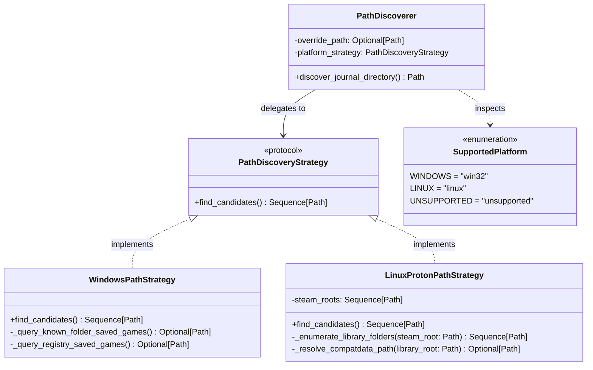

# SDD-002: Operating System Path Discovery Subsystem Design

## 1. Context and Problem Statement

Before `ed-telemetry` can tail logs or ingest point-in-time state files, the application must discover the directory where the Elite Dangerous client writes its telemetry. Because the game is closed-source and distributed across Microsoft Windows and Linux compatibility layers (Steam Play / Proton / SteamOS / Wine), locating this path requires platform-specific discovery strategies.

As mandated by [ADR 0004](file:///home/michael/src/github.com/mnaatjes/ed-telemetry/architecture/adr/0004_os_path_discovery_and_filesystem_research_framework.md), Path Discovery is a standalone upstream capability residing in `packages/ed_watcher.discovery`. It serves two downstream consumers:
1. **Workflow A (SDK Recon & Data Preservation):** Harvesting empirical log samples (`packages/ed_sdk`).
2. **Workflow B (Production Telemetry Daemon):** Live tailing, state aggregation, and community egress (`packages/ed_app` and `packages/ed_egress`).

This document details the software design, platform-gated funnel architecture, interface contracts, error semantics, and testing boundaries for the Path Discovery subsystem.

---

## 2. Architectural Boundaries & Invariants

* **Invariant A (Domain Decoupling):** Operating systems, file paths, Windows Shell DLLs, and Steam VDF formats are infrastructure concerns. They are strictly forbidden from entering `packages/ed_domain`.
* **Invariant B (Strict Discoverer Scope):** The Path Discoverer is exclusively a *directory resolver*. It validates that a candidate directory exists and is readable. It **must not** check for the existence of `Journal.*.log` or snapshot files (`Market.json`, `Backpack.json`, etc.), as snapshot files are dynamically created by the game engine only upon specific player activities.
* **Invariant C (Platform Gating):** Zero cross-platform strategy execution. Windows host strategies execute Win32 API calls; Linux host strategies scan Proton/Steam directories. Neither platform attempts the other's discovery mechanisms.

---

## 3. Structural Architecture

The discovery subsystem is structured around a central coordinator (`PathDiscoverer`) delegating to platform-specific strategies implementing a shared protocol interface (`PathDiscoveryStrategy`).



### 3.1 Component Directory Structure

Within `packages/ed_watcher`:
```text
packages/ed_watcher/
└── src/
    └── ed_watcher/
        ├── __init__.py
        ├── discovery/
        │   ├── __init__.py
        │   ├── coordinator.py       # PathDiscoverer orchestrator
        │   ├── exceptions.py        # JournalPathNotFoundError, UnsupportedPlatformError
        │   ├── models.py            # SupportedPlatform enum, DiscoveryResult
        │   ├── protocols.py         # PathDiscoveryStrategy interface
        │   └── strategies/
        │       ├── __init__.py
        │       ├── linux.py         # LinuxProtonPathStrategy (Steam & Flatpak)
        │       └── windows.py       # WindowsPathStrategy (Win32 Known Folders & Registry)
        └── py.typed
```

---

## 4. Dynamic Behavior: The Platform-Gated Search Funnel

The discovery process follows an ordered, deterministic precedence hierarchy:


---

## 5. Interface Contracts & Data Definitions

### 5.1 Enums & Result Models

```python
from enum import Enum
from pathlib import Path
from dataclasses import dataclass
from typing import Optional


class SupportedPlatform(str, Enum):
    WINDOWS = "win32"
    LINUX = "linux"
    UNSUPPORTED = "unsupported"

    @classmethod
    def from_current_platform(cls) -> "SupportedPlatform":
        import sys

        if sys.platform == "win32":
            return cls.WINDOWS
        elif sys.platform.startswith("linux"):
            return cls.LINUX
        return cls.UNSUPPORTED


@dataclass(frozen=True)
class DiscoveryResult:
    resolved_path: Path
    discovery_source: str  # "explicit_override", "env_override", "win32_shell", "steam_proton", etc.
```

### 5.2 Exception Hierarchy (`ed_watcher.discovery.exceptions`)

All path discovery exceptions reside strictly within `packages/ed_watcher/src/ed_watcher/discovery/exceptions.py` and derive from the infrastructure base `WatcherError`. They are structured to provide callers with programmatic inspection attributes (e.g. `inspected_paths`, `platform_name`, `target_path`) alongside actionable diagnostic messages.

```python
from pathlib import Path
from typing import Sequence


class WatcherError(Exception):
    """Base infrastructure exception for all ed_watcher failures."""


class PathDiscoveryError(WatcherError):
    """Base exception for all path discovery failures."""


class UnsupportedPlatformError(PathDiscoveryError):
    """
    Raised when the runtime encounters an operating system without an automated strategy.

    Attributes:
        platform_name: The raw sys.platform string that was rejected.
    """

    def __init__(self, platform_name: str) -> None:
        self.platform_name = platform_name
        super().__init__(
            f"Unsupported operating system platform: '{platform_name}'. "
            "Automated path discovery is only supported on Windows (win32) and Linux. "
            "Supply an explicit path parameter or set the ED_JOURNAL_DIR environment variable."
        )


class InvalidPathOverrideError(PathDiscoveryError):
    """
    Raised when an explicit override path (parameter or environment variable)
    does not exist or is not a readable directory.

    Attributes:
        target_path: The invalid Path provided.
        source: The origin of the override ('parameter' or 'environment').
        reason: Diagnostic reason for failure ('does_not_exist', 'not_a_directory', 'permission_denied').
    """

    def __init__(self, target_path: Path, source: str, reason: str) -> None:
        self.target_path = target_path
        self.source = source
        self.reason = reason
        super().__init__(
            f"Invalid journal directory override from {source}: '{target_path}' ({reason}). "
            "Verify the path exists, is a directory, and has read permissions."
        )


class JournalPathNotFoundError(PathDiscoveryError):
    """
    Raised when automated platform strategies exhaust all candidate locations
    without locating a valid Elite Dangerous journal directory.

    Attributes:
        inspected_paths: The ordered sequence of candidate paths evaluated.
        platform_name: The active platform strategy that was executed.
    """

    def __init__(self, inspected_paths: Sequence[Path], platform_name: str) -> None:
        self.inspected_paths = tuple(inspected_paths)
        self.platform_name = platform_name
        formatted_paths = "\n  - ".join(str(p) for p in self.inspected_paths) or "None"
        super().__init__(
            f"Failed to discover Elite Dangerous journal directory on {platform_name}.\n"
            f"Inspected candidate locations:\n  - {formatted_paths}\n\n"
            "Remediation: Launch Elite Dangerous at least once to initialize save files, "
            "or provide an explicit path parameter / ED_JOURNAL_DIR."
        )
```

---

## 6. Testing Opportunities & Emulation Scope (Reminder Stub)

In accordance with UP scoping policies, full cross-platform Docker integration and CI test fixtures will be formalized in a dedicated testing ADR. For Component Design SDD-002, the following testing contracts are established:

1. **Unit Testing Fast-Path (Pytest Mocking in `tests/unit/test_path_discovery.py`):**
   - **Happy Path Discovery:**
     - Mock Windows `shell32.SHGetKnownFolderPath` returning a valid `Saved Games` directory in `tmp_path`.
     - Mock Linux Steam standard library paths and custom `libraryfolders.vdf` in `tmp_path`.
   - **Exception Branch Verification (100% Error Coverage):**
     - Verify `UnsupportedPlatformError` is raised when `sys.platform == "darwin"`.
     - Verify `InvalidPathOverrideError` is raised when passing non-existent or unreadable paths via parameter or `ED_JOURNAL_DIR`.
     - Verify `JournalPathNotFoundError` is raised when all candidate directories are missing, asserting that `error.inspected_paths` accurately reflects all evaluated candidates.
   - **Isolation Invariant:** Assert that Windows strategies never execute on Linux and Linux strategies never execute on Windows.

2. **Integration Verification (Future Scope):**
   - GitHub Actions multi-runner matrix (`windows-latest` for native Win32 Shell API execution; `ubuntu-latest` for Proton filesystem verification).
   - Docker containerized environments modeling standard Linux vs. Flatpak sandboxes.

---

## 7. Implementation Roadmap & PR Sequencing

* **Milestone 1 (Foundations, Models & Exceptions):**
  - Implement `SupportedPlatform`, `DiscoveryResult` in `ed_watcher.discovery.models`.
  - Implement complete exception hierarchy (`WatcherError`, `PathDiscoveryError`, `UnsupportedPlatformError`, `InvalidPathOverrideError`, `JournalPathNotFoundError`) with inspection attributes in `ed_watcher.discovery.exceptions`.
  - Implement `PathDiscoveryStrategy` protocol in `ed_watcher.discovery.protocols`.
  - Add unit tests for models and exception formatting/attributes.
* **Milestone 2 (Windows Strategy):**
  - Implement `WindowsPathStrategy` with Win32 ctypes `SHGetKnownFolderPath` and registry fallback.
  - Add unit tests mocking Windows environment markers and ctypes calls.
* **Milestone 3 (Linux Proton Strategy):**
  - Implement `LinuxProtonPathStrategy` scanning Steam libraries, default paths, and Flatpak prefixes.
  - Add unit tests mocking Steam `libraryfolders.vdf` parsing and filesystem trees in `tmp_path`.
* **Milestone 4 (Coordinator & Complete Test Suite):**
  - Implement `PathDiscoverer` coordinating overrides and platform gating in `ed_watcher.discovery.coordinator`.
  - Add end-to-end unit tests covering all success and failure branches, verifying 100% branch coverage across the discovery subsystem.
* **Milestone 5 (Diataxis API Reference Documentation):**
  - Author developer API reference manual `docs/reference/watcher_path_discovery.md` documenting `PathDiscoverer`, `DiscoveryResult`, parameter signatures, return types, and code snippets.
  - Register the reference in `docs/reference/README.md`.
