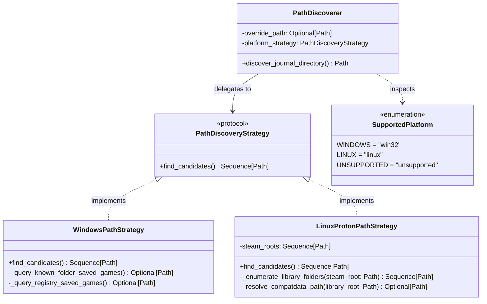
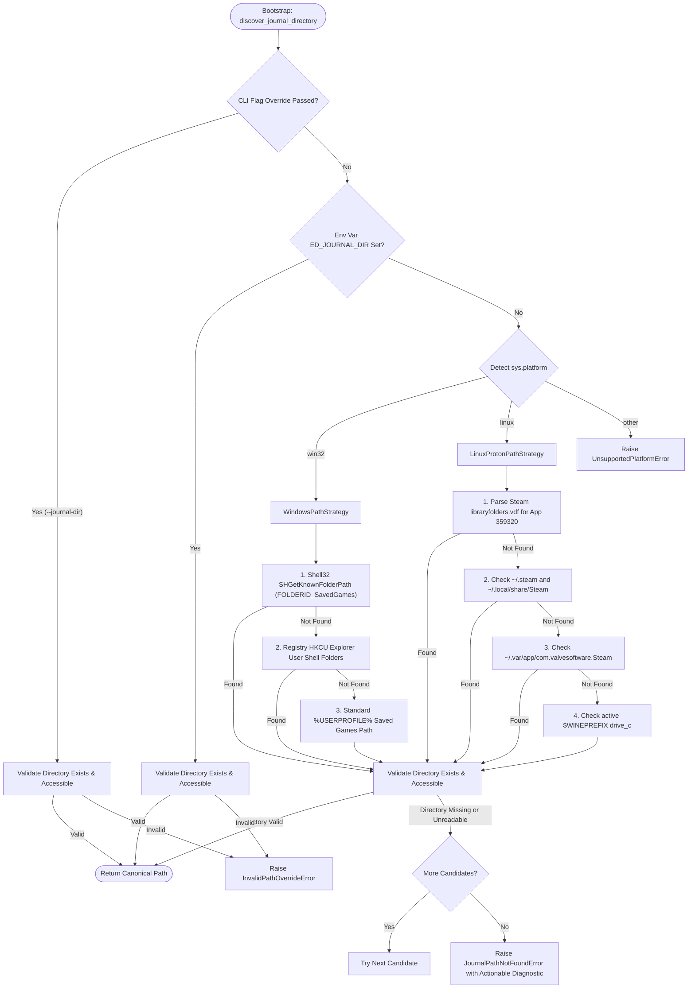

# SDD-002: Operating System Path Discovery Subsystem Design

## 1. Context and Problem Statement

Before `ed-telemetry` can tail logs or ingest point-in-time state files, the application must discover the directory where the Elite Dangerous client writes its telemetry. Because the game is closed-source and distributed across Microsoft Windows and Linux compatibility layers (Steam Play / Proton / SteamOS / Wine), locating this path requires platform-specific discovery strategies.

As mandated by [ADR 0004](file:///home/michael/src/github.com/mnaatjes/ed-telemetry/architecture/adr/0004_os_path_discovery_and_filesystem_research_framework.md), Path Discovery is a standalone upstream capability residing in `packages/ed_watcher.discovery`. It serves two downstream consumers:
1. **Workflow A (SDK Recon & Data Preservation):** Harvesting empirical log samples (`packages/ed_sdk`).
2. **Workflow B (Production Telemetry Daemon):** Live tailing, state aggregation, and community egress (`packages/ed_app` and `packages/ed_egress`).

This document details the software design, platform-gated funnel architecture, interface contracts, error semantics, and testing boundaries for the Path Discovery subsystem.

---

## 2. Architectural Boundaries & Invariants

* **Invariant A (Domain Decoupling):** Operating systems, file paths, Windows Shell DLLs, and Steam VDF formats are infrastructure concerns. They are strictly forbidden from entering `packages/ed_domain`.
* **Invariant B (Strict Discoverer Scope):** The Path Discoverer is exclusively a *directory resolver*. It validates that a candidate directory exists and is readable. It **must not** check for the existence of `Journal.*.log` or snapshot files (`Market.json`, `Backpack.json`, etc.), as snapshot files are dynamically created by the game engine only upon specific player activities.
* **Invariant C (Platform Gating):** Zero cross-platform strategy execution. Windows host strategies execute Win32 API calls; Linux host strategies scan Proton/Steam directories. Neither platform attempts the other's discovery mechanisms.

---

## 3. Structural Architecture

The discovery subsystem is structured around a central coordinator (`PathDiscoverer`) delegating to platform-specific strategies implementing a shared protocol interface (`PathDiscoveryStrategy`).



### 3.1 Component Directory Structure

Within `packages/ed_watcher`:
```text
packages/ed_watcher/
└── src/
    └── ed_watcher/
        ├── __init__.py
        ├── discovery/
        │   ├── __init__.py
        │   ├── coordinator.py       # PathDiscoverer orchestrator
        │   ├── exceptions.py        # JournalPathNotFoundError, UnsupportedPlatformError
        │   ├── models.py            # SupportedPlatform enum, DiscoveryResult
        │   ├── protocols.py         # PathDiscoveryStrategy interface
        │   └── strategies/
        │       ├── __init__.py
        │       ├── linux.py         # LinuxProtonPathStrategy (Steam & Flatpak)
        │       └── windows.py       # WindowsPathStrategy (Win32 Known Folders & Registry)
        └── py.typed
```

---

## 4. Dynamic Behavior: The Platform-Gated Search Funnel

The discovery process follows an ordered, deterministic precedence hierarchy:



---

## 5. Interface Contracts & Data Definitions

### 5.1 Enums & Result Models

```python
from enum import Enum
from pathlib import Path
from dataclasses import dataclass
from typing import Optional


class SupportedPlatform(str, Enum):
    WINDOWS = "win32"
    LINUX = "linux"
    UNSUPPORTED = "unsupported"

    @classmethod
    def from_current_platform(cls) -> "SupportedPlatform":
        import sys

        if sys.platform == "win32":
            return cls.WINDOWS
        elif sys.platform.startswith("linux"):
            return cls.LINUX
        return cls.UNSUPPORTED


@dataclass(frozen=True)
class DiscoveryResult:
    resolved_path: Path
    discovery_source: str  # "cli_override", "env_override", "win32_shell", "steam_proton", etc.
```

### 5.2 Exception Hierarchy

All discovery exceptions inherit from `WatcherError` within `ed_watcher`:
* `WatcherError` (Base infrastructure error)
  * `PathDiscoveryError`
    * `UnsupportedPlatformError`: Raised when running on unhandled platforms (e.g. Darwin/macOS, BSD).
    * `InvalidPathOverrideError`: Raised when the operator provides `--journal-dir` or `ED_JOURNAL_DIR` pointing to a non-existent or unreadable path.
    * `JournalPathNotFoundError`: Raised when automated strategy candidates are exhausted without encountering a valid journal directory. Contains actionable diagnostics pointing to `--journal-dir` remediation.

---

## 6. Testing Opportunities & Emulation Scope (Reminder Stub)

In accordance with UP scoping policies, full cross-platform Docker integration and CI test fixtures will be formalized in a dedicated testing ADR. For Component Design SDD-002, the following testing contracts are established:

1. **Unit Testing Fast-Path (Pytest Mocking):**
   - Use `tmp_path` to build virtual Windows and Proton filesystem hierarchies.
   - Mock `sys.platform` to verify that `LinuxProtonPathStrategy` is never invoked under Windows, and vice-versa.
   - Mock `shell32.SHGetKnownFolderPath` Win32 ctypes calls to test missing/corrupted registry paths.
2. **Integration Verification (Future Scope):**
   - GitHub Actions multi-runner matrix (`windows-latest` for native Win32 Shell API execution; `ubuntu-latest` for Proton filesystem verification).
   - Docker containerized environments modeling standard Linux vs. Flatpak sandboxes.

---

## 7. Implementation Roadmap & PR Sequencing

* **Milestone 1 (Foundations & Protocols):**
  - Implement `SupportedPlatform`, exceptions, and `PathDiscoveryStrategy` protocol in `ed_watcher.discovery`.
* **Milestone 2 (Windows Strategy):**
  - Implement `WindowsPathStrategy` with Win32 ctypes `SHGetKnownFolderPath` and registry fallback.
* **Milestone 3 (Linux Proton Strategy):**
  - Implement `LinuxProtonPathStrategy` scanning Steam libraries, default paths, and Flatpak prefixes.
* **Milestone 4 (Orchestrator & CLI Integration):**
  - Implement `PathDiscoverer` coordinating overrides and platform gating; expose `--journal-dir` in `packages/ed_app`.
