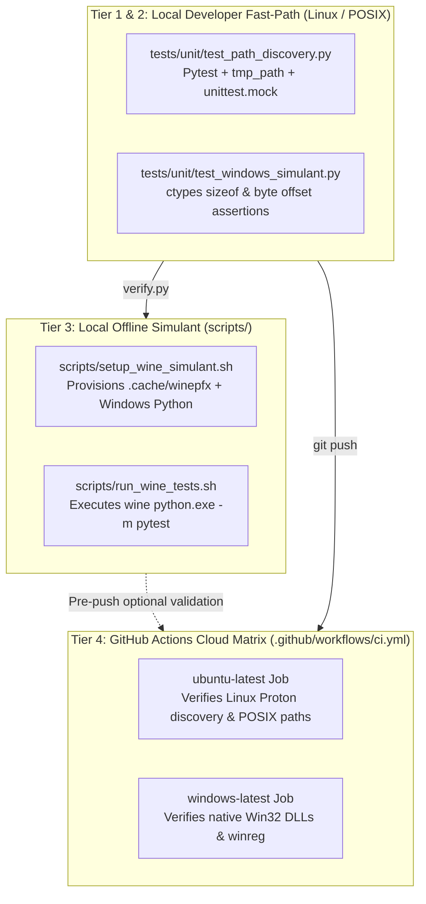

# SDD-003: Cross-Platform Testing Strategy and Simulation Matrix Design

## 1. Context and Problem Statement

`ed-telemetry` contains platform-specific code paths (`packages/ed_watcher.discovery`) that interface directly with the Microsoft Windows NT subsystem (Win32 `shell32.dll` Known Folder APIs, `ole32.dll`, and `winreg`) as well as Linux POSIX filesystems (Steam Proton prefixes, Valve VDF formats). 

As decided in [ADR 0005](../adr/0005_cross_platform_testing_strategy_and_simulation_matrix.md), testing these paths solely via standard in-memory mocks on a Linux development workstation (`prd-mgr-01`) introduces the risk of binary ABI packing mismatches, C-type structure misalignments, and registry access errors that only surface when executed against a real Windows kernel.

This document details the software design, execution mechanics, scripts, CI configuration, and phased implementation milestones for our 3-tier testing pyramid:
1. **Tier 1 & 2:** Fast Local In-Memory Mocks and Ctypes ABI Memory Profiling.
2. **Tier 3:** Deterministic Local Wine Windows Python Simulant (`scripts/setup_wine_simulant.sh`).
3. **Tier 4:** Native Cloud CI Matrix Execution on Microsoft Windows (`windows-latest`).

---

## 2. Architectural Boundaries & Invariants

* **Invariant A (Workstation Isolation):** The local Wine simulant must operate strictly within an isolated project prefix (`.cache/winepfx/`). It must never alter global system Wine registries, touch system desktop menus, or register Windows MIME types on `prd-mgr-01`.
* **Invariant B (Dependency Hygiene):** Daily developer workflows must not require Wine. Running `python scripts/verify.py` locally on Linux relies on Tier 1 and Tier 2 fast-path tests (< 1 second) without spawning Wine processes.
* **Invariant C (Platform Parity in CI):** All pull requests targeting `main` must pass the Tier 2 verification suite on both `ubuntu-latest` and native `windows-latest` before merging.

---

## 3. Structural Component Architecture

The cross-platform testing architecture is organized across three discrete layers:



---

## 4. Subsystem Specifications

### 4.1 Ctypes Binary ABI Simulant (`tests/unit/test_windows_simulant.py`)

To verify that our `WindowsPathStrategy` ctypes definitions match the Microsoft Windows NT SDK C header specification without needing a Windows machine, the test suite asserts binary memory layouts:

```python
import ctypes
from ctypes import wintypes
from ed_watcher.discovery.strategies.windows import WindowsPathStrategy

def test_guid_structure_binary_abi_layout():
    """Verify GUID struct matches Windows SDK: 16 bytes total, specific field offsets."""
    class GUID(ctypes.Structure):
        _fields_ = [
            ("Data1", wintypes.DWORD),
            ("Data2", wintypes.WORD),
            ("Data3", wintypes.WORD),
            ("Data4", ctypes.c_byte * 8),
        ]
    
    assert ctypes.sizeof(GUID) == 16
    assert GUID.Data1.offset == 0
    assert GUID.Data2.offset == 4
    assert GUID.Data3.offset == 6
    assert GUID.Data4.offset == 8
```

### 4.2 Scripted Local Wine Simulant (`scripts/setup_wine_simulant.sh` & `scripts/run_wine_tests.sh`)

To eliminate variance between developers on Linux workstations, two deterministic scripts govern local Wine provisioning and execution:

#### 1. Provisioning Script (`scripts/setup_wine_simulant.sh`)
* **Pre-flight Checks:**
  - Asserts that `wine64` is installed on the host. If missing, prints concrete installation instructions (`sudo apt install wine64`).
  - Asserts that `curl` and `tar` / `unzip` are available.
* **Isolated Prefix Initialization:**
  - Sets `WINEPREFIX="$REPO_ROOT/.cache/winepfx"`.
  - Sets `WINEDLLOVERRIDES="mscoree,mshtml="` to suppress unnecessary Gecko/Mono prompt dialogues.
  - Initializes headless prefix via `wineboot --init`.
* **Windows Python Provisioning:**
  - Downloads official Python Windows 64-bit embeddable package (`python-3.11.x-embed-amd64.zip`) or standard installer into `.cache/downloads/`.
  - Unpacks into `$WINEPREFIX/drive_c/Python311/`.
  - Installs/configures `pip` and minimal test dependencies (`pytest`).
* **Idempotency:**
  - If `$WINEPREFIX/drive_c/Python311/python.exe` already exists and responds, exits cleanly in 0 seconds.

#### 2. Test Execution Script (`scripts/run_wine_tests.sh`)
* Sets `WINEPREFIX="$REPO_ROOT/.cache/winepfx"` and executes:
  ```bash
  wine "$WINEPREFIX/drive_c/Python311/python.exe" -m pytest tests/unit/test_path_discovery.py
  ```
* Captures exit code and emits clean developer terminal output.

### 4.3 Native GitHub Actions CI Matrix (`.github/workflows/ci.yml`)

The GitHub Actions workflow is expanded from a single Linux host to a true dual-OS matrix:

```yaml
jobs:
  verify:
    name: Quality Gates (${{ matrix.os }} - Python ${{ matrix.python-version }})
    runs-on: ${{ matrix.os }}
    strategy:
      fail-fast: false
      matrix:
        os: [ubuntu-latest, windows-latest]
        python-version: ["3.11", "3.12"]

    steps:
      - name: Checkout source code
        uses: actions/checkout@v4

      - name: Set up Python ${{ matrix.python-version }}
        uses: actions/setup-python@v5
        with:
          python-version: ${{ matrix.python-version }}
          cache: "pip"

      - name: Install dependencies
        run: |
          python -m pip install --upgrade pip
          pip install -e ".[dev]"

      - name: Execute Quality Gates (verify.py)
        run: |
          python scripts/verify.py
```

---

## 5. Implementation Roadmap & Sequencing

Per project quality rules, setup and test tooling must precede subsequent subsystem integrations:

* **Milestone 1 (Local Binary ABI Simulants):**
  - Implement `tests/unit/test_windows_simulant.py` asserting ctypes `GUID` struct size, offsets, and packing contracts.
  - Verify execution via `scripts/verify.py`.
* **Milestone 2 (Wine Simulant Provisioning Script):**
  - Implement and verify `scripts/setup_wine_simulant.sh` ensuring idempotent prefix creation and Python installation.
  - Implement `scripts/run_wine_tests.sh` to trigger headless Wine testing.
* **Milestone 3 (GitHub Actions Multi-OS Matrix):**
  - Update `.github/workflows/ci.yml` with the `windows-latest` matrix runner.
  - Verify native execution and CI status on GitHub.
* **Milestone 4 (Diataxis How-To Operator Documentation):**
  - Author `docs/how-to/test_cross_platform_locally.md` instructing developers on using `scripts/setup_wine_simulant.sh` and interpreting Windows CI results.
  - Register the guide in `docs/how-to/README.md`.
