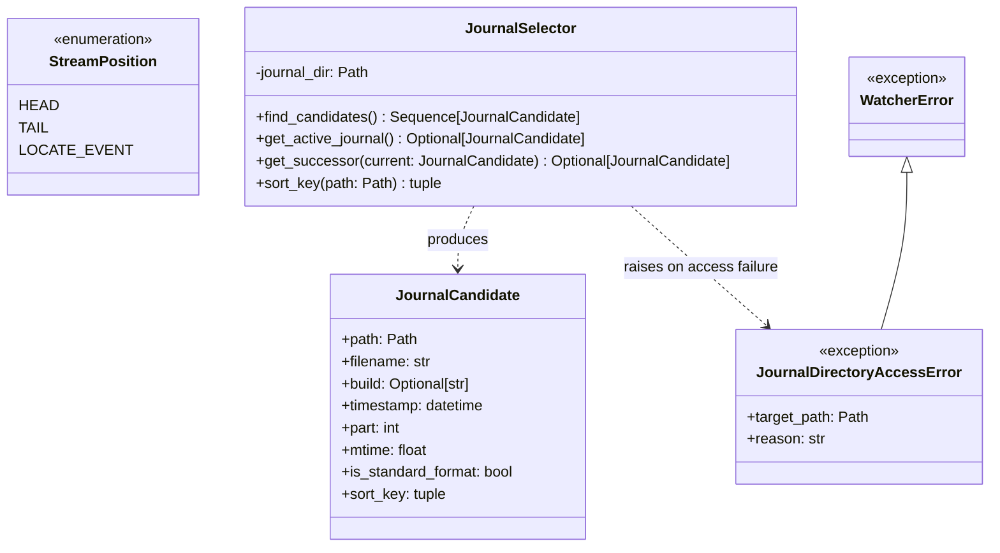
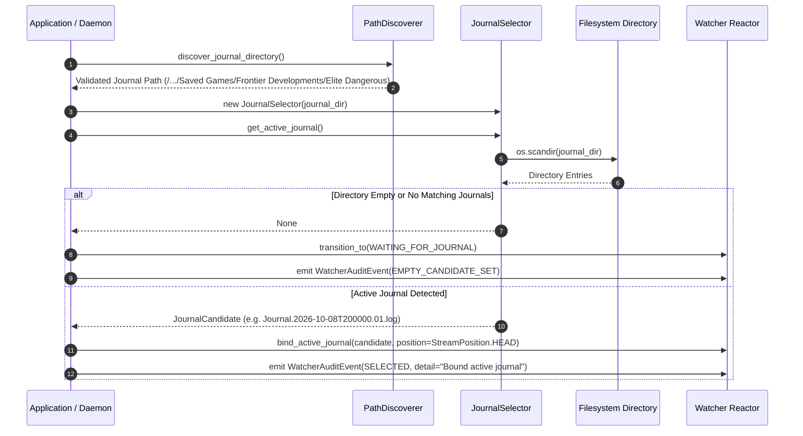
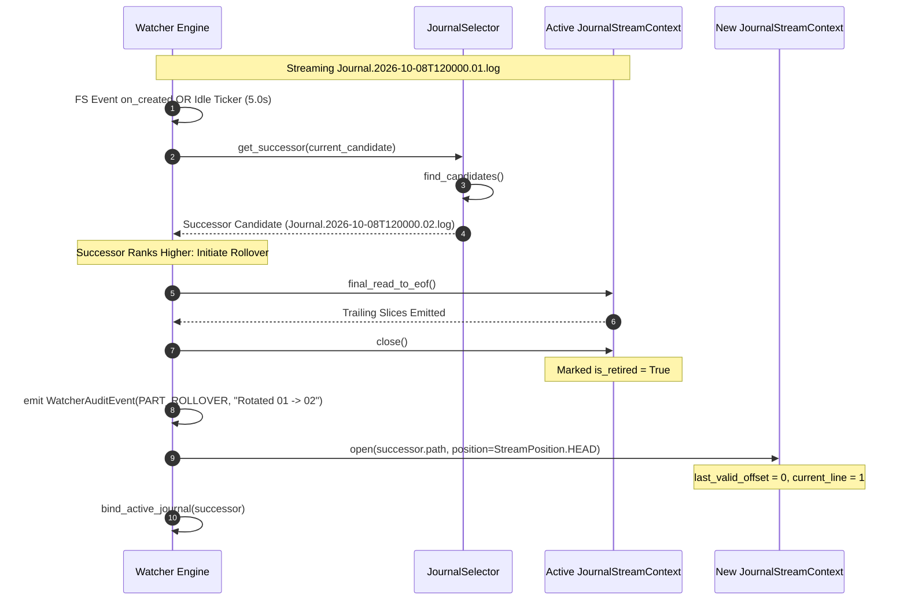

# SDD-004: Active Journal Candidate Selection, Sorting, and Continuous Succession

## 1. Context and Problem Statement

Following the discovery of the Elite Dangerous journal directory by `PathDiscoverer` ([ADR 0004](../adr/0004_os_path_discovery_and_filesystem_research_framework.md)), the `ed_watcher` ingestion engine must identify which journal file (`Journal.*.log`) is currently active and requires streaming.

In Frontier Developments (FDev) *Elite Dangerous*, journal filenames reflect distinct generation eras and operational states:
* **Odyssey Era (Live 4.0 / Update 11+)**: `Journal.YYYY-MM-DDTHHMMSS.NN.log` (15-character ISO-like timestamp).
* **Legacy Era (Horizons 3.8 / Beyond)**: `Journal.YYMMDDHHMMSS.NN.log` (12-digit compact timestamp).
* **Pre-Release Builds**: `JournalAlpha...` and `JournalBeta...` prefixes.
* **Session Rollovers**: Files rolling over into consecutive parts (`.01.log` $\to$ `.02.log`) sharing identical or advancing session timestamps.

Historical community approaches relying on `os.path.getctime` or `os.path.getmtime` fail catastrophically in cross-platform environments:
1. `ctime` divergence: Windows NTFS returns file creation (birth) time, whereas POSIX/Linux returns inode change time (modified by `chmod`, renames, or backup utilities).
2. Archive/cloud restoration: Extracting or syncing historical logs distorts filesystem metadata out of true game chronological order.
3. Rollover collisions: When files rollover across midnight or share identical timestamps, improper part sorting results in stale file tailing.

As mandated by [ADR 0006](../adr/0006_active_journal_candidate_selection_and_sorting.md), this document details the software design, module topology, algorithmic invariants, error semantics, and verification framework for candidate selection, deterministic sorting, and continuous runtime successor ranking.

---

## 2. Architectural Boundaries & Invariants

* **Invariant A (Domain Decoupling & Pure Discovery)**: Candidate selection is an infrastructure and ingestion concern residing strictly within `packages/ed_watcher`. It must not import from `packages/ed_domain` or perform downstream JSON parsing.
* **Invariant B (Deterministic Composite Sort Key)**: Candidate ordering must strictly adhere to the lexicographical composite key $(timestamp_{utc}, part, mtime)$. Filesystem modification time (`mtime`) functions strictly as a tertiary tiebreaker for non-standard test fixtures.
* **Invariant C (Non-Fatal Vacancy Semantics)**: An empty journal candidate set in a valid directory is a normal operational state (e.g. fresh game installation prior to first launch). The selector must yield `None` and signal the waiting state without raising fatal process exceptions.
* **Invariant D (Continuous Succession)**: The selector is not merely an initial boot utility; it functions as an active evaluator (`get_successor`) throughout the daemon lifecycle to detect session changes and multi-part rollovers.

---

## 3. Structural Architecture

The candidate selection subsystem is encapsulated in `packages/ed_watcher.selector`, exposing pure domain-free ranking and filtering capabilities:



### 3.1 Component Specifications

#### `JournalCandidate`
An immutable, comparable value object representing a single evaluated journal file:
* `path`: Absolute filesystem path.
* `filename`: Base name of the file (`Journal.2026-10-08T120000.01.log`).
* `build`: Optional build prefix (`"Alpha"`, `"Beta"`), or `None` for standard production builds.
* `timestamp`: Parsed UTC `datetime` from the filename, or `datetime.min` if non-standard.
* `part`: Extracted 2-digit integer part sequence, or `0` if non-standard.
* `mtime`: Filesystem `st_mtime` floating-point value.
* `is_standard_format`: Boolean indicating whether regex parsing succeeded.
* `sort_key`: Precomputed tuple `(timestamp, part, mtime)` enabling native comparison operators (`<`, `>`, `==`).

#### `JournalSelector`
The stateless coordinator responsible for directory inspection and candidate evaluation:
* `find_candidates()`: Scans the target directory, applies `JOURNAL_FILE_REGEX`, and returns candidates sorted monotonically ascending.
* `get_active_journal()`: Returns the highest-ranking candidate, or `None` if the directory contains no matching files.
* `get_successor(current)`: Evaluates if any available candidate in the directory ranks strictly higher than `current`.

---

## 4. Algorithmic Invariants & Dynamic Behavior

### 4.1 Regex Compilation & Parsing Rules

Canonical filename matching is performed via case-insensitive regular expression:

```python
JOURNAL_FILE_REGEX = re.compile(
    r"^Journal(?P<build>Alpha|Beta)?"
    r"\.(?P<timestamp>\d{4}-\d{2}-\d{2}T\d{6}|\d{12})"
    r"\.(?P<part>\d{2})"
    r"\.log$",
    re.IGNORECASE,
)
```

Timestamp normalization branches across two supported FDev schemas:
1. **ISO Schema (`\d{4}-\d{2}-\d{2}T\d{6}`)**: Parsed via `datetime.strptime(ts_str, "%Y-%m-%dT%H%M%S").replace(tzinfo=timezone.utc)`.
2. **Compact Legacy Schema (`\d{12}`)**: Parsed via `datetime.strptime(ts_str, "%y%m%d%H%M%S").replace(tzinfo=timezone.utc)`.

If regex matching fails or parsing raises `ValueError`, the candidate falls back gracefully:
```python
sort_key = (datetime.min.replace(tzinfo=timezone.utc), 0, path.stat().st_mtime)
```

### 4.2 Dynamic Sequence: Boot-Time Ingestion Initialization



### 4.3 Dynamic Sequence: Continuous Runtime Successor Detection (Part Rollover)



---

## 5. Error Semantics and Abort Boundaries

| Exception | Base | Trigger Condition | Engine Impact | Remediation |
| :--- | :--- | :--- | :--- | :--- |
| `JournalDirectoryAccessError` | `WatcherError` | The injected journal path does not exist, is not a directory, or raises `PermissionError` during `scandir`. | **Fatal Startup Crash**. Engine halts immediately. | Check permissions or supply valid directory path via `ED_JOURNAL_DIR`. |
| `EmptyCandidateSet` (Condition) | N/A | Target directory exists and is readable, but zero files match `JOURNAL_FILE_REGEX`. | **Non-Fatal Waiting Transition**. Yields `None`. | Daemon awaits filesystem `on_created` events or manual game startup. |
| Malformed Filename (Condition) | N/A | File matches regex prefix but timestamp numbers are invalid (e.g. month `99`). | **Silent Degradation**. Ranked via `st_mtime` with `datetime.min`. | File is ordered after all legitimate game logs. |

---

## 6. Implementation Plan & PR Sequencing

The implementation of ADR 0006 / SDD-004 is partitioned into isolated deliverables:

* **PR 1: Selector Module and Exception Definitions** (`packages/ed_watcher/selector.py`, `packages/ed_watcher/exceptions.py`):
  * Declare `StreamPosition` enum.
  * Declare `JournalDirectoryAccessError`.
  * Implement `JournalCandidate` dataclass with precomputed sort keys and comparison operators.
  * Implement `JournalSelector` with regex parsing, fallback handling, and candidate enumeration.
* **PR 2: Test Suite & Cross-Platform Fixture Matrix** (`tests/unit/test_journal_selector.py`):
  * Test matrix: Odyssey ISO format, Legacy compact format, Alpha/Beta prefixes, multi-part rollovers (`01` $\to$ `02`).
  * Test empty candidate directory handling (returns `None`, non-blocking).
  * Test missing/inaccessible directory handling (raises `JournalDirectoryAccessError`).
  * Test non-standard test log fallback sorting via `mtime`.
  * Test `get_successor` transitions.

---

## 7. Vacation Test Checklist

An independent engineer can verify this subsystem by confirming:
1. [ ] `from ed_watcher.selector import JournalSelector, StreamPosition, JournalCandidate` executes without errors.
2. [ ] Passing a directory containing both `Journal.2026-10-08T120000.01.log` and `Journal.2026-10-08T120000.02.log` selects part `02`.
3. [ ] Passing an empty temporary directory returns `None` from `get_active_journal()`.
4. [ ] Passing an unreadable or non-existent path raises `JournalDirectoryAccessError`.
5. [ ] Running `pytest tests/unit/test_journal_selector.py` passes 100% with zero domain dependencies.
