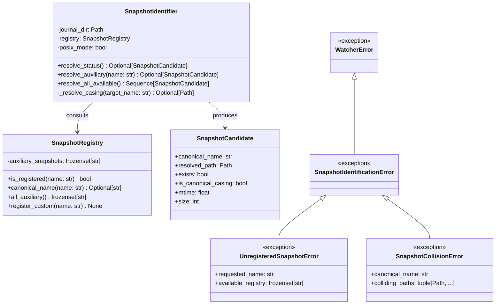
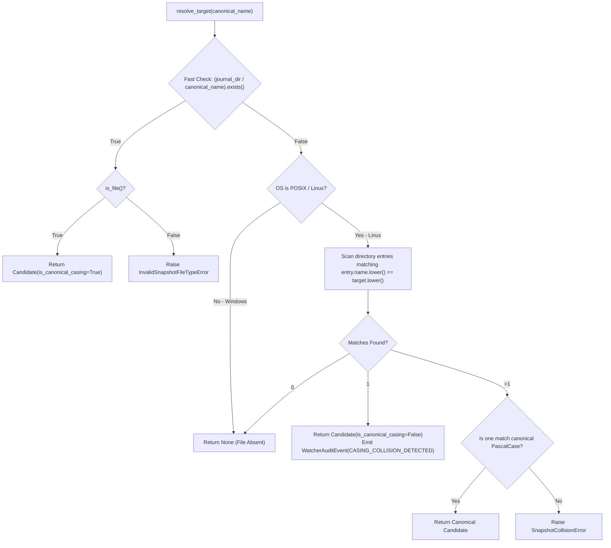
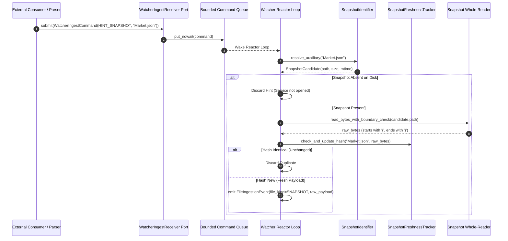

# SDD-005: Status and Snapshot File Identification, Casing Normalization, and Trigger Architecture

## 1. Context and Problem Statement

While journal log files follow dynamic timestamp-based rollover naming patterns ([ADR 0006](../adr/0006_active_journal_candidate_selection_and_sorting.md) / [SDD-004](0004_active_journal_candidate_selection_and_sorting.md)), Frontier Developments (FDev) *Elite Dangerous* also outputs discrete JSON state snapshot files into the same Saved Games directory.

These snapshot files fall into two distinct operational categories:
1. **The Active Cockpit Heartbeat (`Status.json`)**: Emitted autonomously by the game client at ~1.0 Hz and immediately upon cockpit toggle switch changes (landing gear, cargo scoop, lights, pips).
2. **Auxiliary State Snapshots**: Point-in-time state files generated or overwritten strictly upon player menu interaction (`Market.json`, `Cargo.json`, `ShipLocker.json`, `Backpack.json`, `NavRoute.json`, `Outfitting.json`, `Shipyard.json`, `ModulesInfo.json`, `FCMaterials.json`).

These files present critical operational challenges:
* **Cross-Platform Casing Discrepancies**: Windows NTFS is case-insensitive. Linux filesystems (Ext4, Btrfs, ZFS) used under Proton/Wine or native development are strictly case-sensitive. Custom Wine configurations, synthetic test fixtures, or symlinks may introduce lowercase or mixed-case filenames (`status.json` vs. `Status.json`).
* **Presence Variance & Graceful Inactivity**: Auxiliary snapshots do not exist until the player opens the corresponding station service (e.g. `Outfitting.json` is missing until Outfitting is visited). Candidate lookup must not treat the absence of unvisited service snapshots as an error.
* **Unidirectional Telemetry Egress Contract**: Snapshot files are strictly write-only egress telemetry dumps written by the game client. The game never reads them back from disk. Modifying or replacing these files will not alter in-game state. `ed_watcher` operates strictly as a read-only consumer.
* **I/O Chatter Elimination**: Blindly polling 9 snapshot files on every clock tick wastes disk I/O and CPU cycles. We require a multi-tier trigger hierarchy.

As decided in [ADR 0007](../adr/0007_status_and_snapshot_file_identification.md), this document details the software design, module topology, casing normalization algorithms, error semantics, and verification framework for status and snapshot identification.

---

## 2. Architectural Boundaries & Invariants

* **Invariant A (Domain Decoupling & Pure Identification)**: Snapshot identification is an infrastructure concern residing strictly within `packages/ed_watcher.snapshots`. It must not import domain logic from `packages/ed_domain` or perform JSON decoding.
* **Invariant B (Frozen Canonical Registry)**: The supported set of FDev telemetry files is bounded to the 9 verified canonical names, with explicit runtime extension support for testing or future expansions. Arbitrary `.json` directory globbing is strictly prohibited.
* **Invariant C (Canonical PascalCase Priority)**: When resolving snapshot files on case-sensitive POSIX systems where casing collisions exist (e.g. both `Status.json` and `status.json` present), the canonical PascalCase target is unconditionally prioritized.
* **Invariant D (Graceful Absence Tolerance)**: Missing auxiliary snapshot files represent un-instantiated game features, returning `None` without raising exceptions or logging errors.
* **Invariant E (Injected Directory Dependency)**: Snapshot identifiers do not perform autonomous path discovery; they receive the canonical `journal_dir: Path` resolved by `PathDiscoverer`.

---

## 3. Structural Component Architecture

The snapshot identification subsystem resides in `packages/ed_watcher.snapshots`:



### 3.1 Component Specifications

#### `SnapshotRegistry`
Immutable baseline catalog governing recognized FDev snapshot filenames:
* **Canonical Status File**: `"Status.json"`
* **Canonical Auxiliary Snapshots**:
  ```python
  CANONICAL_AUXILIARY_SNAPSHOTS = frozenset(
      {
          "Market.json",
          "Outfitting.json",
          "Shipyard.json",
          "ModulesInfo.json",
          "Cargo.json",
          "Backpack.json",
          "NavRoute.json",
          "ShipLocker.json",
          "FCMaterials.json",
      }
  )
  ```
* Provides `canonical_name(query: str) -> str | None` doing case-insensitive lookup against the registry.
* Supports `register_custom(name: str)` for experimental test fixtures or future expansions.

#### `SnapshotCandidate`
Immutable value object describing a resolved snapshot file on disk:
* `canonical_name`: The canonical PascalCase registry name (`"Status.json"`).
* `resolved_path`: The physical filesystem path on disk.
* `exists`: Boolean indicating whether the file physically exists.
* `is_canonical_casing`: Boolean indicating if the physical file matches canonical PascalCase (`True`) or required case-folding normalization on POSIX (`False`).
* `mtime`: Filesystem `st_mtime`.
* `size`: Current byte size (`st_size`).

#### `SnapshotIdentifier`
The resolver coordinating filesystem inspection:
* `resolve_status()`: Resolves `Status.json` candidate using casing normalization.
* `resolve_auxiliary(name)`: Resolves a specific registered auxiliary file. Raises `UnregisteredSnapshotError` if the name is not in the registry.
* `resolve_all_available()`: Inspects the directory and returns candidates for all currently instantiated registered snapshots.

---

## 4. Algorithmic Invariants & Dynamic Behavior

### 4.1 Cross-Platform Casing Normalization Algorithm

To guarantee identical behavior across Windows NTFS and Linux POSIX filesystems without incurring unnecessary directory scan overhead:



### 4.2 Multi-Tier Ingestion & Gating Hierarchy

To eliminate blind polling and I/O chatter while guaranteeing sub-second response times, snapshot lookups operate across three distinct tiers:

| Tier | Mechanism | Target Category | Frequency / Latency | Action / Flow |
| :--- | :--- | :--- | :--- | :--- |
| **Tier 1** | **Inbound Target Hint Port (`WatcherIngestReceiver`)** | Specific Auxiliary Snapshots (e.g. `Market.json`, `NavRoute.json`) | Event-driven (< 20ms debounce) | Downstream event parser emits `WatcherIngestCommand(action=HINT_SNAPSHOT, target_name="Market.json")`. The reactor wakes immediately and invokes `resolve_auxiliary("Market.json")`. Zero JSON parsing in watcher. |
| **Tier 2** | **OS Filesystem Events (`watchdog`)** | Any registered snapshot | Near-real-time (< 50ms) | OS `on_created` or `on_modified` matching `SnapshotRegistry` triggers target resolution and debounced read. |
| **Tier 3** | **Reactor Fallback Ticker** | `Status.json` (continuous) + Auxiliary Registry (sweep) | Periodic: 1.0s on Windows, 0.5s on Linux | Evaluates `Status.json` for 1.0 Hz cockpit changes; scans auxiliary files to catch dropped OS notifications. |

---

## 5. Dynamic Sequence: Inbound Hinted Snapshot Resolution (Tier 1)



---

## 6. Error Semantics & Exception Hierarchy

```text
WatcherError (packages/ed_watcher.exceptions)
└── SnapshotIdentificationError
    ├── SnapshotDirectoryAccessError
    │   ├── target_path: Path
    │   └── reason: str ("does_not_exist" | "not_a_directory" | "permission_denied")
    ├── UnregisteredSnapshotError
    │   ├── requested_name: str
    │   └── available_registry: frozenset[str]
    ├── SnapshotCollisionError
    │   ├── canonical_name: str
    │   └── colliding_paths: tuple[Path, ...]
    └── InvalidSnapshotFileTypeError
        ├── target_path: Path
        └── actual_type: str ("directory" | "fifo" | "socket")
```

---

## 7. Implementation Plan & PR Sequencing

* **PR 1: Snapshot Registry, Models, and Identifier** (`packages/ed_watcher/snapshots/`):
  * Implement `SnapshotRegistry` with baseline canonical FDev catalog.
  * Implement `SnapshotCandidate` dataclass.
  * Implement `SnapshotIdentifier` with fast-path and POSIX case-folding fallback.
  * Define snapshot exception hierarchy in `packages/ed_watcher/exceptions.py`.
* **PR 2: Unit Testing & POSIX/NT Simulation Matrix** (`tests/unit/test_snapshot_identifier.py`):
  * Test canonical PascalCase fast-path resolution.
  * Test graceful absence (`None`) for unvisited station service files.
  * Test POSIX case-folding normalization (`market.json` $\to$ `Market.json`).
  * Test casing collision resolution (canonical priority vs. ambiguous collision exception).
  * Test `UnregisteredSnapshotError` on arbitrary filenames.
  * Test Wine NT simulation execution via `scripts/run_wine_tests.sh`.
* **PR 3: Reference Documentation** (`docs/reference/watcher_snapshot_identifier.md`):
  * Author public API reference manual.

---

## 8. Vacation Test Checklist

An independent engineer can verify this subsystem by confirming:
1. [ ] `from ed_watcher.snapshots import SnapshotIdentifier, SnapshotRegistry, SnapshotCandidate` imports cleanly.
2. [ ] In an empty directory, `resolve_status()` and `resolve_auxiliary("Market.json")` return `None` without errors.
3. [ ] Requesting `resolve_auxiliary("InvalidFile.json")` raises `UnregisteredSnapshotError`.
4. [ ] In a directory containing `market.json` on Linux, `resolve_auxiliary("Market.json")` returns the candidate with `is_canonical_casing=False`.
5. [ ] Running `pytest tests/unit/test_snapshot_identifier.py` passes 100% with zero domain dependencies.
