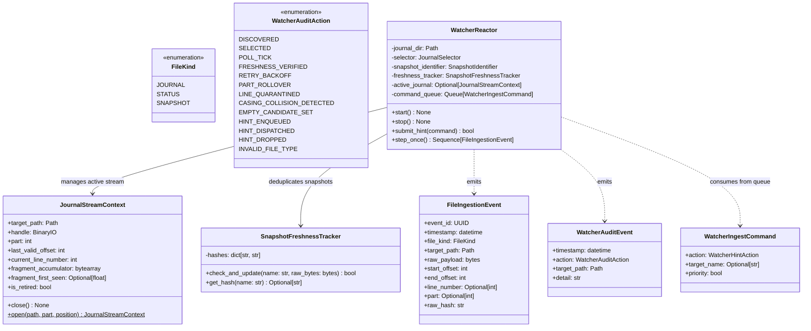
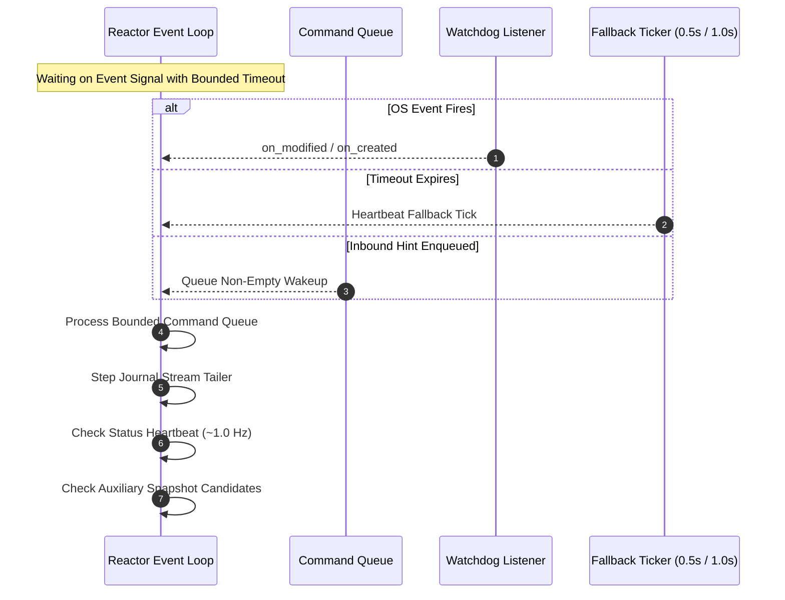

# SDD-006: Unified File Ingestion Engine, Reactive Reactor, and Freshness Auditing

## 1. Context and Problem Statement

Following candidate discovery and sorting for journals ([ADR 0006](../adr/0006_active_journal_candidate_selection_and_sorting.md) / [SDD-004](0004_active_journal_candidate_selection_and_sorting.md)) and status/snapshot identification ([ADR 0007](../adr/0007_status_and_snapshot_file_identification.md) / [SDD-005](0005_status_and_snapshot_file_identification.md)), `ed_watcher` requires a unified runtime execution engine to manage physical file descriptors, stream delta bytes, evaluate content freshness, debounce burst writes, handle part rollovers, and emit clean event envelopes.

In *Elite Dangerous*, target files exhibit distinct physical I/O behaviors:
1. **Journal Files (`Journal.*.log`)**: Growing, append-only line-delimited streams with multi-part rollovers (`.01.log` $\to$ `.02.log`).
2. **Snapshot Files (`Status.json`, `Market.json`, etc.)**: Overwrite-in-place state files rewritten periodically or upon UI interaction.

These characteristics present severe operational challenges:
* **Truncation Race Conditions**: FDev rewrites snapshot files by truncating to 0 bytes before writing new JSON, causing external tools to read empty or half-written payloads.
* **Proton / Wine Inotify Event Loss**: Linux kernel `inotify` events are frequently dropped across Steam Proton / Wine translation layers, stalling pure event-driven tailers.
* **Partial Line Flushes**: Tailers reading an appending journal stream at EOF may read half a line if the game engine has not yet flushed the trailing newline (`\n`).
* **Moving Target Seek Hazards**: Using relative seek arithmetic from EOF (`seek(-diff, SEEK_END)`) skips lines when concurrent game flushes occur.
* **Separation of Concerns (The Cardinal Boundary)**: The I/O engine must extract raw byte slices without performing domain JSON deserialization or business schema validation.

As decided in [ADR 0008](../adr/0008_file_ingestion_io_freshness_and_concurrency.md), this document details the software design, module topology, state machines, dual event envelopes, command queues, and verification framework for the Unified File Ingestion Engine and Reactive Reactor.

---

## 2. Architectural Boundaries & Invariants

* **Invariant A (Pure Byte Ingestion / Scope Boundary)**: The engine extracts raw byte slices. It never parses JSON fields (`flags`, `pips`, `fuel`, `StarSystem`). All domain model transformation is strictly deferred to downstream consumers.
* **Invariant B (Monotonic Forward Seek Invariant)**: Journal streaming must seek strictly using absolute forward offsets (`handle.seek(last_valid_offset, os.SEEK_SET)`). Relative seek arithmetic using `SEEK_END` is strictly prohibited.
* **Invariant C (Fragment Accumulator & Quarantine Circuit Breaker)**: Uncompleted journal line fragments lacking trailing `\n` are held in an in-memory accumulator. If a fragment remains uncompleted for $\ge 5.0$ seconds or exceeds $5\text{ MB}$, the circuit breaker trips, emits `LINE_QUARANTINED`, and skips to current EOF.
* **Invariant D (The Succession Invariant)**: While daemon initial boot uses the configured `StreamPosition` (`HEAD`, `TAIL`, `LOCATE_EVENT`), all successor journal files spawned mid-session (`02.log`, `03.log`) **must unconditionally initialize at `StreamPosition.HEAD` (byte 0)**.
* **Invariant E (Atomic Snapshot Reading with Structural Boundary Check)**: Snapshot reads require `len(raw) > 0` and must start with `b'{'` and end with `b'}'`. Partial writes retry with exponential backoff (20ms, 40ms, 80ms).
* **Invariant F (64-Bit BLAKE2b Freshness Gate)**: All snapshot reads pass through `SnapshotFreshnessTracker`. Identical content hashes are discarded silently without downstream emission.
* **Invariant G (Dual Plane Separation)**: Data Plane events (`FileIngestionEvent`) and Control Plane telemetry (`WatcherAuditEvent`) are completely decoupled into discrete envelope contracts.

---

## 3. Structural Component Architecture

The ingestion and reactor subsystem is organized within `packages/ed_watcher.engine`:



---

## 4. Algorithmic Invariants & Execution Workflows

### 4.1 Hybrid Reactive Reactor Loop

To guarantee sub-50ms event latency while remaining immune to dropped kernel filesystem notifications under Proton/Wine:
1. **Primary Wakeup**: OS filesystem notifications (`watchdog` listener on `on_created` and `on_modified`).
2. **Fallback Heartbeat Ticker**: Periodic timeout wait (1.0s on Windows, 0.5s on Wine/Linux).
3. **Inbound Hint Wakeup**: Agnostic command submitted via `WatcherIngestReceiver.submit_hint()`.



### 4.2 Journal Streaming & Line Fragment Invariant

When reading an active journal file:
1. Read up to 64 KB using `handle.read(64 * 1024)`.
2. Append read bytes to `fragment_accumulator`.
3. Check for newline bytes (`b'\n'`):
   - **Newlines Present**: Split at `b'\n'`. Emit a `FileIngestionEvent` for every complete line. Advance `last_valid_offset` by byte length of completed lines and increment `current_line_number`. Retain trailing fragment (if any) in accumulator.
   - **No Newline Present**: Uncompleted line fragment. Rewind handle via `handle.seek(last_valid_offset, os.SEEK_SET)`.
4. **Quarantine Circuit Breaker**:
   - If fragment remains uncompleted for $\ge 5.0$ seconds OR accumulator $> 5\text{ MB}$:
   - Trip breaker: emit `WatcherAuditEvent(action=LINE_QUARANTINED)`.
   - Clear accumulator and advance `last_valid_offset` past quarantined bytes to current EOF.

### 4.3 Snapshot Whole-Read & 20ms Debounce Protocol

When a snapshot file (`Status.json` or auxiliary file) is triggered:
1. Apply **20ms Debounce Window** to coalesce rapid successive disk writes.
2. Read full bytes via `path.read_bytes().strip()`.
3. **Structural Boundary Guard**:
   - Verify `len(raw) > 0` and `raw.startswith(b'{')` and `raw.endswith(b'}')`.
   - If incomplete (mid-truncation race), retry with exponential backoff (20ms, 40ms, 80ms; up to 3 attempts).
   - If all retries fail, discard read, emit `WatcherAuditEvent(action=RETRY_BACKOFF)`, and await next tick.
4. **BLAKE2b Freshness Gate**:
   - Calculate 64-bit BLAKE2b hash: `blake2b(raw, digest_size=8).hexdigest()`.
   - Compare with `SnapshotFreshnessTracker.get_hash(name)`.
   - If identical, discard duplicate without emitting event.
   - If changed, record new hash and emit `FileIngestionEvent(file_kind=STATUS | SNAPSHOT, raw_payload=raw)`.

---

## 5. Event Envelopes Specification

### 5.1 Data Plane: `FileIngestionEvent`

```python
class FileKind(StrEnum):
    JOURNAL = "journal"
    STATUS = "status"
    SNAPSHOT = "snapshot"


@dataclass(frozen=True)
class FileIngestionEvent:
    event_id: UUID
    timestamp: datetime  # UTC ISO 8601
    file_kind: FileKind
    target_path: Path
    raw_payload: bytes
    start_offset: int
    end_offset: int
    line_number: int | None  # 1-indexed for journals; None for whole snapshots
    part: int | None  # Integer part sequence for journals; None for snapshots
    raw_hash: str  # 64-bit BLAKE2b digest string
```

### 5.2 Control & Observability Plane: `WatcherAuditEvent`

```python
@dataclass(frozen=True)
class WatcherAuditEvent:
    timestamp: datetime
    action: WatcherAuditAction
    target_path: Path
    detail: str = ""
```

---

## 6. Inbound Control Port: `WatcherIngestReceiver`

Exposes a decoupled interface allowing downstream consumers to submit agnostic operational hints:

```python
class WatcherHintAction(StrEnum):
    HINT_SNAPSHOT = "hint_snapshot"
    HINT_ROLLOVER = "hint_rollover"
    HINT_DIRECTORY_SCAN = "hint_scan"


@dataclass(frozen=True)
class WatcherIngestCommand:
    action: WatcherHintAction
    target_name: str | None = None
    priority: bool = False


@dataclass(frozen=True)
class ReactorQueueMetrics:
    current_depth: int
    capacity: int
    high_water_mark: int
    total_enqueued: int
    total_processed: int
    total_dropped: int


class WatcherIngestReceiver(Protocol):
    def submit_hint(self, command: WatcherIngestCommand) -> bool: ...
    def get_queue_metrics(self) -> ReactorQueueMetrics: ...
```

---

## 7. Implementation Plan & PR Sequencing

* **PR 1: Core Envelopes, Models, and Trackers** (`packages/ed_watcher/engine/`):
  * Define `FileKind`, `FileIngestionEvent`, `WatcherAuditAction`, `WatcherAuditEvent`.
  * Define `WatcherHintAction`, `WatcherIngestCommand`, `ReactorQueueMetrics`, `WatcherIngestReceiver`.
  * Implement `SnapshotFreshnessTracker` with 64-bit BLAKE2b deduplication.
  * Implement `JournalStreamContext` with per-file lifecycle and `StreamPosition` initialization.
* **PR 2: Journal Stream Tailer & Fragment Circuit Breaker** (`packages/ed_watcher/engine/tailer.py`):
  * Implement monotonic forward seek reading with 64 KB buffer.
  * Implement newline verification and line numbering.
  * Implement Fragment Accumulator with 5.0s stagnant timeout and 5 MB ceiling circuit breaker.
* **PR 3: Snapshot Whole-Reader & Concurrency Retries** (`packages/ed_watcher/engine/snapshot_reader.py`):
  * Implement atomic read with structural `{ ... }` boundary guard.
  * Implement 20ms debounce and exponential backoff retry runner.
* **PR 4: Reactive Reactor Driver & Verification Suite** (`packages/ed_watcher/engine/reactor.py`, `tests/`):
  * Implement `WatcherReactor` unifying watchdog listeners, fallback ticker, command queue, and candidate selectors.
  * Full unit tests covering burst writes, truncation retries, part rollovers, and dropped event recoveries.
  * Verification under Linux and Wine Windows NT simulant.
* **PR 5: Reference Documentation** (`docs/reference/watcher_engine.md`).

---

## 8. Vacation Test Checklist

An independent engineer can verify this subsystem by confirming:
1. [ ] Tailing a mock journal growing in 64 KB bursts emits complete `FileIngestionEvent` lines monotonically without missing or duplicated lines.
2. [ ] Appending an incomplete line without trailing `\n` holds the fragment in memory; appending `\n` flushes the complete line.
3. [ ] Leaving an incomplete line stagnant for $\ge 5.0$ seconds trips the circuit breaker, emits `LINE_QUARANTINED`, and resumes tailing.
4. [ ] Overwriting `Status.json` with identical contents emits zero duplicate events.
5. [ ] Overwriting `Status.json` with 0 bytes triggers exponential backoff retry rather than raising an unhandled exception.
6. [ ] Spawning a successor `.02.log` automatically retires the old handle and begins reading from byte 0.
