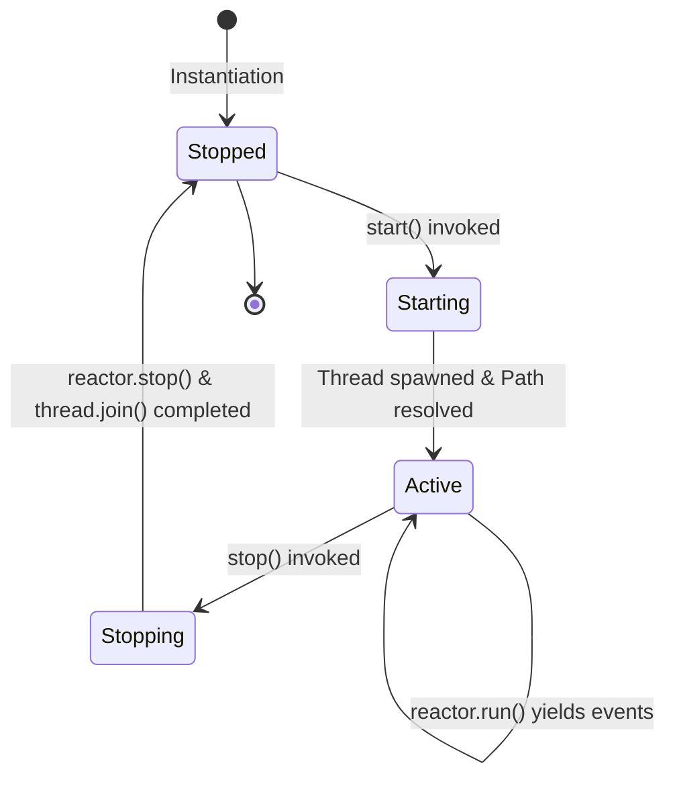

# SDD-007: Watcher Port Adapter and Threaded Lifecycle Management

## 1. Context and Problem Statement

Following the completion of the core ingestion and reactor subsystems ([ADR 0008](../adr/0008_file_ingestion_io_freshness_and_concurrency.md), [SDD-006](0006_file_ingestion_io_and_reactive_reactor.md)):
- `PathDiscoverer` resolves OS-specific journal directories.
- `JournalSelector` deterministically ranks active log streams and handles part rollover.
- `SnapshotIdentifier` normalizes case discrepancies across Windows NTFS and Linux/Proton.
- `WatcherReactor` manages zero-byte truncation retries, non-blocking byte tailing, and emits raw event envelopes (`FileIngestionEvent`, `WatcherAuditEvent`).

However, `WatcherReactor.run()` is an infinite, synchronous generator loop. In the outer package boundary:
1. `packages/ed_watcher/watcher.py` contains only a stub `JournalWatcher` class with a boolean flag (`self._active = True`) from the walking skeleton ([ADR 0003](../adr/0003_minimal_walking_skeleton_and_bootstrap_contract.md)).
2. The class name `JournalWatcher` is a naming misnomer, as it implies it only watches `.log` files, omitting the 1Hz cockpit heartbeat (`Status.json`) and auxiliary station snapshots.
3. The port contract in `packages/ed_domain/ports/watcher.py` lacks method signatures for registering event callbacks or propagating errors outward without violating Domain I/O Purity (Invariant A).

This Software Design Document formalizes the implementation of **[ADR 0009](../adr/0009_watcher_port_adapter_and_threaded_lifecycle.md)**: specifying the abstract `WatcherPort` protocol in `ed_domain` and the production-grade `FileSystemWatcher` driving adapter in `ed_watcher`.

---

## 2. Architectural Boundaries & Component Interaction

```mermaid
flowchart TD
    subgraph Host Process / Entry Points
        CLI["CLI / Daemon Entry Point"]
        Boot["ed_app.bootstrap.build_engine()"]
    end

    subgraph Application & Domain Plane (ed_domain)
        Engine["TelemetryEngine"]
        Port["WatcherPort (Protocol)"]
    end

    subgraph Infrastructure / Driving Adapter Plane (ed_watcher)
        Adapter["FileSystemWatcher"]
        Worker["Background Worker Thread"]
        subgraph Internal Engine
            Discoverer["PathDiscoverer"]
            Selector["JournalSelector"]
            Snapshots["SnapshotIdentifier"]
            Reactor["WatcherReactor"]
        end
    end

    CLI --> Boot
    Boot -->|Instantiates| Adapter
    Boot -->|Injects into| Engine
    Engine -->|Calls start/stop| Port
    Adapter -.->|Implements| Port
    Adapter -->|Spawns| Worker
    Worker -->|Runs generator| Reactor
    Reactor --> Selector
    Reactor --> Snapshots
    Reactor --> Discoverer
    Worker -->|Dispatches callbacks| Engine
```

### Invariant Preservation
* **Invariant A (Domain I/O Purity):** `WatcherPort` defines purely abstract callbacks (`IngestionEventHandler`, `AuditEventHandler`). It has zero imports from `pathlib`, `os`, `threading`, or `watchdog`.
* **Invariant B (SDK Runtime Isolation):** The watcher adapter operates strictly behind domain ports and communicates solely via immutable dataclass envelopes.

---

## 3. Detailed Component Specifications

### 3.1 Port Protocol Specification (`packages/ed_domain/ports/watcher.py`)

The abstract port protocol establishes the lifecycle and subscription contract:

```python
"""Abstract ports for inbound telemetry watchers."""

from typing import Any, Callable, Protocol, runtime_checkable

# Type aliases for event handlers
# Handlers accept unparsed event envelopes or domain payloads
IngestionEventHandler = Callable[[Any], None]
AuditEventHandler = Callable[[Any], None]


@runtime_checkable
class WatcherPort(Protocol):
    """Abstract contract for inbound telemetry driving adapters."""

    def register_event_handler(self, handler: IngestionEventHandler) -> None:
        """Register a callback for raw file ingestion events."""
        ...

    def register_audit_handler(self, handler: AuditEventHandler) -> None:
        """Register a callback for watcher operational audit events."""
        ...

    def start(self) -> None:
        """Start listening or polling for telemetry events asynchronously."""
        ...

    def stop(self) -> None:
        """Stop listening or polling and wait for background workers to exit."""
        ...

    @property
    def is_active(self) -> bool:
        """Return True if watcher is actively listening."""
        ...
```

---

### 3.2 Concrete Adapter Architecture (`packages/ed_watcher/watcher.py`)

The production adapter class is named `FileSystemWatcher`. It encapsulates thread synchronization, dependency assembly, and exception shielding.

#### Class Signature & Constructor

```python
class FileSystemWatcher(WatcherPort):
    """Concrete driving adapter monitoring journals and snapshots from the filesystem."""

    def __init__(
        self,
        journal_dir: Path | None = None,
        snapshot_registry: SnapshotRegistry | None = None,
        stream_position: StreamPosition = StreamPosition.LATEST,
        poll_interval: float | None = None,
        on_event: IngestionEventHandler | None = None,
        on_audit: AuditEventHandler | None = None,
        join_timeout: float = 5.0,
    ) -> None: ...
```

#### Constructor Parameters

| Parameter | Type | Default | Description |
| :--- | :--- | :--- | :--- |
| `journal_dir` | `Optional[Path]` | `None` | Explicit path override. If omitted, uses `PathDiscoverer().discover_journal_directory()`. |
| `snapshot_registry` | `Optional[SnapshotRegistry]` | `None` | Custom snapshot definitions. If omitted, uses standard `SnapshotRegistry()`. |
| `stream_position` | `StreamPosition` | `StreamPosition.LATEST` | Initial seek position (`LATEST` for live tailing, `HEAD` for historical replay). |
| `poll_interval` | `Optional[float]` | `None` | Fallback ticker interval (defaults to 1.0s on Windows, 0.5s on Wine/Linux). |
| `on_event` | `Optional[IngestionEventHandler]` | `None` | Initial callback registered for `FileIngestionEvent`. |
| `on_audit` | `Optional[AuditEventHandler]` | `None` | Initial callback registered for `WatcherAuditEvent`. |
| `join_timeout` | `float` | `5.0` | Maximum seconds to wait when joining the background thread during `stop()`. |

---

## 4. Thread Lifecycle and State Management

### 4.1 State Machine



### 4.2 Startup Sequence (`start()`)
1. **Idempotency Guard:** If `self.is_active` is `True`, `start()` immediately returns without side effects.
2. **Path Resolution:** If `self._journal_dir` is `None`, executes `PathDiscoverer().discover_journal_directory()` and caches the resolved path.
3. **Subsystem Assembly:**
   - Instantiates `JournalSelector(self._journal_dir)`.
   - Instantiates `SnapshotIdentifier(self._journal_dir, registry=self._snapshot_registry)`.
   - Instantiates `WatcherReactor(journal_dir=self._journal_dir, selector=..., snapshot_identifier=..., stream_position=self._stream_position, poll_interval=self._poll_interval)`.
4. **Thread Launch:**
   - Spawns daemon thread: `threading.Thread(target=self._run_loop, name="ed-watcher-reactor", daemon=True)`.
   - Sets `self._is_active = True`.
   - Starts thread execution.

### 4.3 Worker Loop (`_run_loop()`)
1. Iterates over `for item in self._reactor.run(): ...`.
2. Inspects `item` type:
   - If `isinstance(item, FileIngestionEvent)`: iterates over registered `_event_handlers` and dispatches `handler(item)`.
   - If `isinstance(item, WatcherAuditEvent)`: iterates over registered `_audit_handlers` and dispatches `handler(item)`.
3. **Exception Shielding:**
   - Each handler invocation is wrapped in a `try...except Exception as exc:` block.
   - Exceptions inside external consumer handlers are logged or dispatched to audit handlers (`WatcherAuditAction.READ_ERROR`) without breaking the reactor loop.

### 4.4 Shutdown Sequence (`stop()`)
1. **Idempotency Guard:** If `self.is_active` is `False`, returns immediately.
2. **Reactor Signal:** Invokes `self._reactor.stop()` (which sets the receiver stop flag and wakes the ticker).
3. **Thread Join:** Invokes `self._thread.join(timeout=self._join_timeout)`.
4. **Resource Reset:**
   - If thread is still alive after timeout, logs an audit warning.
   - Sets `self._is_active = False`.
   - Clears thread and reactor references.

---

## 5. Composition Root Integration (`packages/ed_app/bootstrap.py`)

`ed_app.bootstrap.build_engine()` updates from the legacy stub to instantiate `FileSystemWatcher`:

```python
"""Composition Root: Assembles dependencies into a runnable TelemetryEngine."""

from ed_app.engine import TelemetryEngine
from ed_egress.transmitter import NullTransmitter
from ed_watcher.watcher import FileSystemWatcher


def build_engine() -> TelemetryEngine:
    """Instantiate concrete adapters and inject into the core domain engine.

    Guaranteed side-effect-free: does not bind network sockets,
    create files, or launch background threads during construction.
    """
    watcher = FileSystemWatcher()
    egress_adapters = [NullTransmitter()]
    return TelemetryEngine(watcher=watcher, egress_ports=egress_adapters)
```

---

## 6. Verification and Test Strategy

### 6.1 Unit Tests (`tests/unit/test_watcher_adapter.py`)
1. **Contract Conformance:** Verify `isinstance(FileSystemWatcher(), WatcherPort)` succeeds.
2. **Registration:** Verify multiple callbacks can be attached via `register_event_handler` and `register_audit_handler`.
3. **Lifecycle Start / Stop:** Verify background thread starts, reports `is_active == True`, and stops cleanly when `stop()` is called within `< 1.0s`.
4. **Event Dispatch:** Using a temporary journal directory with mock log entries, verify `FileIngestionEvent` items arrive at registered callbacks on the background thread.
5. **Exception Isolation:** Verify an erroring consumer callback does not terminate the reactor loop.

### 6.2 Wine Cross-Platform Verification (`scripts/run_wine_tests.sh`)
* Add `tests/unit/test_watcher_adapter.py` to the Wine test runner script to ensure Windows thread joining and ctypes path resolution behave identically under Wine Python 3.11.

---

## 7. Implementation Plan

| Step | Target File | Action |
| :---: | :--- | :--- |
| **1** | `packages/ed_domain/ports/watcher.py` | Add `register_event_handler`, `register_audit_handler`, and handler type aliases. |
| **2** | `packages/ed_watcher/watcher.py` | Replace stub `JournalWatcher` with complete, thread-managed `FileSystemWatcher`. |
| **3** | `packages/ed_app/bootstrap.py` | Update `build_engine` to instantiate `FileSystemWatcher`. |
| **4** | `tests/unit/test_watcher_adapter.py` | Author comprehensive unit and thread lifecycle tests. |
| **5** | `scripts/run_wine_tests.sh` | Add test file to Wine cross-platform verification runbook. |
| **6** | `docs/reference/watcher_filesystem_adapter.md` | Author Diátaxis Reference manual for `FileSystemWatcher`. |
