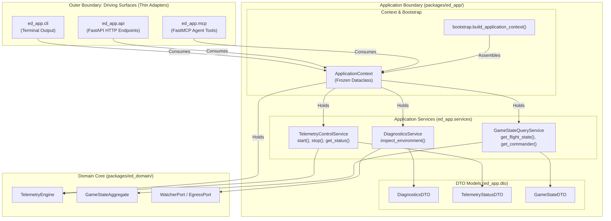

# SDD-008: Application Service Layer, DTO Boundary Contracts, and Multi-Modal Orchestration

## 1. Context and Problem Statement

Following the completion of the `ed_watcher` driving adapter ([ADR 0009](../adr/0009_watcher_port_adapter_and_threaded_lifecycle.md), [SDD-007](0007_watcher_port_adapter_and_threaded_lifecycle.md)), `ed-telemetry` requires an orchestration layer to expose capabilities across its co-equal front doors (CLI, REST API, MCP server).

Governed by **[ADR 0010](../adr/0010_application_service_layer_and_boundary_contracts.md)**, we must prevent logic duplication and architectural erosion:
1. Driving surfaces (`ed_app.cli`, `ed_app.api`, `ed_app.mcp`) must remain ultra-thin protocol translators.
2. An intermediate **Application Service Layer** (`ed_app.services`) must encapsulate all application use-case coordination, returning protocol-neutral Data Transfer Objects (`ed_app.dto`).
3. An immutable **`ApplicationContext`** (`ed_app.context`) assembled by `ed_app.bootstrap.build_application_context()` must provide a single typed dependency root.
4. Boundaries must be machine-enforced by `import-linter` (Invariants C, D, E, F, G) to guarantee concrete infrastructure adapters (`ed_watcher`, `ed_egress`) are never touched outside `bootstrap.py`.

This Software Design Document formalizes the structural taxonomy, class contracts, DTO schemas, and CI linter configurations for the Application Service Layer.

---

## 2. Architectural Boundaries & Component Interaction



---

## 3. Structural Taxonomy & Submodule Organization

The `packages/ed_app/` package is structured into dedicated, decoupled modules:

```text
packages/ed_app/
├── __init__.py
├── context.py              # ApplicationContext immutable dataclass
├── bootstrap.py            # Composition Root factory (build_application_context)
├── exceptions.py           # ApplicationServiceError hierarchy
├── dto/                    # Pure, serializable Data Transfer Objects
│   ├── __init__.py
│   ├── diagnostics.py      # DiagnosticsDTO, CandidateLocationDTO
│   ├── control.py          # TelemetryStatusDTO, IngestionMetricsDTO
│   └── state.py            # GameStateDTO, CommanderStateDTO
├── services/               # Protocol-agnostic use-case orchestrators
│   ├── __init__.py
│   ├── base.py             # BaseApplicationService
│   ├── diagnostics.py      # DiagnosticsService
│   ├── control.py          # TelemetryControlService
│   └── query.py            # GameStateQueryService
└── cli/                    # Ultra-thin CLI driving surface
    ├── __init__.py
    └── main.py
```

---

## 4. Component & Class Specifications

### 4.1 Application Context (`packages/ed_app/context.py`)

```python
from dataclasses import dataclass
from ed_app.services.control import TelemetryControlService
from ed_app.services.diagnostics import DiagnosticsService
from ed_app.services.query import GameStateQueryService
from ed_domain.engine import TelemetryEngine


@dataclass(frozen=True)
class ApplicationContext:
    """Immutable bundle of initialized application services and engine handles.

    Provides driving surfaces (CLI, REST, MCP) with a single, strongly-typed
    entry point to all application-layer capabilities without global state.
    """

    telemetry_control: TelemetryControlService
    diagnostics: DiagnosticsService
    game_state: GameStateQueryService
    engine: TelemetryEngine
```

---

### 4.2 Data Transfer Objects (`packages/ed_app/dto/`)

DTOs decouple internal domain aggregates from driving surfaces. DTOs are strictly immutable dataclasses containing standard library primitives:

#### Diagnostics DTO (`packages/ed_app/dto/diagnostics.py`)
```python
from dataclasses import dataclass
from datetime import datetime


@dataclass(frozen=True)
class CandidateLocationDTO:
    """Evaluated telemetry search location."""

    path: str
    exists: bool
    is_directory: bool


@dataclass(frozen=True)
class DiagnosticsDTO:
    """Diagnostic environment health status."""

    platform_name: str
    is_supported_platform: bool
    resolved_journal_dir: str | None
    candidates: tuple[CandidateLocationDTO, ...]
    error_detail: str | None
    timestamp: datetime
```

#### Telemetry Control DTO (`packages/ed_app/dto/control.py`)
```python
from dataclasses import dataclass
from datetime import datetime


@dataclass(frozen=True)
class TelemetryStatusDTO:
    """Active telemetry engine operational status."""

    is_running: bool
    is_watcher_active: bool
    active_journal_dir: str | None
    stream_position: str
    timestamp: datetime
```

---

### 4.3 Application Services (`packages/ed_app/services/`)

All application services inherit from `BaseApplicationService` and operate protocol-neutrally.

#### Diagnostics Service (`packages/ed_app/services/diagnostics.py`)
```python
from ed_app.dto.diagnostics import DiagnosticsDTO
from ed_domain.ports.watcher import WatcherPort


class DiagnosticsService:
    """Inspects environment, platform strategies, and journal path resolution."""

    def __init__(self, watcher: WatcherPort) -> None:
        self._watcher = watcher

    def inspect_environment(self) -> DiagnosticsDTO:
        """Inspect host environment and return diagnostic status DTO."""
        ...
```

#### Telemetry Control Service (`packages/ed_app/services/control.py`)
```python
from ed_app.dto.control import TelemetryStatusDTO
from ed_domain.engine import TelemetryEngine


class TelemetryControlService:
    """Manages telemetry engine lifecycle and state transitions."""

    def __init__(self, engine: TelemetryEngine) -> None:
        self._engine = engine

    def start(self) -> TelemetryStatusDTO:
        """Start inbound telemetry ingestion."""
        self._engine.start()
        return self.get_status()

    def stop(self) -> TelemetryStatusDTO:
        """Stop inbound telemetry ingestion."""
        self._engine.stop()
        return self.get_status()

    def get_status(self) -> TelemetryStatusDTO:
        """Return current engine operational status DTO."""
        ...
```

---

### 4.4 Composition Root Factory (`packages/ed_app/bootstrap.py`)

```python
from pathlib import Path
from ed_app.context import ApplicationContext
from ed_app.services.control import TelemetryControlService
from ed_app.services.diagnostics import DiagnosticsService
from ed_app.services.query import GameStateQueryService
from ed_domain.engine import TelemetryEngine
from ed_egress.transmitter import NullTransmitter
from ed_watcher.watcher import FileSystemWatcher


def build_application_context(
    journal_dir_override: Path | None = None,
) -> ApplicationContext:
    """Instantiate ports, domain engine, and application services into a frozen context.

    Guaranteed side-effect-free: does not bind network sockets, create files,
    or launch background threads during construction.
    """
    watcher = FileSystemWatcher(journal_dir=journal_dir_override)
    egress_adapters = [NullTransmitter()]
    engine = TelemetryEngine(watcher=watcher, egress_ports=egress_adapters)

    # Application services
    telemetry_control = TelemetryControlService(engine=engine)
    diagnostics = DiagnosticsService(watcher=watcher)
    game_state = GameStateQueryService()

    return ApplicationContext(
        telemetry_control=telemetry_control,
        diagnostics=diagnostics,
        game_state=game_state,
        engine=engine,
    )
```

---

## 5. Architectural Invariants & Mechanical CI Enforcement

### 5.1 Invariant Rules

1. **Invariant C (Protocol Neutrality):** Services and DTOs must never import or raise web/CLI framework types (`fastapi`, `starlette`, `click`, `argparse`, `mcp`, `sys.exit`).
2. **Invariant D (Downward Dependency Rule):** `ed_app.services` must never import driving surfaces (`ed_app.cli`, `ed_app.api`, `ed_app.mcp`).
3. **Invariant E (DTO Boundary Isolation):** Services must return pure, serializable DTOs to driving surfaces, never mutable internal domain aggregates or entity pointers.
4. **Invariant F (Side-Effect-Free Construction):** Constructors (`__init__`) must strictly assign dependencies without starting threads, binding sockets, or performing disk I/O.
5. **Invariant G (Infrastructure Adapter Isolation):** Only `ed_app.bootstrap` is authorized to import concrete adapters (`ed_watcher`, `ed_egress`). Driving surfaces, services, and DTOs are strictly forbidden from importing concrete adapters.

### 5.2 Import-Linter Configuration (`pyproject.toml`)

```toml
[[tool.importlinter.contracts]]
name = "Invariant G: Driving surfaces and services forbidden from concrete adapters"
type = "forbidden"
source_modules = [
    "ed_app.cli",
    "ed_app.api",
    "ed_app.mcp",
    "ed_app.services",
    "ed_app.dto",
]
forbidden_modules = [
    "ed_watcher",
    "ed_egress",
]

[[tool.importlinter.contracts]]
name = "Invariant D: Application services forbidden from driving surfaces"
type = "forbidden"
source_modules = [
    "ed_app.services",
    "ed_app.dto",
]
forbidden_modules = [
    "ed_app.cli",
    "ed_app.api",
    "ed_app.mcp",
]

[[tool.importlinter.contracts]]
name = "Invariant C: Services and DTOs forbidden from protocol frameworks"
type = "forbidden"
source_modules = [
    "ed_app.services",
    "ed_app.dto",
]
forbidden_modules = [
    "argparse",
    "click",
    "fastapi",
    "starlette",
    "mcp",
]
```

---

## 6. Verification and Test Strategy

1. **Architecture Boundary Tests:**
   - Verify `import-linter` enforces Invariant G, D, and C during `scripts/verify.py`.
2. **Side-Effect-Freedom Tests:**
   - Verify `build_application_context()` spawns 0 threads and creates 0 file handles.
3. **DTO Immutability Tests:**
   - Verify all DTO dataclasses are frozen and reject attribute reassignment.
4. **Service Protocol Agnosticism Tests:**
   - Verify services execute cleanly without CLI or HTTP mocks.
5. **Multi-Platform Wine Verification:**
   - Verify `build_application_context()` and service DTO instantiation execute identically under Windows Python 3.11 via Wine.

---

## 7. Implementation Plan

| Step | Target File | Action |
| :---: | :--- | :--- |
| **1** | `pyproject.toml` | Add Invariants G, D, and C contracts to `import-linter`. |
| **2** | `packages/ed_app/exceptions.py` | Create base `ApplicationServiceError` exception hierarchy. |
| **3** | `packages/ed_app/dto/` | Create DTO modules (`diagnostics.py`, `control.py`, `state.py`). |
| **4** | `packages/ed_app/services/` | Create service modules (`diagnostics.py`, `control.py`, `query.py`). |
| **5** | `packages/ed_app/context.py` | Define immutable `ApplicationContext` dataclass. |
| **6** | `packages/ed_app/bootstrap.py` | Add `build_application_context()` factory root. |
| **7** | `tests/unit/test_application_services.py` | Author unit test suite verifying DTOs, services, and invariants. |
| **8** | `docs/reference/application_services.md` | Author Diátaxis Reference guide for Application Services and DTOs. |
