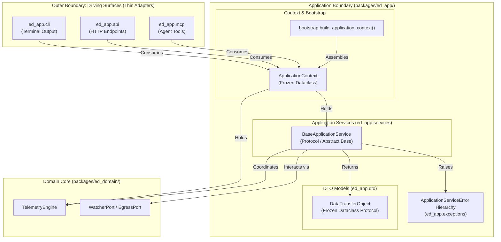

# SDD-008: Application Service Layer, DTO Boundary Contracts, and Multi-Modal Orchestration

## 1. Context and Problem Statement

Following the completion of the `ed_watcher` driving adapter ([ADR 0009](../adr/0009_watcher_port_adapter_and_threaded_lifecycle.md), [SDD-007](0007_watcher_port_adapter_and_threaded_lifecycle.md)), `ed-telemetry` requires an architectural scaffolding layer in `packages/ed_app/` to mediate between pure domain logic and multiple co-equal driving surfaces (CLI, REST API, MCP server).

Governed by **[ADR 0010](../adr/0010_application_service_layer_and_boundary_contracts.md)**, this design document establishes **strictly the structural scaffolding, base abstractions, typing standards, and mechanical boundary enforcement** for the Application Service Layer—without implementing specific, speculative use-case features.

Specifically, this scaffolding must establish:
1. Submodule organizational taxonomy in `packages/ed_app/` (`dto/`, `services/`, `context.py`, `exceptions.py`, `bootstrap.py`).
2. The DTO architectural standard: immutable dataclass markers containing strictly standard library primitives.
3. The base service protocol and exception hierarchy.
4. The immutable `ApplicationContext` container and factory root.
5. Mechanical CI enforcement via `import-linter` (Invariants C, D, and G in `pyproject.toml`).

---

## 2. Architectural Boundaries & Structural Scaffolding



---

## 3. Structural Taxonomy & Submodule Organization

The `packages/ed_app/` package is structured into dedicated, decoupled modules:

```text
packages/ed_app/
├── __init__.py
├── context.py              # ApplicationContext immutable dataclass
├── bootstrap.py            # Composition Root factory (build_application_context)
├── exceptions.py           # ApplicationServiceError base hierarchy
├── dto/                    # Pure, serializable Data Transfer Objects
│   ├── __init__.py
│   └── base.py             # DataTransferObject protocol and base utilities
├── services/               # Protocol-agnostic use-case orchestrators
│   ├── __init__.py
│   └── base.py             # BaseApplicationService protocol / base class
└── cli/                    # Ultra-thin CLI driving surface
    ├── __init__.py
    └── main.py
```

---

## 4. Component & Scaffolding Specifications

### 4.1 Application Exception Hierarchy (`packages/ed_app/exceptions.py`)

Pure application-level exceptions decoupled from HTTP codes, CLI exit statuses, or JSON-RPC schemas:

```python
"""Application service layer exception hierarchy."""


class ApplicationServiceError(Exception):
    """Base exception for all application-layer service failures."""


class ServiceInitializationError(ApplicationServiceError):
    """Raised when an application service fails pre-flight validation."""


class ResourceNotFoundError(ApplicationServiceError):
    """Raised when an application query targets a missing domain resource."""


class InvalidServiceOperationError(ApplicationServiceError):
    """Raised when a service operation violates workflow state rules."""
```

---

### 4.2 Data Transfer Object Architectural Standard (`packages/ed_app/dto/base.py`)

All DTOs authored across the application must satisfy the structural standard:

```python
"""Base protocols and serialization helpers for Data Transfer Objects."""

from typing import Any, Protocol, runtime_checkable


@runtime_checkable
class DataTransferObject(Protocol):
    """Protocol satisfied by all immutable application-level DTOs."""

    def to_dict(self) -> dict[str, Any]:
        """Convert DTO fields to a JSON-serializable dictionary."""
        ...
```

#### DTO Quality Invariants:
1. **Immutable:** Must be decorated with `@dataclass(frozen=True)`.
2. **Primitive Types Only:** Field types must strictly belong to standard library primitives (`str`, `int`, `float`, `bool`, `datetime`, `UUID`, `tuple`).
3. **Purity Boundary:** Must never import from `ed_domain`, `ed_watcher`, or external web/CLI frameworks.

---

### 4.3 Base Application Service Contract (`packages/ed_app/services/base.py`)

```python
"""Base protocol for application services."""

from typing import Protocol, runtime_checkable


@runtime_checkable
class BaseApplicationService(Protocol):
    """Abstract protocol for all application use-case services.

    Guarantees protocol neutrality: services accept standard primitives
    or DTOs and return immutable DTOs without coupling to transport layers.
    """
```

---

### 4.4 Application Context (`packages/ed_app/context.py`)

```python
"""Application Context: Bundles assembled services and engine handles."""

from dataclasses import dataclass
from typing import Any

from ed_domain.engine import TelemetryEngine


@dataclass(frozen=True)
class ApplicationContext:
    """Immutable bundle of initialized application services and engine handles.

    Provides driving surfaces (CLI, REST, MCP) with a single, strongly-typed
    entry point to all application-layer capabilities without global state.
    """

    engine: TelemetryEngine
    services: tuple[Any, ...] = ()
```

---

### 4.5 Composition Root Factory (`packages/ed_app/bootstrap.py`)

```python
"""Composition Root: Assembles dependencies into a runnable TelemetryEngine or ApplicationContext."""

from pathlib import Path

from ed_app.context import ApplicationContext
from ed_domain.engine import TelemetryEngine
from ed_egress.transmitter import NullTransmitter
from ed_watcher.watcher import FileSystemWatcher


def build_engine(journal_dir: Path | None = None) -> TelemetryEngine:
    """Instantiate concrete adapters and inject into the core domain engine.

    Guaranteed side-effect-free: does not bind network sockets,
    create files, or launch background threads during construction.
    """
    watcher = FileSystemWatcher(journal_dir=journal_dir)
    egress_adapters = [NullTransmitter()]
    return TelemetryEngine(watcher=watcher, egress_ports=egress_adapters)


def build_application_context(
    journal_dir_override: Path | None = None,
) -> ApplicationContext:
    """Instantiate ports, domain engine, and application services into a frozen context.

    Guaranteed side-effect-free: does not bind network sockets, create files,
    or launch background threads during construction.
    """
    engine = build_engine(journal_dir=journal_dir_override)
    return ApplicationContext(engine=engine, services=())
```

---

## 5. Architectural Invariants & Mechanical CI Enforcement

### 5.1 Invariant Rules

1. **Invariant C (Protocol Neutrality):** `ed_app.services` and `ed_app.dto` must never import web or CLI framework types (`fastapi`, `starlette`, `click`, `argparse`, `mcp`, `sys.exit`).
2. **Invariant D (Downward Dependency Rule):** `ed_app.services` and `ed_app.dto` must never import driving surfaces (`ed_app.cli`, `ed_app.api`, `ed_app.mcp`).
3. **Invariant E (DTO Boundary Isolation):** Services must return pure, serializable DTOs to driving surfaces, never mutable internal domain aggregates or raw entity pointers.
4. **Invariant F (Side-Effect-Free Construction):** Constructors (`__init__`) must strictly assign dependencies without starting threads, binding sockets, or performing disk I/O.
5. **Invariant G (Infrastructure Adapter Isolation):** Only `ed_app.bootstrap` is authorized to import concrete adapters (`ed_watcher`, `ed_egress`). Driving surfaces, services, and DTOs are strictly forbidden from importing concrete adapters.

### 5.2 Import-Linter Configuration (`pyproject.toml`)

```toml
[[tool.importlinter.contracts]]
name = "Invariant G: Driving surfaces and services forbidden from concrete adapters"
type = "forbidden"
source_modules = [
    "ed_app.cli",
    "ed_app.api",
    "ed_app.mcp",
    "ed_app.services",
    "ed_app.dto",
]
forbidden_modules = [
    "ed_watcher",
    "ed_egress",
]

[[tool.importlinter.contracts]]
name = "Invariant D: Application services forbidden from driving surfaces"
type = "forbidden"
source_modules = [
    "ed_app.services",
    "ed_app.dto",
]
forbidden_modules = [
    "ed_app.cli",
    "ed_app.api",
    "ed_app.mcp",
]

[[tool.importlinter.contracts]]
name = "Invariant C: Services and DTOs forbidden from protocol frameworks"
type = "forbidden"
source_modules = [
    "ed_app.services",
    "ed_app.dto",
]
forbidden_modules = [
    "argparse",
    "click",
    "fastapi",
    "starlette",
    "mcp",
]
```

---

## 6. Verification and Test Strategy

1. **Architecture Boundary Tests:**
   - Verify `import-linter` enforces Invariant G, D, and C during `scripts/verify.py`.
2. **Side-Effect-Freedom Tests:**
   - Verify `build_application_context()` spawns 0 threads and creates 0 file handles.
3. **DTO Immutability Tests:**
   - Verify `DataTransferObject` implementations are frozen dataclasses and reject attribute reassignment.
4. **Context Integrity Tests:**
   - Verify `ApplicationContext` is immutable and correctly exposes `engine` and `services`.
5. **Cross-Platform Wine Verification:**
   - Verify `build_application_context()` and base exceptions execute identically under Windows Python 3.11 via Wine.

---

## 7. Implementation Plan

| Step | Target File | Action |
| :---: | :--- | :--- |
| **1** | `pyproject.toml` | Add Invariants G, D, and C contracts to `import-linter`. |
| **2** | `packages/ed_app/exceptions.py` | Create base `ApplicationServiceError` hierarchy. |
| **3** | `packages/ed_app/dto/base.py` & `__init__.py` | Define `DataTransferObject` protocol and base helpers. |
| **4** | `packages/ed_app/services/base.py` & `__init__.py` | Define `BaseApplicationService` protocol. |
| **5** | `packages/ed_app/context.py` | Define immutable `ApplicationContext` dataclass. |
| **6** | `packages/ed_app/bootstrap.py` | Add `build_application_context()` factory root. |
| **7** | `tests/unit/test_application_scaffolding.py` | Author unit test suite verifying context, DTO protocol, and invariants. |
| **8** | `docs/reference/application_scaffolding.md` | Author Diátaxis Reference guide for Application Scaffolding. |
| **9** | `docs/how-to/add_application_service.md` | Author Diátaxis How-To runbook for adding a service to the Application Service Layer (post-implementation). |
