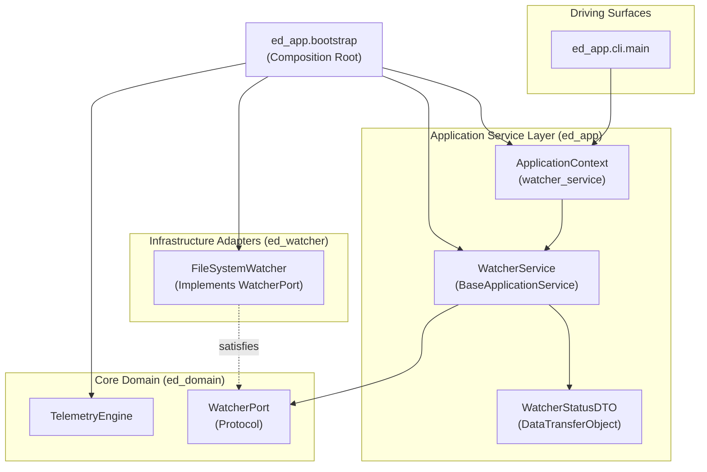

# SDD-009: Watcher Telemetry Application Service and Boundary Exposure

## 1. System Overview

This Software Design Document specifies the architecture, contracts, and implementation plan for onboarding the `WatcherService` into the Application Service Layer (`packages/ed_app/services/watcher.py`). Governed by [ADR 0011](../adr/0011_watcher_telemetry_application_service.md) and adhering to the onboarding procedure defined in `docs/how-to/add_application_service.md`.

---

## 2. Requirements and Design Invariants

1. **Hexagonal Encapsulation (Invariant G):** `ed_app.services` and driving surfaces (`cli`, `api`, `mcp`) must never import `ed_watcher` or `ed_egress`. Interaction with the watcher occurs strictly through `WatcherPort` injected into `WatcherService`.
2. **DTO Immutability and Protocol Compliance:** Status responses must return a frozen dataclass `WatcherStatusDTO` that implements `DataTransferObject` (`to_dict() -> dict[str, Any]`).
3. **Application Service Protocol Compliance:** `WatcherService` must implement `BaseApplicationService` and expose `service_name = "watcher_service"`.
4. **Side-Effect-Free Instantiation:** Constructing `WatcherService` and assembling `ApplicationContext` must spawn 0 background threads, execute 0 network requests, and touch 0 disk files.
5. **Exception Hierarchy Compliance:** Any service operational failure must inherit from `ApplicationServiceError`.

---

## 3. Structural Specification

### 3.1 Component Diagram



---

## 4. API and Class Specifications

### 4.1 Data Transfer Object (`packages/ed_app/dto/watcher.py`)

```python
from dataclasses import dataclass
from typing import Any

from ed_app.dto.base import DataTransferObject


@dataclass(frozen=True)
class WatcherStatusDTO:
    """Immutable status representation of the telemetry watcher adapter."""

    is_active: bool
    journal_dir: str | None

    def to_dict(self) -> dict[str, Any]:
        """Serialize status fields to primitive dictionary."""
        return {
            "is_active": self.is_active,
            "journal_dir": self.journal_dir,
        }
```

### 4.2 Application Service (`packages/ed_app/services/watcher.py`)

```python
from pathlib import Path
from typing import Protocol, runtime_checkable

from ed_app.dto.watcher import WatcherStatusDTO
from ed_app.exceptions import ServiceDependencyError
from ed_app.services.base import BaseApplicationService
from ed_domain.ports.watcher import WatcherPort


class WatcherService(BaseApplicationService):
    """Application service managing and querying inbound watcher telemetry."""

    def __init__(self, watcher: WatcherPort) -> None:
        if watcher is None:
            raise ServiceDependencyError("WatcherPort instance is required")
        self._watcher = watcher

    @property
    def service_name(self) -> str:
        return "watcher_service"

    def get_status(self) -> WatcherStatusDTO:
        """Query current operational state of the watcher adapter."""
        journal_dir_path = getattr(self._watcher, "journal_dir", None)
        journal_str = str(journal_dir_path) if journal_dir_path is not None else None
        return WatcherStatusDTO(
            is_active=self._watcher.is_active,
            journal_dir=journal_str,
        )

    def start(self) -> None:
        """Start inbound telemetry watching."""
        self._watcher.start()

    def stop(self) -> None:
        """Stop inbound telemetry watching."""
        self._watcher.stop()
```

### 4.3 Context and Bootstrap Wiring

* In `packages/ed_app/context.py`:
  ```python
  @dataclass(frozen=True)
  class ApplicationContext:
      engine: TelemetryEngine
      watcher_service: WatcherService
      services: tuple[Any, ...] = ()
  ```
* In `packages/ed_app/bootstrap.py`:
  ```python
  def build_application_context(journal_dir: Path | None = None) -> ApplicationContext:
      engine = build_engine(journal_dir=journal_dir)
      watcher_service = WatcherService(watcher=engine.watcher)
      return ApplicationContext(
          engine=engine,
          watcher_service=watcher_service,
          services=(watcher_service,),
      )
  ```

---

## 5. Verification and Test Strategy

1. **Unit Testing (`tests/unit/test_watcher_service.py`):**
   - Verify `WatcherService` satisfies `BaseApplicationService`.
   - Verify constructor rejection if `watcher` is `None` (raising `ServiceDependencyError`).
   - Verify `get_status()` returns `WatcherStatusDTO` satisfying `DataTransferObject`.
   - Verify `start()` and `stop()` lifecycle delegations to `WatcherPort`.
   - Verify side-effect-free instantiation (0 threads, 0 socket binds).
2. **Architecture Boundary Tests:**
   - Execute `lint-imports` ensuring Invariant G remains unbreached (`ed_app.services.watcher` does not import `ed_watcher`).
3. **Cross-Platform Verification:**
   - Execute `./scripts/run_wine_tests.sh` to verify execution under Windows Python 3.11 via Wine.

---

## 6. Implementation Plan

| Step | Target File | Action |
| :---: | :--- | :--- |
| **1** | `packages/ed_app/dto/watcher.py` & `__init__.py` | Implement `WatcherStatusDTO`. |
| **2** | `packages/ed_app/services/watcher.py` & `__init__.py` | Implement `WatcherService`. |
| **3** | `packages/ed_app/context.py` | Update `ApplicationContext` with `watcher_service`. |
| **4** | `packages/ed_app/bootstrap.py` | Wire `watcher_service` into `build_application_context()`. |
| **5** | `packages/ed_app/__init__.py` | Expose `WatcherService` and `WatcherStatusDTO` exports. |
| **6** | `tests/unit/test_watcher_service.py` | Add unit tests verifying service behaviors and protocols. |
| **7** | `scripts/run_wine_tests.sh` | Add Wine test coverage for `WatcherService`. |
| **8** | `docs/reference/application_scaffolding.md` | Document `WatcherService` and `WatcherStatusDTO`. |
| **9** | `docs/how-to/add_application_service.md` | Update how-to procedure with lessons learned/refinements. |
