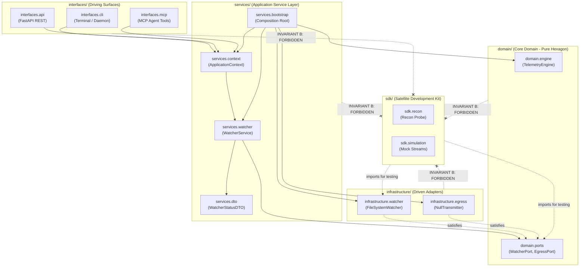

# SDD-010: Pure Hexagonal Source Topology and Satellite SDK Migration

## 1. System Overview

This Software Design Document specifies the concrete architecture, physical directory movements, namespace transformation, tooling reconfigurations, and post-migration verification procedures to migrate `ed-telemetry` from the legacy flat `packages/` layout to the **Pure Hexagonal `src/` tree with Satellite `sdk/`**, governed by [ADR 0012](../adr/0012_segregation_of_root_monorepo_topology_into_apps_and_libs.md).

---

## 2. Requirements and Design Invariants

1. **Topological 1-to-1 Mapping:** The physical directories under `src/` must map directly to the 4 quadrants of Clean / Hexagonal Architecture:
   - `src/domain/`: 100% Core Domain (Center of Hexagon).
   - `src/services/`: 100% Application Service Layer (Use Cases, DTOs, Context, Bootstrap).
   - `src/infrastructure/`: 100% Driven Adapters (Watcher, Egress).
   - `src/interfaces/`: 100% Driving Surfaces (CLI, API, MCP).
2. **Satellite SDK Isolation:** `sdk/` must reside completely outside `src/` as a companion development and simulation harness. Production code under `src/` is strictly forbidden from importing `sdk/` (Invariant B).
3. **Adapter-Local Encapsulation:** Adapter-internal models (`JournalCandidate`, `StreamPosition`, `SnapshotIdentifier`, `FileIngestionEvent`) must remain strictly inside `src/infrastructure/watcher/` and must never pollute `src/domain/`.
4. **Invariant Continuity:** 100% of the architectural invariants (A, B, C, D, G) defined in ADRs 0001, 0010, and 0011 must be re-anchored and validated without dilution.
5. **Deterministic Scripted Execution:** A temporary migration script (`scripts/migrate_topology.py`) will perform deterministic string replacements and directory moves, followed by manual inspection and mandatory script deletion before PR merge.

---

## 3. Structural Specification

### 3.1 Target Filesystem Layout

```
ed-telemetry/
├── src/                                 # 100% Production Runtime Codebase
│   ├── domain/                          # Hexagon Center: Pure Entities & Port Protocols
│   │   ├── engine.py                    # TelemetryEngine
│   │   ├── py.typed
│   │   └── ports/                       # WatcherPort, EgressPort, IngestionEventHandler
│   │
│   ├── services/                        # Application Service Layer: Use Cases & DTOs
│   │   ├── bootstrap.py                 # Composition Root (build_application_context, build_engine)
│   │   ├── context.py                   # Immutable ApplicationContext dataclass
│   │   ├── exceptions.py                # ApplicationServiceError hierarchy
│   │   ├── py.typed
│   │   ├── dto/                         # DataTransferObject protocol, WatcherStatusDTO
│   │   └── watcher.py                   # WatcherService implementation
│   │
│   ├── infrastructure/                  # Secondary Driven Adapters (External I/O)
│   │   ├── py.typed
│   │   ├── watcher/                     # FileSystemWatcher, PathDiscoverer, JournalSelector, Reactor
│   │   └── egress/                      # NullTransmitter, future HttpTransmitter
│   │
│   └── interfaces/                      # Primary Driving Surfaces (Front Doors)
│       ├── py.typed
│       ├── __main__.py                  # Executable module runner
│       ├── cli/                         # Terminal commands & main smoke test entrypoint
│       ├── api/                         # Future: FastAPI REST routes
│       └── mcp/                         # Future: Model Context Protocol tools
│
├── sdk/                                 # Satellite Development Kit & Simulation Harness
│   ├── py.typed
│   ├── recon/                           # Offline journal acquisition & anonymization
│   └── simulation/                      # Synthetic journal streams & mock generators
│
├── tests/                               # Verification Suites
│   └── unit/                            # Unit test suites targeting domain, services, infra
│
├── docs/                                # Diátaxis Operator Documentation Plane
└── architecture/                        # Engineering Plane (ADRs, SDDs, RFCs)
```

### 3.2 Mermaid Architecture Diagram



---

## 4. Module & Import Namespace Transformation Map

Every Python file across `src/`, `sdk/`, and `tests/` will undergo deterministic namespace transformation:

| Old Namespace (`packages/`) | New Namespace (`src/` / `sdk/`) | Notes |
| :--- | :--- | :--- |
| `ed_domain` | `domain` | `from ed_domain.engine import ...` $\to$ `from domain.engine import ...` |
| `ed_domain.ports` | `domain.ports` | `from ed_domain.ports.watcher import ...` $\to$ `from domain.ports.watcher import ...` |
| `ed_watcher` | `infrastructure.watcher` | `from ed_watcher.watcher import ...` $\to$ `from infrastructure.watcher.watcher import ...` |
| `ed_egress` | `infrastructure.egress` | `from ed_egress.transmitter import ...` $\to$ `from infrastructure.egress.transmitter import ...` |
| `ed_app.services` | `services` | `from ed_app.services.watcher import ...` $\to$ `from services.watcher import ...` |
| `ed_app.dto` | `services.dto` | `from ed_app.dto.watcher import ...` $\to$ `from services.dto.watcher import ...` |
| `ed_app.context` | `services.context` | `from ed_app.context import ...` $\to$ `from services.context import ...` |
| `ed_app.exceptions` | `services.exceptions` | `from ed_app.exceptions import ...` $\to$ `from services.exceptions import ...` |
| `ed_app.bootstrap` | `services.bootstrap` | `from ed_app.bootstrap import ...` $\to$ `from services.bootstrap import ...` |
| `ed_app.cli` | `interfaces.cli` | `from ed_app.cli.main import ...` $\to$ `from interfaces.cli.main import ...` |
| `ed_app` (module runner) | `interfaces` | `python -m ed_app` $\to$ `python -m interfaces` (or console script `ed-telemetry`) |
| `ed_sdk` | `sdk` | `from ed_sdk import ...` $\to$ `from sdk import ...` |

---

## 5. Tooling, Packaging, and Invariant Configuration

### 5.1 `pyproject.toml` Configuration Updates

```toml
[tool.setuptools.packages.find]
where = ["src", "sdk"]

[tool.mypy]
python_version = "3.11"
strict = true
warn_return_any = true
warn_unused_configs = true
mypy_path = ["src", "sdk"]
packages = ["domain", "services", "infrastructure", "interfaces", "sdk"]

[tool.pytest.ini_options]
minversion = "8.0"
testpaths = ["tests"]
pythonpath = ["src", "sdk"]

[tool.importlinter]
include_external_packages = true
root_packages = [
    "domain",
    "services",
    "infrastructure",
    "interfaces",
    "sdk",
]

[[tool.importlinter.contracts]]
name = "Invariant A: Domain package must remain purely decoupled"
type = "forbidden"
source_modules = ["domain"]
forbidden_modules = [
    "infrastructure",
    "services",
    "interfaces",
    "sdk",
    "watchdog",
    "tkinter",
    "socket",
    "http",
    "urllib",
    "requests",
    "httpx",
]

[[tool.importlinter.contracts]]
name = "Invariant B: SDK forbidden in production packages"
type = "forbidden"
source_modules = [
    "domain",
    "infrastructure",
    "services",
    "interfaces",
]
forbidden_modules = ["sdk"]

[[tool.importlinter.contracts]]
name = "Layered Architecture Boundaries"
type = "layers"
layers = [
    "interfaces",
    "services",
    "infrastructure",
    "domain",
]

[[tool.importlinter.contracts]]
name = "Invariant G: Infrastructure adapter isolation"
type = "forbidden"
source_modules = [
    "interfaces",
    "services.watcher",
    "services.dto",
]
forbidden_modules = [
    "infrastructure",
]
allow_indirect_imports = true

[[tool.importlinter.contracts]]
name = "Invariant D: Downward dependency within application services"
type = "layers"
layers = [
    "interfaces",
    "services.bootstrap",
    "services.context",
    "services.watcher",
    "services.dto",
    "services.exceptions",
]

[[tool.importlinter.contracts]]
name = "Invariant C: Services and DTOs forbidden from protocol frameworks"
type = "forbidden"
source_modules = [
    "services.watcher",
    "services.dto",
]
forbidden_modules = [
    "argparse",
    "click",
    "fastapi",
    "starlette",
    "mcp",
]

[[tool.bumpversion.files]]
filename = "src/domain/__init__.py"
search = '__version__ = "{current_version}"'
replace = '__version__ = "{new_version}"'
```

### 5.2 Verification Scripts Update (`scripts/verify.py` & `scripts/run_wine_tests.sh`)

* In `scripts/verify.py`:
  - `("Ruff Lint", [sys.executable, "-m", "ruff", "check", "src", "sdk", "tests"])`
  - `("Ruff Format Check", [sys.executable, "-m", "ruff", "format", "--check", "src", "sdk", "tests"])`
  - `("CLI Smoke Test", [sys.executable, "-m", "interfaces"])`
* In `scripts/run_wine_tests.sh`:
  - Update Windows Python sys.path injection:
    ```bash
    sys.path.insert(0, os.path.join(r'${WIN_REPO_ROOT}', 'src'))
    sys.path.insert(0, os.path.join(r'${WIN_REPO_ROOT}', 'sdk'))
    ```
  - Update imports in all Wine execution blocks (`from infrastructure.watcher.watcher import FileSystemWatcher`, `from services.bootstrap import build_application_context`, etc.).

---

## 6. Documentation & Historical Supersedence Task Matrix

To satisfy governance and operator clarity, documentation and historical ledgers must be updated as part of the implementation milestone:

### 6.1 Historical ADR Supersedence Annotations
Per Rule 5.1 and MADR 3.0, the following historical ADRs will receive formal supersedence notes pointing to ADR 0012:
* **`architecture/adr/0001_architectural_vision_and_operational_concept.md`**: Superseded in Section 4 & 6.1 (directory topology).
* **`architecture/adr/0002_verification_tooling_and_versioning_lifecycle.md`**: Superseded in Section 3.1 (`packages/` path).

### 6.2 Living User-Facing Documentation (`docs/`)
* **`docs/how-to/add_application_service.md`**: Update all filepaths to `src/services/`, `src/domain/`, and verification commands to `ruff check src sdk tests`.
* **`docs/how-to/verify_architecture_and_test_locally.md`**: Update verification commands and import-linter contract outputs.
* **`docs/reference/application_scaffolding.md`**: Update filesystem diagrams and module layouts to `src/services/` and `src/interfaces/`.
* **`docs/reference/watcher_filesystem_adapter.md`**: Update paths to `src/infrastructure/watcher/`.
* **`docs/reference/watcher_engine.md`**: Update paths to `src/infrastructure/watcher/engine/`.
* **`docs/reference/watcher_journal_selector.md`**: Update paths to `src/infrastructure/watcher/selector.py`.
* **`docs/reference/watcher_snapshot_identifier.md`**: Update paths to `src/infrastructure/watcher/snapshots/`.
* **`docs/reference/watcher_path_discovery.md`**: Update paths to `src/infrastructure/watcher/discovery/`.

### 6.3 Repository Root and Subsystem READMEs
* **`README.md`**: Update repository layout tree, quickstart commands, and package descriptions.
* **`architecture/adr/README.md`**: Ensure ADR 0012 is listed and supersedence links are accurate.
* **`architecture/designs/README.md`**: Register SDD-010.

---

## 7. Phased Implementation Plan

| Step | Phase | Action |
| :---: | :--- | :--- |
| **1** | **Automation Script Creation** | Author temporary script `scripts/migrate_topology.py` to deterministically perform `git mv` operations, update Python file imports across `src/`, `sdk/`, `tests/`, and update `pyproject.toml`. |
| **2** | **Script Execution** | Execute `python3 scripts/migrate_topology.py` to move directories and perform bulk namespace transformations. |
| **3** | **Verification Scripts Update** | Update `scripts/verify.py` and `scripts/run_wine_tests.sh` with new path targets and module imports. |
| **4** | **Script Auditing & Deletion** | Manually audit `git diff` to verify clean namespace transformation; verify zero unintended modifications; **permanently delete `scripts/migrate_topology.py`**. |
| **5** | **Documentation & ADR Sync** | Update all living docs in `docs/how-to/`, `docs/reference/`, repository `README.md`, and add supersedence headers to ADR 0001 and ADR 0002. |
| **6** | **Quality Gate Verification** | Execute `./scripts/verify.py` (Ruff lint, Ruff format, Mypy, Import-Linter, 78 Pytest tests, CLI smoke test). |
| **7** | **Wine Simulation Verification** | Execute `./scripts/run_wine_tests.sh` to confirm 100% pass rate under Windows Python 3.11 via Wine. |
| **8** | **Commit, Push & PR** | Create commit `refactor(topology): migrate to pure hexagonal src/ and satellite sdk/`, push branch, and open PR. |
