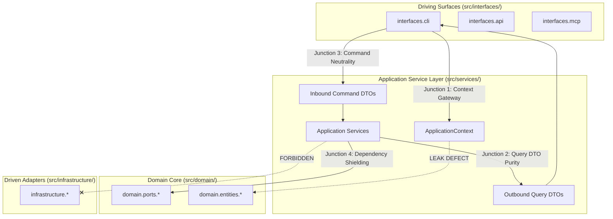
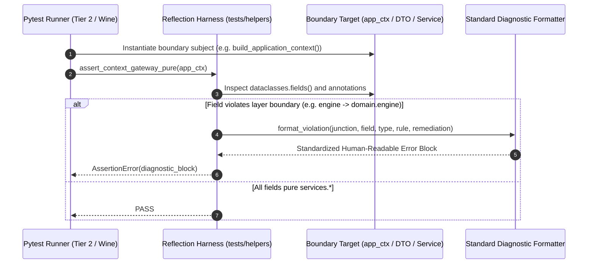

# SDD-011: Runtime Reflection Verification for Object-Tunneling Boundary Invariants

This Software Design Document specifies the architecture, data models, reflection algorithms, diagnostic reporting formats, and test integration for the **Runtime Reflection Verification System** governed by [ADR 0013](../adr/0013_runtime_reflection_verification_for_object_tunneling_boundaries.md).

---

## 1. System Overview & Problem Context

`ed-telemetry` enforces architectural boundaries using static AST inspection (`import-linter`). However, static linters cannot detect **Transitive Runtime Object Tunneling**—when an authorized import path returns a composite object whose fields expose objects from unauthorized layers at runtime.

The canonical example is currently active in the codebase:
```python
# src/interfaces/cli/main.py
from services.bootstrap import build_application_context  # Statically allowed!

app_ctx = build_application_context()
app_ctx.engine.start()  # RUNTIME VIOLATION: CLI invokes domain.engine without importing domain!
```

SDD-011 designs a standard-library-based runtime reflection harness (`tests/helpers/boundary_reflection.py`) that audits live Python memory graphs across 4 architectural junctions and fails tests with standardized, actionable diagnostics.

---

## 2. Architectural Junction Models & Inspection Flow



---

## 3. Dynamic Sequence Flow



---

## 4. Subsystem Design & Component Specifications

The subsystem consists of two components:
1. `tests/helpers/boundary_reflection.py`: Reusable reflection inspection algorithms and diagnostic formatting protocols.
2. `tests/unit/test_boundary_reflection.py`: Dedicated test suite executing the audits across Junctions 1–4.

### 4.1 Reflection Validator Module (`tests/helpers/boundary_reflection.py`)

#### A. Data Model: `BoundaryViolation`
```python
@dataclass(frozen=True)
class BoundaryViolation:
    invariant_name: str
    junction_name: str
    source_layer: str
    target_layer: str
    enclosing_container: str
    field_or_param_name: str
    leaked_type_name: str
    leaked_module_path: str
    policy_violation: str
    remediation_action: str
```

#### B. Diagnostic Formatter: `format_violation_diagnostic()`
Produces the exact standardized template defined in ADR 0013:
```python
def format_violation_diagnostic(v: BoundaryViolation) -> str:
    return (
        f"\n{'=' * 80}\n"
        f"ARCHITECTURAL RUNTIME BOUNDARY VIOLATION: {v.invariant_name}\n"
        f"{'=' * 80}\n"
        f"Junction:     {v.junction_name} ({v.source_layer} -> {v.target_layer})\n"
        f"Location:     {v.enclosing_container}.{v.field_or_param_name}\n"
        f"Leaked Type:  {v.leaked_type_name}\n"
        f"Module Path:  {v.leaked_module_path}\n"
        f"Severity:     CRITICAL (Object Tunneling Detected)\n\n"
        f"Policy Violation:\n"
        f"  {v.policy_violation}\n\n"
        f"Remediation:\n"
        f"  {v.remediation_action}\n"
        f"{'=' * 80}\n"
    )
```

#### C. Junction Inspection Algorithms

##### 1. Junction 1: `audit_context_gateway(app_ctx: Any) -> list[BoundaryViolation]`
* Inspects `dataclasses.fields(app_ctx)`.
* For each field:
  - Fetches live instance via `getattr(app_ctx, field.name)`.
  - Determines module: `type(val).__module__`.
  - Violates boundary if `mod.startswith("domain")` or `mod.startswith("infrastructure")` or `mod.startswith("sdk")`.
  - All attributes must implement `BaseApplicationService` or be an empty/primitive container.

##### 2. Junction 2: `audit_dto_purity(dto: Any) -> list[BoundaryViolation]`
* Recursively traverses `dataclasses.fields(dto)`.
* Asserts value types are strictly: `int`, `float`, `str`, `bool`, `bytes`, `None`, `datetime`, or nested frozen `DataTransferObject` dataclasses, or lists/tuples/dicts thereof.
* Violates boundary if any nested value's module belongs to `domain.*` or `infrastructure.*`.

##### 3. Junction 3: `audit_command_neutrality(command: Any) -> list[BoundaryViolation]`
* Inspects `dataclasses.fields(command)`.
* Forbids any type belonging to CLI (`click`, `argparse`), web (`starlette`, `fastapi`), or protocol (`mcp`) frameworks.

##### 4. Junction 4: `audit_service_constructor_shielding(service_cls: type) -> list[BoundaryViolation]`
* Inspects `inspect.signature(service_cls.__init__).parameters`.
* Audits type annotations.
* Violates boundary if any parameter annotation references `infrastructure.*`.
* All dependencies must resolve to `domain.ports.*` or standard library primitives.

---

## 5. Verification Test Suite (`tests/unit/test_boundary_reflection.py`)

A dedicated unit test file that exercises all 4 junctions:

1. `test_junction1_context_gateway_identifies_telemetry_engine_leak()`:
   - Evaluates current `build_application_context()`.
   - **Expected Behavior in this Phase:** Deliberately asserts that `app_ctx.engine` is flagged as a Junction 1 violation with the standardized diagnostic message. This serves as the verified benchmark proving the detector works before refactoring.
2. `test_junction1_context_gateway_verifies_pure_services()`:
   - Validates that `watcher_service` on `app_ctx` passes cleanly.
3. `test_junction2_watcher_status_dto_purity()`:
   - Instantiates `WatcherStatusDTO` and asserts 100% primitive purity.
4. `test_junction4_service_constructor_shielding()`:
   - Audits `WatcherService.__init__` and asserts it only binds `WatcherPort`.

---

## 6. Integration into Verification Gates

1. **`scripts/verify.py`:**
   - Automatically executed under Step 5 (`Pytest Suite`).
   - Runs in `< 10ms`.
2. **`scripts/run_wine_tests.sh`:**
   - Added as Step 7 in the Wine simulant runner to verify object graph reflection under Windows Python 3.11 / Wine.
3. **GitHub Actions Matrix:**
   - Executes across Ubuntu and Windows runners on Python 3.11 and 3.12.

---

## 7. Phased Implementation Plan

| Milestone | Task Description | Target Files | Verification Gate |
| :---: | :--- | :--- | :--- |
| **Phase 1** | Author reflection validator module and standardized formatter. | `tests/helpers/boundary_reflection.py` | Ruff & Mypy clean |
| **Phase 2** | Author unit test suite covering Junctions 1–4. | `tests/unit/test_boundary_reflection.py` | Pytest passes (verifying expected leak detection) |
| **Phase 3** | Integrate reflection test step into Wine simulant test script. | `scripts/run_wine_tests.sh` | Clean execution under Wine |
| **Phase 4** | Document runtime reflection validation in How-To runbooks. | `docs/how-to/test_cross_platform_locally.md` | Markdown hygiene check |
