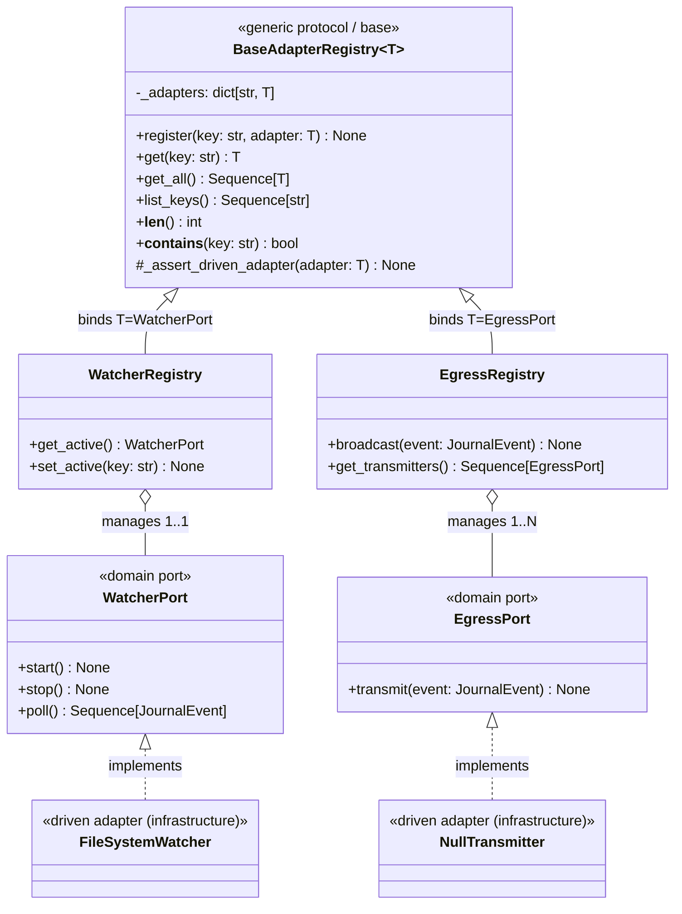
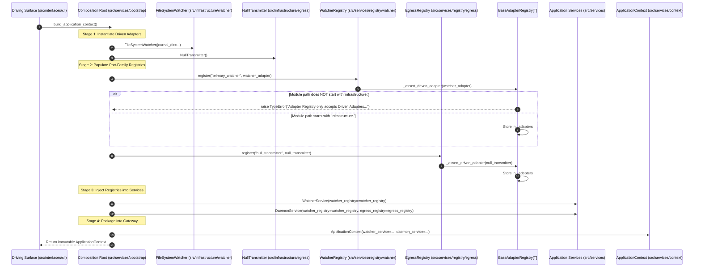

# SDD-012: Driven Adapter Registry Architecture and Composition Root Integration

This Software Design Document specifies the architecture, data models, class hierarchies, boundary verification algorithms, and composition root wiring for the **Driven Adapter Registry Subsystem** governed by [ADR 0014](../adr/0014_driven_adapter_registry_architecture_and_composition_root.md).

---

## 1. System Overview & Problem Context

In Pure Hexagonal Architecture ([ADR 0012](../adr/0012_segregation_of_root_monorepo_topology_into_apps_and_libs.md)), all real-world I/O mechanisms residing outside the domain core and application service layer are Adapters. Adapters are divided into two mutually exclusive directional categories:
1. **Driving Adapters (Primary / Inward):** Entry surfaces (`src/interfaces/`) that receive external actor invocations (CLI commands, REST calls, MCP requests) and delegate them into `ApplicationContext`.
2. **Driven Adapters (Secondary / Outward):** Real-world technology bindings (`src/infrastructure/`) driven by the core system to observe environment state (journal directory watchers) or transmit processed telemetry (EDDN, Inara, EDSM, Discord Webhooks, Null Transmitters).

### Current Codebase Deficiencies
Currently in `src/services/bootstrap.py`, driven adapters are instantiated ad-hoc and passed directly into `TelemetryEngine` as unstructured arguments (`watcher=...`, `egress_ports=[...]`). This approach presents critical architectural liabilities:
* **Conflation with Engine & Services:** There is no centralized authority or structured container for managing driven adapters.
* **Lack of Boundary Enforcement:** Driving adapters or arbitrary mock objects can be mistakenly passed where only infrastructure-bound driven adapters belong.
* **Lack of Extensibility:** Adding multiple outbound transmitters (EDDN, Inara) requires repetitive plumbing through application service constructors rather than leveraging a typed, cohesive collection.
* **Risk of Driving Surface Leakage:** Without a structured registry shielded behind the Application Service Layer, raw driven adapters risk leaking directly onto `ApplicationContext` (violating Junction 1 of [ADR 0013](../adr/0013_runtime_reflection_verification_for_object_tunneling_boundaries.md)).

SDD-012 designs a strongly typed, generic driven adapter registry subsystem (`src/services/registry/`) partitioned strictly by **Port Family**, backed by automated runtime boundary reflection, and cleanly integrated into the Composition Root.

---

## 2. Architectural Invariants & Quality Attributes

1. **Invariant 1: Driven Adapter Exclusivity:**
   The registry accepts **Driven Adapters only** (`src/infrastructure/`). Any attempt to register an adapter residing in `src/interfaces/`, `src/services/`, `src/domain/`, or an unauthorized package raises an explicit, immediate `TypeError`.
2. **Invariant 2: Port Family Segregation (ISP):**
   Registries are segregated by abstract domain port family (`BaseAdapterRegistry[T]`). Application services must depend only on the specific port family they require (`DispatcherService` depends on `EgressRegistry`; `WatcherService` depends on `WatcherRegistry`). Monolithic "global adapter bags" are strictly prohibited.
3. **Invariant 3: Common Generic Protocol:**
   All bespoke registries descend from `BaseAdapterRegistry[T]`, providing identical collection mechanics, registration idempotency/collision semantics, inspection APIs, and automated runtime boundary validation.
4. **Invariant 4: Composition Root Shielding:**
   Neither `BaseAdapterRegistry` instances nor concrete driven adapter instances are exposed directly on `ApplicationContext`. Driving interfaces access subsystem state and trigger actions solely through Application Services (`WatcherService`, `DaemonService`, `DispatcherService`) and immutable DTOs.
5. **Invariant 5: Zero Domain Pollution:**
   The domain core (`src/domain/`) remains pure. Registry classes reside exclusively in `src/services/registry/` and reference domain ports strictly via abstract protocols (`src/domain/ports/`).

---

## 3. Structural Component Model



---

## 4. Dynamic Sequence: Composition Root Assembly & Boundary Enforcement



---

## 5. Subsystem Design & Component Specifications

### 5.1 Package Locality
The driven adapter registry subsystem resides within `src/services/registry/`:

```text
src/services/
├── registry/
│   ├── __init__.py           # Exports: BaseAdapterRegistry, EgressRegistry, WatcherRegistry
│   ├── base.py               # BaseAdapterRegistry[T] generic class & validation
│   ├── egress.py             # EgressRegistry specialized for EgressPort
│   └── watcher.py            # WatcherRegistry specialized for WatcherPort
```

### 5.2 Common Generic Protocol (`BaseAdapterRegistry[T]`)
Located in `src/services/registry/base.py`:

```python
from collections.abc import Sequence
from typing import Generic, TypeVar

T = TypeVar("T")


class BaseAdapterRegistry(Generic[T]):
    """Generic base registry for driven adapters in the Application Service Layer."""

    def __init__(self) -> None:
        self._adapters: dict[str, T] = {}

    def _assert_driven_adapter(self, adapter: T) -> None:
        """Enforce that the registered adapter resides strictly in src/infrastructure/."""
        module_path = type(adapter).__module__
        if not module_path.startswith("infrastructure."):
            raise TypeError(
                f"Adapter Registry only accepts Driven Adapters from 'src/infrastructure/', "
                f"got: {type(adapter).__qualname__} from '{module_path}'"
            )

    def register(self, key: str, adapter: T) -> None:
        """Register a driven adapter under a unique alphanumeric key."""
        if not key or not isinstance(key, str):
            raise ValueError("Registry key must be a non-empty string.")
        if key in self._adapters:
            raise KeyError(f"Adapter with key '{key}' is already registered.")
        self._assert_driven_adapter(adapter)
        self._adapters[key] = adapter

    def get(self, key: str) -> T:
        """Retrieve a registered driven adapter by key."""
        if key not in self._adapters:
            raise KeyError(f"No adapter registered under key '{key}'.")
        return self._adapters[key]

    def get_all(self) -> Sequence[T]:
        """Return all registered driven adapters in registration order."""
        return tuple(self._adapters.values())

    def list_keys(self) -> Sequence[str]:
        """Return all registered keys in registration order."""
        return tuple(self._adapters.keys())

    def __len__(self) -> int:
        return len(self._adapters)

    def __contains__(self, key: str) -> bool:
        return key in self._adapters
```

### 5.3 Specialized Port-Family Registries

#### 5.3.1 `EgressRegistry`
Located in `src/services/registry/egress.py`:
* **Generic Bound:** `EgressPort` (`src/domain/ports/egress.py`).
* **Cardinality Semantics:** $1 \rightarrow N$ broadcast transmission.
* **Specialized Methods:**
  * `get_transmitters() -> Sequence[EgressPort]`: Immutable sequence of active outbound sinks.
  * `broadcast(event: JournalEvent) -> None`: Iterates through all registered transmitters and safely invokes `transmit(event)`.

#### 5.3.2 `WatcherRegistry`
Located in `src/services/registry/watcher.py`:
* **Generic Bound:** `WatcherPort` (`src/domain/ports/watcher.py`).
* **Cardinality Semantics:** $1 \rightarrow 1$ active input source per engine runtime.
* **Specialized Methods:**
  * `get_active() -> WatcherPort`: Returns the designated active input stream watcher.
  * `set_active(key: str) -> None`: Switches the active stream watcher to a registered adapter.

---

## 6. Composition Root Integration (`src/services/bootstrap.py`)

The Composition Root assembles the subsystem in four discrete stages:

```python
def build_application_context(journal_dir: Path | None = None) -> ApplicationContext:
    # Stage 1: Instantiate Driven Adapters (src/infrastructure/)
    watcher_adapter = FileSystemWatcher(journal_dir=journal_dir)
    null_transmitter = NullTransmitter()

    # Stage 2: Populate Port-Family Registries (src/services/registry/)
    watcher_registry = WatcherRegistry()
    watcher_registry.register("primary_watcher", watcher_adapter)

    egress_registry = EgressRegistry()
    egress_registry.register("null_transmitter", null_transmitter)

    # Stage 3: Inject Registries into Application Services (src/services/)
    watcher_service = WatcherService(watcher_registry=watcher_registry)
    daemon_service = DaemonService(
        watcher_registry=watcher_registry,
        egress_registry=egress_registry,
    )

    # Stage 4: Package into Gateway (src/services/context.py)
    return ApplicationContext(
        daemon_service=daemon_service,
        watcher_service=watcher_service,
        services=(daemon_service, watcher_service),
    )
```

---

## 7. Operator Documentation & Runbook Plan

In accordance with Diátaxis documentation governance (`docs/how-to/`), two operational runbooks will be delivered during Elaboration:
1. **`docs/how-to/register_driven_adapter.md`:**
   Guides developers through creating a concrete adapter in `src/infrastructure/`, implementing a domain port, registering it in `bootstrap.py`, and exposing telemetry via an Application Service DTO.
2. **`docs/how-to/create_driven_adapter_registry.md`:**
   Guides developers through creating a new bespoke port-family registry when introducing new port protocols (e.g., `StoragePort`, `AudioPort`) by subclassing `BaseAdapterRegistry[T]`.

---

## 8. Verification Strategy & Test Matrix

| Test ID | Scope | Invariant / Specification | Verification Method |
| :--- | :--- | :--- | :--- |
| **TEST-REG-01** | Unit | `BaseAdapterRegistry` rejects non-infrastructure instances | Attempt to register mock class from `interfaces.*` or `services.*`; assert `TypeError`. |
| **TEST-REG-02** | Unit | `BaseAdapterRegistry` key uniqueness | Attempt to register duplicate key; assert `KeyError`. |
| **TEST-REG-03** | Unit | `BaseAdapterRegistry` dictionary protocol | Test `get`, `get_all`, `list_keys`, `len`, and `in` operations. |
| **TEST-REG-04** | Unit | `EgressRegistry` broadcast mechanics | Register multiple transmitters; verify broadcast dispatches to all sinks. |
| **TEST-REG-05** | Unit | `WatcherRegistry` active selection | Verify `get_active()` and `set_active()` select correct watcher. |
| **TEST-REG-06** | Unit / Reflection | Junction 1 Gateway Purity | Verify `ApplicationContext` contains no `BaseAdapterRegistry` or `infrastructure.*` fields. |
| **TEST-REG-07** | Lint | Static Architecture Separation | Verify `import-linter` rules pass without contract violations. |

---

## 9. Implementation Phasing & Pull Request Sequencing

* **Phase 1 (Documentation & Governance):**
  - PR: SDD-012 registration in `architecture/designs/README.md`.
* **Phase 2 (Subsystem Construction):**
  - Implement `BaseAdapterRegistry[T]`, `EgressRegistry`, and `WatcherRegistry` in `src/services/registry/`.
  - Comprehensive unit tests in `tests/unit/test_adapter_registry.py`.
* **Phase 3 (Composition Root & Service Wiring):**
  - Refactor `src/services/bootstrap.py` to wire `WatcherRegistry` and `EgressRegistry`.
  - Update `WatcherService` and introduce `DaemonService`.
  - Author Diátaxis runbooks in `docs/how-to/`.
* **Phase 4 (Final Decommissioning & Quality Gates):**
  - Decommission legacy `TelemetryEngine`.
  - Restore strict zero-tolerance boundary reflection (`assert len(engine_violations) == 0`).
