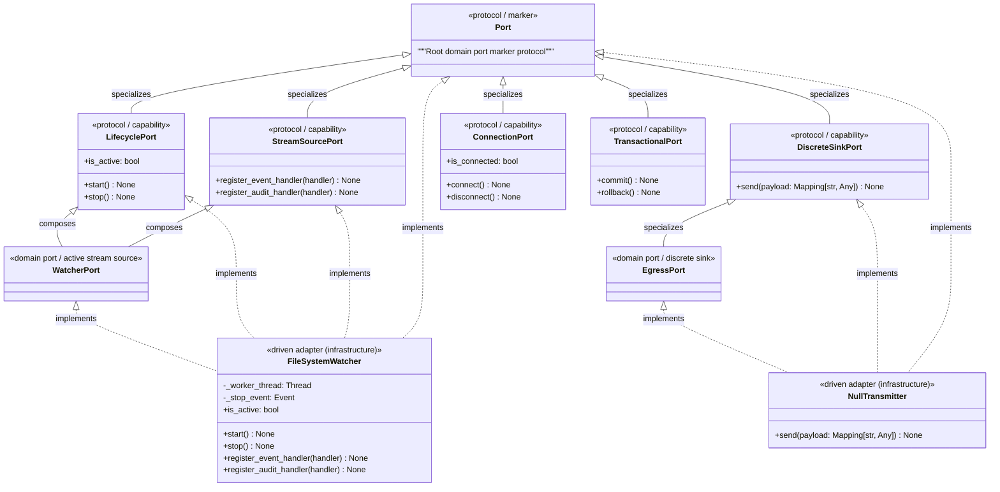
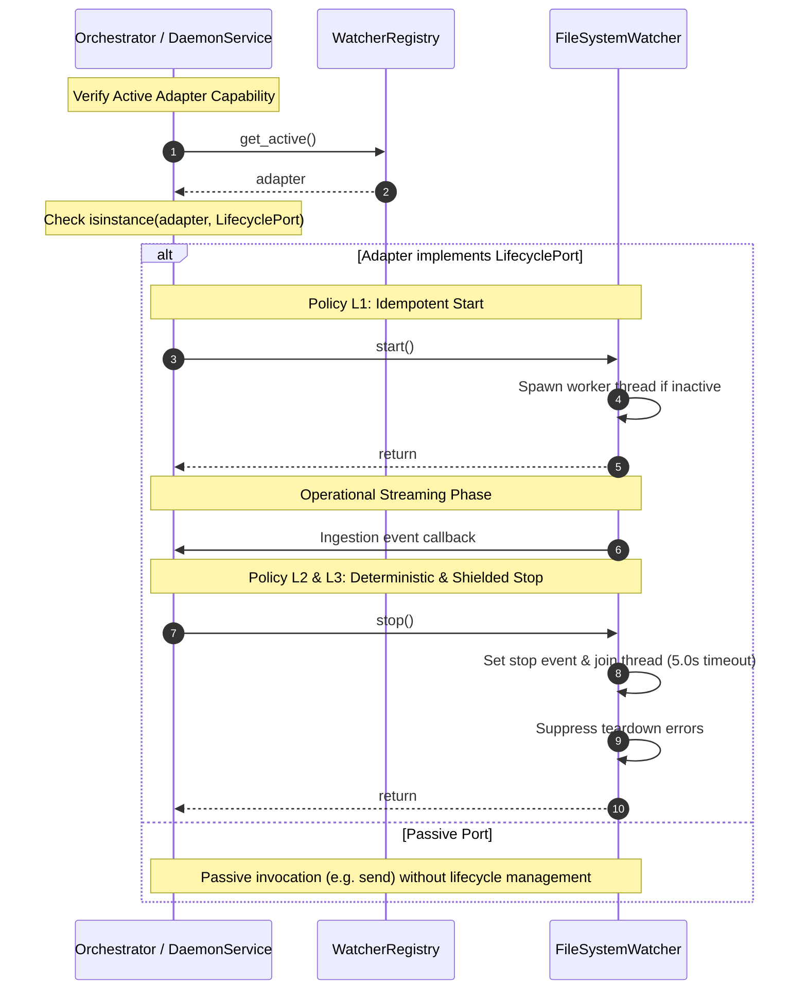

# SDD-013: Domain Port Protocol Genealogy, Capability Taxonomy, and Lifecycle Governance

This Software Design Document specifies the architecture, protocol class hierarchy, capability taxonomy, behavioral invariants, and verification strategy for the **Domain Port Protocol Genealogy** governed by [ADR 0015](../adr/0015_domain_port_protocol_genealogy_and_lifecycle_governance.md).

---

## 1. System Overview & Problem Context

In Pure Hexagonal Architecture ([ADR 0012](../adr/0012_segregation_of_root_monorepo_topology_into_apps_and_libs.md)), all external technological systems are abstracted behind abstract **Ports** defined exclusively in the Domain Core (`src/domain/ports/`).

### Identified Deficiencies
Prior to this design:
1. **Lack of a Common Root:** `WatcherPort` (`src/domain/ports/watcher.py`) and `EgressPort` (`src/domain/ports/egress.py`) existed as independent `@runtime_checkable` protocols without a common ancestor or polymorphic marker. Generic containers like `BaseAdapterRegistry[T]` had to rely on unbounded `TypeVar("T")`.
2. **Unregulated Lifecycle Boundaries:** `WatcherPort` declared `start()`, `stop()`, and `is_active` ad-hoc, while `EgressPort` declared only `send()`. There was no formal capability protocol distinguishing active, long-running adapters from passive, discrete sinks.
3. **Impediment to Orchestration:** Without a standard `LifecyclePort` capability protocol, future Application Services (`DaemonService`) could not polymorphically manage active background adapters without hardcoding bespoke port hooks.

SDD-013 designs a clean, composable protocol genealogy based on Python `typing.Protocol` structural subtyping, establishes the canonical 5-archetype capability taxonomy, defines machine-enforced lifecycle behavioral policies, and refactors existing ports and registries.

---

## 2. Architectural Invariants & Quality Attributes

1. **Invariant 1: Domain Isolation (Pure Standard Library):**
   All protocol definitions in `src/domain/ports/` depend strictly on standard library typing constructs (`Protocol`, `runtime_checkable`, `collections.abc`). Zero imports of external frameworks or infrastructure modules.
2. **Invariant 2: Interface Segregation Principle (ISP):**
   Capabilities are factored into granular protocols (`LifecyclePort`). Passive ports (e.g. `EgressPort`) must never declare dummy lifecycle methods (`start`/`stop`).
3. **Invariant 3: Polymorphic Generic Bounds:**
   The generic base registry `BaseAdapterRegistry[T]` must bind its type parameter to `T = TypeVar("T", bound=Port)`.
4. **Invariant 4: Runtime Checkability:**
   Every protocol in the hierarchy must be decorated with `@runtime_checkable` to enable memory reflection inspection and dynamic type checks.
5. **Invariant 5: Deterministic Lifecycle Invariants (Policies L1, L2, L3):**
   Every adapter implementing `LifecyclePort` must guarantee strict idempotency (L1), bounded deterministic thread joins (L2), and shutdown exception shielding (L3).

---

## 3. Structural Component & Protocol Hierarchy Model



---

## 4. Dynamic Sequence: Lifecycle Orchestration & Behavioral Policies



---

## 5. Subsystem Design & Component Specifications

### 5.1 Package Locality
The port definitions reside within `src/domain/ports/`:

```text
src/domain/ports/
├── __init__.py           # Exports: Port, LifecyclePort, WatcherPort, EgressPort
├── base.py               # Root Port marker and LifecyclePort capability protocols
├── egress.py             # EgressPort (Discrete Sink Archetype)
└── watcher.py            # WatcherPort (Active Worker & Stream Source Archetypes)
```

### 5.2 Root Marker & Capability Protocols (`src/domain/ports/base.py`)

```python
"""Root domain boundary port protocols and reusable capabilities.

Governed by ADR 0015 and SDD-013.
"""

from collections.abc import Callable, Mapping
from typing import Any, Protocol, runtime_checkable

IngestionEventHandler = Callable[[Any], None]
AuditEventHandler = Callable[[Any], None]


@runtime_checkable
class Port(Protocol):
    """Root marker protocol for all domain boundary ports.

    Serves as the common polymorphic root for structural typing,
    generic container bounds, and reflection audits.
    """


@runtime_checkable
class LifecyclePort(Port, Protocol):
    """Capability protocol for domain ports requiring background execution management."""

    def start(self) -> None:
        """Start background workers or streaming channels asynchronously."""
        ...

    def stop(self) -> None:
        """Gracefully stop and join background workers deterministically."""
        ...

    @property
    def is_active(self) -> bool:
        """Return True if background workers are actively executing."""
        ...


@runtime_checkable
class DiscreteSinkPort(Port, Protocol):
    """Capability protocol for discrete, outbound point-in-time transmission sinks."""

    def send(self, payload: Mapping[str, Any]) -> None:
        """Transmit a payload to downstream consumers."""
        ...


@runtime_checkable
class StreamSourcePort(Port, Protocol):
    """Capability protocol for continuous inbound event streaming sources."""

    def register_event_handler(self, handler: IngestionEventHandler) -> None:
        """Register a callback for raw file ingestion events."""
        ...

    def register_audit_handler(self, handler: AuditEventHandler) -> None:
        """Register a callback for operational audit events."""
        ...


@runtime_checkable
class ConnectionPort(Port, Protocol):
    """Capability protocol for stateful, persistent network connections."""

    def connect(self) -> None:
        """Establish persistent network connection."""
        ...

    def disconnect(self) -> None:
        """Cleanly close persistent network connection."""
        ...

    @property
    def is_connected(self) -> bool:
        """Return True if persistent connection is active and ready."""
        ...


@runtime_checkable
class TransactionalPort(Port, Protocol):
    """Capability protocol for atomic, scoped persistence resources."""

    def commit(self) -> None:
        """Commit pending changes atomically."""
        ...

    def rollback(self) -> None:
        """Roll back pending changes."""
        ...
```

### 5.3 Refactored `WatcherPort` (`src/domain/ports/watcher.py`)

```python
"""Abstract ports for inbound telemetry watchers."""

from typing import Protocol, runtime_checkable

from domain.ports.base import (
    AuditEventHandler,
    IngestionEventHandler,
    LifecyclePort,
    StreamSourcePort,
)

__all__ = ["WatcherPort", "IngestionEventHandler", "AuditEventHandler"]


@runtime_checkable
class WatcherPort(LifecyclePort, StreamSourcePort, Protocol):
    """Contract for inbound file and telemetry watchers.

    Composes LifecyclePort (worker archetype) and StreamSourcePort (event streaming).
    """

    # NOTE: start(), stop(), is_active inherited from LifecyclePort.
    # NOTE: register_event_handler, register_audit_handler inherited from StreamSourcePort.
```

### 5.4 Refactored `EgressPort` (`src/domain/ports/egress.py`)

```python
"""Abstract ports for outbound telemetry egress."""

from typing import Protocol, runtime_checkable

from domain.ports.base import DiscreteSinkPort

__all__ = ["EgressPort"]


@runtime_checkable
class EgressPort(DiscreteSinkPort, Protocol):
    """Contract for transmitting telemetry payloads to external endpoints.

    Specializes DiscreteSinkPort (pure outbound sink archetype).
    Zero lifecycle hooks declared.
    """

    # NOTE: send(payload) inherited from DiscreteSinkPort.
```

### 5.5 Refactored `BaseAdapterRegistry[T]` (`src/services/registry/base.py`)

Parameterize the generic registry with `T = TypeVar("T", bound=Port)` and validate both driven adapter module locality and port pedigree:

```python
from domain.ports.base import Port

T = TypeVar("T", bound=Port)


class BaseAdapterRegistry(Generic[T]):
    ...

    def register(self, key: str, adapter: T) -> None:
        if not key or not isinstance(key, str):
            raise ValueError("Registry key must be a non-empty string.")
        if key in self._adapters:
            raise KeyError(f"Adapter with key '{key}' is already registered.")
        self._assert_driven_adapter(adapter)
        if not isinstance(adapter, Port):
            raise TypeError(f"Adapter must satisfy domain.ports.base.Port, got: {type(adapter).__name__}")
        self._adapters[key] = adapter
```

---

## 6. Verification Strategy & Test Matrix

| Test ID | Scope | Invariant / Specification | Verification Method |
| :--- | :--- | :--- | :--- |
| **TEST-PORT-01** | Unit | `Port` marker protocol hierarchy | Assert `issubclass(LifecyclePort, Port)`, `issubclass(WatcherPort, Port)`, and `issubclass(EgressPort, Port)`. |
| **TEST-PORT-02** | Unit | Active vs. Passive Discrimination | Assert `issubclass(WatcherPort, LifecyclePort)` and `not issubclass(EgressPort, LifecyclePort)`. |
| **TEST-PORT-03** | Unit | Concrete Driven Adapter Satisfaction | Assert `FileSystemWatcher` satisfies `(Port, LifecyclePort, WatcherPort)` and `NullTransmitter` satisfies `(Port, EgressPort)` but NOT `LifecyclePort`. |
| **TEST-PORT-04** | Unit | Registry Generic Bound Enforcement | Verify `BaseAdapterRegistry` rejects non-Port classes with `TypeError` and passes `mypy --strict`. |
| **TEST-PORT-05** | Unit | Policy L1, L2, L3 Behavioral Conformance | Verify `FileSystemWatcher` idempotency, bounded thread join on stop, and clean shutdown on mock errors. |

---

## 7. Phased Implementation Milestones

* **Milestone 1 (Design Documentation):**
  - Author and merge SDD-013 in `architecture/designs/`.
* **Milestone 2 (Protocol Construction):**
  - Implement `src/domain/ports/base.py` defining `Port`, `LifecyclePort`, `DiscreteSinkPort`, `StreamSourcePort`, `ConnectionPort`, and `TransactionalPort`.
  - Refactor `src/domain/ports/watcher.py` (composing `LifecyclePort` and `StreamSourcePort`).
  - Refactor `src/domain/ports/egress.py` (specializing `DiscreteSinkPort`).
  - Update `src/domain/ports/__init__.py` exporting all root marker and capability protocols.
* **Milestone 3 (Registry Alignment & Test Suite):**
  - Refactor `src/services/registry/base.py` (`T = TypeVar("T", bound=Port)`).
  - Implement `tests/unit/test_domain_ports.py` covering `TEST-PORT-01` through `TEST-PORT-05`.
  - Verify all quality gates pass via `scripts/verify.py`.
