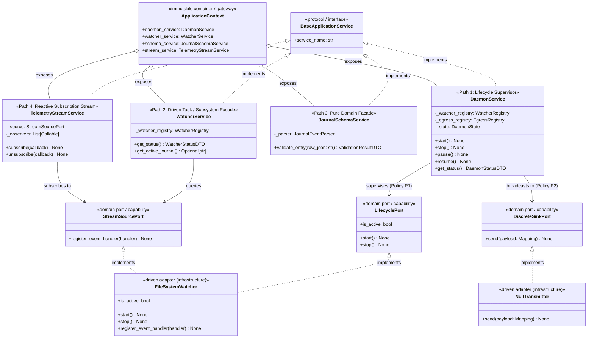
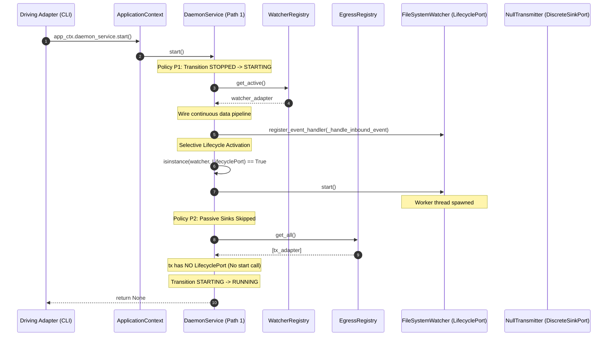
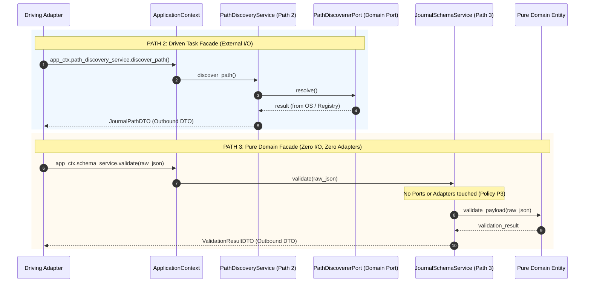

# SDD-014: Interaction Path Governance, Topology Invariants, and Automated Enforcement Policies

This Software Design Document specifies the architecture, component topology, dynamic sequence models, and machine-enforced verification harness for the **Four Canonical Hexagonal Interaction Paths** and binding policies **P1 through P4** governed by [ADR 0016](../adr/0016_interaction_path_governance_and_enforcement_policies.md).

---

## 1. System Overview & Problem Context

In Pure Hexagonal Architecture ([ADR 0012](../adr/0012_segregation_of_root_monorepo_topology_into_apps_and_libs.md)), the Application Service Layer (`src/services/`) mediates all interactions between Driving Surfaces (`src/interfaces/`), Domain Entities (`src/domain/`), and Driven Adapters (`src/infrastructure/`).

### Identified Architectural Deficiencies Prior to this Design
1. **Unregulated Service Topologies:** No formal taxonomy classified whether an application service acted as a process supervisor, a task delegate, an in-memory rule engine, or a reactive push stream.
2. **Lifecycle Proliferation Risk:** Without Policy P1, individual task facades risked instantiating worker threads directly, creating competing lifecycle controllers and uncoordinated pipelines.
3. **Passive Adapter Ambiguity:** Without Policy P2, passive outbound sinks lacked explicit guarantees separating their discrete interfaces (`send()`) from active lifecycle methods (`start()`, `stop()`).
4. **Unchecked Dependency Creep in Domain Facades:** Without Policy P3, in-memory validation services risked taking convenience dependencies on infrastructure file readers or driven registries.
5. **Runtime Object Tunneling:** Without Policy P4, external callers could bypass service facades via transitive attribute traversal across `ApplicationContext` or DTO fields.

SDD-014 provides the detailed architectural blueprint to codify the four canonical paths and implement automated CI quality gates that machine-enforce Policies P1 through P4.

---

## 2. Architectural Invariants & Quality Attributes

This subsystem enforces four primary policies backed by machine-validated quality attributes:

1. **Policy P1 (Active Lifecycle Exclusivity):**
   * *Invariant:* Background threads and execution loops are restricted exclusively to adapters implementing `LifecyclePort`.
   * *Exclusivity:* Invoking `.start()` and `.stop()` is permitted **only** within Path 1 Lifecycle Supervisors (`DaemonService`).
   * *Clause P1.1:* Adapters implementing `LifecyclePort` may be encapsulated by companion Path 2 facades strictly for on-demand capabilities residing outside the continuous lifecycle loop (status queries, diagnostics).
2. **Policy P2 (Passive Sink Capability Invariant):**
   * *Invariant:* Driven adapters implementing `DiscreteSinkPort` must remain purely passive (`send()` only). They must not declare background execution loops or lifecycle management methods.
3. **Policy P3 (Pure Domain Isolation Invariant):**
   * *Invariant:* Path 3 application services represent pure computational logic. They have zero imports and zero dependencies on `src/infrastructure/` and `src/services/registry/`.
4. **Policy P4 (Gateway Placement & DTO Purity Invariant):**
   * *Invariant:* Driving adapters access application services exclusively through `ApplicationContext`.
   * *Purity:* Every public service method accepts only primitives or immutable Command DTOs, and returns only primitives or immutable Outbound Query DTOs (`@dataclass(frozen=True)`). Zero domain or infrastructure types may be leaked.

---

## 3. Structural Component & Protocol Hierarchy Model

The following diagram defines the structural topology uniting the four interaction paths:

---

## 4. Dynamic Sequence Models

### 4.1 Path 1 Sequence: Lifecycle Supervision & Selective Activation

### 4.2 Path 2 vs. Path 3 Dynamic Sequence Comparison

---

## 5. Machine-Enforced Verification Harness Strategy

Every policy declared in ADR 0016 is mapped to an automated quality gate executed within Tier 2 Quality Gates (`scripts/verify.py`):

| Test ID | Governing Policy | Verification Mechanism | Quality Gate Stage | Failure Condition |
| :---: | :--- | :--- | :--- | :--- |
| **TEST-PATH-01** | Policy P1 (Lifecycle Exclusivity AST) | AST Linter (`scripts/lint_lifecycle_exclusivity.py`) | Tier 2 (`scripts/verify.py`) | Any call to `.start()` or `.stop()` found in `src/services/` (outside authorized supervisor modules). |
| **TEST-PATH-02** | Policy P2 (Passive Sink Capability) | Structural Capability Assertions | Pytest (`tests/unit/test_domain_ports.py`) | Concrete egress adapters implement `LifecyclePort` or declare `start()` / `stop()` methods. |
| **TEST-PATH-03** | Policy P3 (Pure Domain Isolation) | AST Import Boundaries | `import-linter` (`pyproject.toml`) | Path 3 computational modules import from `infrastructure` or `services.registry`. |
| **TEST-PATH-04** | Policy P4 (Gateway Attribute Integrity) | Memory Graph Reflection Harness | Pytest (`tests/unit/test_boundary_reflection.py`) | Attributes on `ApplicationContext` fail `BaseApplicationService` protocol or leak raw infrastructure. |
| **TEST-PATH-05** | Policy P4 (DTO Output Purity) | Recursive Reflection Field Audit | Pytest (`tests/unit/test_boundary_reflection.py`) | Service method return DTOs leak domain entities, port protocols, or concrete adapters. |

---

## 6. Phased Implementation Roadmap

The implementation of SDD-014 is strictly confined to establishing the architectural path rules, wiring the machine enforcement quality gates into the automated verification pipeline, and authoring Diátaxis operator/developer documentation. Concrete implementation of `DaemonService` and refactoring of `WatcherService` will be governed by their own dedicated design and implementation cycle:

* **Phase 1: Automated Enforcement Quality Gates:**
  - **Gate 1 (AST Lifecycle Exclusivity Linter):** Implement `scripts/lint_lifecycle_exclusivity.py` scanning `src/services/` (excluding whitelisted supervisor modules) to assert that no non-supervisor service invokes `.start()` or `.stop()`. Wire directly into `CHECKS` in `scripts/verify.py`.
  - **Gate 2 (Import-Linter Boundary Contract):** Add contract `Invariant P3: Path 3 pure domain isolation` in `pyproject.toml` forbidding computational domain modules from importing `infrastructure` or `services.registry`.
  - **Gate 3 (Policy Test Suite `tests/unit/test_path_policies.py`):** Implement test fixtures for `TEST-PATH-01` through `TEST-PATH-05` validating lifecycle exclusivity, passive sink structural capability, and reflection boundaries.

* **Phase 2: Diátaxis Contributor & Operator Documentation (`docs/how-to/`):**
  - Author `docs/how-to/classify_driven_adapter_interaction_path.md`: Step-by-step practical procedure enabling contributors to classify newly authored driven adapters into Paths 1 through 4 based on port capability protocols and temporal cadence.
  - Author `docs/how-to/determine_use_case_facades.md`: Decision checklist and procedural guide based on The Three Disambiguation Rules for determining whether an adapter requires a companion Path 2 use-case facade.

* **Phase 3: Pipeline Integration & Verification:**
  - Execute full Tier 2 quality gates (`.venv/bin/python scripts/verify.py`).
  - Verify all 5 gates pass synchronously: Ruff linting, Ruff formatting, Mypy typing, AST Lifecycle Exclusivity check, Import-Linter boundaries, Pytest suite, and CLI smoke test.
