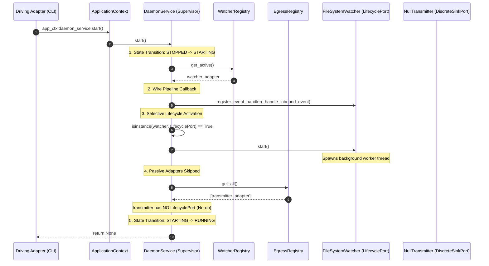
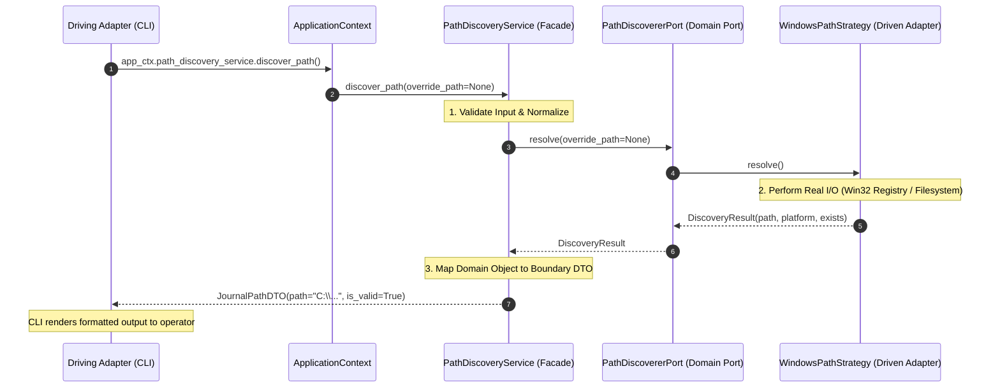
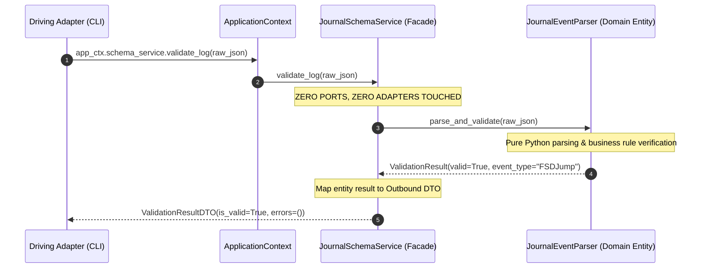
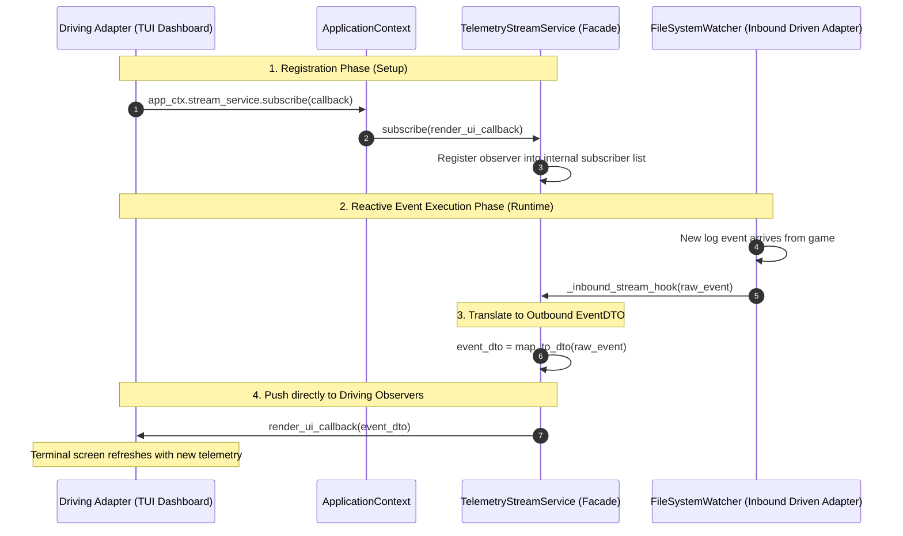

# The Four Canonical Hexagonal Interaction Paths: Architecture, Topology, and Reference Guide

This document provides the authoritative engineering reference for the **Four Canonical Interaction Paths** connecting Driving Adapters (`src/interfaces/`), the Application Service Layer (`src/services/`), the Domain Core (`src/domain/`), and Driven Adapters (`src/infrastructure/`) under Pure Hexagonal Architecture.

---

## 1. Executive Summary & The Architectural Cardinal Rule

In Hexagonal Architecture (Ports and Adapters), external delivery mechanisms and concrete technological systems never communicate directly. All information exchange is mediated by the **Application Service Layer** through explicit, machine-enforced boundary contracts.

### The Cardinal Boundary Invariant
```text
  [Driving Adapters] ---> [Application Services] ---> [Driven Adapters via Domain Ports]
   (src/interfaces/)        (src/services/)                     (src/infrastructure/)
```
1. **Driving Adapters** (CLI, REST APIs, GUI, TUI) initiate requests into the system. They access application services exclusively through the frozen `ApplicationContext`.
2. **Application Services** (Use-Case Facades, Supervisors, Coordinators) orchestrate application workflows. They translate external parameters into domain operations and return immutable Data Transfer Objects (DTOs).
3. **Driven Adapters** (Filesystem Tailers, Network Transmitters, OS Query Engines) fulfill operations requiring external I/O. They implement abstract Domain Ports and are completely oblivious to Driving Adapters and Application Services.

---

## 2. Macro Topology & The Four Paths at a Glance

```mermaid
flowchart TD
    subgraph DrivingPlane ["Driving Plane (src/interfaces/)"]
        CLI["CLI Entrypoints & Subcommands"]
        REST["HTTP / REST Controllers"]
        TUI["Live TUI / Terminal Dashboard"]
    end

    subgraph ServicePlane ["Application Service Layer (src/services/)"]
        CTX["ApplicationContext<br/>(Immutable Gateway Container)"]

        P1["<b>Path 1: Lifecycle Supervisor</b><br/><code>DaemonService</code><br/>• Supervises LifecyclePort<br/>• Wires StreamSource to DiscreteSink"]
        P2["<b>Path 2: Driven Task Facade</b><br/><code>PathDiscoveryService</code><br/>• Delegates I/O to Port<br/>• Returns Query DTO"]
        P3["<b>Path 3: Pure Domain Facade</b><br/><code>JournalSchemaService</code><br/>• Zero I/O, Zero Adapters<br/>• In-memory business rules"]
        P4["<b>Path 4: Reactive Subscription</b><br/><code>TelemetryStreamService</code><br/>• Push stream to UI callbacks<br/>• Observer fan-out"]
    end

    subgraph DomainPlane ["Domain Core (src/domain/)"]
        PORTS["Domain Port Protocols<br/>(LifecyclePort, StreamSourcePort, DiscreteSinkPort)"]
        ENTITIES["Domain Entities & Pure Logic<br/>(JournalCandidate, TelemetryEvent, Rules)"]
    end

    subgraph InfraPlane ["Driven Infrastructure Plane (src/infrastructure/)"]
        FSW["Driven Adapter: FileSystemWatcher"]
        TX["Driven Adapter: NullTransmitter / Webhook"]
        OS_STRAT["Driven Adapter: Windows / Linux Strategies"]
    end

    %% Driving connections
    CLI -->|Calls .start() / .stop()| CTX
    CLI -->|Calls .discover_path()| CTX
    REST -->|Calls .validate()| CTX
    TUI -->|Subscribes .subscribe()| CTX

    CTX --> P1
    CTX --> P2
    CTX --> P3
    CTX --> P4

    %% Service connections
    P1 -->|1. Wires & Starts| PORTS
    P1 -->|2. Broadcasts events| PORTS
    P2 -->|Delegates I/O via Port| PORTS
    P3 -->|Executes pure rules| ENTITIES
    P4 -->|Consumes inbound stream| PORTS
    P4 -.->|Pushes live DTOs| TUI

    %% Infrastructure implementations
    FSW -.->|Implements| PORTS
    TX -.->|Implements| PORTS
    OS_STRAT -.->|Implements| PORTS

    classDef driving fill:#2b6cb0,stroke:#bee3f8,color:#fff;
    classDef service fill:#2d3748,stroke:#cbd5e0,color:#fff;
    classDef domain fill:#285e61,stroke:#b2f5ea,color:#fff;
    classDef infra fill:#744210,stroke:#feebc8,color:#fff;
    class CLI,REST,TUI driving;
    class CTX,P1,P2,P3,P4 service;
    class PORTS,ENTITIES domain;
    class FSW,TX,OS_STRAT infra;
```

---

## 3. Comprehensive Comparison Table

| Dimension | Path 1: Lifecycle Supervisor | Path 2: Driven Task Facade | Path 3: Pure Domain Facade | Path 4: Reactive Subscription |
| :--- | :--- | :--- | :--- | :--- |
| **Primary Intent** | Long-running process management and event stream routing. | Request-Response external I/O task or resource query. | Pure in-memory computation, validation, or transformation. | Push-based asynchronous event streaming to driving observers. |
| **Example Service** | `DaemonService` | `PathDiscoveryService`, `WatcherService` | `JournalSchemaService`, `RouteCalculator` | `TelemetryStreamService` |
| **Port Types Involved** | `LifecyclePort`, `StreamSourcePort`, `DiscreteSinkPort` | Domain-specific Driven Ports (`PathDiscovererPort`) | **Zero Ports** (Pure Domain Entities only) | `StreamSourcePort` |
| **Touches Driven Adapters?** | **Yes** (Supervises workers & sinks) | **Yes** (Delegates I/O operation) | **No** (Zero I/O, Zero Adapters) | **Yes** (Listens to inbound source) |
| **Touches Pure Domain?** | Yes (Port protocols & state rules) | Yes (Domain models & port contracts) | **Yes** (Exclusively domain models) | Yes (Event entities & DTO mappers) |
| **Execution Cadence** | Continuous / Asynchronous Daemon Loop. | One-shot / Synchronous (or async request). | Instantaneous / In-memory synchronous. | Continuous Push / Callback streaming. |
| **Input Boundary** | Lifecycle commands (`start()`, `pause()`). | Parameters or Command DTOs. | Raw strings, payloads, domain data. | Subscriber callback: `Callable[[DTO], None]`. |
| **Output Boundary** | `DaemonStatusDTO`, `DaemonHealthDTO`. | Specific Result DTO (`JournalPathDTO`). | Validation Result DTO or computed entity. | Real-time DTO emissions pushed to caller. |
| **Error Containment** | `DaemonLifecycleError` (Exception shielding). | `ApplicationServiceError` (Domain translation). | `DomainValidationError` (Pure errors). | Subscriber error shielding (Prevents pipeline crashes). |

---

## 4. Deep-Dive Specification of Each Path

---

### Path 1: The Lifecycle & Pipeline Supervisor (Macro Process Control)

#### Architectural Purpose
Coordinates the macro execution lifecycle of the operating system process, supervises background worker threads conforming to `LifecyclePort`, and establishes the pipeline routing data from inbound stream sources to outbound broadcast sinks.

#### Dynamic Sequence Diagram


#### Concrete Implementation Pattern
```python
# src/services/daemon.py
class DaemonService(BaseApplicationService):
    """Path 1: Master Lifecycle Supervisor and Pipeline Orchestrator."""

    def __init__(
        self,
        watcher_registry: WatcherRegistry,
        egress_registry: EgressRegistry,
    ) -> None:
        self._watcher_registry = watcher_registry
        self._egress_registry = egress_registry
        self._state = DaemonState.STOPPED
        self._events_processed = 0

    def start(self) -> None:
        """Execute macro lifecycle startup."""
        if self._state == DaemonState.RUNNING:
            return  # Policy L1: Idempotent
        self._state = DaemonState.STARTING
        try:
            active_watcher = self._watcher_registry.get_active()
            # 1. Wire data stream
            active_watcher.register_event_handler(self._handle_inbound_event)
            # 2. Polymorphic Lifecycle activation
            if isinstance(active_watcher, LifecyclePort):
                active_watcher.start()
            self._state = DaemonState.RUNNING
        except Exception as exc:
            self._state = DaemonState.ERROR
            raise DaemonStartupError(f"Startup failed: {exc}") from exc

    def stop(self) -> None:
        """Execute deterministic shutdown and join."""
        if self._state in (DaemonState.STOPPED, DaemonState.ERROR):
            return
        self._state = DaemonState.STOPPING
        active_watcher = self._watcher_registry.get_active()
        if isinstance(active_watcher, LifecyclePort):
            active_watcher.stop()  # Policy L2 & L3: Deterministic join & shielded
        self._state = DaemonState.STOPPED

    def _handle_inbound_event(self, event: Any) -> None:
        """Route event from source to all egress sinks."""
        if self._state != DaemonState.RUNNING:
            return
        self._events_processed += 1
        payload = event if isinstance(event, dict) else {"event": str(event)}
        self._egress_registry.broadcast(payload)
```

---

### Path 2: The Driven Task Facade (Request-Response I/O)

#### Architectural Purpose
Encapsulates a distinct, non-continuous business use-case that requires interaction with external infrastructure (disk, OS, registry, network). It delegates the low-level I/O to a Domain Port implemented by a Driven Adapter, shields the caller from concrete libraries, and packages the result into an immutable DTO.

#### Dynamic Sequence Diagram


#### Concrete Implementation Pattern
```python
# src/services/discovery.py
class PathDiscoveryService(BaseApplicationService):
    """Path 2: Functional Use-Case Facade delegating to Driven Port."""

    def __init__(self, discoverer: PathDiscovererPort) -> None:
        self._discoverer = discoverer

    @property
    def service_name(self) -> str:
        return "path_discovery_service"

    def discover_path(self, override_path: str | None = None) -> JournalPathDTO:
        """Executes UC-0002: Resolve journal location via driven adapter."""
        try:
            # Delegate external I/O to Port
            result = self._discoverer.resolve(override_path)

            # Map domain output to boundary DTO
            return JournalPathDTO(
                path=str(result.resolved_path),
                platform=result.platform_name,
                strategy_used=result.strategy_used,
                is_valid=result.exists,
            )
        except Exception as exc:
            raise ApplicationServiceError(f"Path resolution failed: {exc}") from exc
```

---

### Path 3: The Pure Domain Facade (In-Memory Computation & Rules)

#### Architectural Purpose
Executes domain calculations, state verifications, parsing algorithms, or schema validations that are **100% computational**. It touches **zero driven adapters, zero ports, and performs zero I/O**. It coordinates pure domain entities directly, preventing driving surfaces from coupling to internal entity structures.

#### Dynamic Sequence Diagram


#### Concrete Implementation Pattern
```python
# src/services/schema.py
class JournalSchemaService(BaseApplicationService):
    """Path 3: Pure In-Memory Domain Computation Facade (Zero I/O)."""

    def __init__(self, parser: JournalEventParser) -> None:
        # parser is a pure domain entity, NOT a driven adapter!
        self._parser = parser

    @property
    def service_name(self) -> str:
        return "journal_schema_service"

    def validate_log_entry(self, raw_line: str) -> ValidationResultDTO:
        """Validate a raw telemetry line against Frontier game rules."""
        # Pure computational execution
        domain_result = self._parser.evaluate_schema(raw_line)
        return ValidationResultDTO(
            is_valid=domain_result.is_valid,
            event_name=domain_result.event_name,
            timestamp=domain_result.timestamp_iso,
            validation_errors=tuple(domain_result.errors),
        )
```

---

### Path 4: The Reactive Subscription Stream (Observer Push to UI)

#### Architectural Purpose
Enables real-time push-based updates to driving surfaces (Terminal UIs, curses dashboards, WebSockets, desktop GUIs). The driving surface registers an observer callback with the Application Service. When the underlying inbound stream receives events from the driven adapter, the service translates them into DTOs and pushes them directly to the driving surface without requiring polling.

#### Dynamic Sequence Diagram


#### Concrete Implementation Pattern
```python
# src/services/stream.py
class TelemetryStreamService(BaseApplicationService):
    """Path 4: Reactive Subscription & Push Stream Facade."""

    def __init__(self, watcher: StreamSourcePort) -> None:
        self._watcher = watcher
        self._subscribers: list[Callable[[TelemetryEventDTO], None]] = []
        # Attach internal listener to domain port
        self._watcher.register_event_handler(self._on_inbound_event)

    @property
    def service_name(self) -> str:
        return "telemetry_stream_service"

    def subscribe(self, callback: Callable[[TelemetryEventDTO], None]) -> None:
        """Driving surface registers a reactive push observer."""
        if callback not in self._subscribers:
            self._subscribers.append(callback)

    def unsubscribe(self, callback: Callable[[TelemetryEventDTO], None]) -> None:
        """Remove registered observer."""
        if callback in self._subscribers:
            self._subscribers.remove(callback)

    def _on_inbound_event(self, raw_event: Any) -> None:
        """Intercept event from driven adapter and push to driving subscribers."""
        dto = TelemetryEventDTO.from_domain_event(raw_event)
        for subscriber in tuple(self._subscribers):
            try:
                subscriber(dto)
            except Exception:
                # Shield streaming pipeline from rogue UI exceptions
                pass
```

---

## 5. Architectural Invariants Governing All Four Paths

Every interaction path implemented in `ed-telemetry` must satisfy five mandatory invariants:

1. **The Gateway Invariant (Junction 1):**
   Driving adapters may access application services **strictly via `ApplicationContext`**. Never instantiate application services ad-hoc inside CLI or controller files.
2. **The Output Purity Invariant (Junction 2):**
   Every method across Paths 1, 2, 3, and 4 returns only **primitives or immutable DTOs** (`@dataclass(frozen=True)`). Never return domain entities, port instances, or driven adapters.
3. **The Input Neutrality Invariant (Junction 3):**
   Service methods accept only **primitive Python types** (`str`, `int`, `bool`, `Path`) or immutable Inbound Command DTOs. Never accept HTTP request objects, Click context objects, or GUI widgets.
4. **The Exception Shielding Invariant:**
   Raw OS exceptions (`FileNotFoundError`, `OSError`, `socket.error`) originating in driven infrastructure must be caught and re-raised as typed subclasses of `ApplicationServiceError`.
5. **The Thread Isolation Invariant:**
   Driving adapters must never manage OS threads. Thread lifecycles are owned exclusively by `LifecyclePort` implementations and supervised by `DaemonService` (Path 1).
