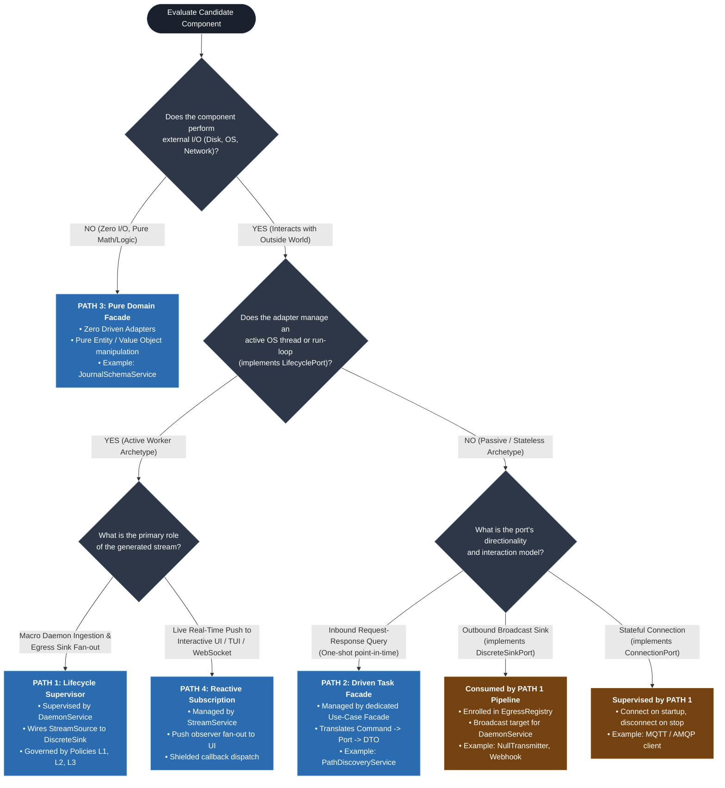

# Driven Adapter Interaction Path Selection Criteria and Decision Framework

This document defines the formal decision framework, evaluation heuristics, and taxonomy matrices that govern how any Driven Adapter (`src/infrastructure/`) or domain capability is mapped to one of the **Four Canonical Hexagonal Interaction Paths**.

---

## 1. The Core Architectural Axiom

In Pure Hexagonal Architecture, the choice of interaction path is **deterministic, not subjective**.

> **Selection Axiom:** The interaction path is dictated strictly by the conjunction of:
> 1. **The Domain Port Capability Archetype** implemented by the driven adapter (`LifecyclePort`, `StreamSourcePort`, `DiscreteSinkPort`, `ConnectionPort`, `TransactionalPort`).
> 2. **The Temporal Cadence and Consumer Topology** required by the driving surface (One-shot Request vs. Continuous Ingestion vs. Push Observer).

```text
  [Port Capability Archetype]  +  [Temporal Cadence & Consumer]  ===>  Interaction Path (1, 2, 3, or 4)
```

---

## 2. Decision Tree Flowchart

The following flowchart provides the step-by-step evaluation procedure for selecting the correct path:



---

## 3. The Four Evaluation Criteria Dimensions

Every component is evaluated across four orthogonal dimensions:

### Dimension 1: Concurrency Archetype (Active vs. Passive)
* **Active Adapters:** Encapsulate operating system resources that execute concurrently (daemon worker threads, file polling loops, async task reactors). They implement `LifecyclePort` (`start()`, `stop()`, `is_active`).
  * *Routing Rule:* Active adapters **must never be invoked ad-hoc**. They require the deterministic supervision of **Path 1 (`DaemonService`)** to guarantee clean thread join on shutdown (`SIGINT`/`SIGTERM`) adhering to Policies L1–L3.
* **Passive Adapters:** Execute synchronously on the caller's thread or act as stateless receivers. They have no lifecycle hooks.
  * *Routing Rule:* Passive adapters are invoked on-demand via **Path 2** or act as passive sinks in **Path 1**.

### Dimension 2: Data Flow Directionality (Source vs. Sink vs. Request)
* **Inbound Stream Source (`StreamSourcePort`):** Continually produces telemetry records (e.g. `FileSystemWatcher`).
  * If routed to external broadcast sinks $\rightarrow$ **Path 1**.
  * If routed to an interactive UI subscriber $\rightarrow$ **Path 4**.
* **Outbound Broadcast Sink (`DiscreteSinkPort`):** Consumes payloads emitted by the pipeline (e.g. `NullTransmitter`, REST logger, WebSocket publisher).
  * *Routing Rule:* Enrolled in `EgressRegistry` and broadcast to by **Path 1**.
* **Bidirectional / Request-Response (`Port` with point-in-time queries):** Takes an input parameter, performs I/O, and returns a result (e.g. `PathDiscovererPort`).
  * *Routing Rule:* Directly encapsulated by a dedicated **Path 2** Use-Case Facade.

### Dimension 3: Temporal Cadence (Point-in-Time vs. Continuous Stream)
* **Point-in-Time (One-Shot):** The operation has a bounded beginning and end during the execution of a single command (e.g. discovering where files live, checking disk space).
  * *Routing Rule:* Maps strictly to **Path 2** (or **Path 3** if computational).
* **Continuous (Streaming):** The operation remains active across the lifetime of the process, reacting to unpredictable external events.
  * *Routing Rule:* Maps strictly to **Path 1** or **Path 4**.

### Dimension 4: Environmental Dependency (External I/O vs. In-Memory)
* **External I/O Required:** Touches disk, registry, network sockets, environment variables, or OS system calls.
  * *Routing Rule:* Requires an adapter in `src/infrastructure/` and domain port routing via **Path 1, 2, or 4**.
* **Zero External I/O (Pure Computation):** Operates strictly on primitives, memory buffers, or in-memory domain models.
  * *Routing Rule:* Maps to **Path 3 (Pure Domain Facade)**. No infrastructure adapters are permitted.

---

## 4. Comprehensive Adapter Classification Matrix

The following matrix classifies all existing and planned adapters in the `ed-telemetry` ecosystem:

| Component | Layer | Port Capability Archetype | Temporal Cadence | Directionality | Target Interaction Path | Managing Service / Facade |
| :--- | :--- | :--- | :--- | :--- | :---: | :--- |
| **`FileSystemWatcher`** | `src/infrastructure/watcher/` | `LifecyclePort` + `StreamSourcePort` | Continuous | Inbound Source | **Path 1** | `DaemonService` (Macro Supervisor) |
| **`FileSystemWatcher`** (TUI mode) | `src/infrastructure/watcher/` | `StreamSourcePort` | Continuous | Inbound Source | **Path 4** | `TelemetryStreamService` (Observer Push) |
| **`NullTransmitter`** | `src/infrastructure/egress/` | `DiscreteSinkPort` | Event-driven | Outbound Sink | **Path 1** (as sink) | `EgressRegistry` (Broadcast Target) |
| **`WebSocketTransmitter`** (Planned) | `src/infrastructure/egress/` | `DiscreteSinkPort` | Event-driven | Outbound Sink | **Path 1** (as sink) | `EgressRegistry` (Broadcast Target) |
| **`WindowsPathStrategy`** | `src/infrastructure/watcher/discovery/` | `PathDiscovererPort` | One-shot | Inbound Query | **Path 2** | `PathDiscoveryService` |
| **`LinuxProtonStrategy`** | `src/infrastructure/watcher/discovery/` | `PathDiscovererPort` | One-shot | Inbound Query | **Path 2** | `PathDiscoveryService` |
| **`JournalEventParser`** | `src/domain/models/` | *None (Pure Entity)* | One-shot | Pure Computation | **Path 3** | `JournalSchemaService` |
| **`RouteBurnCalculator`** | `src/domain/models/` | *None (Pure Value Object)* | One-shot | Pure Computation | **Path 3** | `NavigationCalculationService` |

---

## 5. Architectural Anti-Patterns to Prevent

When designing or onboarding new adapters, the following anti-patterns violate these selection criteria:

### Anti-Pattern 1: The "Direct Driving Touch" (Bypassing Services)
* **Violation:** A Driving Adapter (CLI) imports and calls a Driven Adapter directly:
  ```python
  # FORBIDDEN: CLI importing infrastructure directly
  from infrastructure.watcher.discovery.strategies.windows import WindowsPathStrategy

  path = WindowsPathStrategy().find_candidates()
  ```
* **Correction:** The Driving Adapter must obtain the Use-Case Facade from `ApplicationContext`:
  ```python
  # CORRECT: Driving Adapter accesses facade via ApplicationContext
  path_dto = app_ctx.path_discovery_service.discover_path()
  ```
* **Enforcement:** Statically flagged by `import-linter` (Invariant G).

### Anti-Pattern 2: The "Rogue Thread Spawner" (Unsupervised Lifecycle)
* **Violation:** Creating an adapter with a background thread loop and calling `.start()` directly from a Path 2 functional facade or CLI command without `DaemonService` supervision.
* **Correction:** Any adapter implementing `LifecyclePort` must be registered in an adapter registry and supervised by **Path 1 (`DaemonService`)** to ensure deterministic join on shutdown.

### Anti-Pattern 3: The "Unnecessary Port" (I/O Mocking for Pure Math)
* **Violation:** Creating a Domain Port and Infrastructure Adapter for logic that does not touch external I/O (e.g. creating an `EvaluationPort` and `MathAdapter` to parse JSON strings).
* **Correction:** Pure business calculations belong directly in `src/domain/`. Route through **Path 3 (Pure Domain Facade)** with zero adapters.

### Anti-Pattern 4: The "Dangling Sink" (Direct Outbound Transmission)
* **Violation:** A functional service directly grabbing a transmitter adapter from `EgressRegistry` and calling `.send()` ad-hoc.
* **Correction:** Outbound broadcasting is coordinated as part of the telemetry pipeline managed by **Path 1 (`DaemonService`)**.

---

## 6. Disambiguation Rules for Creating Companion Use-Case Facades

When an adapter implements `LifecyclePort` (e.g. `FileSystemWatcher`), architects must determine which capabilities belong in the macro lifecycle loop vs. a companion Path 2 Use-Case Facade:

### Rule 1: The Actor Intent Test (Cockburn Sea-Level Use-Case)
Does an external human actor (CLI operator) or driving client have a discrete, non-continuous operational goal that completes in a single request-response cycle?
* Continuous process supervision (`ed-telemetry run`) belongs in **Path 1 (`DaemonService`)**.
* Discrete status inquiry (`ed-telemetry status`) or pre-flight doctor checks (`ed-telemetry doctor`) justify a **Path 2 Facade (`WatcherService`)**.

### Rule 2: The Lifecycle Exclusion Boundary
Use-case facades for lifecycle adapters are restricted strictly to capabilities that are **not** part of the continuous event loop:
* **Lifecycle Loop (Path 1):** Spawning worker threads, stopping threads, joining threads, continuous event dispatching.
* **Companion Facade (Path 2):** Introspection (`get_status()`, reading current journal path, query lines read), declarative configuration adjustments, or on-demand cache flushing.

### Rule 3: The Multi-Adapter Aggregation Principle
When a business query requires checking the state of multiple adapters across different registries (e.g. checking both inbound watcher health and outbound network transmitter readiness), encapsulate that aggregation into a single specialized facade (e.g. `HealthDiagnosticService`) rather than forcing the caller to query multiple low-level services.

### Decision Checklist for Companion Facade Creation

| Step | Evaluation Question | If YES | If NO |
| :---: | :--- | :--- | :--- |
| **1** | Is the operation part of starting, stopping, or running the continuous event loop? | **DO NOT create a facade method.** Belongs in `DaemonService`. | Proceed to Step 2. |
| **2** | Does a driving client (CLI/REST) require on-demand access to this capability? | Proceed to Step 3. | **DO NOT expose.** Keep internal to adapter. |
| **3** | Is it a read-only query (status, health metrics, current file)? | **Create a Query Method** on a Path 2 facade (`get_status()`). | Proceed to Step 4. |
| **4** | Is it a point-in-time command (rescan directory, adjust polling interval)? | **Create an Action Method** on a Path 2 facade (`rescan()`). | Keep internal to adapter. |
