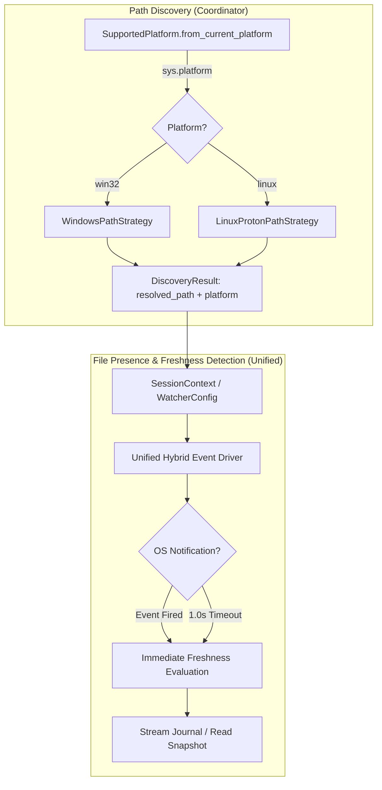
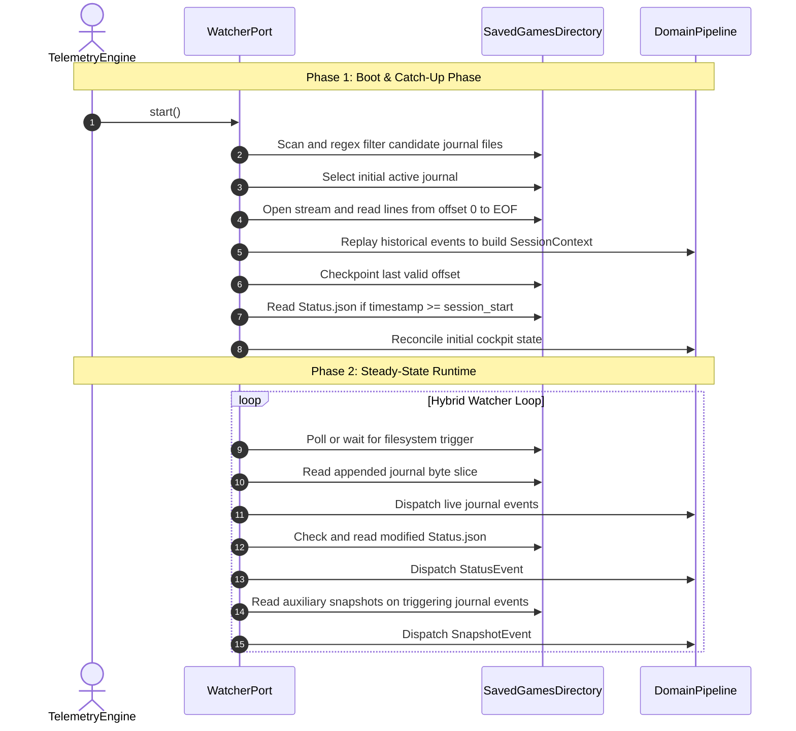
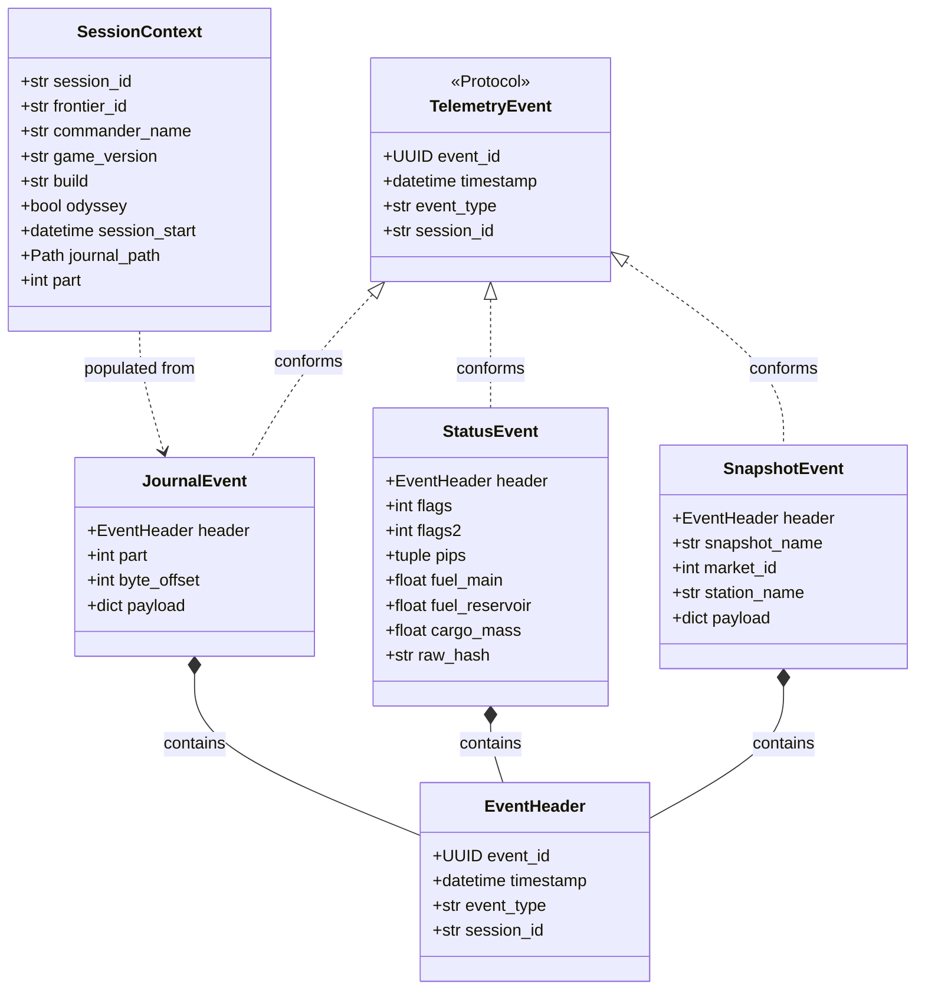

# Pre-ADR Architectural Considerations: File Discovery, Presence & Freshness Detection

## 1. Scope Boundary & Phase Naming

### Scoped Phase Name: **File Presence & Freshness Detection (FPFD)**
This architectural phase is strictly confined to:
1. Determining if a candidate target file physically exists.
2. Confirming the file contains readable, non-empty content (`st_size > 0`).
3. Determining if that content has not yet been processed (unseen byte offsets or modified payload checksum).

**Excluded from this phase:**
- Downstream JSON decoding.
- Domain schema validation.
- Business event dispatch.

---

## 2. Directory Access, File Locking & Concurrent Access Semantics

### 2.1 The Challenge: Windows File Sharing vs. POSIX Descriptors
When Frontier Developments (FDev) runs on Windows, the game engine opens journal log files (`Journal.*.log`) with append mode and shared read (`FILE_SHARE_READ`). However, snapshot files (`Status.json`, `Market.json`) are frequently reopened with truncate/write flags.

If external tools attempt to access files without proper sharing flags, the Windows kernel rejects the open call with:
```text
PermissionError: [WinError 32] The process cannot access the file because it is being used by another process.
```

### 2.2 Analysis of Reference Implementation (EDMarketConnector)
In [monitor.py](file:///home/michael/src/github.com/mnaatjes/EDMarketConnector/monitor.py#L375) and [dashboard.py](file:///home/michael/src/github.com/mnaatjes/EDMarketConnector/dashboard.py#L182), EDMC performs:
```python
# Journal opening (unbuffered binary read):
loghandle = open(logfile, "rb", 0)

# Snapshot opening:
with open(status_json_path, "rb") as h:
    data = h.read().strip()
```
- **How EDMC avoids locks:** EDMC does **not** invoke low-level Win32 `CreateFileW` calls. Instead, it relies on Python's standard C runtime (CRT) `open(..., 'rb')`.
- In modern Python (3.10+) on Windows, the underlying MSVCRT implementation of `open()` in read mode requests read sharing (`FILE_SHARE_READ | FILE_SHARE_WRITE`), permitting concurrent access alongside FDev's append/write operations.
- However, for snapshot files (`Status.json`), EDMC occasionally hits sharing collisions or zero-byte buffers during in-place truncation. EDMC mitigates this simply by wrapping reads in `try...except Exception:` blocks, catching errors silently, and waiting for the next 1-second polling iteration.

### 2.3 Evaluated Solution Options for Directory & File Access

#### Option A: Standard Library Ephemeral Read with Transient Retry (Recommended)
- **Mechanism**:
  - Open files using Python standard `open(path, 'rb')`.
  - For streaming journals, maintain an open handle with non-blocking line reading.
  - For snapshots, open, read complete bytes, and immediately close handle (`path.read_bytes()`).
  - Guard transient `PermissionError` (sharing violation) or `JSONDecodeError` (truncation race) with bounded exponential backoff (e.g., 20ms, 40ms, 80ms; up to 3 retries).
- **Pros**: Clean, cross-platform standard library code; zero C-extension or platform dependency.
- **Cons**: Relies on retry backoff rather than deterministic lock coordination.

#### Option B: Low-Level Win32 `_winapi.CreateFile` with Explicit `FILE_SHARE_*` Flags
- **Mechanism**:
  - On Windows, bypass `open()` and call `_winapi.CreateFile(path, GENERIC_READ, FILE_SHARE_READ | FILE_SHARE_WRITE | FILE_SHARE_DELETE, ...)`.
  - Wrap handle into C file descriptor via `msvcrt.open_osfhandle()` and `os.fdopen()`.
- **Pros**: Explicit, deterministic kernel sharing flags directly matching Win32 SDK.
- **Cons**: High platform coupling; introduces divergent Windows/POSIX I/O drivers for file opening; unnecessary given modern CRT read behavior.

#### Recommendation
Adopt **Option A**. Standard library `open(..., 'rb')` provides full read-sharing compatibility when combined with an exponential backoff retry guard.

---

## 3. Consideration 1: Divergent OS Flows & Propagation of Platform Context



### Architectural Resolution: Where Divergence is Confined
The platform context must not leak across business logic. We propagate the operating system context cleanly while avoiding architectural anti-patterns:

1. **Rejection of Ambient "Context" Objects**:
   - An ambient `WatcherContext` or bag-of-properties threaded up and down function calls is **strictly rejected** as a God Object / Trampoline Data anti-pattern.
   - Low-level functions (file tailers, sort key evaluators, hashers) must accept strictly narrow, explicit primitives (`Path`, `int`, `file handle`). They must not accept broad context envelopes.
2. **Model Enrichment in `DiscoveryResult`**:
   - `DiscoveryResult` ([models.py](file:///home/michael/src/github.com/mnaatjes/ed-telemetry/packages/ed_watcher/discovery/models.py#L29-L34)) is updated directly to include the detected host execution platform:
   ```python
   @dataclass(frozen=True)
   class DiscoveryResult:
       resolved_path: Path
       discovery_source: str
       platform: SupportedPlatform
   ```
   - The coordinator / composition root inspects `DiscoveryResult.platform` once at initialization time to configure platform-tuned parameters (e.g. timeout frequencies) without leaking OS details into inner file ingestion routines.
3. **Unified Outer Abstraction**:
   The `WatcherPort` contract remains $100\%$ unified:
   ```
   PathDiscoverer -> FilePresenceDetector -> FreshnessChecker -> Stream/ReadAdapter
   ```
4. **Driver Confinement**:
   Platform divergence is confined strictly to:
   - **Path Resolution** (already decoupled in `packages/ed_watcher/discovery/strategies/`).
   - **Filesystem Event Driver Tuning**: If running on Linux/Proton over Wine or network mount points where `inotify` events may not propagate reliably, the hybrid event driver applies a shorter fallback polling tick (e.g., 500ms vs. 1000ms). The ingestion engine itself executes identical logic across all platforms.

---

## 4. Consideration 2: Execution Order of File Ingestion



### Execution Order Rules:
1. **Journal Precedes Snapshots on Boot**: The active journal must be read before snapshots because `Fileheader`, `Commander`, and `LoadGame` establish the active `SessionContext` (`session_start`, `FID`, `Odyssey`).
2. **Freshness Gating**: Any snapshot whose payload `timestamp < session_start` is discarded as stale residue from a prior session.
3. **Steady-State Priority**:
   - **Priority 1 (High)**: Journal delta stream (real-time telemetry).
   - **Priority 2 (Medium)**: `Status.json` cockpit state changes (~1.0 Hz).
   - **Priority 3 (Reactive)**: Auxiliary snapshots (`Market.json`, `Cargo.json`) read strictly when triggered by corresponding journal events.

---

## 5. Consideration 3: Ingestion Strategy: Full Read vs. Delta Monitoring

| Target File | Ingestion Strategy | Freshness Metric | Rationale |
| :--- | :--- | :--- | :--- |
| **Journal Files (`Journal.*.log`)** | **Delta Stream (Offset Checkpointing)** | `current_size > last_processed_offset` | Append-only logs grow continuously. Re-reading entire files on every append is an $O(N)$ CPU and I/O anti-pattern. |
| **Status Snapshot (`Status.json`)** | **Delta Ingestion via Content Hashing** | `stat().st_mtime` change AND `hash(raw_bytes) != last_hash` | Small file (~1-2 KB), overwritten ~1s. Read in whole, but only dispatched if raw content hash changes. |
| **Event Snapshots (`Market.json`, etc.)** | **One-Shot Whole Read on Trigger** | Triggered by Journal Event AND `file.exists()` | Read completely upon receipt of triggering journal event, dispatched once, and cached. |

---

## 6. Consideration 4: Candidate Selection Strategies for Active Journal

*Note: The choice of candidate selection algorithm is an open architectural decision with multiple viable options.*

### Evaluated Candidate Selection Strategies

#### Strategy 1: Filesystem Creation Time (`os.path.getctime`)
- **Mechanism**: `max(journal_files, key=os.path.getctime)`.
- **Pros**: Direct and simple; historical convention used by EDMC.
- **Cons**:
  - `ctime` is **not portable**: On Windows it means file creation (birth time), while on POSIX/Linux it represents metadata change time (`st_ctime`).
  - Restoring files from archives or cloud sync resets `ctime` out of game chronological order.

#### Strategy 2: Filesystem Modification Time (`os.path.getmtime`)
- **Mechanism**: `max(journal_files, key=os.path.getmtime)`.
- **Pros**: Portable across Windows and POSIX; reflects the file most recently written to.
- **Cons**: An external process, backup tool, or touch utility can update `mtime` on an old journal, causing false selection.

#### Strategy 3: Canonical Filename Timestamp & Part Parsing (Lexicographical Domain Key)
- **Mechanism**:
  Parse the embedded timestamp and part number directly from the filename regex:
  ```python
  def journal_sort_key(filepath: Path) -> tuple[datetime, int]:
      match = JOURNAL_FILE_REGEX.match(filepath.name)
      if match:
          ts = parse_journal_timestamp(match.group("timestamp"))
          part = int(match.group("part"))
          return (ts, part)
      return (datetime.min, 0)
  ```
  Select: `max(journal_files, key=journal_sort_key)`.
- **Pros**:
  - **100% deterministic and portable**: Immune to filesystem metadata corruption, file copying, timezone shifts, and archive restoration.
  - Matches the game engine's true chronological generation order.
- **Cons**: Requires parsing timestamp strings from filenames.

#### Strategy 4: Composite Lexicographical & Metadata Sort (Recommended)
- **Mechanism**:
  Combines filename domain regex extraction with filesystem `st_mtime` metadata into a deterministic tuple sort key:
  ```python
  def composite_journal_sort_key(filepath: Path) -> tuple[datetime, int, float]:
      """
      Composite sort key for Journal log candidate selection.

      Evaluates:
      1. Primary: Parsed ISO/compact timestamp from filename (chronological game order)
      2. Secondary: Part number sequence (e.g. 01 -> 02 rollover within same session)
      3. Tertiary: Filesystem st_mtime as tiebreaker for malformed filenames or non-matching logs
      """
      match = JOURNAL_FILE_REGEX.match(filepath.name)
      if match:
          ts = parse_journal_timestamp(match.group("timestamp"))
          part = int(match.group("part"))
          return (ts, part, filepath.stat().st_mtime)
      return (datetime.min, 0, filepath.stat().st_mtime)
  ```
  Select active file via:
  ```python
  active_journal = max(candidate_files, key=composite_journal_sort_key)
  ```
- **Pros**:
  - **Immune to Platform Metadata Inconsistencies**: Bypasses the divergence between Windows birthtime and Linux POSIX metadata change time (`st_ctime`).
  - **Archive & Cloud-Sync Safe**: Restoring files or copying them across disks preserves filename timestamps even when filesystem timestamps are wiped.
  - **Session Rollover Resilient**: Correctly ranks `02.log` over `01.log` even if both share identical creation or start timestamps.
  - **Graceful Fallback**: If a test fixture or simulated log has a non-standard timestamp string, it falls back gracefully to `st_mtime`.
- **Cons**: Minor overhead of evaluating regex and parsing datetime during the initial startup discovery scan ($O(N)$ once at boot).

---

## 7. Consideration 5: Stream vs. Read Decision: Impact on Flow & Fallback Strategies

### Impact on Flow
- **Journals (Streaming)**:
  - Persistent read-only handle maintained across turns.
  - Non-blocking byte slice reads up to `EOF`.
  - Handle remains open; `last_offset = handle.tell()` is saved after each parsed line.
- **Snapshots (Read in Whole)**:
  - Transient open-read-close lifecycle.
  - Avoids holding persistent locks on files that FDev frequently truncates.

### Fallback & Recovery Strategies
1. **Truncation Race on Snapshots**:
   - Calling `read_bytes()` during an FDev write cycle returns `0` bytes or truncated JSON.
   - *Fallback*: Do not advance freshness state. Retain previous valid snapshot. Execute exponential backoff retry (20ms, 40ms, 80ms).
2. **Incomplete Line Flush on Journal**:
   - The game engine writes a line but has only flushed partial bytes before the watcher reaches `EOF`.
   - *Fallback*: Verify buffer ends in newline (`\n`). If trailing byte is not `\n`, seek back to `last_offset` and yield.
3. **Journal Part Rotation Rollover**:
   - Game client closes `01.log` and opens `02.log`.
   - *Fallback*: When `EOF` is reached on `01.log`, perform directory presence check for successor `02.log`. When detected, drain `01.log` completely, close descriptor, and transition stream to `02.log`.

---

## 8. Tooling & Technology Inventory

| Tool / Library | Status | Role in FPFD Phase | Rationale |
| :--- | :--- | :--- | :--- |
| **`pathlib.Path`** | Existing (Stdlib) | Path normalization & existence checking | Standardized cross-platform path handling. |
| **`re`** | Existing (Stdlib) | Filename regex parsing (`JOURNAL_FILE_REGEX`) | Extracts timestamp, build prefix, and part number. |
| **`hashlib` (BLAKE2b)** | Existing (Stdlib) | Snapshot content hashing | Fast $O(1)$ change detection for `Status.json` raw bytes without JSON deserialization overhead. |
| **`asyncio` / `threading`** | Existing (Stdlib) | Event loop & timeout ticker | Drives the hybrid event-wait + 1.0s timeout polling loop. |
| **`watchdog`** | **New (Proposed)** | OS filesystem event monitoring (`on_created`, `on_modified`) | Native OS notification drivers (`inotify` on Linux, `ReadDirectoryChangesW` on Windows). |
| **`_winapi` / `msvcrt`** | Existing (Stdlib) | Windows-specific low-level verification (if needed) | Available as fallback if standard library file opening requires low-level share flags. |

---

## 9. Domain Models Representation & Evaluation of the "Ur-Event" Pattern

### 9.1 Evaluation: State (`SessionContext`) vs. Stream (`TelemetryEvent`)

#### Why is `TelemetryEvent` necessary if `SessionContext` already exists?
- **`SessionContext` is Entity State (The "Who & Where")**:
  It represents the persistent, slowly changing environmental envelope of the active session (Commander name, Frontier ID, game version, active journal path, start time). It is a reference entity updated on major transitions.
- **`TelemetryEvent` is Stream Occurrences (The "What Happened & When")**:
  It represents discrete time-series occurrences passing through time (e.g. `FSDJump`, `FuelStatus`, `CargoPickup`, `Docked`). A single `SessionContext` spans tens of thousands of `TelemetryEvent` instances.
- **Egress & Decoupling**: Downstream consumers (WebSockets, UI dashboards, telemetry exporters) subscribe to a stream of `TelemetryEvent` instances; they query `SessionContext` only when establishing session bounds or account identity.

#### Event Collection & Retention:
- **In-Memory Ring Buffering**: The domain engine maintains an in-memory sliding window (e.g. ring buffer of the last $N=1,000$ events). This enables:
  1. Replaying dropped events to reconnecting clients without re-reading disks.
  2. Querying recent flight history (e.g. "last 5 systems jumped").
  3. Boundary contract verification during testing.

#### Event Identifiers & Idempotency:
- **Should events have UUIDs?**
  **Yes, using Deterministic UUIDs (UUIDv5 or UUIDv7) rather than random UUIDv4**:
  - *The Danger of Random UUIDv4*: If the watcher restarts and replays historical journal lines from offset 0, every replayed event would receive a new random UUIDv4, destroying idempotency and polluting downstream databases with duplicates.
  - *Deterministic Identifier Strategy*:
    - **Journal Events**: Deterministically hashed from `UUIDv5(namespace, f"{session_id}:{part}:{byte_offset}")`.
    - **Status Events**: Deterministically hashed from `UUIDv5(namespace, f"{session_id}:{timestamp}:{raw_hash}")`.
    - **Snapshot Events**: Deterministically hashed from `UUIDv5(namespace, f"{session_id}:{snapshot_name}:{timestamp}")`.

#### Heritability Evaluation: Classical OOP vs. Protocol Composition:
- **No Heavy Inheritance Trees**:
  `SessionContext` is an entity, **not** an event; it does not inherit from `TelemetryEvent`.
  `JournalEvent`, `StatusEvent`, and `SnapshotEvent` do not inherit from a shared concrete base class. Instead, they share a flat, standardized `EventHeader` component and conform to the `TelemetryEvent` protocol.

---

### 9.2 Proposed Domain Models Architecture



---

### 9.3 Concrete Model Definitions (`packages/ed_domain/models/`)

```python
from __future__ import annotations

from dataclasses import dataclass
from datetime import datetime
from pathlib import Path
from typing import Any, Mapping, Protocol, runtime_checkable
from uuid import UUID


@runtime_checkable
class TelemetryEvent(Protocol):
    """Minimal structural protocol satisfied by all inbound telemetry events."""

    @property
    def event_id(self) -> UUID: ...

    @property
    def timestamp(self) -> datetime: ...

    @property
    def event_type(self) -> str: ...

    @property
    def session_id(self) -> str: ...


@dataclass(frozen=True)
class EventHeader:
    """Universal immutable envelope header for stream telemetry."""

    event_id: UUID
    timestamp: datetime
    event_type: str
    session_id: str


@dataclass(frozen=True)
class SessionContext:
    """
    Stateful session envelope established during boot replay.

    Reconciles game executable context and player identity from
    initial Fileheader, LoadGame, and Commander events.
    """

    session_id: str
    frontier_id: str | None
    commander_name: str | None
    game_version: str
    build: str
    odyssey: bool
    session_start: datetime
    active_journal_path: Path
    part: int


@dataclass(frozen=True)
class JournalEvent:
    """Discrete event streamed from an active Journal.*.log line."""

    header: EventHeader
    part: int
    byte_offset: int
    payload: Mapping[str, Any]

    @property
    def event_id(self) -> UUID:
        return self.header.event_id

    @property
    def timestamp(self) -> datetime:
        return self.header.timestamp

    @property
    def event_type(self) -> str:
        return self.header.event_type

    @property
    def session_id(self) -> str:
        return self.header.session_id


@dataclass(frozen=True)
class StatusEvent:
    """
    Real-time cockpit HUD and vehicle state snapshot (from Status.json).

    Specialty vs. Auxiliary Snapshots:
    - Cadence: Unlike reactive snapshots (Market.json, etc.) written on menu interaction,
      Status.json is an autonomous, continuous telemetry heartbeat overwritten at ~1.0 Hz
      and immediately on cockpit state toggles.
    - Conditional Schema: Invariant properties (timestamp, event, flags) are always emitted.
      However, context properties are sparse/conditional: pips/fuel are emitted only in-ship,
      latitude/altitude only in planetary proximity, oxygen/health only on-foot, and
      destination only when actively nav-targeted. All conditional telemetry fields default to None.
    """

    header: EventHeader
    flags: int = 0
    flags2: int = 0
    pips: tuple[int, int, int] | None = None
    firegroup: int | None = None
    gui_focus: int | None = None
    fuel_main: float | None = None
    fuel_reservoir: float | None = None
    cargo_mass: float | None = None
    legal_state: str | None = None
    balance: int | None = None
    latitude: float | None = None
    longitude: float | None = None
    altitude: float | None = None
    heading: float | None = None
    body_name: str | None = None
    planet_radius: float | None = None
    oxygen: float | None = None
    health: float | None = None
    temperature: float | None = None
    selected_weapon: str | None = None
    gravity: float | None = None
    raw_hash: str = ""

    @property
    def event_id(self) -> UUID:
        return self.header.event_id

    @property
    def timestamp(self) -> datetime:
        return self.header.timestamp

    @property
    def event_type(self) -> str:
        return self.header.event_type

    @property
    def session_id(self) -> str:
        return self.header.session_id


@dataclass(frozen=True)
class SnapshotEvent:
    """Discrete auxiliary snapshot (Market.json, Cargo.json, NavRoute.json, etc.)."""

    header: EventHeader
    snapshot_name: str  # "Market.json"
    market_id: int | None
    station_name: str | None
    system_address: int | None
    payload: Mapping[str, Any]

    @property
    def event_id(self) -> UUID:
        return self.header.event_id

    @property
    def timestamp(self) -> datetime:
        return self.header.timestamp

    @property
    def event_type(self) -> str:
        return self.header.event_type

    @property
    def session_id(self) -> str:
        return self.header.session_id
```
