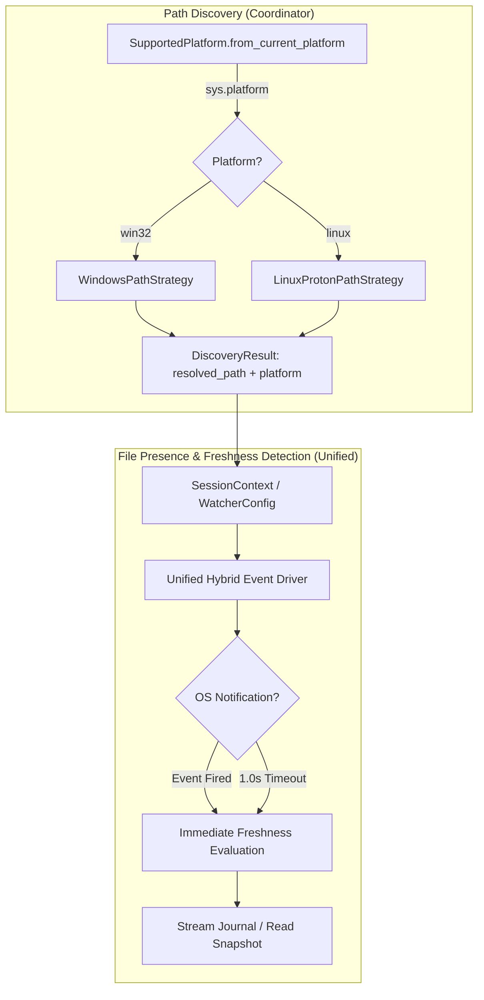
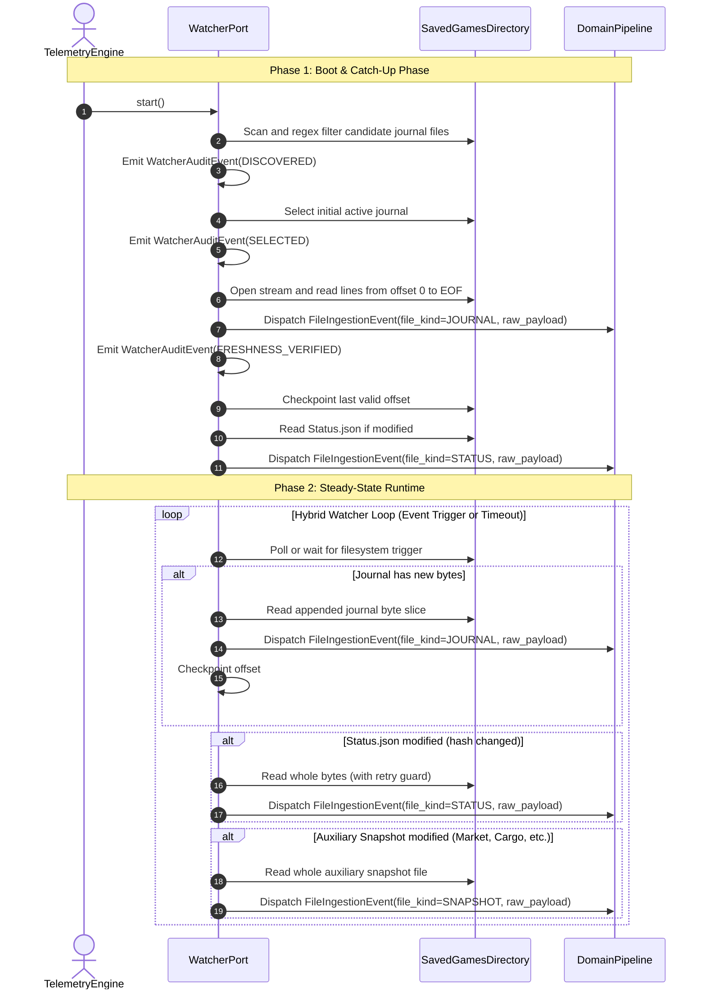
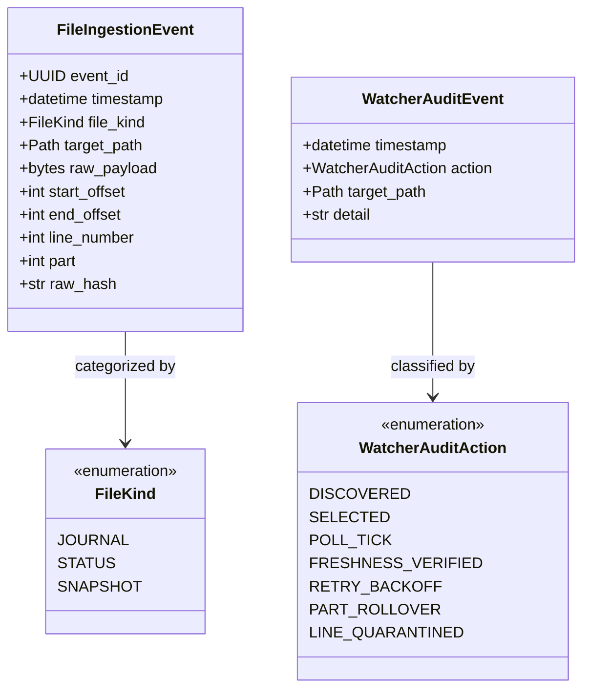

# Pre-ADR Architectural Considerations: File Discovery, Presence & Freshness Detection

## 1. Scope Boundary & Phase Naming

### Scoped Phase Name: **File Presence & Freshness Detection (FPFD)**
This architectural phase is strictly confined to:
1. Determining if a candidate target file physically exists.
2. Confirming the file contains readable, non-empty content (`st_size > 0`).
3. Determining if that content has not yet been processed (unseen byte offsets or modified payload checksum).

**Excluded from this phase:**
- Downstream JSON decoding.
- Domain schema validation.
- Business event dispatch.

---

## 2. Directory Access, File Locking & Concurrent Access Semantics

### 2.1 The Challenge: Windows File Sharing vs. POSIX Descriptors
When Frontier Developments (FDev) runs on Windows, the game engine opens journal log files (`Journal.*.log`) with append mode and shared read (`FILE_SHARE_READ`). However, snapshot files (`Status.json`, `Market.json`) are frequently reopened with truncate/write flags.

If external tools attempt to access files without proper sharing flags, the Windows kernel rejects the open call with:
```text
PermissionError: [WinError 32] The process cannot access the file because it is being used by another process.
```

### 2.2 Analysis of Reference Implementation (EDMarketConnector)
In [monitor.py](file:///home/michael/src/github.com/mnaatjes/EDMarketConnector/monitor.py#L375) and [dashboard.py](file:///home/michael/src/github.com/mnaatjes/EDMarketConnector/dashboard.py#L182), EDMC performs:
```python
# Journal opening (unbuffered binary read):
loghandle = open(logfile, "rb", 0)

# Snapshot opening:
with open(status_json_path, "rb") as h:
    data = h.read().strip()
```
- **How EDMC avoids locks:** EDMC does **not** invoke low-level Win32 `CreateFileW` calls. Instead, it relies on Python's standard C runtime (CRT) `open(..., 'rb')`.
- In modern Python (3.10+) on Windows, the underlying MSVCRT implementation of `open()` in read mode requests read sharing (`FILE_SHARE_READ | FILE_SHARE_WRITE`), permitting concurrent access alongside FDev's append/write operations.
- However, for snapshot files (`Status.json`), EDMC occasionally hits sharing collisions or zero-byte buffers during in-place truncation. EDMC mitigates this simply by wrapping reads in `try...except Exception:` blocks, catching errors silently, and waiting for the next 1-second polling iteration.

### 2.3 Evaluated Solution Options for Directory & File Access

#### Option A: Standard Library Ephemeral Read with Transient Retry (Recommended)
- **Mechanism**:
  - Open files using Python standard `open(path, 'rb')`.
  - For streaming journals, maintain an open handle with non-blocking line reading.
  - For snapshots, open, read complete bytes, and immediately close handle (`path.read_bytes()`).
  - Guard transient `PermissionError` (sharing violation) or `JSONDecodeError` (truncation race) with bounded exponential backoff (e.g., 20ms, 40ms, 80ms; up to 3 retries).
- **Pros**: Clean, cross-platform standard library code; zero C-extension or platform dependency.
- **Cons**: Relies on retry backoff rather than deterministic lock coordination.

#### Option B: Low-Level Win32 `_winapi.CreateFile` with Explicit `FILE_SHARE_*` Flags
- **Mechanism**:
  - On Windows, bypass `open()` and call `_winapi.CreateFile(path, GENERIC_READ, FILE_SHARE_READ | FILE_SHARE_WRITE | FILE_SHARE_DELETE, ...)`.
  - Wrap handle into C file descriptor via `msvcrt.open_osfhandle()` and `os.fdopen()`.
- **Pros**: Explicit, deterministic kernel sharing flags directly matching Win32 SDK.
- **Cons**: High platform coupling; introduces divergent Windows/POSIX I/O drivers for file opening; unnecessary given modern CRT read behavior.

#### Recommendation
Adopt **Option A**. Standard library `open(..., 'rb')` provides full read-sharing compatibility when combined with an exponential backoff retry guard.

---

## 3. Consideration 1: Divergent OS Flows & Propagation of Platform Context



### Architectural Resolution: Where Divergence is Confined
The platform context must not leak across business logic. We propagate the operating system context cleanly while avoiding architectural anti-patterns:

1. **Rejection of Ambient "Context" Objects**:
   - An ambient `WatcherContext` or bag-of-properties threaded up and down function calls is **strictly rejected** as a God Object / Trampoline Data anti-pattern.
   - Low-level functions (file tailers, sort key evaluators, hashers) must accept strictly narrow, explicit primitives (`Path`, `int`, `file handle`). They must not accept broad context envelopes.
2. **Model Enrichment in `DiscoveryResult`**:
   - `DiscoveryResult` ([models.py](file:///home/michael/src/github.com/mnaatjes/ed-telemetry/packages/ed_watcher/discovery/models.py#L29-L34)) is updated directly to include the detected host execution platform:
   ```python
   @dataclass(frozen=True)
   class DiscoveryResult:
       resolved_path: Path
       discovery_source: str
       platform: SupportedPlatform
   ```
   - The coordinator / composition root inspects `DiscoveryResult.platform` once at initialization time to configure platform-tuned parameters (e.g. timeout frequencies) without leaking OS details into inner file ingestion routines.
3. **Unified Outer Abstraction**:
   The `WatcherPort` contract remains $100\%$ unified:
   ```
   PathDiscoverer -> FilePresenceDetector -> FreshnessChecker -> Stream/ReadAdapter
   ```
4. **Driver Confinement**:
   Platform divergence is confined strictly to:
   - **Path Resolution** (already decoupled in `packages/ed_watcher/discovery/strategies/`).
   - **Filesystem Event Driver Tuning**: If running on Linux/Proton over Wine or network mount points where `inotify` events may not propagate reliably, the hybrid event driver applies a shorter fallback polling tick (e.g., 500ms vs. 1000ms). The ingestion engine itself executes identical logic across all platforms.

---

## 4. Consideration 2: Execution Order of File Ingestion



### Execution Order Rules:
1. **Journal Precedes Snapshots on Boot**: The active journal must be read before snapshots so that the domain layer can establish session bounds from the raw stream before reconciling snapshots.
2. **Freshness Gating**: Any snapshot whose raw content hash or filesystem metadata has not changed is discarded without emitting a `FileIngestionEvent`.
3. **Steady-State Priority**:
   - **Priority 1 (High)**: Journal delta stream (`FileIngestionEvent` with `file_kind=JOURNAL`).
   - **Priority 2 (Medium)**: `Status.json` cockpit state changes (`FileIngestionEvent` with `file_kind=STATUS` at ~1.0 Hz).
   - **Priority 3 (Reactive)**: Auxiliary snapshots (`FileIngestionEvent` with `file_kind=SNAPSHOT`).

---

## 5. Consideration 3: Ingestion Strategy: Full Read vs. Delta Monitoring

| Target File | Ingestion Strategy | Freshness Metric | Rationale |
| :--- | :--- | :--- | :--- |
| **Journal Files (`Journal.*.log`)** | **Delta Stream (Offset Checkpointing)** | `current_size > last_processed_offset` | Append-only logs grow continuously. Re-reading entire files on every append is an $O(N)$ CPU and I/O anti-pattern. |
| **Status Snapshot (`Status.json`)** | **Delta Ingestion via Content Hashing** | `stat().st_mtime` change AND `hash(raw_bytes) != last_hash` | Small file (~1-2 KB), overwritten ~1s. Read in whole, but only dispatched if raw content hash changes. |
| **Event Snapshots (`Market.json`, etc.)** | **One-Shot Whole Read on Trigger** | Triggered by Journal Event AND `file.exists()` | Read completely upon receipt of triggering journal event, dispatched once, and cached. |

---

## 6. Consideration 4: Candidate Selection Strategies for Active Journal

*Note: The choice of candidate selection algorithm is an open architectural decision with multiple viable options.*

### Evaluated Candidate Selection Strategies

#### Strategy 1: Filesystem Creation Time (`os.path.getctime`)
- **Mechanism**: `max(journal_files, key=os.path.getctime)`.
- **Pros**: Direct and simple; historical convention used by EDMC.
- **Cons**:
  - `ctime` is **not portable**: On Windows it means file creation (birth time), while on POSIX/Linux it represents metadata change time (`st_ctime`).
  - Restoring files from archives or cloud sync resets `ctime` out of game chronological order.

#### Strategy 2: Filesystem Modification Time (`os.path.getmtime`)
- **Mechanism**: `max(journal_files, key=os.path.getmtime)`.
- **Pros**: Portable across Windows and POSIX; reflects the file most recently written to.
- **Cons**: An external process, backup tool, or touch utility can update `mtime` on an old journal, causing false selection.

#### Strategy 3: Canonical Filename Timestamp & Part Parsing (Lexicographical Domain Key)
- **Mechanism**:
  Parse the embedded timestamp and part number directly from the filename regex:
  ```python
  def journal_sort_key(filepath: Path) -> tuple[datetime, int]:
      match = JOURNAL_FILE_REGEX.match(filepath.name)
      if match:
          ts = parse_journal_timestamp(match.group("timestamp"))
          part = int(match.group("part"))
          return (ts, part)
      return (datetime.min, 0)
  ```
  Select: `max(journal_files, key=journal_sort_key)`.
- **Pros**:
  - **100% deterministic and portable**: Immune to filesystem metadata corruption, file copying, timezone shifts, and archive restoration.
  - Matches the game engine's true chronological generation order.
- **Cons**: Requires parsing timestamp strings from filenames.

#### Strategy 4: Composite Lexicographical & Metadata Sort (Recommended)
- **Mechanism**:
  Combines filename domain regex extraction with filesystem `st_mtime` metadata into a deterministic tuple sort key:
  ```python
  def composite_journal_sort_key(filepath: Path) -> tuple[datetime, int, float]:
      """
      Composite sort key for Journal log candidate selection.

      Evaluates:
      1. Primary: Parsed ISO/compact timestamp from filename (chronological game order)
      2. Secondary: Part number sequence (e.g. 01 -> 02 rollover within same session)
      3. Tertiary: Filesystem st_mtime as tiebreaker for malformed filenames or non-matching logs
      """
      match = JOURNAL_FILE_REGEX.match(filepath.name)
      if match:
          ts = parse_journal_timestamp(match.group("timestamp"))
          part = int(match.group("part"))
          return (ts, part, filepath.stat().st_mtime)
      return (datetime.min, 0, filepath.stat().st_mtime)
  ```
  Select active file via:
  ```python
  active_journal = max(candidate_files, key=composite_journal_sort_key)
  ```
- **Pros**:
  - **Immune to Platform Metadata Inconsistencies**: Bypasses the divergence between Windows birthtime and Linux POSIX metadata change time (`st_ctime`).
  - **Archive & Cloud-Sync Safe**: Restoring files or copying them across disks preserves filename timestamps even when filesystem timestamps are wiped.
  - **Session Rollover Resilient**: Correctly ranks `02.log` over `01.log` even if both share identical creation or start timestamps.
  - **Graceful Fallback**: If a test fixture or simulated log has a non-standard timestamp string, it falls back gracefully to `st_mtime`.
- **Cons**: Minor overhead of evaluating regex and parsing datetime during the initial startup discovery scan ($O(N)$ once at boot).

---

## 7. Consideration 5: Stream vs. Read Decision: Impact on Flow & Fallback Strategies

### Impact on Flow
- **Journals (Streaming)**:
  - Persistent read-only handle maintained across turns.
  - Non-blocking byte slice reads up to `EOF`.
  - Handle remains open; `last_offset = handle.tell()` is saved after each parsed line.
- **Snapshots (Read in Whole)**:
  - Transient open-read-close lifecycle.
  - Avoids holding persistent locks on files that FDev frequently truncates.

### Fallback & Recovery Strategies
1. **Truncation Race on Snapshots**:
   - Calling `read_bytes()` during an FDev write cycle returns `0` bytes or truncated JSON.
   - *Fallback*: Do not advance freshness state. Retain previous valid snapshot. Execute exponential backoff retry (20ms, 40ms, 80ms).
2. **Incomplete Line Flush on Journal**:
   - The game engine writes a line but has only flushed partial bytes before the watcher reaches `EOF`.
   - *Fallback*: Verify buffer ends in newline (`\n`). If trailing byte is not `\n`, seek back to `last_offset` and yield.
3. **Journal Part Rotation Rollover**:
   - Game client closes `01.log` and opens `02.log`.
   - *Fallback*: When `EOF` is reached on `01.log`, perform directory presence check for successor `02.log`. When detected, drain `01.log` completely, close descriptor, and transition stream to `02.log`.

---

## 8. Tooling & Technology Inventory

| Tool / Library | Status | Role in FPFD Phase | Rationale |
| :--- | :--- | :--- | :--- |
| **`pathlib.Path`** | Existing (Stdlib) | Path normalization & existence checking | Standardized cross-platform path handling. |
| **`re`** | Existing (Stdlib) | Filename regex parsing (`JOURNAL_FILE_REGEX`) | Extracts timestamp, build prefix, and part number. |
| **`hashlib` (BLAKE2b)** | Existing (Stdlib) | Snapshot content hashing | Fast $O(1)$ change detection for `Status.json` raw bytes without JSON deserialization overhead. |
| **`asyncio` / `threading`** | Existing (Stdlib) | Event loop & timeout ticker | Drives the hybrid event-wait + 1.0s timeout polling loop. |
| **`watchdog`** | **New (Proposed)** | OS filesystem event monitoring (`on_created`, `on_modified`) | Native OS notification drivers (`inotify` on Linux, `ReadDirectoryChangesW` on Windows). |
| **`_winapi` / `msvcrt`** | Existing (Stdlib) | Windows-specific low-level verification (if needed) | Available as fallback if standard library file opening requires low-level share flags. |

---

## 9. Watcher I/O & Lifecycle Audit Architecture (FPFD Scope)

### 9.1 Boundary Enforcement: I/O Envelopes vs. Domain Payloads
In alignment with the **File Presence & Freshness Detection (FPFD)** scope boundary (Section 1):
- The watcher subsystem is **strictly responsible for physical file interaction**: detecting existence, verifying non-empty content (`st_size > 0`), evaluating freshness, and extracting raw unparsed byte slices.
- The watcher is **strictly agnostic to internal JSON schemas**: it does not parse game telemetry attributes (`pips`, `fuel`, `cargo`, `body_name`), nor does it validate game business logic.
- To eliminate class proliferation and inheritance boilerplate, the watcher's output is consolidated into two tightly bounded data structures:
  1. **`FileIngestionEvent`**: The raw data I/O carrier emitted whenever fresh bytes are read from any target file.
  2. **`WatcherAuditEvent`**: The operational diagnostic audit record emitted during watcher lifecycle transitions, retries, and error handling.

---

### 9.2 Consolidated Model Architecture



---

### 9.3 Concrete Model Definitions (`packages/ed_watcher/models.py`)

```python
from __future__ import annotations

from dataclasses import dataclass
from datetime import datetime
from enum import StrEnum
from pathlib import Path
from uuid import UUID


class FileKind(StrEnum):
    """Discriminator for target file categories within FPFD scope."""

    JOURNAL = "journal"  # Append-only log stream (Journal.*.log)
    STATUS = "status"  # Fast heartbeat snapshot (Status.json)
    SNAPSHOT = "snapshot"  # Auxiliary state snapshots (Market.json, Cargo.json, etc.)


@dataclass(frozen=True)
class FileIngestionEvent:
    """
    Consolidated I/O record emitted upon extracting raw bytes from a target file.

    Carries file location, byte pointers, line number, and raw unparsed payload.
    Does NOT decode or validate domain JSON schemas.
    """

    event_id: UUID  # Deterministic UUIDv5 based on (path, start_offset, raw_hash)
    timestamp: datetime  # Read timestamp (UTC)
    file_kind: FileKind  # JOURNAL | STATUS | SNAPSHOT
    target_path: Path  # Absolute path to file on disk
    raw_payload: bytes  # Raw unparsed byte content (line or whole file)
    start_offset: int = 0  # Stream start offset (0 for snapshots)
    end_offset: int = 0  # Stream end offset (len(raw_payload) for snapshots)
    line_number: int | None = None  # 1-indexed for journals; None for whole snapshots
    part: int | None = None  # Journal part number (if applicable)
    raw_hash: str = ""  # Content hash (64-bit BLAKE2b used for change detection)


class WatcherAuditAction(StrEnum):
    """Discriminator for watcher operational lifecycle actions."""

    DISCOVERED = "discovered"  # Candidate file detected in directory
    SELECTED = "selected"  # Active journal selected for streaming
    POLL_TICK = "poll_tick"  # Fallback periodic poll completed
    FRESHNESS_VERIFIED = "freshness_verified"  # File determined to have new unread content
    RETRY_BACKOFF = "retry_backoff"  # Transient I/O or truncate race retry
    PART_ROLLOVER = "part_rollover"  # Transitioned from part N to N+1
    LINE_QUARANTINED = "line_quarantined"  # Corrupt or undecodable line isolated


@dataclass(frozen=True)
class WatcherAuditEvent:
    """Internal diagnostic audit record for watcher operations and error tracking."""

    timestamp: datetime
    action: WatcherAuditAction
    target_path: Path
    detail: str = ""
```
