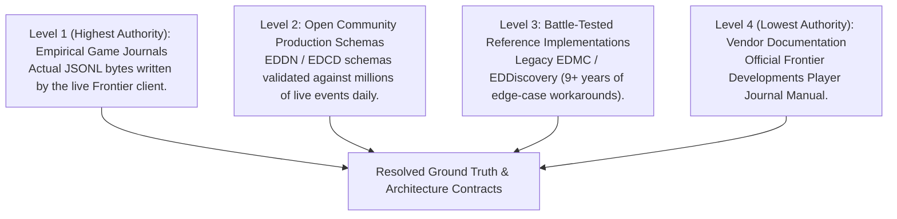
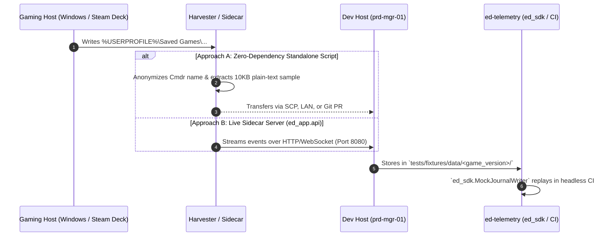

# Technical Exploration: Empirical Data Acquisition, Research Pipeline, and Game Host Topology

## 1. Executive Summary and Problem Statement

Before engineering domain models or live journal tailing mechanics, the development team must obtain verified ground truth regarding **how Elite Dangerous actually writes journal files, which filepaths are used across operating systems, and what event schemas exist**.

This document captures the architectural evaluation, lessons learned from legacy EDMC, and structural design proposals regarding:
1. Ground truth discovery and the **Hierarchy of Truth**.
2. Avoidance of schema brittleness (Tolerant Reader & Event Envelope vs. Rigid Models).
3. The "Split-Machine" problem: Gaming Host (Windows / Steam Deck) vs. Development Host (Linux `prd-mgr-01`).
4. Data transport topologies (Standalone Harvester vs. Sidecar Network Daemon).

---

## 2. Epistemology: The Hierarchy of Truth & Incompleteness

### 2.1 The Long Tail of Game Events
Elite Dangerous produces hundreds of distinct events, many of which are locked behind hundreds of hours of niche gameplay (e.g., Thargoid Titan destruction, fleet carrier hyperjumps, exobiology sampling). A single developer cannot empirically trigger every event. Furthermore, official documentation (Frontier Journal Manuals) frequently lags game updates or omits subtle schema variations.

### 2.2 The 4-Tier Hierarchy of Truth
When sources conflict or provide partial information, decisions must resolve according to an authoritative hierarchy:



---

## 3. Legacy EDMC Architectural Audit & The "Event Envelope"

An audit of `/home/michael/src/github.com/mnaatjes/EDMarketConnector` (`monitor.py`, `plug.py`, `plugins/eddn.py`) revealed that:
* **Legacy EDMC defines ZERO strict Pydantic or dataclass models.**
* It parses raw bytes via `json.loads(line)` into mutable dictionaries (`MutableMapping[str, Any]`), validating only the existence of a `'timestamp'` field.
* **Why it survived 9+ years:** Immunity to game updates. When Frontier adds new events or fields, EDMC never crashes or requires emergency hotfixes.
* **Where it failed:** Mutation of shared state in global dictionaries and deep coupling to Tkinter GUI threads.

### 3.1 Architectural Synthesis: The Immutable Event Envelope
Instead of authoring 150+ brittle models, `ed-telemetry` adopts the **Tolerant Reader / Defensive Envelope Pattern**:

```python
@dataclass(frozen=True, slots=True)
class TelemetryEvent:
    """Immutable envelope for Elite Dangerous journal events."""

    timestamp: datetime
    event_type: str
    payload: Mapping[str, Any]  # Read-only view of the raw game record
```

* **Core Guarantee:** Unrecognized events and unexpected fields are ingested cleanly without crashing.
* **Immutability:** Downstream egress adapters and driving surfaces cannot corrupt shared payloads.
* **Targeted Validation:** Only specific egress adapters (e.g., EDDN) perform schema filtering on the subset of fields they transmit.

---

## 4. The Split-Machine Challenge & Data Harvester Topologies

Development occurs on a headless Linux host (`prd-mgr-01`), while the game runs on a Windows gaming workstation or Steam Deck.



### 4.1 Approach A: Zero-Dependency Standalone Harvester (`scripts/harvest_journal_sample.py`)
* **Deployment:** Downloaded directly onto the gaming PC without installing full `ed-telemetry` or dependencies.
* **Execution:** Scans standard paths:
  - Windows: `%USERPROFILE%\Saved Games\Frontier Developments\Elite Dangerous\`
  - Linux Proton: `~/.steam/steam/steamapps/compatdata/359320/pfx/...`
* **Output:** Extracts the `Fileheader` (`gameversion`, `build`), anonymizes commander names, and generates minimal plain-text `.jsonl` samples (< 20 KB) grouped by game version.
* **Transport:** Outputs to a local folder with optional `--scp user@host:path` delegation to OpenSSH.
* **Pros:** Completely zero-overhead, no Docker or Python virtualenv required on gaming PC.

### 4.2 Approach B: The Live Sidecar Telemetry Server (`ed_app.api`)
* **Concept:** Run `ed-telemetry serve --port 8080` directly on the gaming host.
* **Execution:** Exposes live game events over WebSocket / SSE / REST. A remote client running on `prd-mgr-01` subscribes to the stream and logs events to disk.
* **Evaluation of Docker on Windows Gaming Host:**
  - Running Docker Desktop on Windows requires WSL 2 / Hyper-V and consumes 2–4 GB RAM, introducing undesirable overhead on a gaming rig.
  - Cross-filesystem mounts (`/mnt/c/...`) frequently suffer from dropped `inotify` file-change notifications.
  - **Verdict:** If using a sidecar on Windows, run `ed-telemetry` natively in a lightweight Python virtualenv (< 30 MB RAM) rather than a Docker container. On Linux/Steam Deck hosts, a Docker container or systemd daemon is viable.

---

## 5. Repository Anti-Bloat Governance Rules

To prevent `ed-telemetry` from turning into an unmanageable data pipeline or binary repository:
1. **No Binary Zip Archives in Git:** Harvesters must produce clean, plain-text `.jsonl` and `.json` snippets that can be reviewed as standard text diffs.
2. **Strict Fixture Cap:** Committed test fixtures in `tests/fixtures/data/<game_version>/` must remain under 20 KB per game version.
3. **Ephemeral Staging Directory:** Multi-megabyte raw play session logs must remain in `.gitignore`'d directories (`.cache/research_data/` or `scratch/`).
4. **Invariant B Compliance:** All fixture management and mock simulation tooling must reside strictly in `packages/ed_sdk/` and `scripts/`, never leaking into production runtime packages (`ed_domain`, `ed_watcher`, `ed_app`).

---

## 6. Open Items for Next Session

When resuming this work:
1. **Decision Gate:** Decide whether to implement **Approach A** (standalone `harvest_journal_sample.py` script) or proceed directly to **Approach B** (authoring the real `ed_watcher` file tailer + CLI runner).
2. **Author ADR 0004:** Formalize the Ingestion Strategy, Filesystem Topology Matrix, and Immutable `TelemetryEvent` envelope contract.
3. **Integration Testing Setup:** Wire `ed_sdk.mock_writer.MockJournalWriter` to replay real harvested snippets in CI.
