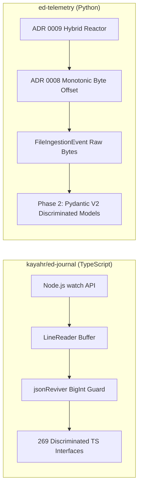

# Repository Research: ed-journal Architectural Implications for ed-telemetry

## 1. Diagnostic: Architectural Synthesis

An investigation of `kayahr/ed-journal` highlights how a modern, statically typed library can cleanly ingest, watch, and parse Elite Dangerous telemetry. Its design validates several foundational decisions in `ed-telemetry` (ADRs 0006–0009) and sets the technical standard for Phase 2 domain modeling.

## 2. Theory: Structural Comparison



## 3. Analysis: Core Architectural Takeaways

### Takeaway 1: Composite Position Metadata (`JournalPosition`)
`ed-journal` models stream location using a tuple of `{ file, offset, line }`.
* **Application to `ed-telemetry`:** `FileIngestionEvent` must carry this exact positional envelope:
  ```python
  class FileIngestionEvent(BaseModel):
      target_path: Path
      start_offset: int
      end_offset: int
      line_number: int | None
      raw_bytes: bytes
      raw_hash: str  # BLAKE2b
  ```
  This guarantees that downstream listeners can log exact physical file coordinates for any malformed or anomalous game events.

### Takeaway 2: Declarative Fast-Forward Positioning
`ed-journal` allows callers to start the stream at `"start"`, `"end"`, or the newest occurrence of a specific event (`"FSDJump"`).
* **Application to `ed-telemetry`:** When developing CLI and TUI tools for `ed-telemetry`, operators rarely want to parse three years of historical exploration journals on application launch. Implementing a `seek_to_latest(event_name="Location")` scanner allows the application to initialize its spatial coordinates in milliseconds without replaying millions of lines.

### Takeaway 3: BigInt / 64-bit Integer Safety
`ed-journal` demonstrates that `SystemAddress`, `MarketID`, and `CommanderID` routinely overflow standard 53-bit float limits.
* **Application to `ed-telemetry`:**
  * In Python, integers have arbitrary precision, avoiding truncation in pure Python code.
  * However, when interacting with fast serialization libraries (e.g., `orjson`, C extensions, or SQLite bindings), schema fields representing addresses and IDs must explicitly declare 64-bit signed/unsigned integer types (`int` in Pydantic, `BIGINT` / `INTEGER` in databases) to prevent C-level numeric overflow.

### Takeaway 4: Domain Schema Acceleration via 269 Reference Interfaces
Authoring Pydantic domain models for all 250+ Elite Dangerous events from scratch is time-consuming and error-prone.
* **Application to `ed-telemetry`:** `kayahr/ed-journal/src/main/events/` provides an authoritative, modular repository of field names, optionality, and sub-object types. We can directly reference these TypeScript definitions as the baseline blueprint when authoring `ed-telemetry`'s Phase 2 domain classes.

## 4. Remediation: Concrete Deliverables for Subsequent Disciplines

| Finding in `ed-journal` | Downstream Implementation in `ed-telemetry` |
| :--- | :--- |
| Composite `{ file, offset, line }` position | Envelope fields on `FileIngestionEvent` (ADR 0008) |
| Reverse seek to event (`findLastEvent`) | Startup state locator for CLI/TUI session initialization |
| 64-bit ID and Address overflow risks | Explicit `int` typing on `SystemAddress` and `MarketID` models |
| 269 modular domain interfaces | Authoritative schema dictionary for Phase 2 Pydantic models |
| Official PDF manual archive (v1–v37) | Canonical local reference for validating legacy event schemas |
