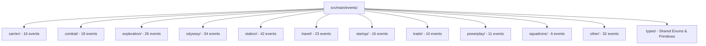

# Repository Research: ed-journal Event Taxonomy & Snapshot Models

## 1. Diagnostic: Schema Granularity

`kayahr/ed-journal` provides the most comprehensive, strongly typed schema implementation in the Elite Dangerous open-source ecosystem. It defines **269 TypeScript event files** partitioned cleanly across 12 functional domains in `src/main/events/`.

## 2. Theory: Domain Partitioning Matrix

The event model taxonomy maps to game mechanics:



### Module Breakdown

| Subdirectory | Focus Area | Exemplar Events & Interfaces |
| :--- | :--- | :--- |
| `carrier/` | Fleet Carrier operations | `CarrierBuy`, `CarrierJump`, `CarrierStats`, `CarrierCrewServices` |
| `combat/` | Engagements & defensive state | `Bounty`, `Died`, `HullDamage`, `Interdicted`, `ShipTargeted` |
| `exploration/` | Astronomical scans & sampling | `Scan`, `FSSDiscoveryScan`, `SAASignalsFound`, `ScanOrganic` |
| `odyssey/` | On-foot suits, weapons, lockers | `Backpack`, `ShipLocker`, `BuySuit`, `UpgradeWeapon`, `Disembark` |
| `station/` | Starport services & markets | `Market`, `Outfitting`, `Shipyard`, `CommunityGoal`, `EngineerCraft` |
| `travel/` | Flight paths & hyperspace jumps | `Docked`, `FSDJump`, `Location`, `NavRoute`, `SupercruiseExit` |
| `startup/` | Initialization events | `FileHeader`, `Commander`, `LoadGame`, `Materials`, `Rank` |
| `trade/` | Commerce & resource refinement | `MarketBuy`, `MarketSell`, `MiningRefined`, `AsteroidCracked` |
| `powerplay/` | Faction alignment & voting | `PowerplayJoin`, `PowerplayVote`, `PowerplaySalary` |
| `squadrons/` | Player group management | `SquadronStartup`, `SquadronDemotion`, `DisbandedSquadron` |
| `other/` | Auxiliary & systems telemetry | `Status`, `Music`, `Synthesis`, `ModuleInfo`, `SystemsShutdown` |
| `types/` | Primitives & game enumerations | Star types, planet classes, allegiance, combat ranks, suit types |

## 3. Analysis: Companion Snapshot Model Specialization

`ed-journal` models companion snapshot files by extending their corresponding journal trigger events. In `src/main/events/`:

### 1. `ExtendedMarket` (`station/Market.ts`)
* Corresponds to `Market.json`.
* Extends basic journal `Market` event (`MarketID`, `StationName`) with full commodity lists:
  `Items: Array<{ id: number, Name: string, Category: string, BuyPrice: number, SellPrice: number, MeanPrice: number, Stock: number, Demand: number, Producer: boolean, ... }>`

### 2. `ExtendedOutfitting` (`station/Outfitting.ts`)
* Corresponds to `Outfitting.json`.
* Adds complete module pricing table: `Items: Array<{ id: number, Name: string, BuyPrice: number }>`

### 3. `ExtendedShipyard` (`station/Shipyard.ts`)
* Corresponds to `Shipyard.json`.
* Adds available ship catalog: `PriceList: Array<{ id: number, ShipType: string, BaseValue: number }>`

### 4. `ExtendedNavRoute` (`travel/NavRoute.ts`)
* Corresponds to `NavRoute.json`.
* Adds full hop path: `Route: Array<{ StarSystem: string, SystemAddress: bigint, StarPos: [number, number, number], StarClass: string }>`

### 5. `ExtendedFCMaterials` (`odyssey/FCMaterials.ts`)
* Corresponds to `FCMaterials.json`.
* Adds fleet carrier bartender micro-resource buy/sell orders.

### 6. `Status` (`other/Status.ts`)
* Corresponds to `Status.json`.
* Strongly types all cockpit fields, vehicle flags (`Flags`, `Flags2`), oxygen, health, pips, and navigation destinations.

## 4. Remediation: Value for ed-telemetry Domain Modeling

* **Immediate Translation Reference:** When authoring Pydantic V2 models for `ed-telemetry` (Phase 2), these 269 TypeScript definitions provide complete field mappings, eliminating the need to guess data types or discover them via trial and error.
* **Discriminated Union Pattern:** `ed-journal` uses `"event"` as a literal discriminator in `AnyJournalEvent`:
  ```typescript
  export type AnyJournalEvent = FileHeaderEvent | FSDJumpEvent | LocationEvent | ...
  ```
  This directly maps to Pydantic's `Field(discriminator='event')` pattern, allowing `ed-telemetry` to parse arbitrary journal lines into strongly typed classes with zero boilerplate.
