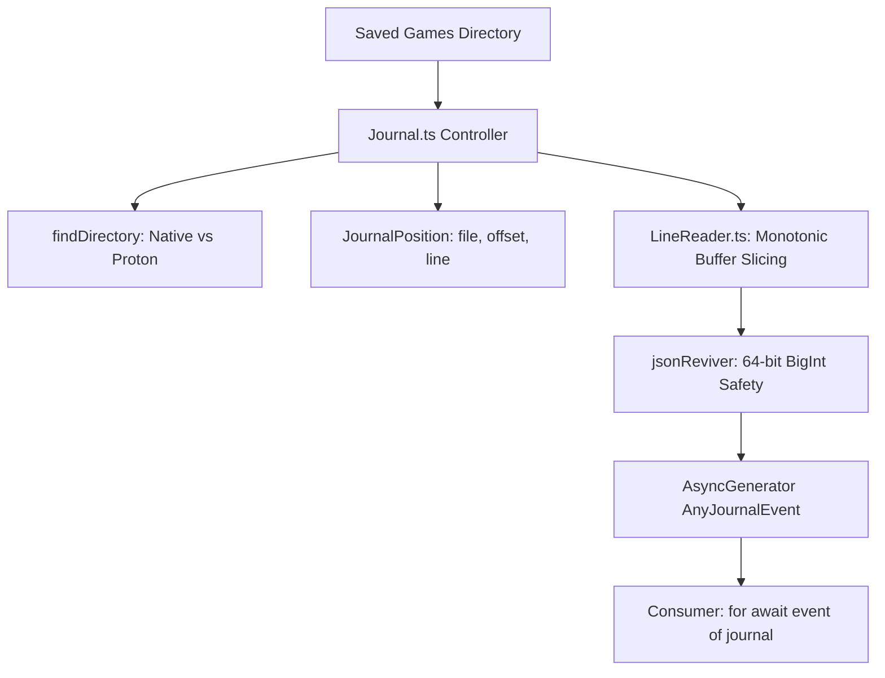

# Repository Research: kayahr/ed-journal Overview & Archive Assets

## 1. Diagnostic: Purpose & Scope

The repository `kayahr/ed-journal` (`/home/michael/src/github.com/kayahr/ed-journal`) is an open-source TypeScript library authored by Klaus Reimer (`kayahr`). It provides a complete, strongly typed streaming parser and directory watcher for Elite Dangerous journal and companion snapshot files.

### Repository Metadata

* **Author:** Klaus Reimer (`k@ailis.de`).
* **Language & Runtime:** TypeScript / Node.js 18+ (ESM modules, `AsyncIterable`, `AsyncDisposable`).
* **Scope:** 269 distinct TypeScript event models, automated file watching, monotonic position tracking, snapshot schema extensions, and 64-bit integer parsing.
* **Archival Value:** The repository preserves the **complete historical archive of 30 official Frontier Developments Journal Manuals** in PDF format (`doc/journal/Journal_Manual_v1.pdf` through `Journal_Manual_v37.pdf`).

## 2. Theory: System Architecture

`ed-journal` is designed as a zero-dependency (using Node.js native `fs/promises`) streaming client implementing modern JavaScript asynchronous iteration:

## 3. Analysis: The FDev Specification Archive

Under `/home/michael/src/github.com/kayahr/ed-journal/doc/journal/`, the repository archives 30 distinct official Frontier Developments specification manuals released across Elite Dangerous history:

| Document Filename | FDev Specification Era | Key Features Introduced |
| :--- | :--- | :--- |
| `Journal_Manual_v1.pdf` | Elite Dangerous 2.2 | Initial launch of JSON lines journal logging |
| `Journal_Manual_v11.pdf` | Elite Dangerous 2.4 | Early Thargoid encounters, repair/refuel breakdown |
| `Journal_Manual_v22.pdf` | Elite Dangerous 3.3 | Beyond Chapter 4 (FSS, DSS, Codex, Squadron logging) |
| `Journal_Manual_v28.pdf` | Elite Dangerous 3.7 | Fleet Carriers launch, `NavRoute.json` introduced |
| `Journal_Manual_v31.pdf` | Elite Dangerous 4.0 | Odyssey launch (on-foot suits, weapons, backpack) |
| `Journal_Manual_v37.pdf` | Odyssey Update 14 (May 2023) | Thargoid War parameters, `SupercruiseDestinationDrop` |

This archive serves as the definitive historical provenance for resolving backwards-compatibility edge cases in older player logs.

## 4. Remediation: Value for ed-telemetry

1. **Exhaustive Type Definitions:** The 269 TypeScript interfaces provide an immediately translatable reference dictionary for Pydantic V2 domain models in Phase 2.
2. **Streaming Interface Verification:** Demonstrates how consumers interact cleanly with a journal stream via `AsyncIterable` without polling or tight loops.
3. **Historical Manual Reference:** Direct local access to raw FDev specification PDFs for field ambiguity checks without needing web lookups.
