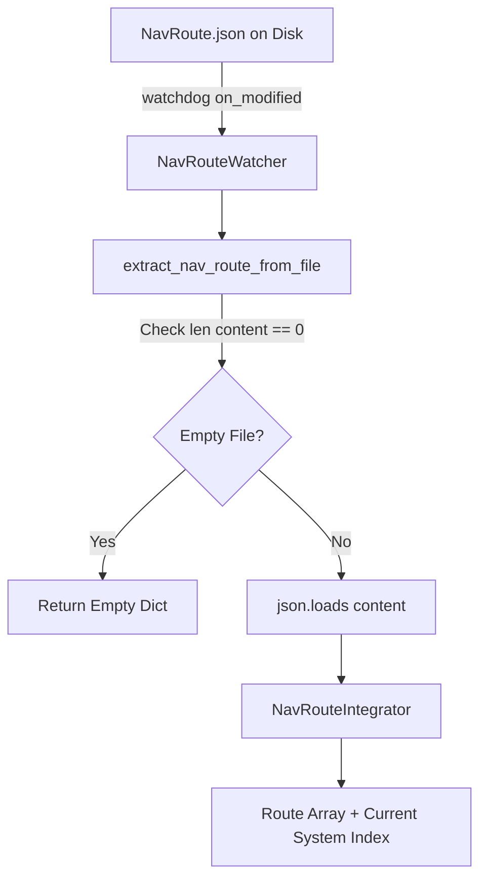

# Repository Research: ed-scout NavRoute Snapshot Handling

## 1. Diagnostic: The NavRoute Problem

In Elite Dangerous, plotting a multi-hop hyperspace route writes an array of star systems into `NavRoute.json`. Because the file is written in-place and re-written whenever a jump occurs or route changes, consumer tools face race conditions between file modification events and incomplete file writes.

`ed-scout` manages this file through `NavRouteWatcher.py` and `NavRouteIntegrator.py`.

## 2. Theory: Implementation Architecture



### Ingestion Logic (`NavRouteWatcher._extract_nav_route_from_file`)

```python
def _extract_nav_route_from_file(nav_route: str):
    with open(nav_route, "r") as read_file:
        content = read_file.read()
        if len(content) == 0:
            return {}
        nav_route = json.loads(content)
        return nav_route["Route"]
```

## 3. Analysis: Strengths & Weaknesses

### 1. Zero-Length Guard
`ed-scout` explicitly recognizes that reading `NavRoute.json` immediately upon receiving an OS modification event often encounters a 0-byte file:
```python
if len(content) == 0:
    return {}
```
This confirms our ADR 0008 diagnosis: the game engine opens the snapshot with truncate mode (`O_TRUNC`), generating an OS write notification before data buffers flush to disk.

### 2. Missing Backoff & Structural Validation
While `ed-scout` prevents crashing on empty files, it fails to handle partial writes:
* If the file contains half of the JSON payload (e.g., `{"timestamp":"...", "Route": [{"Star`), `json.loads(content)` raises `json.decoder.JSONDecodeError`.
* `_extract_nav_route_from_file` lacks a retry or backoff mechanism. When `json.loads()` fails, the exception escapes uncaught, dropping the route update until the user manually triggers another route calculation.

### 3. Synchronization with Journal Events (`NavRouteIntegrator.py`)
`NavRouteIntegrator` maintains route progression:
* Hyperspace route points are matched against journal `FSDJump` and `Location` events using `SystemAddress`.
* As jumps execute, previous route hops are flagged as visited, keeping the scout UI synchronized with the player's active position along the planned path.

## 4. Remediation: Architectural Validation for ed-telemetry

The findings in `NavRouteWatcher.py` validate the defensive measures established in `ed-telemetry`'s ADR 0008:
1. **Debounce & Exponential Backoff:** Rather than failing permanently on a partial or 0-byte snapshot read, `ed-telemetry` implements a 3-stage backoff (20ms, 40ms, 80ms).
2. **Structural Boundary Validation:** Checking raw byte boundaries (`raw.startswith(b'{') and raw.endswith(b'}')`) guarantees the JSON payload is structurally complete before dispatching to the deserializer.
3. **Freshness Deduplication:** `ed-scout` re-parses `NavRoute.json` on every modification event regardless of whether the route actually changed. `ed-telemetry`'s BLAKE2b raw hash tracking prevents unneeded downstream JSON re-parsing.
