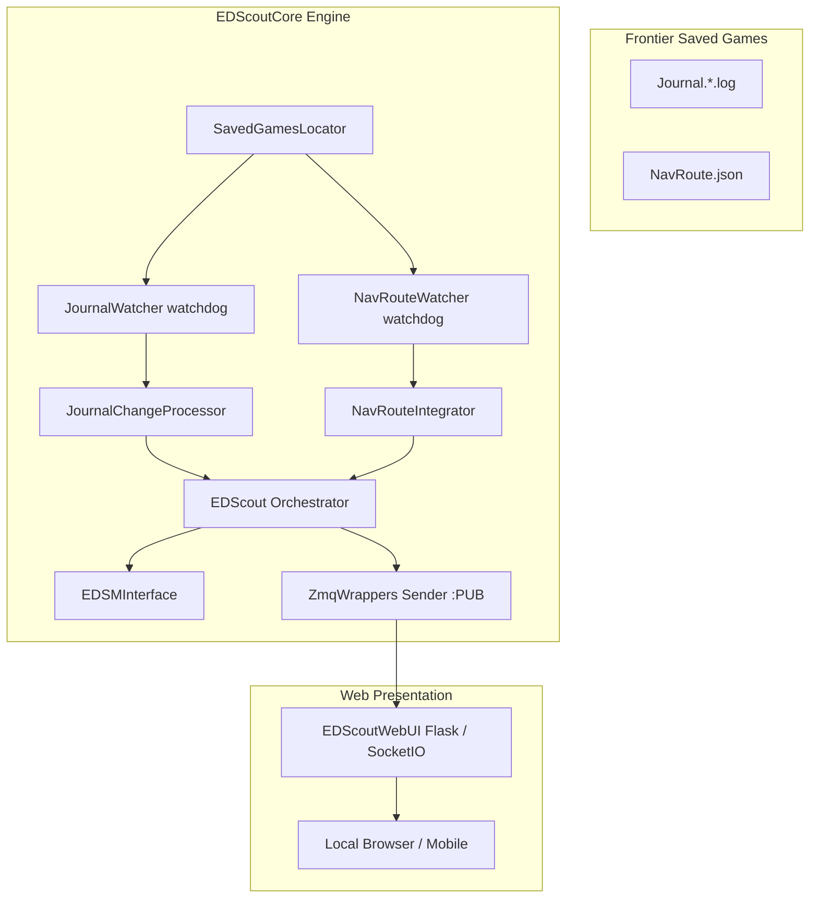

# Repository Research: ed-scout Overview & Architecture

## 1. Diagnostic: Purpose & Scope

The repository `joncage/ed-scout` (`/home/michael/src/github.com/joncage/ed-scout`) is a community-developed Python scout utility designed to assist explorers in Elite Dangerous. It calculates celestial body values in real time, projects exploration profits along planned hyperspace routes (`NavRoute.json`), and queries the EDSM API to alert commanders when approaching unvisited or high-value systems.

### Repository Metadata

* **Author:** Jonathan Vassallo (`joncage`).
* **Language / Stack:** Python 3 (Flask web UI, `watchdog`, ZeroMQ, `pyinstaller`).
* **Architecture:** Decoupled dual-tier design:
  1. `EDScoutCore/`: Pure headless backend library for locating game files, tailing active journals, watching `NavRoute.json`, and querying EDSM.
  2. `EDScoutWebUI/`: Flask web application providing local dashboard visualization and mobile browser access.
* **Inter-Process Communication:** Local ZeroMQ publisher (`ZmqWrappers.py`) broadcasting JSON-serialized events from `EDScoutCore` to the web presentation layer.

## 2. Theory: System Topology

`ed-scout` provides one of the cleanest real-world examples of separating the file-monitoring subsystem from user-interface presentation:

## 3. Analysis: Module Inventory

| Module File | Component Purpose | Size (LOC) |
| :--- | :--- | :--- |
| `EDScoutCore/SavedGamesLocator.py` | Cross-platform discovery of Frontier Saved Games path (Windows registry vs Linux Proton) | 44 |
| `EDScoutCore/JournalInterface.py` | Watchdog-based journal file watcher (`JournalWatcher`) and delta reader (`JournalChangeProcessor`) | 244 |
| `EDScoutCore/FileSystemUpdatePrompter.py` | High-frequency polling thread (`0.1s`) used to force filesystem stat updates | 34 |
| `EDScoutCore/NavRouteWatcher.py` | Dedicated watchdog listener for companion snapshot `NavRoute.json` | 74 |
| `EDScoutCore/NavRouteIntegrator.py` | Merges route hop arrays with live journal navigation events (`FSDJump`, `FSDTarget`) | 61 |
| `EDScoutCore/BodyAppraiser.py` | Valuation heuristics calculating credit values of terraformable/water/ammonia worlds | 185 |
| `EDScoutCore/EDSMInterface.py` | HTTP client querying EDSM for historical system coordinates and scan records | 78 |
| `EDScoutCore/ZmqWrappers.py` | ZeroMQ PUB/SUB wrapper broadcasting journal events to port 5555 | 30 |

## 4. Remediation: Value for ed-telemetry

* **Direct Architectural Parallels:** `ed-scout` attempts to solve the exact same foundational problems tackled by `ed-telemetry` ADRs 0006–0009: cross-platform path discovery, watching rotating journal logs, and synchronizing whole-file snapshot updates.
* **Failure Modes & Pitfalls:** Reviewing `ed-scout`'s unit tests and issue history reveals critical real-world edge cases (especially on Linux/Steam/Proton with `watchdog` inotify latency), confirming why `ed-telemetry`'s hybrid reactor and monotonic offset tracking are vital improvements.
