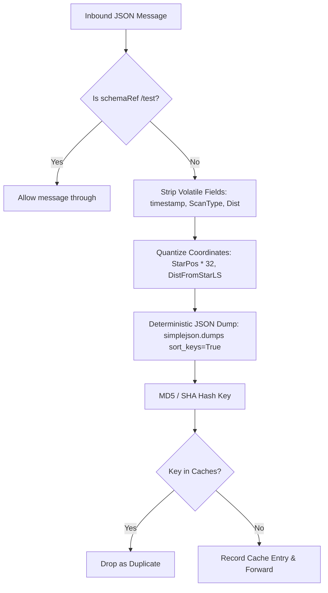

# Repository Research: EDCD/EDDN Deduplication & Normalization Engine

## 1. Diagnostic: The Multi-Client Duplication Problem

In Elite Dangerous, multiple players frequently explore the same planetary systems, travel in Wings, or dock at identical stations within minutes of each other. Furthermore, single players often run multiple companion tools concurrently (e.g., EDMarketConnector and EDDiscovery running simultaneously on the same workstation).

Without robust deduplication, a single commodity price update or star scan would flood ZeroMQ listeners with dozens of identical messages. EDDN solves this within `eddn.core.DuplicateMessages`.

## 2. Theory: The Deduplication Pipeline

The deduplication core operates in `src/eddn/core/DuplicateMessages.py`. It runs an asynchronous pruning thread and evaluates incoming messages using a sliding time window (configured via `RELAY_DUPLICATE_MAX_MINUTES`, typically 60 minutes).



## 3. Analysis: Normalization Techniques in DuplicateMessages

To ensure messages generated by different clients with slightly different floating-point representations or arrival timings resolve to identical deduplication keys, EDDN applies specific normalization transforms:

### 1. Timestamp Stripping
```python
# Remove timestamp (Mainly to avoid multiple scan messages and faction influences)
jsonTest["message"].pop("timestamp")
```
Because two wingmates or two independent tools upload events moments apart, the timestamp field is deleted from the test dictionary before hashing.

### 2. Coordinate Quantization (Floating-Point Rounding)
```python
# Convert journal starPos to avoid software modification in dupe messages
if "StarPos" in jsonTest["message"]:
    jsonTest["message"]["StarPos"] = [int(round(x * 32)) for x in jsonTest["message"]["StarPos"]]
```
* **Why multiply by 32?** In Elite Dangerous, galactic coordinates ($x, y, z$) are stored internally by Frontier's Stellar Forge engine with a fractional precision of $\frac{1}{32}$ light years ($0.03125$ LY).
* Due to floating-point formatting variances across Python, C#, Node.js, and Go client serialization, raw JSON floats can vary subtly (e.g., `120.25` vs `120.2500001`).
* Multiplying by 32 and rounding to an integer collapses floating-point inaccuracies into exact Stellar Forge grid units.

### 3. Distance Normalization
```python
# Prevent journal Docked event with small difference in distance from start
if "DistFromStarLS" in jsonTest["message"]:
    jsonTest["message"]["DistFromStarLS"] = int(jsonTest["message"]["DistFromStarLS"] + 0.5)
```
Distance to star in light seconds varies slightly depending on whether the player drops from supercruise near the outer boundary or right at the station beacon. Rounding to integer values normalizes these differences.

### 4. Volatile Field Pruning
```python
# Remove journal ScanType and DistanceFromArrivalLS (Avoid duplicate scan messages after SAAScanComplete)
jsonTest["message"].pop("ScanType", None)
jsonTest["message"].pop("DistanceFromArrivalLS", None)
```
FDev generates auxiliary scan records with varying `ScanType` flags (e.g., auto-scan vs. detailed discovery scan vs. probe map). Stripping these fields ensures the underlying celestial body data is recognized as identical.

### 5. Deterministic Key Serialization
```python
message = simplejson.dumps(jsonTest, sort_keys=True)
```
Keys must be sorted lexicographically prior to hashing; dictionary insertion order in JSON strings must never affect identity.

## 4. Remediation: Architectural Guidance for ed-telemetry

1. **Floating-Point Coordinate Normalization:**
   When `ed-telemetry` normalizes coordinates or compares spatial locations in cache layers, it should adopt Stellar Forge grid quantization ($x \times 32$ integer rounding) to ensure 100% deterministic spatial indexing.
2. **Deterministic Payload Hashing:**
   In ADR 0008, `SnapshotFreshnessTracker` relies on BLAKE2b raw byte hashing. When whole-file snapshot payloads contain whitespace or non-semantic formatting variances, a normalized JSON serialization pass (stripping volatile timestamps or sorting keys) may be applied at the domain layer if raw byte hashing proves too sensitive to cosmetic whitespace re-writes.
