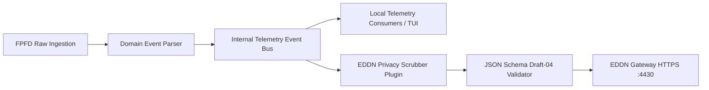

# Repository Research: EDCD/EDDN Architectural Implications for ed-telemetry

## 1. Diagnostic: Architectural Synthesis

Analyzing `EDCD/EDDN` reveals community-standard architectural practices and network expectations that directly inform the design of `ed-telemetry`'s domain modeling, telemetry egress plugins, and data cleansing layers.

## 2. Theory: Downstream Interoperability & Privacy Boundaries

While `ed-telemetry`'s initial ingestion layers (ADRs 0006–0009) focus on raw file presence and freshness, subsequent domain phases will interpret telemetry and potentially broadcast state to external network sinks (such as EDDN, Discord webhooks, or local websocket overlays).



### The Inward vs. Outward Privacy Boundary

* **Inward Telemetry (Local Operator Plane):** The local user requires private data: commander credits, loan balances, current legal status, cargo manifests, precise planetary coordinates, and ship health.
* **Outward Telemetry (Public Broadcast Plane):** Any module exporting data to the community (EDDN) must enforce an absolute privacy boundary, scrubbing commander identity, ship loadout specifics, tactical positions, and localization tags before network egress.

## 3. Analysis: Core Architectural Requirements

### Requirement 1: Stellar Forge Grid Quantization in Spatial Models

EDDN’s finding that Frontier coordinates are discrete multiples of $\frac{1}{32}$ LY ($0.03125$ LY) provides a mathematically rigorous way to handle spatial equality in `ed-telemetry`:
* Floating-point comparisons like `pos1 == pos2` fail due to IEEE 754 precision issues.
* Spatial models in `ed-telemetry` should provide a quantized representation:
  ```python
  @property
  def grid_coordinates(self) -> tuple[int, int, int]:
      return (
          int(round(self.x * 32)),
          int(round(self.y * 32)),
          int(round(self.z * 32)),
      )
  ```

### Requirement 2: CAPI vs. Journal Reconciliation Layer

EDDN's developer documentation highlights the critical desynchronization risk between Frontier Companion API (CAPI) endpoints and local Journal files.
* If `ed-telemetry` integrates CAPI for market/shipyard polling, it must never trust CAPI data without first validating that:
  1. The commander is currently docked (`docked: true`).
  2. The station name and star system name returned by CAPI match the most recent Journal `Docked` or `Location` event.
  3. Stale or desynchronized CAPI responses must be dropped to prevent polluting local market caches.

### Requirement 3: Egress Scrubbing Pipeline

To support modular EDDN publishing without leaking private player data, `ed-telemetry` should design an egress filter pipeline that:
1. Strips all keys matching regex `.*_Localised$`.
2. Strips all disallowed personal attributes (`ActiveFine`, `CockpitBreach`, `BoostUsed`, `FuelLevel`, `FuelUsed`, `JumpDist`, `Latitude`, `Longitude`, `Wanted`, `VoucherAmount`).
3. Enforces presence of mandatory metadata: `uploaderID`, `softwareName`, `softwareVersion`, `gameversion`, and `gamebuild`.

### Requirement 4: Schema-Driven Verification Test Suite

EDDN's canonical schema files (`schemas/journal-v1.0.json`, `schemas/commodity-v3.0.json`, etc.) provide an authoritative test suite for validating `ed-telemetry`'s serialization models.
* Unit tests in `ed-telemetry` can directly run `jsonschema.validate()` against EDDN's live schemas to guarantee that serialized events remain 100% compliant with community standards.

## 4. Remediation: Concrete Deliverables for Subsequent Disciplines

| Upstream Finding in EDDN | Downstream Implementation in `ed-telemetry` |
| :--- | :--- |
| $\frac{1}{32}$ LY Stellar Forge coordinate grid | Spatial comparison and indexing methods in celestial models |
| CAPI lag and desynchronization | Pre-ingest validation guards in optional CAPI provider modules |
| Negative JSON Schema `disallowed` constraints | `EDDNScrubber` privacy pipeline in outbound telemetry exporter |
| Mandatory `gameversion` & `gamebuild` headers | Session context metadata extraction from `FileHeader`/`LoadGame` |
| ZeroMQ compression (`zlib`) | Protocol reference for potential streaming network subscribers |
