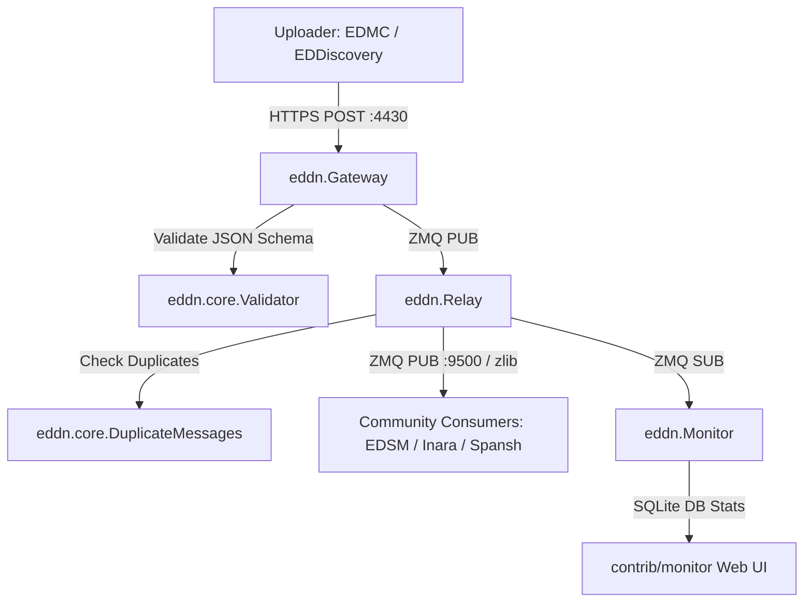

# Repository Research: EDCD/EDDN Overview & System Architecture

## 1. Diagnostic: Purpose & Network Role

The repository `EDCD/EDDN` (`/home/michael/src/github.com/EDCD/EDDN`) contains the source code, infrastructure configuration, and schema specifications for the **Elite Dangerous Data Network (EDDN)**.

EDDN serves as the central clearinghouse and message backbone for the entire third-party Elite Dangerous ecosystem (including Inara, EDSM, Spansh, EDMarketConnector, EDDiscovery, and Coriolis). It aggregates crowdsourced in-game data uploaded by hundreds of thousands of player clients, validates payloads against strict JSON Schemas, sanitizes private information, and redistributes deduplicated streams in real time via ZeroMQ.

### Repository Metadata

* **Upstream Organization:** Elite Dangerous Community Developers (EDCD).
* **Architecture:** Python microservice pipeline powered by Gevent, Bottle, SimpleJSON, and ZeroMQ (ZMQ PUB/SUB).
* **Network Protocol:** Inbound via HTTPS POST (`https://eddn.edcd.io:4430/upload/`), Outbound via compressed ZeroMQ stream (`tcp://eddn.edcd.io:9500`).
* **Governance:** JSON Schema (Draft 04) canonical definitions located under `schemas/`.

## 2. Theory: Daemon & Message Pipeline Pipeline

EDDN is decomposed into four discrete daemon processes communicating over internal ZeroMQ sockets:

1. **`Gateway.py` (Ingestion Web Service):**
   * High-concurrency WSGI web application running on Bottle and greenlet-cooperative Gevent (`gevent.monkey.patch_all()`).
   * Listens on HTTPS port 4430 with maximum request payload limit set to 1 MiB (`bottle.BaseRequest.MEMFILE_MAX = 1024 * 1024`).
   * Performs real-time schema validation via `Validator.py` against Draft 04 JSON schemas.
   * Rewrites/injects the server-authoritative `gatewayTimestamp`.
   * Anonymizes `uploaderID` by generating salted SHA-256 hashes before re-broadcasting.
   * Emits validated envelopes to internal ZeroMQ publish sockets.

2. **`Relay.py` (Deduplication & Fanout Core):**
   * Subscribes to internal Gateway broadcasts.
   * Runs the `DuplicateMessages` worker thread to identify duplicate submissions from overlapping uploaders (e.g., wing mates scanning the same star or multiple tools running on the same PC).
   * Compresses message payloads with `zlib.compress` before transmitting over public subscriber endpoints (`tcp://*:9500`).

3. **`Bouncer.py` (Access & Abuse Control):**
   * Monitors anomalous ingestion rates, malformed bursts, or misbehaving software clients, isolating abusive uploaders by IP or client signatures.

4. **`Monitor.py` (Observability & Telemetry):**
   * Consumes live relay traffic and writes hourly aggregate metrics to SQLite (`EDDN_Monitor.s3db`), providing statistics on uploader clients, message counts per schema, and parsing error rates.

## 3. Analysis: Data Sources & Lifecycle

EDDN ingests data originating from two distinct Frontier Developments data sources:

1. **Player Journal (`Journal.*.log`):**
   * Line-delimited JSON written to the local disk by the game client.
   * Direct source for exploration (`Scan`, `FSSDiscoveryScan`, `FSSAllBodiesFound`), travel (`FSDJump`, `Location`, `Docked`), and station notifications.
   * Preserved with minimal mutation beyond privacy scrubbing and coordinate precision normalization.

2. **Frontier Companion API (CAPI):**
   * Frontier's OAuth2 HTTP web service historically provided for mobile applications.
   * Used exclusively for commodity market prices (`commodity-v3.0.json`), outfitting catalogs (`outfitting-v3.0.json`), shipyard inventories (`shipyard-v2.0.json`), and fleet carrier bartender listings (`fcmaterials_capi-v1.0.json`).
   * **CAPI Lag Problem:** The documentation notes that CAPI data routinely lags behind the live game server by seconds or minutes. Uploaders must verify that the commander is marked `docked: true` and that the CAPI system/station matches the last Journal `Docked`/`Location` event before publishing.

## 4. Remediation: Value for ed-telemetry

* **Interoperability Standard:** `EDCD/EDDN` defines the definitive community-agreed contracts for what telemetry data is considered public, valuable, and standardized.
* **Validation Baseline:** The JSON Schema definitions in `EDDN` establish strict type assertions for celestial object IDs, star classes, body IDs, commodity IDs, and coordinate dimensions that can validate `ed-telemetry` domain models.
