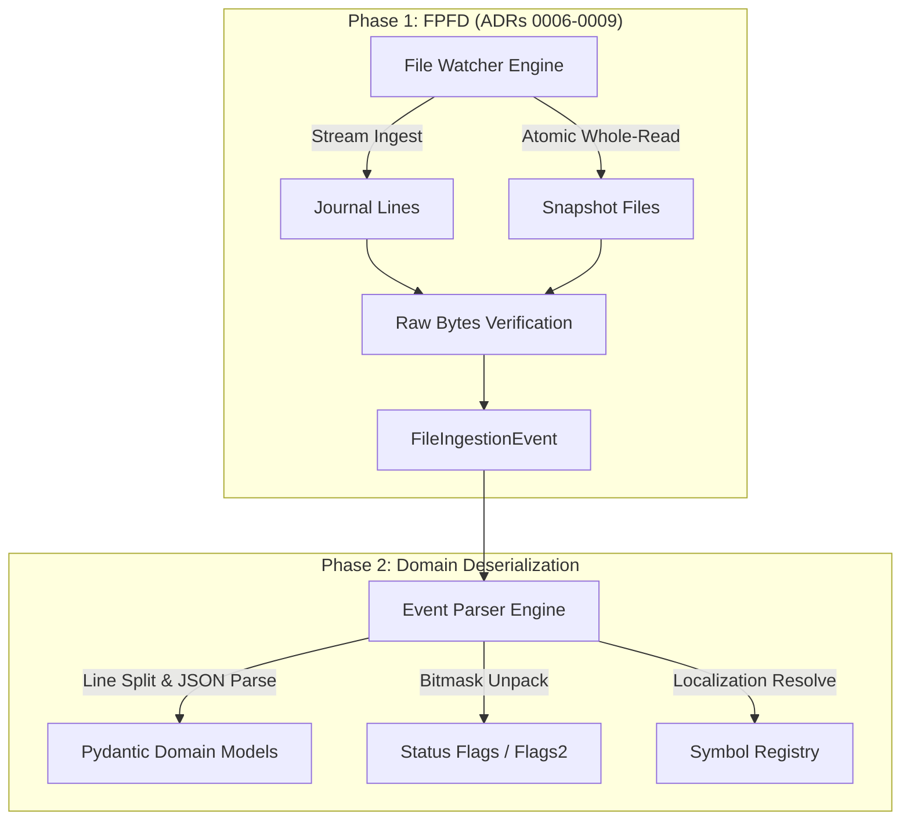

# Repository Research: elite-api-docs Architectural Implications for ed-telemetry

## 1. Diagnostic: Architectural Synthesis

An exhaustive analysis of `elite-api-docs` reveals specific game engine operational behaviors that directly impact the design of the `ed-telemetry` ingestion pipeline, event routing, and domain parsing models.

## 2. Theory: Boundary Decoupling Invariants

The findings strongly validate the separation between **Phase 1: File Presence & Freshness Detection (FPFD)** and **Phase 2: Domain Modeling & Deserialization**.



If parsing or bitmask decomposition were coupled into the I/O reactor (Phase 1), schema variations documented across journal versions 1 through 37 would cause the watcher to stall, crash, or miss critical disk events.

## 3. Analysis: Core Architectural Requirements

### Requirement 1: Bitmask Modeling via Python `IntFlag`

The documentation establishes that cockpit telemetry is transmitted through bitmasks (`Flags`: 32 bits, `Flags2`: 22+ bits).
* **Implementation Rule:** In `ed-telemetry`, models must define `StatusFlags(IntFlag)` and `StatusFlags2(IntFlag)`.
* **Resilience Rule:** Because FDev continually appends bit definitions (e.g., bit 20 for SCO, bit 21 for SCA), flag parsers must handle bits beyond documented values without throwing `ValueError` exceptions.

### Requirement 2: Case-Insensitive Heading Normalization

`elite-api-docs` confirms that the opening heading entry uses `"event": "fileheader"` in lower-case in historical logs, whereas other journal events use PascalCase (`"FileHeader"`).
* **Implementation Rule:** The envelope deserializer must normalize event names or support case-insensitive matching for `FileHeader`.

### Requirement 3: Optional Localization Fallback

The journal omits `*_Localised` strings if identical to the raw symbol key.
* **Implementation Rule:** Domain models referencing localized attributes must define a resolver property:
  ```python
  @property
  def display_name(self) -> str:
      if self.name_localised:
          return self.name_localised
      return self.name.strip("$").rstrip(";")
  ```

### Requirement 4: Tolerant Schema Parsing (Open World Assumption)

The documentation demonstrates that FDev routinely adds fields across minor updates (e.g., adding `DepartureTime` to `CarrierJumpRequest` in v36, or `DestinationSettlement` in v35) without warning.
* **Implementation Rule:** All domain schemas must configure `extra = "allow"` to ensure forward compatibility with newer game patches.

### Requirement 5: Dual-Channel Telemetry Routing

The documentation delineates two distinct data paths:
1. **Incremental Stream (`Journal.*.log`):** Cumulative historical trail of game events.
2. **Volatile Snapshot State (`Status.json`, `Market.json`, etc.):** Ephemeral current state overwritten on change.
* **Implementation Rule:** The `ed-telemetry` architecture must maintain distinct handler channels: an append-only event log consumer for journals, and a state cache (key-value store or state provider) for snapshots.

## 4. Remediation: Concrete Deliverables for Subsequent Disciplines

| Upstream Finding in `elite-api-docs` | Downstream Artifact / Implementation in `ed-telemetry` |
| :--- | :--- |
| Bitmasks in `Status.json` (`Flags`, `Flags2`) | Strongly typed `IntFlag` models in domain package |
| Nine distinct companion snapshot files | Snapshot registry in ADR 0007 validated against canonical docs |
| Truncate-and-overwrite file writing | Non-zero byte verification and exponential backoff in ADR 0008 |
| ISO 8601 GMT timestamps | UTC datetime serialization in `FileIngestionEvent` |
| Schema evolution without major version bumps | Pydantic V2 open models with field aliasing |
