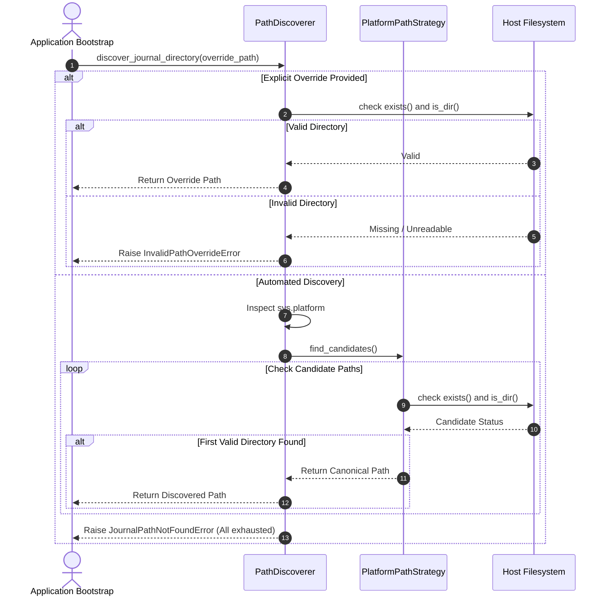

# Use-Case UC-0002: Resolve Elite Dangerous Game Journal Directory

## 1. Characterization

* **Use Case ID:** `UC-0002`
* **Use Case Name:** Resolve Elite Dangerous Game Journal Directory
* **Goal Level:** User-Goal (Sea-Level)
* **Primary Actor:** Telemetry Engine Bootstrap Service (Programmatic / SDK Runner)
* **Secondary Actor:** Host Operating System (Win32 Shell / Linux Steam Environment)
* **Scope:** `packages/ed_watcher.discovery`

---

## 2. Context & Value Proposition

Before the telemetry system can tail player activity or ingest station market data, it must locate the local directory where Elite Dangerous stores journal and state files. Successfully resolving this directory enables both the offline Recon Probe (`packages/ed_sdk`) and the production telemetry daemon (`packages/ed_app`) to operate autonomously without requiring manual user configuration in typical environments.

---

## 3. Pre-conditions & Post-conditions

### 3.1 Pre-conditions
1. The host system is running a supported operating system (Microsoft Windows or Linux with Steam/Proton).
2. The runtime has sufficient filesystem permissions to inspect user profile or Steam library directories.

### 3.2 Post-conditions
* **Success:** A validated, canonical `pathlib.Path` pointing to an existing, readable Elite Dangerous journal directory is returned to the bootstrap orchestrator.
* **Failure:** An informative, actionable exception (`PathDiscoveryError`) is raised detailing examined paths and instructing the operator on providing an explicit path parameter or environment variable override.

---

## 4. Flow of Events

### 4.1 Main Success Scenario (Basic Flow)
1. Bootstrap invokes `PathDiscoverer.discover_journal_directory()` without an override.
2. `PathDiscoverer` evaluates `sys.platform` and selects the corresponding platform strategy (`WindowsPathStrategy` on Windows, `LinuxProtonPathStrategy` on Linux).
3. The platform strategy enumerates standard directory locations in prioritized order.
4. The strategy encounters a directory candidate that exists and has read permissions.
5. `PathDiscoverer` returns the canonical `pathlib.Path` to the caller.

### 4.2 Extension Flows (Alternate & Failure Paths)

* **1a. Caller supplies programmatic parameter or environment override (`override_path` or `ED_JOURNAL_DIR`):**
  * `1a1.` `PathDiscoverer` bypasses automated platform strategies.
  * `1a2.` `PathDiscoverer` validates that the override path exists and is a directory.
  * `1a3.` If valid, `PathDiscoverer` returns the override path.
  * `1a4.` If invalid or unreadable, `PathDiscoverer` raises `InvalidPathOverrideError` and halts bootstrap.

* **2a. Host operating system is unsupported (e.g. macOS, FreeBSD):**
  * `2a1.` `PathDiscoverer` detects an unsupported `sys.platform`.
  * `2a2.` `PathDiscoverer` raises `UnsupportedPlatformError` stating that automated discovery is unavailable and directs the user to supply an explicit path override.

* **4a. Automated strategy candidates are completely exhausted:**
  * `4a1.` The platform strategy tests all candidate locations (standard Steam, custom library folders, Flatpak prefixes, registry entries) and finds none existing.
  * `4a2.` `PathDiscoverer` raises `JournalPathNotFoundError` containing the full list of inspected paths and clear remediation instructions (`"Supply an explicit override path or launch Elite Dangerous once to generate save folders"`).

---

## 5. Special Requirements & Invariants

1. **Read-Only Inspection:** The discoverer must never create (`mkdir`) or modify any directories during the discovery phase.
2. **No File Inventory Validation:** The discoverer must only verify directory existence and read accessibility. It must never fail or reject a directory due to missing journal or snapshot files.
3. **Execution Latency:** Path resolution must complete in under 50 milliseconds under normal local filesystem conditions.
