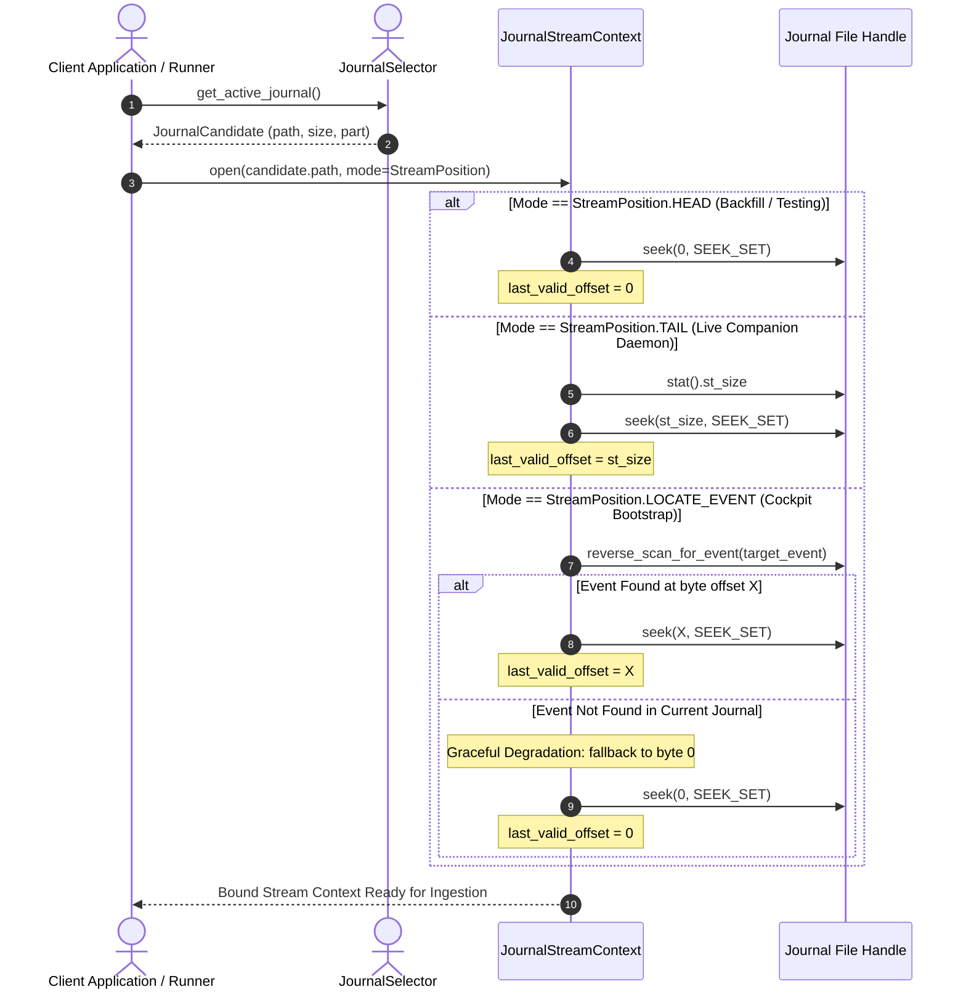

# Use-Case UC-0003: Declarative Journal Stream Positioning and Ingestion Modes

## 1. Characterization

* **Use Case ID:** `UC-0003`
* **Use Case Name:** Declarative Journal Stream Positioning and Ingestion Modes
* **Goal Level:** User-Goal (Sea-Level)
* **Primary Actor:** Telemetry Ingestion Driver / Downstream Client Application (e.g., EDDN Relay Daemon, Exploration Backfiller, Cockpit HUD)
* **Secondary Actor:** Host Filesystem / Journal Streamer (`ed_watcher.selector`, `ed_watcher.watcher`)
* **Scope:** `packages/ed_watcher`
* **Governing ADRs:** [ADR 0006](file:///home/michael/src/github.com/mnaatjes/ed-telemetry/architecture/adr/0006_active_journal_candidate_selection_and_sorting.md), [ADR 0008](file:///home/michael/src/github.com/mnaatjes/ed-telemetry/architecture/adr/0008_file_ingestion_io_freshness_and_concurrency.md)
* **Governing Design:** [SDD-004](file:///home/michael/src/github.com/mnaatjes/ed-telemetry/architecture/designs/0004_active_journal_candidate_selection_and_sorting.md)

---

## 2. Context & Value Proposition

In *Elite Dangerous*, an active journal file can grow to tens of megabytes during a play session. Different consumer applications and operational environments require vastly different entry points into the file upon daemon startup:

1. **Live Network Egress Daemons (e.g. EDDN / EDMC Uploader)**: When launching mid-session, transmitting historical trades, docking events, or commodity scans already executed hours earlier floods community networks with stale, invalid data. The daemon must tail exclusively from current end-of-file.
2. **Historical Analytics & Career Synchronizers (e.g. EDSM / Inara)**: Explorers and log synchronizers require complete deterministic replays from byte 0 to reconstruct full stellar routes, engineering unlocks, and financial balances.
3. **Cockpit Companion HUDs / Voice Synthesizers**: Real-time overlays need live monitoring, but cannot wait for the player to initiate a new hyperspace jump before learning the current star system, ship hull health, or docked station. They need to rapidly bootstrap from the most recent location beacon without replaying gigabytes of logs.
4. **Offline Testing & Simulation Harnesses**: Automated verification suites must inject static burst files (`Journal.FastWritesOnStartup.log`) to verify parsing determinism from a known byte baseline.

Configurable `StreamPosition` decouples startup positioning policy from runtime byte streaming, ensuring `handle.seek(last_valid_offset, os.SEEK_SET)` is initialized correctly for each operational profile.

---

## 3. Pre-conditions & Post-conditions

### 3.1 Pre-conditions
1. An active journal file candidate has been resolved by `JournalSelector.get_active_journal()`.
2. The active file exists on disk and is accessible in read-only binary mode (`open(..., 'rb')`).
3. The consumer application declares its desired `StreamPosition` policy (`HEAD`, `TAIL`, or `LOCATE_EVENT`).

### 3.2 Post-conditions
* **Success:** A `JournalStreamContext` is initialized with `last_valid_offset` bound to the exact requested physical byte boundary. Streaming commences monotonically forward using `SEEK_SET` without skipping valid data or replaying discarded history.
* **Failure:** If the target event anchor cannot be resolved under `LOCATE_EVENT`, the engine falls back gracefully according to configured fallback policy (defaulting to `HEAD`), emits an informative audit event, and continues streaming without unhandled exceptions.

---

## 4. Flow of Events

---

## 5. Detailed Scenarios

### 5.1 Scenario A: Live Companion Telemetry (`StreamPosition.TAIL`)
* **Primary Actor**: Live Background Relay Daemon (e.g. EDDN broadcaster).
* **Execution Flow**:
  1. The player launches the background telemetry relay 3 hours into an active play session.
  2. The daemon resolves `Journal.2026-10-08T120000.01.log` (current size: 14.8 MB).
  3. The daemon initializes the stream with `StreamPosition.TAIL`.
  4. The engine reads file size (`15,518,976` bytes) and executes `seek(15518976, os.SEEK_SET)`.
  5. `last_valid_offset` is set to `15518976`.
  6. **Result**: Zero historical events are emitted. When the player docks 30 seconds later, only the newly written `Docked` event is captured and broadcasted.

### 5.2 Scenario B: Historical Career Backfill & Fixture Testing (`StreamPosition.HEAD`)
* **Primary Actor**: Fleet Synchronizer / Pytest Fixture Suite.
* **Execution Flow**:
  1. The user requests a complete sync of their exploration log to an external career log.
  2. The application passes `StreamPosition.HEAD`.
  3. The engine initializes `last_valid_offset = 0` and calls `seek(0, os.SEEK_SET)`.
  4. The engine reads sequential 64 KB slices up to EOF.
  5. **Result**: All historical events from game session inception are emitted monotonically in chronological order.

### 5.3 Scenario C: Rapid Cockpit HUD State Anchor (`StreamPosition.LOCATE_EVENT`)
* **Primary Actor**: Desktop Cockpit Overlay HUD.
* **Execution Flow**:
  1. The player boots the overlay while flying in supercruise.
  2. The overlay needs to know the current star system and coordinates immediately without replaying 100,000 lines of prior trade logs.
  3. The application requests `StreamPosition.LOCATE_EVENT("Location")` (or `"FSDJump"`).
  4. The engine scans backward from EOF in 64 KB blocks until it encounters the opening delimiter of the most recent `Location` event.
  5. The engine binds `last_valid_offset` to that exact start offset and executes `seek(offset, os.SEEK_SET)`.
  6. **Result**: The overlay receives the player's current system state within 5 milliseconds, then seamlessly transitions to live tailing.

---

## 6. Extension & Alternate Flows

### 6a. File Rotation While Operating in `TAIL` Mode
1. The engine is tailing in `StreamPosition.TAIL`.
2. The game process rolls over to `Journal...02.log`.
3. `JournalSelector.get_successor()` detects the rollover.
4. **Invariant**: Succession parts (`.02.log`, `.03.log`) **must always initialize at `StreamPosition.HEAD` (byte 0)** regardless of initial daemon boot configuration, guaranteeing zero line loss across part rollovers.
