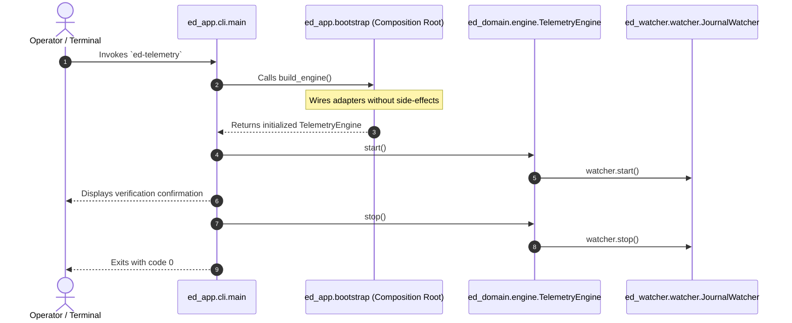

# How to Run the CLI Telemetry Daemon

This practical runbook guides operators, developers, and headless Linux/Steam Deck users through installing and executing the `ed-telemetry` command-line interface.

---

## 1. Prerequisites

Ensure Python 3.11 or newer is installed on your workstation or host system.

1. Create and activate a dedicated virtual environment:
   ```bash
   python3 -m venv .venv
   source .venv/bin/activate  # On Windows: .venv\Scripts\activate
   ```

2. Install the package in editable mode:
   ```bash
   pip install -e .
   ```
   *(For development and testing tools, install with `pip install -e ".[dev]"`)*.

---

## 2. Launching the CLI Daemon

The `ed-telemetry` application provides two equivalent execution methods:

### Method A: Direct Console Script (Recommended)
Once installed in your active virtual environment, run the registered executable directly from any working directory:

```bash
ed-telemetry
```

Expected output:
```text
ed-telemetry baseline verified: engine started successfully
```

### Method B: Python Module Invocation
Alternatively, execute the package via Python's module runner:

```bash
python -m ed_app
```

Expected output:
```text
ed-telemetry baseline verified: engine started successfully
```

---

## 3. Execution Lifecycle & Architecture

When you launch `ed-telemetry`, the system executes the following deterministic lifecycle:



1. **Composition Root Assembly:** `ed_app.bootstrap.build_engine()` instantiates the inbound watcher (`JournalWatcher`) and outbound transmitters (`NullTransmitter`), injecting them into `TelemetryEngine`.
2. **Zero Side-Effects Construction:** Instantiation does not bind network sockets, lock files, or launch background threads.
3. **Headless Execution:** Runs purely in standard terminal environments across Linux and Windows without virtual display servers (`xvfb`).

---

## 4. Troubleshooting

### Command Not Found (`ed-telemetry: command not found`)
* **Cause:** The active virtual environment's `bin/` (or Windows `Scripts\`) directory is not in your current shell's `PATH`.
* **Remediation:** Ensure your virtual environment is active (`source .venv/bin/activate`), or execute via explicit path (`./.venv/bin/ed-telemetry`) or module runner (`python -m ed_app`).

### Missing Dependencies
* **Remediation:** Re-install the package in your active environment:
  ```bash
  pip install -e .
  ```
